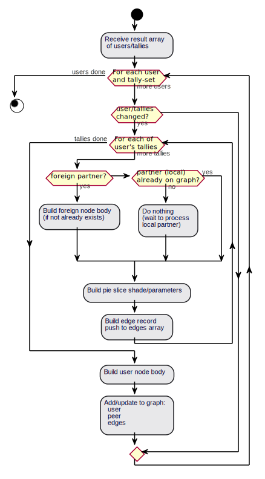

# Network Visualizer
July 2020

## Project Background:
The MyCHIPs server currently relies on the [Wylib](http://github.com/gotchoices/wylib)
library for its administrative User Interface.

In addition to viewing/editing users and contract documents, this UI includes a 
network visualizer for observing local users and their remote connections in a 
graphical way.  See for example, the system simulation as explained 
[here.](/test/sim/README.simdock).

The existing code, implemented in VueJS is part of Wylib, is mostly in the files:
[svgraph](http://github.com/gotchoices/wylib/src/svgraph.vue) and
[svgnode](http://github.com/gotchoices/wylib/src/svgnode.vue).

This code consists of a generic framework for displaying an abitrary graph network
which should be adaptable by the end-use application.  For example, in MyCHIPs, 
nodes are pictured as trading entities with attached tallies 
(stock assets or foil liabilities).  The particular shape and design of these nodes is not
a part of the wylib library but is left to the application (MyCHIPs, in this case).

The code is also used within the [wyclif](http://github.com/gotchoices/wyclif) 
package in the [wysegi](http://github.com/gotchoices/wyclif/src/wysegi) module
to display an ERD (Entity Releation Diagram) responsive to the current objects 
existing in an SQL database.

The code reads an existing data structure and then places nodes randomly in an 
SVG image.  It then does its best to connect the nodes according to the relational 
links found in the data set.

There is an included menu item "Arrange" which uses an attraction/repulsion model to 
try to spread out the nodes on the page in a reasonable way so it is more readable.
Nodes naturally repel each other, but connection links act like rubber bands to pull
nodes back together.  The goal is that nodes more closely related will be disposed
closer to each other on the screen.  There are also provisions for biasing placement
so (in the case of MyCHIPs) stock relationships will tend to move above and foil
relationships will tend to move below.

The current code has evolved to be a bit messy and complicated (particularly the 
code specific to MyCHIPs).  Also, it is iterative in nature.  Each time you press the
Arrange button, the graph takes a single iteration toward better order.  
In practice, one must hold the button for quite a while to get a readable graph.

## Objectives:
The goal of this project is to improve network visualization tool so it can more
efficiently display the graphical data that will be created using the 
[enhanced agent model simulator.](/doc/projects/Agent_Model.md).

There are existing Javascript libraries that model graph database content visually
including: [Cytoscape](https://js.cytoscape.org/).  It might be possible to use
such a library, or to learn from it.

One example is shown [here](https://cytoscape.org/cytoscape.js-cose-bilkent/).
This seems to quickly and efficiently create a layout for a given set of graph
data.  Admittedly, the MyCHIPs data set will be a lot more messy than what is shown
in the example.  This example does not appear to be deterministic, as it generates
a different result each time the button is pressed.

[This example](https://ivis-at-bilkent.github.io/cytoscape.js-fcose/demo.html)
reveals more of the parameters being used behind the scenes to generate the graph.

[This example](https://cytoscape.org/cytoscape.js-cola/) appears to be a bit more
deterministic.  It also appears to be modeling forces in 3D in order to find more
pathways for the graph to "unfold" itself.  The current Wylib code only models
two dimensions so nodes more often get "stuck" and can't find a good path to
unfold.

Features should include:
- Apparently instant computation/placement of nodes/connections.
- If not instant, iteration should occur automatically, with the algorithm
  deciding on its own when it has converged on an acceptable solution.
- If parameters are tweaked, the graph should respond in real time (not requiring 
  additional (repaint) button pushes.
- The graph should find a "most readable" solution so a human observer can most
  readily see and understand the relational links between nodes.
- The graph should be able to handle datasets whether large or small.
- The end-use code should be able to customize the appearance and data content of 
  the nodes (at a minimum, this still works for the ERD case and the MyCHIPs case.
- The user can easily zoom in/out on the display and focus in on different areas
  of interest in the graph.
- A possible third use-case would be the display of a
  [Visual Balance Sheet](/doc/VisualBS.odg) intended to be the home page of an
  eventual MyCHIPs mobile application.

## Strategy:
- Evaluate whether existing libraries can be used to generate the graph.
- Evaluate whether existing SVG libraries should be upgraded; or
  whether the graph should be a new, separate library function.
- Determine how code will best be integrated into Wylib/MyCHIPs environments.

## Outcomes:
- MyCHIPs Administrative console works with new visualization code
- No longer necessary to manually "arrange" nodes
- Module responds asynchronously to updates in the data set
- Graph converges (and terminates) automatically on a solution
- WyseGI ERD visualizer works with new codebase
- Possibly: MyCHIPs Visual Balance sheet works using this code

## Technical Considerations:
Wylib is currently implemented in VueJS.  For cleanest integration into the
existing environment, it seems wise to also make (keep) this as a VueJS
implementation.

## Implementation Notes
April, 2022

Re-factoring objectives:
- Create a new version of the Wylib svgraph/svnode widget set
  - Add a new svedge widget to track edges separately from nodes
  - Remove auto-placement code--we will leave placement up to the application now
  - Provide better hooks to use d3 or any other desired placement mechanism
- Rewrite src/urnet.vue to be cleaner structure
  - Only repaint nodes whose tally values have actually changed (latest)
  - State objects passed to svgraph,svnode,svedge should contain only those properties we need to be persistent.
  - Each node object includes:
    - Node tag
      - Local users: cid:agent
      - Foreign peers: cid:agent~<tally_ent>-<tally_seq>
    - Body drawing code (paths, shapes, strokes, fills)
    - Location (x, y)
  - Each edge object includes:
    - Source node tag
    - Target node tag
    - Edge UUID
  - In addition to providing a state property, the application will provide
    a service callback routine the graph can query on behalf of edges to determine
    where their source and target endpoints should be at any given time.

  - Local user nodes will be rendered as a
    [visual balance sheet](https://rawcdn.githack.com/gotchoices/MyCHIPs/0fa1d6511d5f487d6928770e3cf3312bdc6d273e/test/visbs/index.html)
  - We will use the d3 pie chart utilities to calculate the applicable section paths.

  - In addition to the persistent state information provided to svgraph, urnet.vue
    will maintain further data structures to allow the placement algorithm to calculate its values.
  - We will use the d3 force simulation to drive the placement of nodes.
  - To facilitate the simulation, we will maintain an array of nodes where each node contains
    an x and y location property.  This needs to also be the state object so that placement is
    a persistent (saved) value.
  - We will also maintain an array of edges called "links."  In this array, the source and target
    properties reference the actual node objects rather than containing ID tags to them.  This
    is consistent with what the simulation requires.
  - The following forces will be applied to nodes:
    - Charge: All nodes will repel each other to spread out the graph.
    - Collision: Nodes will avoid overlapping each other where possible.
    - X: Foreign nodes should align vertically near the user tally pie slices they connect to.
    - Y: Foreign nodes should float up when they are debtor (local tally +) and sink down when they are creditor (local tally -).
    - Y: When local nodes are connected by a tally the creditor should get a push up and the debtor a push down.
    - Link: Any two nodes connected by a tally should attract each other to minimize the length of the connecting edge.
   - Each node will have to contain links to connecting tallies and connected nodes
     sufficient to compute each of the above forces.
  - Since placement is no longer part of svgraph, the application will need to be able to 
    provide/configure its own set of menu items for setting placement parameters.
    These values should also be part of the svgraph state to be persistent.
  - Data structures
    - nodeData: An object of nodes indexed by the node tag
      - inside: boolean
      - tallies: Array of tallies
        - arc: d3 values for arc computation
        - cent: centroid for pie slice
        - hub: x,y point where edge line connects
      - state: Only this part is known to svgraph
        - tag: unique tag for node
        - body: svg path data to draw node
        - radius: general radius of body for sizing canvas
        - x: x position
        - y: y position
    - state.nodes: Object of node state values above, indexed by tag, to pass to svgraph
    - state.edges: Object of edge state values, indexed by uuid, to pass to svgraph
      - source:
        - tag: ID of node at start of edge connector
        - end: Point at start of line
        - aim: Curve control point just after start
      - target:
        - tag: ID of node at finish of edge connector
        - end: Point at finish of line
        - aim: Curve control point just before finish
    - nodeList: Array of node state objects to pass to d3 force simulation
    - linkList: Array of link objects to pass to d3 force simulation
      - source: reference to source (from) object
      - target: reference to target (to) object
  
### Flow Chart
The following activity digraph shows the basic logic for handling updates from
the Database of users and their tallies:

