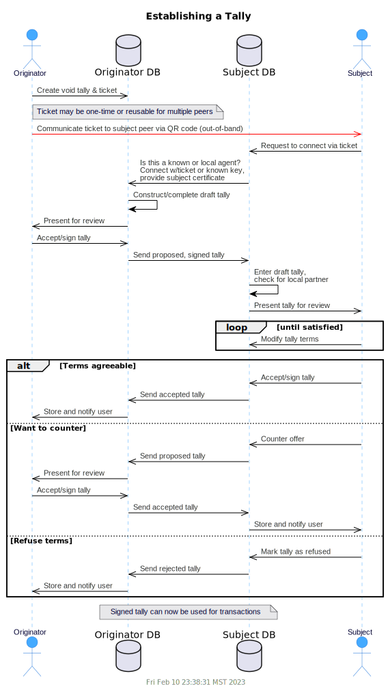

## MyCHIPs Protocol Description 1.0 (draft)
February 2021

### Overview
In the beginning of the project, it was difficult to attempt a top-down design of the system.

I had a basic, intuitive idea about how sites and nodes should communicate with each other,
and what types of messages they should send back and forth, but I didn't really understand it
in a formal enough way to create a detailed description of the protocol.
Instead, I jumped in and started coding.

While that is probably not the most widely accepted approach, it did give me a working network of MyCHIPs nodes, albeit not yet secure.
In conjunction with the agent-model simulator, I could generate random data sets.
And with the network visualizer, I could now actually see what a network might evolve into and what type of scenarios the protocol would have to handle.

Next came the DSR study, which revealed some security/liveness flaws in the way I had implemented the protocol.
Currently, the intermediate BYU results look like, with the addition of a referee, we can achieve a distributed lift that is acceptably secure and live.

So this page is an attempt to describe that protocol using UML sequence and state diagrams.
That should prepare the way for a further revision of the codebase to bring it into line with this improved protocol.

### Network Assumptions
MyCHIPs assumes a network of peer entities who become interconnected through voluntary credit relationships they forge with each other.
Such an entitiy could be an individual person or it could be a legal entity such as a corporation or a partnership (i.e. a group of people).
Entities should quantify the degree to which they trust those peer entities they connect with.

When that trust is greater than zero (i.e. credit terms are offered), one should be prepared to lose the amount of value quantified in the trust.
For example, if I extend you 10 CHIPs of credit, I must recognize the real possibility that you will fail to uphold that promise (default).
In that case, I may lose the value, or have to rely on collateral if such is a part of the particular credit agreement.

Although that risk is necessary, I do not want to be exposed to indirect risks.
For example, if I (A) share a tally with you (B), and you also share a tally with a third entity (C), I don't want to have to rely on your trust of C.
C may hurt you.  But I don't want C to be able to hurt me.

So the assumptions in a distributed network are that contracts and obligations exist only between two immediately connected peer entities.
The instrument for that connection is the [Tally](./Tallies.md)

### Tally Use Cases
A tally is established when two parties decide to formalize a relationship of trust between each other using the MyCHIPs protocol.

There are four cases:
- **Be My Vendor**:
  The User reaches out to a potential trading Partner and asks if he would like to establish a tally.
  This must alway happen via some communication channel outside the MyCHIPs protocol--for example: in-person, via email, teleconference or a traditional web connection.
  In this case, the User is suggesting he hold the [Foil](Tallies.md#tally-parts) of the tally and the Partner will hold the [Stock](Tallies.md#tally-parts).
  The partner is the vendor, or provider of services, so money (value) will normally flow from User to Partner.
  In the moment of exchange, the User will owe value to the Partner.
  In other words, the Partner will have lent money to the User.
- **Be My Client**:
  This is really identical in all respects to the protocol, except that the User is suggesting he be the Vendor (the Stock holder) and the Partner will be the Client (the Foil holder).
- **Transaction**:
  Once established, the tally will serve as a foundation for actual trades of credit.
  It will maintain and track a total balance owed in one direction or another.
  And it constitutes a digital signed contract indicating the [terms and conditions](Tallies.md#credit-terms) by which the two parties have agree to conduct their trades.
  The tally balance is modified by entering individual atomic transactions called [chits](https://www.dictionary.com/browse/chit).
  These chits are also digitally signed and become a part of the tally.
- **Request Close**:
  A tally must be completely voluntary.
  However, once agreed to (signed), an entity is duty-bound to uphold its terms.
  So a tally can be closed at any time, but the obligated entity must somehow bring the tally balance to zero.
  This might involve a [credit lift](Lifts.md) or it could be done by giving product, services, or conventional money.

### Tally Protocol
The steps to establish a tally are shown in the following sequence diagram.
This covers the first two tally use cases, as the only difference is found in which entity is designated as the stock holder and which is the foil holder.

As mentioned, transactions are carried out as chits, which get added to the tally.
More on chits below.

When one of the partners wishes to end the trading relationship, he can do so by the steps in the following sequence diagram.
If the creditor wants to close the tally and is willing to forfeit his balance owed, he can simply gift the balance back to the debtor.
The tally, marked as "closing," will then close automatically.
If the debtor wants to close the tally, he will have to figure out how to provide value sufficient to zero the balance.

### Chit Use Cases
A chit constitutes a pledge of future value from one entity to the other.
Therefore, the chit only needs to be signed by the entity pledging value.
(There is an exception for [lift chits](Lifts.md), which are treated elsewhere.)

### Chit Protocol

Either entity can make a direct payment to the other simply by making and signing a chit.

When requesting payment from the other party, the sequence is a little more complicated.

It is important to note that the consensus algorithm has nothing to do with the validity of a chit.
If a chit is signed by the party pledging value, it is a valid chit.
However, the parties do need to agree about the *order* in which chits are entered into the tally.

This is important from an implementation standpoint because the list of chits will be maintained as a [hash chain](https://en.wikipedia.org/wiki/Hash_chain).
This *chit chain* can be thought of as a tiny blockchain, known only to the two entities who share the tally.
When the data is kept this way, it is very easy for the two partners to verify that they have identical information, just by comparing the hash they hold for the last valid chit on the list.

