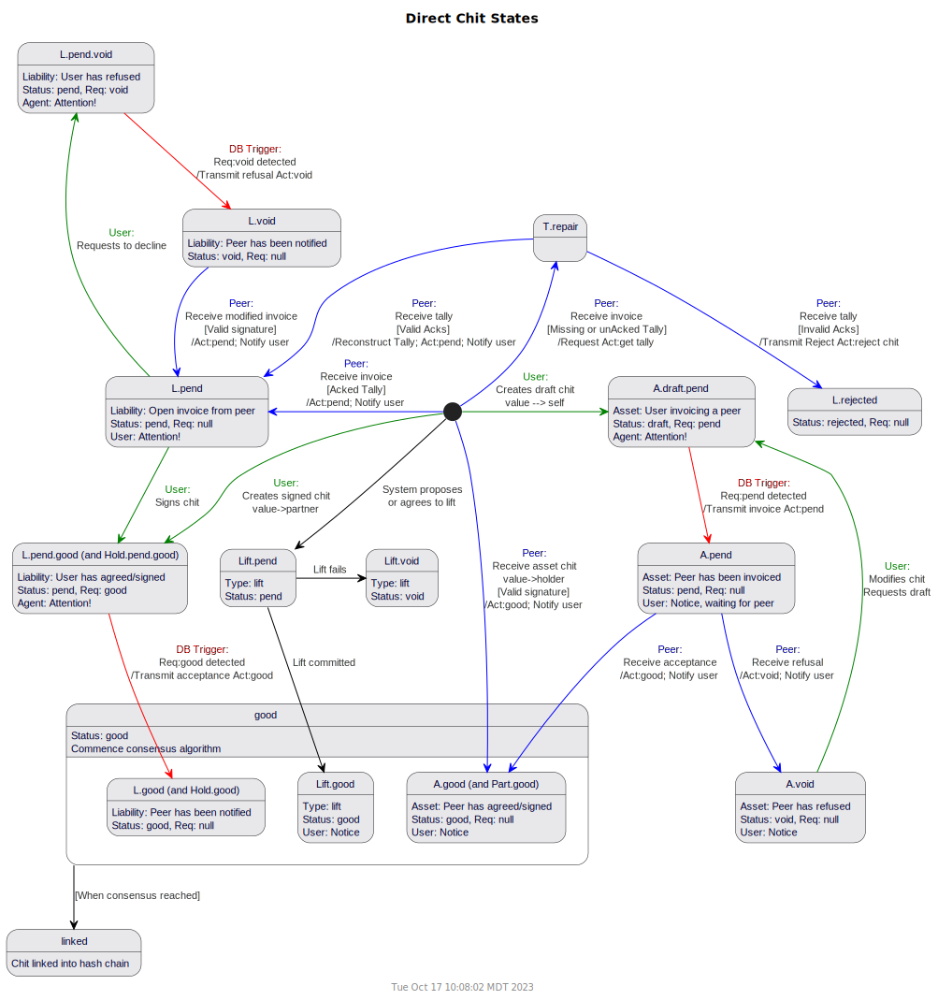

## MyCHIPs Protocol Description 1.0 (draft)
February 2021

### Overview ([TL;DR](#network-assumptions "Skip to the meat"))
As the project began, it was difficult to attempt a top-down design of the system.

I had a basic, intuitive idea about how sites and nodes should communicate with each other,
and what types of messages they would send back and forth, but I didn't really understand it
in a formal enough way to create a detailed description of the protocol.
Instead, I jumped in and started coding.

While that is probably not the most widely accepted approach, it did give me a working prototype of a MyCHIPs site, albeit not yet secure.
In conjunction with the agent-model simulator, I could generate random data sets.
And with the network visualizer, I could now actually see what a network might evolve into and what type of scenarios the protocol would have to handle.

As I went, I produced documents like those included here for
[tallies](Tallies.md) and [lifts](Lifts.md)
to help me make sense of what I needed to code.
Those still serve as a helpful guide for the prototype implementation.

Next came the DSR study, which revealed some security/liveness flaws in the way I had implemented the protocol.
The intermediate BYU results indicate that the addition of a referee will now allow a distributed lift that is acceptably live and secure.

This document is an attempt to more formally describe a refined protocol using UML sequence and state diagrams.
Hopefully this will prepare the way for a further revision of the codebase to bring it into line with this improved protocol.

### Network Assumptions
MyCHIPs assumes a network of peer entities who become interconnected through voluntary credit relationships they establish with each other.
Such an entitiy could be an individual person or it could be a legal organization such as a corporation or a partnership (i.e. a group of people).
The term *user* is also used to be roughly synonymous with entity (with a possible bias toward human entities).

Entities should quantify the degree to which they trust the peer entities they connect with.
When that trust is greater than zero (i.e. credit terms are offered), one should be prepared to lose the amount of value quantified in the trust.
For example, if I extend you 10 CHIPs of credit, I must recognize the possibility that you may fail to uphold your promise.
In that case, I may lose the promised value, or have to rely on collateral if such is a part of the particular credit agreement.

Although this limited risk from trading parters is a necessary part of the system, people should be exposed to indirect risks.
For example, if I (A) share a tally with you (B), and you also share a tally with a third entity (C), I don't want to have to rely on your trust of C.
C may hurt you.  But I don't want C to be able to hurt me.

So the assumptions in a distributed network are that contracts and obligations exist only between two immediately connected peer entities.
The instrument for documenting and enforcing that connection is the [Tally](./Tallies.md).

### Sites and Nodes
When reasoning about lifts and other MyCHIPs transactions, it is sometimes easiest to think of entities as individual, independent nodes
in a giant [graph network](https://en.wikipedia.org/wiki/Graph_theory).

While this works pretty well in most cases, it is important to remember the implementation reality:
Individual entity accounts must be hosted on a server that can maintain a network presence at all times--even when a user's mobile device might be turned off.
And these servers will most likely host more than one user.

This introduces the notion of a *site* which typically represents a single database of users surrounded by a possible cluster of process and control-layer support servers.

The term *node* will get used in a more generic way, possibly referring to an entity *or* a site, depending on the context.
The term *server* may be used sometimes as roughly synonymous with *site.*

### Tally Use Cases
A tally is established when two parties decide to formalize a relationship of trust between them using the MyCHIPs protocol.

Here is some additional detail pertaining to these four use cases:
- **Be My Vendor**:
  The User reaches out to a potential trading Partner and asks if he would like to establish a tally.
  This must alway happen via some communication channel outside the MyCHIPs protocol.
  We will call this “out-of-band communication.”
  Examples include meeting in-person, email, teleconference or a traditional web connection.
  In this case, the User is suggesting he hold the [Foil](Tallies.md#tally-parts) of the tally and the Partner will hold the [Stock](Tallies.md#tally-parts).
  The partner is the vendor, or provider of services, so money (value) will normally flow from User to Partner.
  In the moment of exchange, the User will owe value to the Partner.
  In other words, the Partner will have lent money to the User.
- **Be My Client**:
  This is really identical in all respects to the previous case, except the User is suggesting he be the Vendor (the Stock holder) and the Partner will be the Client (the Foil holder).
- **Transaction**:
  Once established, the tally will serve as a foundation for actual trades, or pledges of credit.
  It will maintain and track a total balance owed in one direction or another.
  And it constitutes a digital signed contract indicating the [terms and conditions](Tallies.md#credit-terms) by which the two parties have agree to conduct their trades.
  The tally balance is modified by entering individual atomic transactions called [chits](https://www.dictionary.com/browse/chit).
  These chits are also digitally signed and become a part of the tally.
- **Request Close**:
  A tally must be completely voluntary on the part of both parties.
  However, once agreed to (signed), the entities are duty-bound to uphold its terms.
  So a tally can be closed at any time, but the obligated entity (debtor) must somehow bring the tally balance to zero.
  This might involve a [credit lift](Lifts.md) or it could be done by giving product, services, or some other kind of money.

### Tally Protocol
The steps to establish a tally are shown in the following sequence diagram.
This covers the first two tally use cases, the only difference being which entity is designated as the stock holder and which is the foil holder.

As mentioned, transactions are carried out as chits, which get added to the tally.
More on chits [below](#chit-use-cases).

When one of the partners wishes to end the trading relationship, he can do so by the steps in the following sequence diagram.
If the creditor wants to close the tally and is willing to forfeit his balance owed, he can simply gift the balance back to the debtor.
The tally, marked as "closing," will then close automatically.

If the creditor wants to retain what is owed to him, he will have to wait for the agreed upon payment terms to time out.
In the normal course of time, payment should be made by the debtor by way of a lift, or some other consideration of product, services or some other kind of money.

If the debtor wants to close the tally sooner, he will have to figure out how to provide value sufficient to zero the balance.

Now we can derive the following state diagram to describe the tally protocol from the perspective of a single entity:

### Chit Use Cases
A chit constitutes a pledge of future value from one entity to the other.
There are two basic types of chits:
- **Direct Chit**:
  This is a simple chit issued by one entity, to its direct trading partner.
  This type of chit only needs to be signed by the entity pledging value.
- **Lift Chit**:
  In this case, the chit is part of a larger [credit lift](Lifts.md).
  There will be a whole group of chits, all bound to the lift.
  A lift chit will to be signed by a *site* certificate, where the site is the system that hosts the MyCHIPs account for the particular user.
  Clearly, the idea of letting one's Chip Service Provider sign chits on one's behalf sounds potentially dangerous.
  So there are some limitations on lift chits:
  - The net effect on an entity of a group (typically 2) of chits, belonging to a single lift, must be in accord with the [trading variables](Lifts.md#trading-variables) established and signed by that user.
  - In general, this means the chits sum to zero.
  - It could be non-zero if the trading variables specify a charge or allow a penalty.

This diagram shows two sets of similar use cases.
In the simpler case, we are negotiating a chip with a direct trading partner.
In the more complex case, we are executing a linear lift that will transmit value through the network to a peer we are not directly connected to.
This lift will also involve one of our direct partners who will be the first link in a chain of entities the lift will flow through.

### Direct Chit Protocol
We will first deal with the simpler case where a single direct chit is being entered onto an existing tally between two entities.
Either entity can make a direct payment to the other simply by making and signing a chit.

This diagram shows the first case, Sending a Direct Payment:

When requesting a direct payment from the other party, the sequence gets a little more complicated.
This involves the generation of an *invoice,* or request for payment:

This diagram also covers the fourth use case, Pay Direct Invoice.
This is what the Payor does once he receives the proposed chit (see the alt conditional block in the previous diagram).

Note that the consensus algorithm has nothing to do with the validity of a chit.
If a chit is signed by the party pledging value (debtor), it is a valid chit.
However, the parties do eventually need to agree about the *order* in which chits are entered into the tally.

This is important from an implementation standpoint because the list of chits will be maintained as a [hash chain](https://en.wikipedia.org/wiki/Hash_chain).
This *chit chain* can be thought of as a tiny blockchain, known only to the two entities who share the tally.
When the data is kept this way, it is very easy for the two partners to verify that they have identical information, just by comparing the hash they hold for the last consensed chit on the chain.

The third use case (Request Direct Invoice) is one step before this.
For example, say you recognize that a vendor has provided services to you and you want to send payment.
You may not know the exact charge, but you want to initiate the process by Requesting a Direct Invoice.

This is not strictly part of the MyCHIPs protocol.
Rather it would be conducted as out-of-band communication (paper, http, email, or text).
But the software needs to facilitate the process by issuing/scanning QR codes containing the necessary data to initiate a responsive chit or lift.

For example: “Hey, how much do I owe you for that gopher-bomb?“
“Well, here's a QR code that will take you to an https endpoint that yields a JSON object containing just the information you are asking for!”

The returned JSON would contain:
- The address of the entity who will receive the payment (smoke-em-out@chippies.net),
- The amount payable,
- An optional listing and descriptions of items contributing to the total,
- Optional hints about where to find this entity on the network.

This sequence will be dealt with in more detail in the section below on [lifts](#linear-lift-payments).
It can be generalized to the simpler case where an invoice is requested from a direct partner.

Now we can derive the following state diagram to describe the direct chit protocol from the perspective of a single entity:

### Credit Lifts Explained
So far, the protocol has dealt primarily with transactions moving value between two partners who are directly connected by a tally.

Transactions of this kind are quite limited.
Certainly, one party can pledge value to another.
But so far, there is no obvious way to resolve such pledges (i.e. get paid) other than hoping for some later return of compensatory product, services or alternative money.

But MyCHIPs accomplishes much more than that.
It allows parties to transmit surplus credits (pledges) they hold, back through the network, and have them reappear as credits on other tallies where they can be spent on something you actually need or want.

The [lift algorithm](http://gotchoices.org/mychips/acdc.html) is like a way to “pay your bills” without the need for traditional money.
It can be thought of as trading what you *have but don't need*, for what you *need but don't have*.
This is sometimes called a “clearing function” as it “clears out” or “nets to zero” offsetting credits on each node it traverses.

This figure shows a circular loop of trading partners.
The arrows show the normal flow of money, credit, or IOU's in a clock-wise direction.
Each arrow also represents a tally, pointing from the foil at its tail, to the stock at its head.

A circular credit lift will move value in the opposite, or counter-clockwise direction, clearing out credit imbalances along the way.

The linear version of the credit lift performs a related function, allowing you to send value through the network to an entity you are not directly connected to.
It can be thought of as paying with *what you have but don't want*, while the receiver gets *what he wants but does not yet have*.
Participating entities along the way also get the benefit of a clearing function on their own tallies.

In order to perform these lifts, nodes must have some idea of where to send credits so they will arrive at their intended destination.
If there was a single, giant database of all the tallies in the world, this would not be such a difficult task.
A central-planning algorithm could simply determine the most efficient lift pathway and create the required chits on all the applicable tallies in a single, consistent, atomic transaction.

But MyCHIPs is purposely designed as a distributed, de-centralized system.
The intent is, no single database will contain knowledge of the whole network.
Ideally, databases will only contain information about the *local* entities they host and other *foreign* entities their local users are directly connected to by tallies.
Even then, information about foreign entities will be kept as limited as possible.

To accomplish this, each database will build a map of theoretical routes believed to exist somewhere in the outside network.
For the purposes of regular (circular) lifts, the goal is to find external routes:
- from known, up-stream foreign entities,
- to known, down-stream foreign entities.

Knowing such external pathways, a site should be able to combine them with known, internal segments of entities to form a complete lift circuit.

For linear (payment) lifts, the process is similar.
The goal is to find external pathways:
- from a known, up-stream foreign entity,
- to a particular, identified foreign entity,
- who may also have provided *hints* about one or more well-known entities it has a direct down-stream connection to.

We use the terminology *up-stream* to denote a peer who owes us excess money.
This is typically associated with a tally of which we hold the stock.
But it is also possible to accumulate excess CHIPs on a tally foil.
An employer or customer is a good example of a partner you would normally find up-stream from you.

We use the terminology *down-stream* to denote a peer we might owe money to.
Alternately, it could be someone who owes us less than we want them to.
This is often associated with a tally of which we hold the foil.
But it is also possible to have fewer CHIP credits than we want on a tally stock.
A merchant or supplier is a good example of a partner you would normally find down-stream of you.

This figure shows a convenient way to visualize a lift pathway in a real implementation.
A site database will contain multiple entities who are connected in a short, linear segment.
Some of these are local, meaning their accounts are hosted by the site.
For example, site B hosts users B1, B2 and B3.

Hopefully, each chain will also include two or more foreign users (hosted by some other site).
Otherwise, a distributed lift through the segment will not be possible.
For example, the chain [B1, B2, B3] is also connected to an up-stream foreign peer A3 at its top end
and a down-stream foreign peer C1 at its bottom.

Site B knows about a complete segment [A3, B1, B2, B3, C1].
But that is where site B's direct knowledge about the network ends.
It will be reliant on site A, site B, and probably a bunch of other sites to execute a complete distributed lift.

A lift segment is defined as:
- One or more local entities connected in a linear chain; and
- A foreign entity at the top of the chain; and
- A foriegn entity at the bottom of the chain.

The *lift capacity* along a segment is computed by comparing the ability/desire of each entity in the chain to perform a lift.
Individual entities define [trading variables](Lifts.md#trading_variables) that control how many credits they would like to maintain on any given tally.

The software compares the actual tally balance to the *desired* balance to arrive at a lift capacity.

### Route Discovery Protocol
Having identified local segments that have a capacity for lifts,
each site then needs a way to cooperate with peer sites to gather just enough information so it can propose lifts that will eventually result in a complete circuit.

The minimal information would be to verify that an external route exists where:
- a lift can be initiated through the top of a local segment (A3); and
- that lift will return to us via the bottom of the segment (C1).

Site B doesn't really need to know many details about the route--just whether one or more such paths exist.
The route may pass through many other sites.
In fact, it may pass through the same site more than once, traversing multiple segments on one site.

Now that site B has identified the local entities [B1,B2,B3] as a single segment with a known lift capacity, it can treat them as a single *node* in the lift--almost as though it were a single entity.
The lift will be committed (or canceled) in a single, atomic transaction on behalf of all the nodes belonging to the segment.

Route discovery requests can be initiated in two ways:
- Manually by a user/entity; or
- By an automomous process acting as *agent* on behalf of the entity.  This just means part of the site server software such as a [CRON](https://en.wikipedia.org/wiki/Cron) job.

An entity would typically request a route because it intends to make a payment (linear lift) to some other entity.
The payee entity's endpoint ID would typically be obtained by scanning a QR code.
The User Interface would send that information (and any hints) to his host site.
The server process can then commence the discovery process for suitable external routes to complete the intended lift.

Note: in this case, each end of the lift will involve a *half segment*.
The payor node will consist of a local entity with zero or more other local entities upstream of it, and topped off by one foreign entity.
For example: [B3, C1, C2].

The payee node will consist of a local entity with zero or more other local entities downstream of it, and a single foreign entity at the bottom.
For example: [A2, A3, B1].

Nodes in the middle get the same experience as if this were a circular lift.

As mentioned, autonomous agent processes are continually scanning for liftable balances along local segments.
Upon discovering a segment with a capacity for a lift, the agent will check its database for possible external routes that can be used to complete the circuit and effect a circular lift.

If a suitable route is not yet known, the agent will commence a search.
If previous successful searches have been conducted, but are too old to be reliable, a new search should be initiated to freshen the route in the database.
If previous searches have been inconclusive, the agent should retry after a reasonable amount of time has passed.

As new information about route success or failure is discovered, it should be relayed to the applicable user entity.

### Lift Protocol
Under construction

### Linear Lift Payments
Under construction

### Chit Consensus Protocol
Under construction

### Referee Communication Protocol
Under construction
