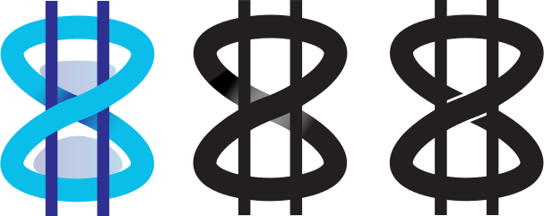

# MyCHIPs Documentation
Copyright MyCHIPs.org; See license in root of this package

## Overview
This software was designed at a high level by writing the
[MyCHIPs Papers](http://gotchoices.org/mychips) published on gotchoices.org 
starting about the beginning of 2018.  The presentation there is quite extensive,
and goes into some detail including possible financial derivative products and 
services that could develop surrounding a functioning MyCHIPs network.

While that original vision is still useful, many implementation details have
become more clear in the process of developing actual source code.  So the
documents here are more current and more specific to the way MyCHIPs is
actually being implemented.

Furthermore, the design is constantly evolving so even these documents can get out of
date from time to time.  When in doubt, consult the source code and/or consult the
author additional helpful information.

## Contents

- [Using the Software](use-start.md)
  - [Docker Test Instance](use-docker.md)
  - [Native Installation](use-native.md)
  - [Connecting the Admin UI](use-admin.md)
  - [Testing the Server](use-test.md)
  - [System Certificates](use-pki.md)
  - [User Mobile Application](use-mobile.md)
    - [Visual Balance Sheet](use-mobile.md#visual-balance-sheet)
    - [User API](use-mobile.md#user-api)
    - [Sample Command Line Client](use-mobile.md#sample-command-line-client)
  - [Running Simulations](sim-docker.md)
    - [Docker Simulation](sim-docker.md#containerized-simulation) (latest)
    - [Network Simulation](sim-network.md) (older)
    - [Local Simulation](sim-local.md) (oldest)
    - [Agent Modeling](sim-agent.md)

- [Learning the Software](learn.md)
  - Theoretical Background:
    - [A Complex Problem](learn-general.md#a-complex-problem)
    - [Money as Credit](learn-general.md#money-as-credit)
    - [Decentralization](learn-general.md#decentralization)
    - [Maintaining Discipline](learn-general.md#maintaining-discipline)
  - Implementation:
    - [Users and Identities](learn-users.md)
    - [Tallies and Chits](learn-tally.md)
    - [The Credit Lift](learn-lift.md)
    - [Network Topology](learn-network.md)
    - [Peer to Peer Connections](learn-noise.md)
    - [Peer to Peer Protocol](learn-protocol.md)

- Working on the Software
  - [Support Libraries](work-hacking.md)
  - [Modifying the Database Schema](work-hacking.md#schema-hacking)
  - [How You can Help](Project/README.md)
  - Future Design Documents
    - [Schema Upgrades](work-upgrade.md)
  - Older Design Documents
    - [Process Dialogs](old-dialog.md)
    - [Pre-1.0 Protocol Design Thoughts](old-safety.md)

- Reference Material
  - [Frequently Asked Questions](ref-faq.md)
  - [Organization of Source Tree](ref-source.md)
  - [Known Issues](ref-bugs.md)

## Other Documents
The [Notes](Notes/README.md) folder contains scans of original hand sketches notes, and 
calculations which could be helpful in understanding the implementation of the
software (if they can be read).

The [Project](Project/README.md) folder contains specifications for coding projects 
developers might want to consider working on.

## Design Figures
The figures included as .odg files can be opened in LibreOffice or a compatible 
program and are referenced at times from the documentation files.

This file [chipglass.svg](figures/chipglass.svg):

is an early attempt at a logo for MyCHIPs 
that indicates its origin in the notion that 
[time is money](http://gotchoices.org/mychips/whychips.html).

The file [[chip.svg](figures/chip.svg)](figures/chip.svg):

is a first take at a typographical
“chip sign” analogous to the “dollar sign” to indicate units of CHIPs. 
It can easily be hand written by making a “figure 8” with two vertical lines through.
Alternately, one can write a “backwards 3” (or curly “E”) followed by a closely 
placed “3” (to approximate an hourglass) and then add the two vertical lines.

The file [[MyCHIPs-logo.ai](figures/MyCHIPs-logo.ai)](figures/MyCHIPs-logo.ai):

contains a more stylized logo and monochrome typographical figure.

The intent of this is to make a standard international symbol for a more
[objective measure](http://gotchoices.org/mychips/definition.html)
of value based on the essence of human time, and independent 
of the economic forces (such as supply and demand) that tend to change the 
price of human work in various economies.  Admittedly, the MyCHIPs definition 
of value is still not entirely objective.  However, it is much more objective 
than the modern definition of a Dollar, a Euro, or any other fiat currency.
