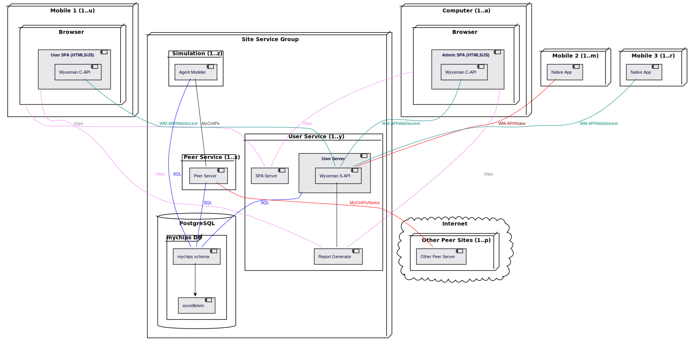

## The MyCHIPs Network

### General Topology
This diagram shows the basic parts of a single site, which represents one
or more logical nodes, or entities:

### Trading entity
An entity is a person or a company who establishes itself on the network for
the purpose of trading credits with other entities.

An entity can have any number of MyCHIPs ID's trading on the network.  But
ideally, there would be only one such ID issuing its own credits on any
given asset (such as future profits, productivity, or a specific collateral
asset).  This is like having more than one credit card, or more critically,
more than one mortgage.  One's creditors probably need to know who is first 
in line to collect on your promises--especially if it involves collateral as
security.

Consumers who trade solely for the credits of others can rightly do so under 
any number of ID's at one time.  This is like having multiple debit cards.  As
long as you collect value in each account before spending that value, no one
gets hurt by you having more than one account.

### Database Instance
A backend database contains a data set for one or more different trading 
entities (users).  This data set includes information about what credit 
connections each user has with others on the network.  It also includes what 
credits each user wants to obtain or trade away.

The relationships linked to a single entity represent a very limited view of 
the network.  But a database used by many different users may be able to 
identify chains of relationships, forming a linear string, or perhaps even a 
complete circuit.  This is useful in executing a credit lift, the ultimate goal 
of the network.

So in theory, the more users you can accommodate in a single database instance,
the more valuable you can be to your customers in facilitating efficient lifts.

A user's or peer's state is meant to be authoritatively kept in the database.
This implies, the database must be [ACID](https://en.wikipedia.org/wiki/ACID)
and therefore [Atomic](https://en.wikipedia.org/wiki/Atomicity_(database_systems).

The database will also have to issue its own asynchronous notifications as 
there is no guaranty what other peer server instances may or may not be running 
at any given time.  In other words, users and peers may be interacting with the 
database (and therefore the network state) through one of the processes 
outlined below, or by some other way.

The database must properly maintain state, respond to authorized state change 
requests, execute orderly state changes, and notify any listeners of applicable
state changes.

### Peer Server Instance
Each database instance can interact with one or more peer server instances, known as *agents*.
Each listens for connections from other agents
(i.e. other instances of itself, or similarly functioning software).
It will also initiate connections with other agents for the purpose of executing transactions.

An gent transmits and listens on a public interface.
It processes requests, interprets state transitions, and then transmits changes of state
back to the database instance, ideally over an internal, higher speed interface.

When an agent is launched, it must know what users it acts on behalf of.
It therefore should register itself with the database instance so as to receive
notifications, which might have been intiated elsewhere, but which are 
applicable to the user(s) the peer server works on behalf of.

### User Server Instance
This server may run together or separately from the peer server.

In the initial implementation, it serves up and communicates with a user SPA to 
control various settings and functions of the user account.  Examples include 
establishing trading preferences (what credits the user is collecting or 
trading away), and inviting other users to share a trading connection (issuing
peer tickets).

Ideally, the user client will be implemented as a standalone phone app (rather
than an SPA).  This should provide much better security for stored keys and 
the like.  Hopefully, the client app and client SPA can utilize the same API
for communicating with the user server.

### Admin Portal
This is actually a separate SPA that communicates through the user server
mentioned above.

It allows the site administrator to control various settings and functions of 
the backend database.  Examples include establishing user accounts and issuing 
connection tickets for those users.

The admin app also contains an interative flow chart to show the network nodes 
its database server knows about.  It is hoped this display will be helpful in 
planning, designing, visualizing debugging the lift algorithm.

### Connections
Each user entity would typically have at least one up-stream and one down-
stream trading connection (tally) in order to effectively trade on the network.
However, in some instances those two connections can virtually be with a single 
other trading partner (i.e. on the same tally).

An up-stream connection is made with someone you usually provide goods or 
services *to.*  For example, your employer is an up-stream connection for you.
If you are a business, your customers are up-stream of you.

The "stream" analogy applies to the direction money would normally flow in 
normal commerce.  So if money flows from customers to their vendors, we 
envision that money as flowing "down hill."

So your down-stream connections are the people and companies you buy goods and 
services from.

So in a credit lift, we will reverse the flow of value so the money will appear 
to move back "up the hill" as you collect back credits from your vendors and 
send it back to your customers.

### Circuits
The objective of the network is to discover strings of connections that link
together, normally in a single direction (i.e. up stream), but find their way 
back to the original entity coming from the other direction (i.e. from down 
stream).

This means a complete circle has been discovered where credits are naturally
flowing in a loop.  Once this circle has been discovered, a server can attempt
to initiate a credit lift around the circle, which will be a transaction
involving all the entities in the loop.

### Scaling
The MyCHIPs server is designed to be able to run all services in a single process.
This simplifies things for smaller system where even the database may be running on the same computer.

When this gets to be too much for a single CPU, a next step might be to
split the database off onto a separate machine.  Now you have two kinds of
thing to measure and scale: database processing and network traffic.

When the network traffic becomes too much for a single process to handle, a
next logical step would be to break off the admin and user server processes.
Admin may not help much as it may not involve all that much traffic.  But
user interactions should be a pretty good chunk of overall activity.

Still, the automated traffic due to lifts and information requests is bound
to be the lion's share of activity.  So you can launch multiple peer server 
processes, on multiple machines, with each process handling as few as a single 
user's traffic.

Loading on the individual database will depend solely on the amount of trading
traffic each user generates.  A single instance may be able to manage hundreds
or even thousands of low traffic users.  A single, very big user may require a
its own server.  Indeed, a single user could eventually overload a single 
database instance.

If/when a provider needs to scale into multiple database instances, it is
conceivable to operate some kind of specialized graph database that just 
gathers and analyses relationship chains for the sole purpose of facilitating 
lifts.  This reference implementation is not currently attempting anything of
that scope.

### Events
Processes are designed to be event driven.  Most state transitions should
occur (whether directly or indirectly) as a result of actions by a user somewhere.
But there are some exceptions.

User Initiated: (someone with an account on our system) 
  - Request a ticket be generated, inviting one or more peers to start a tally
  - Request payment from a peer on an established tally
  - Send payment to a peer on an established tally
  - Seek a potential linear lift (or drop) pathway to a specified peer
  - Execute a linear lift (or drop) to a specified peer
  - Submit a change to the user's lift (buy/sell) trading parameters
  - Set some other operational parameter (examples?)
  - Request credit info on another peer

Peer Initiated: (Similar to above, but from peer server's perspective)
  - Incoming tally request
  - Incoming chit proffer (invoice or payment)
  - Pathway information request
  - Lift/drop execution request
  - Query request for user credit information, if available

Automated:
  - Initiate strategic lift requests

Admin Initiated:
  - Add new user
  - Issue ticket inviting a user to connect/validate keys

### Services
In summary, a site can carry on a variety of different types of network traffic as follows:
- Service Provider Home Page: https://cspHost/index.html (port 443)  
  Most sites will publish an https home page where new users can sign up and existing users can connect to restore a lost connection key.
  Service Providers may publish any number of such pages to support their particular business model.
  The server should carry this out over SSL on standard port 443.
  Insecure connections over port 80 should be redirected to https.
- Agents: np://agentIP:agentPort (65430 or any port)  
  A site may support any number of agent processes answering on any number of different port numbers.
  There are no *standard* port numbers to use.
  The IP number and port for a particular agent are generally made known only to direct partners so there is no need for this to be generally known or predictable.
  Agent traffic is carried out using [noise protocol](/learn-noise.md#noise-protocol-implementation).
- User Connections:  https://cspHost:1024 (or any port)  
  MyCHIPs can optionally serve up SPA web applications on a port defined by the administrator.
  There is an app for the site administrator (admin.html) and one for regular users (user.html).
  The admin app may be useful on small systems where new users are added by hand.
  The user app is meant primarily for testing.
  Regular users should generally connect via the mobile application.
- User Websocket Connections:  wss://cspHost:1025 (or any port)  
  User SPA's and mobile applications connect to the system via websocket.
  During authentication, they must also perform an https fetch (https://cspHost:1024/clientinfo).
  So by convention user connection services specify a pair of adjacent ports where https is done on the first, even port and websockets connect on ths second, odd port.
- Reports:  https://cspHost:1024/report/id/resource  
  User SPA's and mobile applications may also request reports from the control layer.
  If/when such reports are furnished via https addresses, these will be on the same host:port where SPA's are served.
- Documents:  https://cspHost/document/documentHash  
  The site will provide a copy of any document to any client who knows enough to ask specifically for the document hash.
  Hashes are expected to be SHA-256.
  Documents include:
  - Known MyCHIPs contracts (Specially serialized JSON)
  - User ID photographs (JPG, GIF, PNG)
  In the future, this service could be replaced or augmented by a general IPFS service.
- Custom Integrations
  User integrations (such as commercial users working in concert with other software) may well communicate directly with the SQL database.

 [Next - Hacking](work-noise.md)
 [Back to Index](README.md#contents)
