## MyCHIPs Protocol Description 1.3 (working draft)
May 2022; Copyright MyCHIPs.org

### Overview ([TL;DR](#network-assumptions "Skip to the meat"))
As the project began, it was difficult to attempt a top-down design of the system.

I had a basic, intuitive idea about how sites and nodes should communicate with each other,
and what types of messages they would send back and forth, but I didn't really understand it
in a formal enough way to create a detailed description of the protocol.
Instead, I jumped in and started coding.

While that is probably not the most widely accepted approach, it did give me a working prototype of a MyCHIPs site, albeit not yet secure.
In conjunction with the agent-model simulator, I could generate random data sets.
And with the network visualizer, I could now actually see what a network might evolve into and what type of scenarios the protocol would have to handle.

As I went, I produced documents like those included here for
[tallies](learn-tally.md) and [lifts](learn-lift.md)
to help me make sense of what I needed to code.
Those still serve as a helpful reference for the prototype implementation.

Next came the DSR study, which revealed some security/liveness flaws in the way I had designed and implemented the protocol.
The intermediate BYU results (as of Summer 2021) indicate that the addition of the referee will now allow a distributed lift that is acceptably live and secure.

Admittedly, the referee is a compromise from the original goal of a fully distributed system.
But it is still highly decentralized, and its main role is so nodes can achieve consensus about when a pending lift should expire.
Thankfully, the referee doesn't need to know anything about individual entities' balances, keys, or other sensitive data.
So all other functions are still fully distributed.

This document is an attempt to more formally describe a refined protocol with the help of UML sequence and state diagrams.
The goal is to prepare the way for a further revision of the codebase to bring it into line with this improved protocol.
Hopefully this will serve as a clear enough description that any eventual implementation can interoperate with any other.

### Network Assumptions
MyCHIPs assumes a network of peer entities who become interconnected through voluntary credit relationships they establish with each other.
Such an entity could be an individual person or it could be a legal organization such as a corporation or a partnership (i.e. a group of people).
The term *user* is also used to be roughly synonymous with entity (with a possible bias toward human entities).

Entities should quantify the degree to which they trust the peer entities they connect with.
When that trust is greater than zero (i.e. [credit terms](learn-tally.md#credit-terms) are offered), one should be prepared to possibly lose (or exert an effort to collect) the amount of value quantified in the trust.
For example, if I extend you 10 CHIPs of credit, I must recognize the possibility that you may fail to uphold your promise.
In that case, I may lose the promised value, or have to rely on collateral if such is a part of the particular credit agreement.

Although this limited risk from trading parters is a necessary part of the system, people should not be exposed to indirect risks.
For example, if I (A) share a tally with you (B), and you also share a tally with a third entity (C), I don't want to have to rely on your trust of C.
C may hurt you.  But I don't want C to be able to hurt me.

So the assumptions in a distributed network are that contracts and obligations exist only between two immediately connected peer entities.
The instrument for documenting and enforcing that connection is the [Tally](learn-tally.md).

### Sites and Nodes
When reasoning about lifts and other MyCHIPs transactions, it is sometimes easiest to think of entities as individual, independent nodes
in a giant [graph network](https://en.wikipedia.org/wiki/Graph_theory).

While this works pretty well in most cases, it is important to remember the implementation reality:
Individual entity accounts must be hosted on a server that can maintain a network presence at all times--even when a user's mobile device might be turned off.
And these servers will most likely host more than one user.

This introduces the notion of a *site* which typically represents a single database of users surrounded by a possible cluster of process and control-layer support servers.

The term *node* will get used in a more generic way, possibly referring to an entity, a site, or a set of users (a <i>segment</i>) within a site, depending on the context.
The term *server* may be used sometimes as roughly synonymous with *site.*

### Protocol Layers
This document is defining the model state level **protocol** whereby nodes communicate with each other to:
- Establish tallies (formalized trading relationships) between entities
- Send value via direct Chits on a single tally
- Discover potential lift pathways through the network
- Execute distributed lifts across the network

In addition, we will cover the following which might be considered as sub-protocols:
- Gaining consensus between two entities sharing a tally as to the order of chits on the tally
- Communicating with a Referee nominated to call time on a lift transaction

At a lower level, sites will communicate with each other over an encrypted secure connection which uses
[Noise Protocol](http://noiseprotocol.org) and is discussed in some more detail [here](/doc/learn-noise.md).

### State Processing
The protocol is implemented as a state transition model.  This is important because in a
distributed network, nodes are apt to go offline from time to time and network connections may
not always be reliable.

End users will be running software on their mobile devices.
Those devices will communicate with a user service control-layer process which will in turn communicated with the model inside the database.
The database will communicate with a agent process which will communicate with other peer agent processes.

If/when a message is lost in all of this, the system should:
- Stay in a consistent state until the message gets through or is rightly abandoned;
- Enforce the need to re-transmit the message as necessary;
- Tolerate multiple messages getting through, or messages coming through late or at an unexpected time.

### Tally Use Cases
A tally is established when two parties decide to formalize a relationship of trust between them using the MyCHIPs protocol.

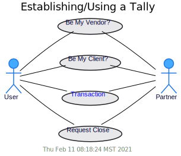

These use-cases are explained as follows::
- **Be My Vendor**:
  The User reaches out to a potential trading Partner and asks if he would like to establish a tally.
  This must always happen via some communication channel outside the MyCHIPs protocol.
  We will call this “[out-of-band communication](https://en.wikipedia.org/wiki/Out-of-band_data).”
  Examples include meeting in-person, email, teleconference or a traditional web connection.
  In this case, the User is suggesting he hold the [Foil](learn-tally.md#tally-parts) of the tally and the Partner will hold the [Stock](learn-tally.md#tally-parts).
  The partner is the vendor, or provider of services, so money (value) will normally flow from User to Partner.
  In the moment of exchange, the User will owe value to the Partner.
  In other words, the Partner will have lent money to the User.
- **Be My Client**:
  This is really identical in all respects to the previous case, except the User is suggesting he be the Vendor (the Stock holder) and the Partner will be the Client (the Foil holder).
- **Transaction**:
  Once established, the tally will serve as a foundation for payments (pledges of credit).
  It will maintain and track a total balance owed in one direction or the other.
  And it constitutes a signed digital contract indicating the [terms and conditions](learn-tally.md#credit-terms) by which the two parties have agreed to conduct their trades.
  The tally balance is modified by entering individual atomic transactions called [chits](https://www.dictionary.com/browse/chit).
  These chits are also digitally signed and become a part of the tally.
- **Setting**:
  There are a number of parameters in a tally that can be set unilaterally by the stock or foil holder after a tally has been signed and agreed to.
  These should not violate the formal terms and conditions of the tally (i.e. those digitally signed by both parties).
  But they will clearly affect how the system will operate the tally.
  
  Settings are modeled as a special kind of chit that transmits no value--only information.
  This will facilitate verifying that each end of the tally contains the same information about settings.

  Users can make the following tally settings:
  - Adjust/change lift [trading variables](learn-lifts.md#trading-variables).
    Although these seem to be solely the business of the user's host service, the partner site needs to know certain aspects in order to properly estimate lift lading capacity.
  - Request a tally to be closed, once it's balance reaches zero.
    While this can be done at any time, a debtor may still not have an obligation to pay down a debt any faster than specified in the previously signed credit terms.
  - Specify a <i>call date</i> or when the other partner is expected to pay its balance down to zero.
  - Change one's own agent address.
  
### Tally Protocol
The steps to establish a tally are shown in the following sequence diagram.
This covers the first two tally use cases, the only difference being which entity is designated as the stock holder and which is the foil holder.
Tally initiation is also discussed in some detail [here](learn-tally.md#establishing-a-tally).

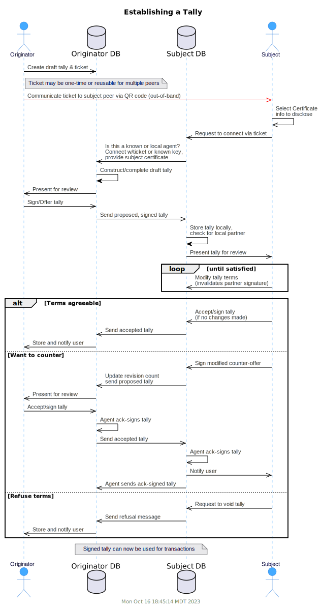

As mentioned, transactions and settings are carried out as chits, which get added to the tally.
More on chits [below](#chit-use-cases).

When one of the partners wishes to end the trading relationship, he can do so by the steps in the following sequence diagram.
If the creditor wants to close the tally and is willing to forfeit his balance owed, he can simply gift the balance back to the debtor.
The tally, marked as "closing," will then close automatically.

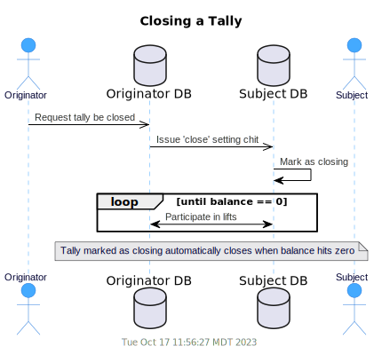

If the creditor wants to retain what is owed to him, he will have to wait for the agreed upon payment terms to time out.
In the normal course of time, payment should be made by the debtor by way of a lift, or some other consideration of product, services or some other kind of money.

If the debtor wants to close the tally sooner, he will have to figure out how to provide value sufficient to zero the balance.

Now we can derive the following state diagram to describe the tally protocol from the perspective of a single entity:

[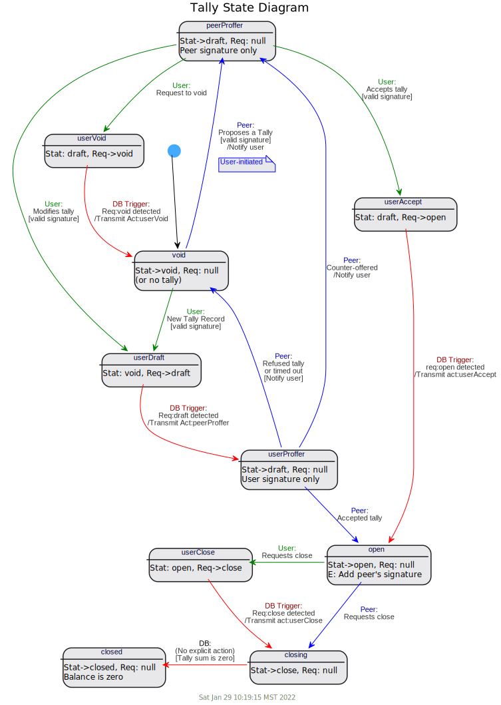](uml/state-tally.svg)

### Chit Use Cases
A chit constitutes a pledge of future value from one entity to another.
There are three basic types of chits:
- **Direct Chit**:
  This is a simple promise issued by one entity, to its direct trading partner.
  It only needs to be signed by the entity pledging value.
- **Setting Chit**:
  This is a declaration by one entity that it wishes to change certain operating conditions of the tally.
  It must be properly signed by that entity.
  For most protocol purposes, it will be dealt with just like a direct chit.
  It has the additional side effect of modifying things like the tally request (close), credit terms, or trading variables.
- **Lift Chit**:
  In this case, the chit is part of a larger [credit lift](learn-lift.md).
  There will be a whole group of chits, all bound to the lift.
  A lift chit will to be signed by a *site* or *referee* certificate, where the site is the system that hosts the MyCHIPs accounts for all the users in the (local) lift or the referee is a site that arbitrates timing for a distributed lift in which multiple sites participate.
  Clearly, the idea of letting one's Chip Service Provider (or worse, some unknown referee site) sign chits on one's behalf sounds potentially dangerous.
  So there are some limitations on lift chits:
  - The net effect on an entity of a group of (typically 2) chits, belonging to a single lift, must be in accordance with the [trading variables](learn-lifts.md#trading-variables) established and signed by that user.
  - Typically this means the chits sum to zero so the entity doesn't gain or lose value through the lift.
  - But it could be non-zero if the trading variables specify a charge or allow a penalty for certain lifts.
  - It is the responsibility of a user's host site software to see that lifts are conducted securely and according to these limitations.

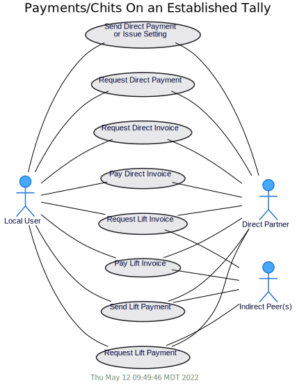

This diagram depicts two sets of similar use cases.
In the simpler case, an entity will negotiate a payment with a direct trading partner.
In the more complex case, we will execute a linear lift that will transmit value through the network to a peer entity our user is not directly connected to.
This lift will also involve one of our direct partners who will be the first link in a chain of entities the lift will flow through.

### Direct Chit Protocol
We will first deal with the simpler case where a single direct chit is being entered onto an existing tally between two entities.
Either entity can change a setting or make a direct payment to the other simply by making and signing a chit.

This diagram shows the first case, Sending a Setting or Direct Payment:

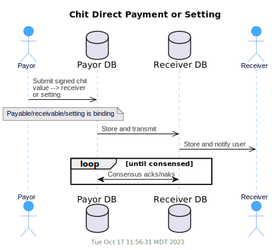

When requesting a direct payment from the other party, the sequence gets a little more complicated.
This involves the generation of an *invoice,* or request for payment.
Setting chits are not applicable to this sequence.

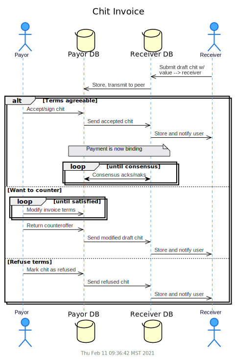

This diagram also covers the fourth use case, Pay Direct Invoice.
This is what the Payor does once he receives the proposed chit (see the alt conditional block in the previous diagram).

Note that the [consensus algorithm](#chit-chain-consensus) has nothing to do with the validity of a chit.
If a chit is signed by the party pledging value (debtor), it is a valid chit.
However, the parties eventually need to also agree about the *order* in which chits are entered into the tally.

The third use case (Request Direct Invoice) is one step before this.
For example, imagine a vendor has provided you services and you are ready to remit payment.
You may not know the exact charge, but you want to initiate the process by Requesting a Direct Invoice.

This is not strictly part of the MyCHIPs protocol.
Rather it would be conducted as out-of-band communication (paper, http, email, or text).
But the software needs to facilitate the process by issuing/scanning QR codes containing the necessary data to initiate a responsive chit or lift.

For example: “Hey, how much do I owe you for that gopher-bomb?“
“Well, here's a QR code that will take you to an https endpoint that yields a JSON object containing just the information you are asking for!”

The returned object would contain:
- The address of the entity who will receive the payment (smoke-em-out@chippies.net),
- The amount payable,
- An optional listing and descriptions of items contributing to the total,
- Optional hints about where to find this entity on the network.

This sequence will be dealt with in more detail in the section below on [lifts](#lift-protocol).
It can be generalized to the simpler case above where an invoice is requested from a direct partner.

Now we can derive the following state diagram to describe the direct chit protocol from the perspective of a single entity.
Notice the states for setting chits are shown right along with regular transaction chits, and depicted as:
- Hold.pend.good, Hold.good: Settings made by our local user (tally holder), and
- Part.good: Settings made by the remote partner peer.

[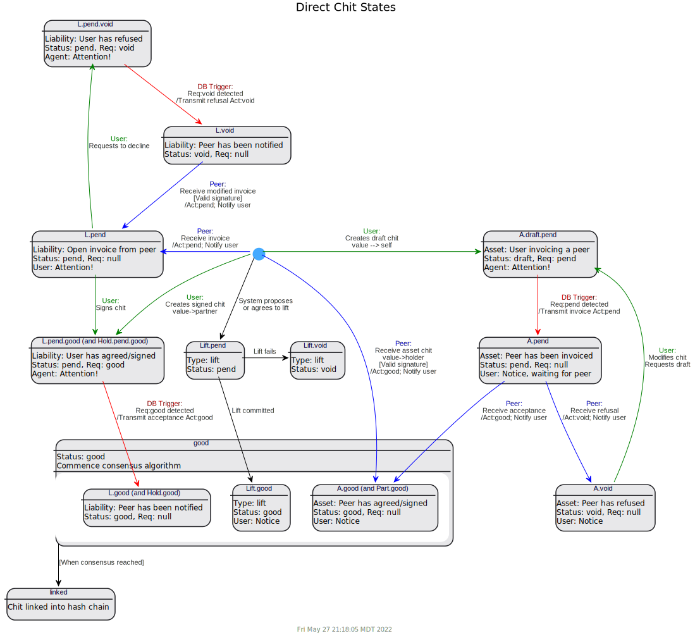](uml/state-chit.svg)

### Chit Chain Consensus
The last step in the diagram above refers to a consensus process.
This is a sub-protocol by which the stock and foil agree upon the order and content of chits entered onto their copies of the tally.
Chit order may not be particularly important from a theoretical standpoint.
But content certainly is.
MyCHIPs uses a storage mechanism called a [hash chain](https://en.wikipedia.org/wiki/Hash_chain) to assure consistency in both.

Each chit contains a hash of its other contents.
This hash is useful for detecting if anything in the chit has changed (something we don't want to happen).

Each chit also contains a copy of the hash for the chit preceeding it in a sequential chain.
In this way, the hash of the latest chit can be compared with the same point in the chain on the other end of the tally.

This *chit chain* can be thought of as a tiny blockchain, known only to the two entities who share the tally.
When the data is kept this way, it is very easy for the two partners to verify that they have identical information, just by comparing the hash they hold for the last consensed chit on the chain.

Manual chits (transactions or settings) may originate from either end of the tally at any time.

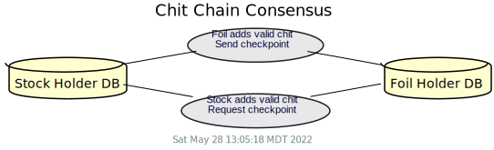

When chits are created as part of a distributed lift, validating signatures will normally propagate around the lift circuit in the downstream (foil to stock) direction.
So the foil holder on any given tally will usually get the signature before the stock holder.
As they attempt to reach consensus on chit order, the signature will naturally get shared with the stock.

The following diagram shows the sequence of events for the two basic use cases.
Keep in mind, this activity is going on as part of the normal chit creation/transmission process described above (and/or in the later lift section).
But it is an important additional mechanism that makes sure the stock and foil keep consistent versions of all chit information that gets appended to the tally.

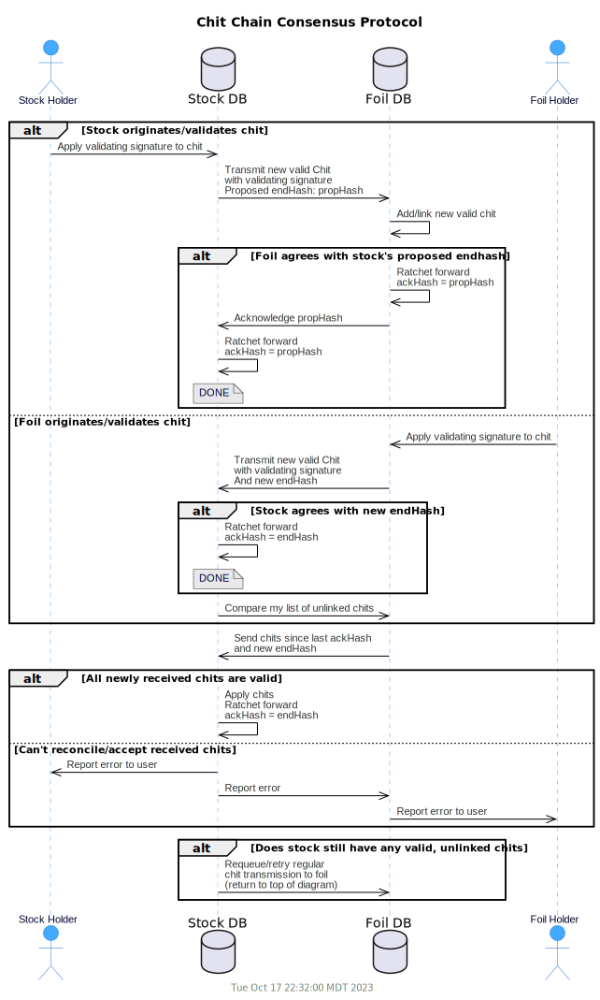

The consensus rules are pretty simple.
Both stock and foil have the duty (and natural incentive) to recognize, accept and store a duly signed and valid chit received from the other.
But the foil is responsible to choose the order chits will be linked into the chain.
The stock must conform to that order.

The goal of the consensus protocol is then to:
- order (link) all valid chits linked into a [hash-chained](https://en.wikipedia.org/wiki/Hash_chain) list; and
- verify that the stock and foil both have an identical chained list of valid chits.

The simplest case is when one side generates a chit and that chit gets completely propagated and linked on both ends before anything else happens on the tally.
Unfortunately, real life will probably involve several other more messy scenarios:
1. One or more valid chits get generated on both ends of the tally and are transmitted at about the same time.
  Both stock and tally will have linked these chits already and think they have a valid end hash.
  The stock will have to comport to the foil's version of things and reorder its chain accordingly.
  So it should only keep a *provisional* end hash (propHash) until the foil acknowledges it.
2. The network between stock and foil is disrupted during normal chit message transmission.
  The packet handling system is built to correctly detect this and use retries to eventually get the packets through sometime later when connectivity is reestablished.
  The state of a chit should remain pending (i.e. not yet good) until the transmitting node successfully connects with the other side's agent.
  As a result, this scenario should devolve into scenario 1 once connectivity is finally restored.
3. A network packet is correctly transmitted to the other side but then lost somehow.
  This could happen if the agent process loses connection to the database at just the wrong time.
  This probably would not be detected until someone tries to add another chit to the chain.
  Then it would be evident to one side that it has a stray, valid chit that is not part of the other side's chain.
  - If the stock lost a chit, it should become evident next time the foil sends a list of activitiy since the last acknowledged checkpoint.
  - If the foil lost a chit, the stock should find it has a leftover valid chit after conforming to the foil.
    It can then just resend that chit through the normal chit protocol.
The system should be tolerant of a packet for the same chit (same tally and chit uuid) arriving two or more times.
This is accomplished by only processing state transitions if the chit is currently in the expected state.

It may seem a little confusing to determine whether the consensus protocol is really a tally thing or a chit thing.
It is centered around chits.
But it is really the two halves of the tally that are (or are not) fully consensed at any given time.

Visualize it this way:
Chaining status is a sub-state of a good chit and consensus is a sub-state of an open tally.
- A valid chit can be:
  - unlinked
  - provisionally linked (stock only)
  - linked
- An open (and/or closing) tally can be:
 - fully consensed (all valid chits are linked)
 - not fully consensed (one or more valid chits are not yet linked)

In addition to the three basic chit substates shown above, it will be important to know if/when consensus messages have been successfully sent to the other side.
We will do this by queing messages and only completing state transition after the message has been sent.
This will allow for more graceful error recovery when a process server crashes or is restarted.

We can now derive the following state diagram to describe the consensus sub-states from the perspective of a single side.
First, the states associated with the foil:

[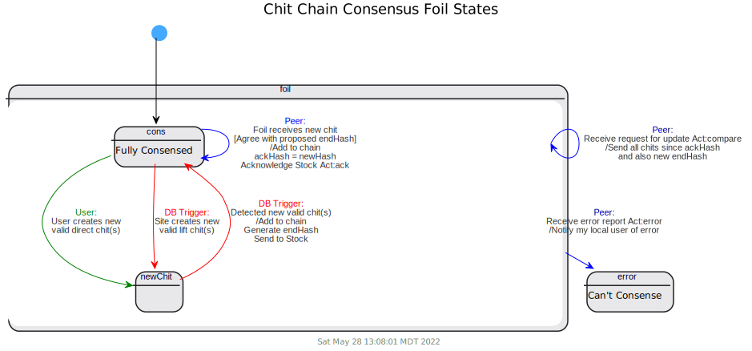](uml/state-conf.svg)

States for the foil are pretty straightforward.
It mainly needs to track new good chits, link them into its chain, and reliably inform the Stock about the latest end hash.

For the Stock, it is a little more complicated.
It must be able to conform to information it receives from the foil.
It can't really consider itself fully settled until receiving proper confirmation from the foil.
And it may need to ask the foil for any chits it has overlooked or not yet received.

[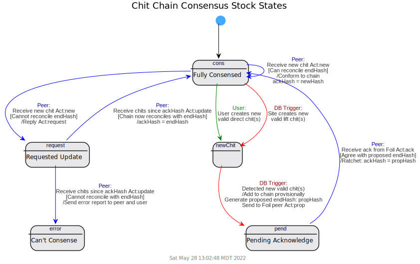](uml/state-cons.svg)

### Credit Lifts Explained
So far, the protocol has dealt primarily with transactions moving value between two partners who are directly connected by a tally.

Transactions of this kind are quite limited.
Certainly, one party can pledge value to another.
But so far, there is no obvious way to resolve such pledges (i.e. get paid) other than hoping for some later return of compensatory product, services or alternative money.

But MyCHIPs accomplishes much more than that.
It allows parties to transmit surplus credits (pledges) they hold, back through the network, and have them reappear as credits on other tallies where they can be spent on something you actually need or want.

The [lift algorithm](http://gotchoices.org/mychips/acdc.html) is like a way to “pay your bills” without the need for traditional money.
It can be thought of as trading what you *have but don't need*, for what you *need but don't have*.
This is sometimes called a “clearing function” as it “clears out” or “nets to zero” offsetting credits on each node it traverses.

This figure shows a circular loop of trading partners.
The arrows show the normal flow of money, credit, or IOU's in a clock-wise direction.
Each arrow also represents a tally, pointing from the foil at its tail, to the stock at its head.

A circular credit lift will move value in the opposite, or counter-clockwise direction, clearing out credit imbalances along the way.

The linear version of the credit lift performs a related function, allowing you to send value through the network to an entity you are not directly connected to.
It can be thought of as paying with *what you have but don't want*, while the receiver gets *what he wants but does not yet have*.
Participating entities along the way also get the benefit of a clearing function on their own tallies.

In order to perform these lifts, nodes must have some idea of where to send credits so they will arrive at their intended destination.
If there was a single, giant database of all the tallies in the world, this would not be such a difficult task.
A central-planning algorithm could simply determine the most efficient lift pathway and create the required chits on all the applicable tallies in a single, consistent, atomic transaction.
In fact, a single MyCHIP site with lots of users can do these kinds of "local lifts" where opportunities
exist among their own user base.

But MyCHIPs is purposely designed as a <a href="https://blockchainengineer.com/centralized-vs-decentralized-vs-distributed-network/">fully distributed</a> system.
The intent is, no single database will contain knowledge of the whole network.
Ideally, databases will only contain detailed information about the *local* entities they host and other *foreign* entities their local users are directly connected to by tallies.
Even then, information about foreign entities will be kept as limited as possible.

To accomplish this, each database will build a map of theoretical routes believed to exist somewhere in the outside network.
For the purposes of regular (circular) lifts, the goal is to find external routes:
- from known, up-stream foreign entities,
- to known, down-stream foreign entities.

Knowing such external pathways, a site should be able to combine them with known, internal segments of entities to form a complete lift circuit.

For linear (payment) lifts, the process is similar.
The goal is to find external pathways:
- from a known, up-stream foreign entity,
- to a particular, identified foreign entity,
- who may also have provided *hints* about one or more well-known entities it has a direct down-stream connection to.

We use the terminology *up-stream* to denote a peer who owes us excess money.
This is typically associated with a tally of which we hold the stock.
But it is also possible to accumulate excess CHIPs on a tally foil.
An employer or customer is a good example of a partner you would normally find up-stream from you.

We use the terminology *down-stream* to denote a peer we might owe money to.
Alternately, it could be someone who owes us less than we want them to.
This is often associated with a tally of which we hold the foil.
But it is also possible to have fewer CHIP credits than we want on a tally stock.
A merchant or supplier is a good example of a partner you would normally find down-stream of you.

This figure shows a convenient way to visualize a lift pathway in a real implementation.
A site database will contain multiple entities who are connected in a short, linear segment.
Some of these are local, meaning their accounts are hosted by the site.
For example, site B hosts users B1, B2 and B3.
But a lift will probably be moving upstream through them, so we would describe the segment in the direction of the lift as [B3, B2, B1].

Hopefully, each chain will begin and end with two or more foreign users (hosted by some other site).
Otherwise, a distributed lift through the segment will not be possible.
For example, the chain [B3, B2, B1] is also connected to an up-stream foreign peer A3 at its top end
and a down-stream foreign peer C1 at its bottom.

Site B knows about a complete segment [A3, B1, B2, B3, C1].
But that is where site B's direct knowledge about the network ends.
It will be reliant on site A, site B, and probably a bunch of other sites to execute a complete distributed lift.

Note: As of Feb 2022, local path segments handle foreign peers differently.
Older versions maintained an explicit entity ID (in the peer table) for remote peers and those ID's formed the top and bottom endpoints of segments.
More recently, segments are only connected in the middle by local user ID's and the ends are characterized by no ID at all (a NULL).
So the internal representation of the B segment would be: [NULL, B3, B2, B1, NULL].

Sites typically will know nothing about the internal ID of users hosted on other sites.
Information about the foreign peers at the end of a segment is derived from the partner certificate stored in the asociated tally.
A CHIP address (cid:agent) is found there, but no local ID that can be used for linking segments.

So a lift segment can be defined as:
- One or more local entities connected in a linear chain; and
- A foreign entity at the top of the chain; and
- A foreign entity at the bottom of the chain.

The *lift capacity* along a segment is computed by comparing the ability/desire of each entity in the chain to perform a lift.
Individual entities define [trading variables](learn-tally.md#trading-variables) that control how many credits they would like to maintain on any given tally.

The lift algorithm compares the actual tally balance to the *desired* balance to arrive at a lift capacity.

As of February, 2022 lifts have been generalized to include transactions that move upstream *or downstream* (technically a *drop*).
Previously segments were linked by joining tallies together stock-to-foil.
So one could only consider a lift or a drop across the complete segment.

Now tallies are linked together according to their capacity to flow (lift) value in either the stock-to-foil or foil-to-stock direction.
In fact, a single tally might simultaneously be a candidate for a lift and a drop, as a member of different segments.
This will allow much more flexibility for users in controlling their accumulated balances.

So as the terms *upstream* and *downstream* are used in relation to a lift,
*upstream* simply means in the direction we want the lift value to flow and *downstream* means the opposite.

### Route Discovery Protocol
Having identified *local* segments that have capacity for a potential lift,
each site then needs a way to cooperate with *foreign* peer sites to gather just enough 
information so it can reasonably initiate lifts or participate in others' lifts.

Each site needs to know whether a potential external route might exist where:
- a lift can be initiated through the top of a given local segment (B1->A3); and
- for circular lifts: the lift will return to us via the bottom of the segment (C1->B3); or
- for linear lifts: the lift will arrive at the desired destination entity (Xn);

In our scenario, site B doesn't really need to know many details about the route--just whether one or more such paths exist.
The route may pass through many other sites on its way back to C1.
In fact, it may pass through some sites more than once, traversing multiple segments.

Once site B has identified the local entities [B1,B2,B3] as a single segment with a known lift capacity, it can treat them as an integral *node* in the lift--almost as though it were a single entity.
The lift will be committed (or canceled) in a single, atomic transaction on behalf of all the nodes belonging to the segment.

Route discovery requests can be initiated in two ways:
- Manually by a user/entity; or
- By an [autonomous process](https://en.wikipedia.org/wiki/Cron) acting as *agent* on behalf of the entity or the site.

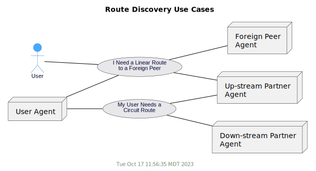

An entity would typically request a route because it intends to make a payment (linear lift) to some other entity.
The payee entity's [CHIP address](learn-users.md#chip-addresses) might be obtained by scanning an invoice QR code or processing an object embedded in an email or text message.
The payor's app would then send that information to his host site.
His agent server process can then commence the discovery process for possible external routes to complete the intended lift.

For a linear lift, each end of the lift may involve a *partial segment*.
The payor segment may include zero or more other local entities upstream before the lift jumps to a foreign peer
(for example: [C2, C1, (B3)]).
The lift may pass through zero or more downstream local entities before reaching the payee
(for example: [(B1), A3, A2]).
Nodes along the way (relays) get the same experience whether the lift is circular or linear.

Manual routing requests are handled as follows:

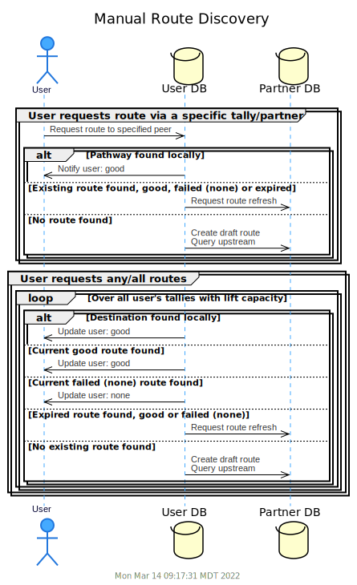

As mentioned, an autonomous agent process is periodically scanning for liftable balances along local segments.
Upon discovering a segment with a capacity for a lift, the system will check its database for external routes that might be used to complete the circuit.

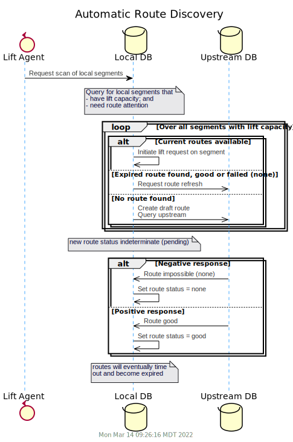

If a suitable route is not yet known, the agent will commence a search by creating one or more 
draft route records in the local database.
This causes the associated agent processes to propagate the query to their associated upstream partners.

If previous successful searches have already been conducted but are too old to be reliable,
the routes may be updated simply by resetting them to draft status again and the process will repeat.

If previous searches have been inconclusive, the agent should similarly retry after a reasonable amount of time has passed.
The database maintains a sorting algorithm internally to determine when to retry old routes and when to try creating new ones.

As mentioned, each site acts in two roles:
- It may initiate upstream route queries necessary for conducting trades for local users; and
- It may receive queries from downstream and act upon them.

The second role is shown in the following sequence diagram:

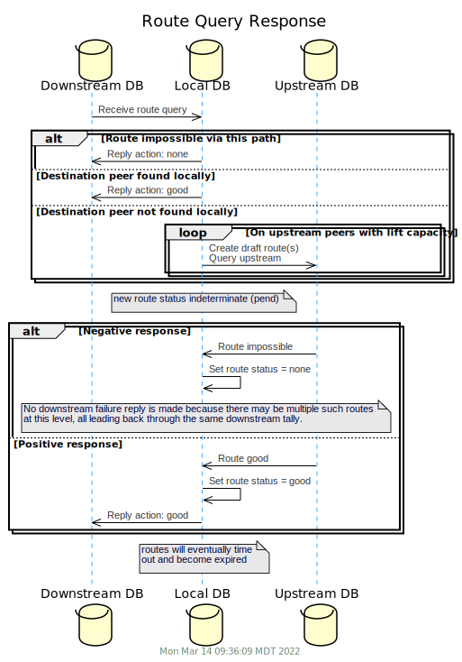

A node responding to a query from downstream really has four possible outcomes:
- The destination node is found on a segment connected to this incoming request;
- There is no pathway possible because there are no upstream tallies with foreign peers;
- One or more pathways are possible through existing, known routes;
- Pathways may be possible but more upstream queries will be needed to find out.

Now we can derive the following state diagram to describe the route discovery protocol from the perspective of a single site:

[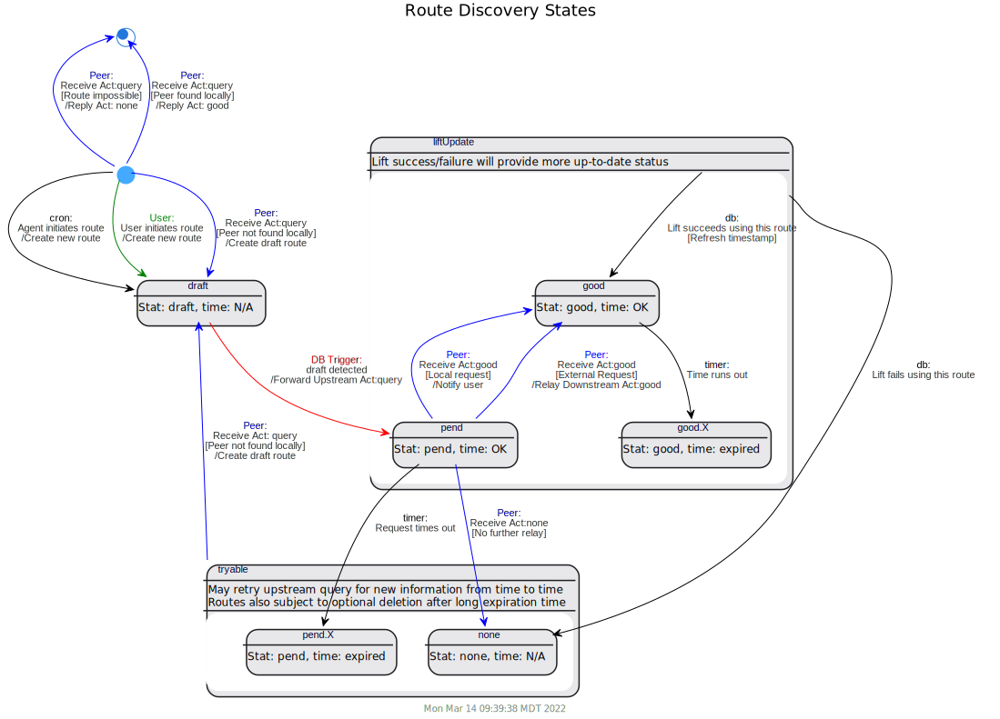](uml/state-route.svg)

Routes may exist in a pending state for some time before a response comes back from upstream
indicating whether to mark the route as good or bad.
So each route should be uniquely identifiable.
In addition to knowing the tally UUID the query came in on, a querying node should supply a route ID.
This route ID will be returned with subsequent updates so the node knows which route to update.

### Lift Protocol
Once a site has discovered one or more viable external routes, it can proceed to propose an actual lift.
The proposal is sent out via an upstream foreign peer at the top of the subject segment.
This use diagram shows five possible phases of the resulting lift:

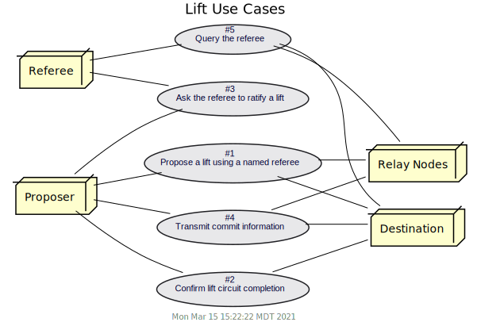

Let's consider the simplified example lift circuit again.
Remember, each node could represent a single user or a segment of users local to a particular site.
We will consider node A as the lift originator.
Node B will be considered the destination of the lift.

For a linear lift, just imagine the tally between A and B does not (or need not) exist.

#### Proposal

Proposals will travel counter-clockwise, <b>against</b> the normal flow of payments (the arrows).
Node A proposes the lift to node D because:
  - Node A contains a route record indicating that an external pathway exists (or has existed) leading from node D, upstream and eventually to node B; and
    - it has capacity for a circular lift through an internal segment with D at the top (output) and B at the bottom (input); or
    - it needs to transmit value from A to B (linear lift).

  The lift proposal is a conditional contract of the form:
  "If I send a specified value to you on this tally, you agree to send that same value along through another node you are connected to, with that value eventually reaching the intended destination."
  - The proposal contains a time, indicating how long the lift proposal will *stay alive*.  After that, it will time out and will be considered "expired" (and therefore void).
  - It also contains the identity of a proposed referee whose job it is to declare when the lift time has expired (or certify its successful completion).
    The referee is typically a well known, reliable site that is reachable by any node on the network.
    This identity record includes:
    - Connection protocol (https, chip, other)
    - Network connection address/port information
  - It is each site's responsibility to decide for itself what referees are worthy of trust.
    - For https protocol, a site should have already collected (out of band) a public key for each referee it intendes to rely on.
    - For chip protol, the connection information is a standard [CHIP address](learn-users.md#chip-addresses) for which the public key is inherently known.
      The local site should probably already share a tally with the referee site.
      This binds the parties to the responsible behavior they expect from each other.
  - If node D wants to participate in the lift, on the proposed terms, it indicates this by forwarding the proposal along to node C where the process repeats itself.
  - This action makes the lift binding upon D, subject only to receipt of an authorizing signature, generated within the specified timeout, as judged by the named referee.
  - If/when C receives the validating signature (by any means), D's obligation to C becomes valid and provable, regardless of whether D cooperates further in the transaction.
    So every node has a natural incentive to cooperate in the second phase of the lift.
    If they don't, they will lose value to their upstream connection without recapturing it from downstream.

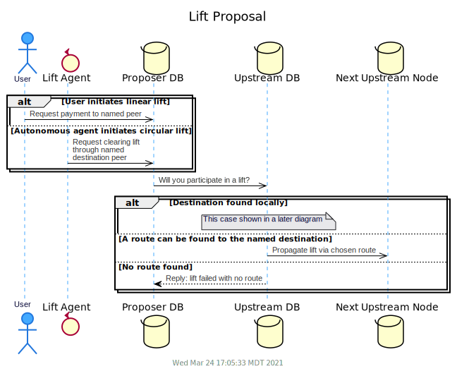

#### Confirmation, Ratification, Commit
  As long as a suitable route exists, the lift proposal will eventually reach its intended destination, or <i>terminus node</i>.
  The terminus node will communicate a confirmation directly to the originator to indicate that the lift has successfully propagated through its intended circuit (or linear path) and is ready to commit.
  The lift header contains a network address and port where the originator can be reached for this purpose.

  Once the originator has obtained the confirmation, it can decide whether it wants to proceed to commit the lift.
  But it can only do so if the time, originally set forth in the lift proposal, has not yet expired (in the sole judgement of the referee).
  So the originator sends a message to the referee requesting permission to commit.

  Depending solely on the time elapsed, the referee will answer either with an 
  approval (good) or disapproval (void) message which
  bear's the referee's digital signature.  The originator should now proceed to transmit
  this record clockwise through the lift chain, starting with node B.
  Node B will forward the signature to C, and so forth until all the nodes in the circuit have received 
  the signature (whether good or void).
  
  Affixing a *good* signature will make make the applicable lift chits binding.
  
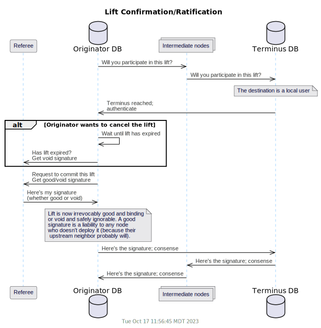

#### Referee Queries
  Assuming all the nodes stayed connected and responded correctly through the lift sequences above, everyone now has exchanged their excess credits and collected other, more wanted ones in their place
  (or they all know the lift is expired and the chits can now be ignored).
  But if part of the network had a problem part-way through the lift, some nodes might be left in an indeterminate state.
  They are committed to the lift, but they don't have the required signature to complete so they really don't know for sure if the lift should go through or not.

  Participating nodes can consult their local clock and get a pretty good idea of when the lift should have timed out.
  If this time is exceeded, they can reach out to the referee node to ask the status of the lift.
  The referee will:
  - answer that time is still running--no answer yet; or
  - respond with a signed "void" message; or
  - provide the "good" authorization signature.

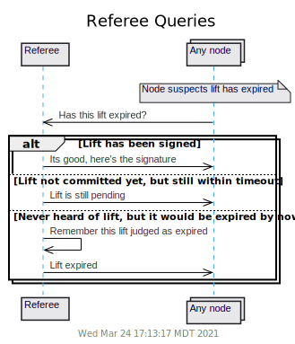

Participating nodes can provide a greater degree of load distribution if, upon discovering a local timeout, they will take the following steps in order:
- See if any other segments exist on our same database that are part of the same lift (same uuid but different sequence) and already have the signature;
- Send a chit consensus check to the upstream peer to see if the signature has been received there;
- Wait an amount of time *after* expected timeout that is proportional to how much time was left on the lift promise (before expiration) when you received it.
  This should generally cause the terminus node (or a node closer to that end of the chain) to act first.
- Request status directly from the originator (if query address has been supplied), who can answer in like fashion to the referee;
- Request status from the referee directly;

As long as connectivity can be maintained with a connected neighbor, the originator, or the referee, each node should be able to successfully complete the lift.
If none of these can be reached, the lift commit/reject will block indefinitely until connectivity can be restored to someone with the signature.

It [has been shown](../test/analysis/dsr/phase-1/results.md) that without a referee, the protocol is more vulnerable to potential safety and/or liveness issues.
So it is important that sites maintain a list of trustworthy referees and their public keys.
To support this function, a site willing to serve as referee must also support the following auxiliary protocol:

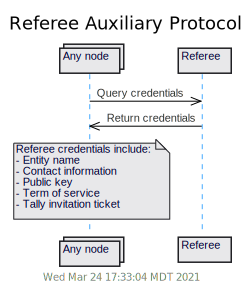

In general practice, it is expected that each host site will execute a tally with referee sites they expect to honor.
Such tallies can contain contractual language expressing the referee's willingness to conduct its function with fidelity and good faith.
This also supports the possibility of assessing fees in exchange for referee services where applicable.

The Term of Service describes how long the referee promises to perform lifts.
This will allow a service provider to discontinue service without breaking trust or losing reputation.

#### Lift States
We can now derive the following state diagram to describe the lift protocol from the perspective of a single node or segment:

The referee lift state diagram is as follows:

[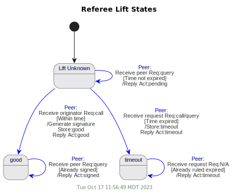](uml/state-ref.svg)

 [Next - Data Messages](learn-message.md)
 [Back to Index](README.md#contents)
