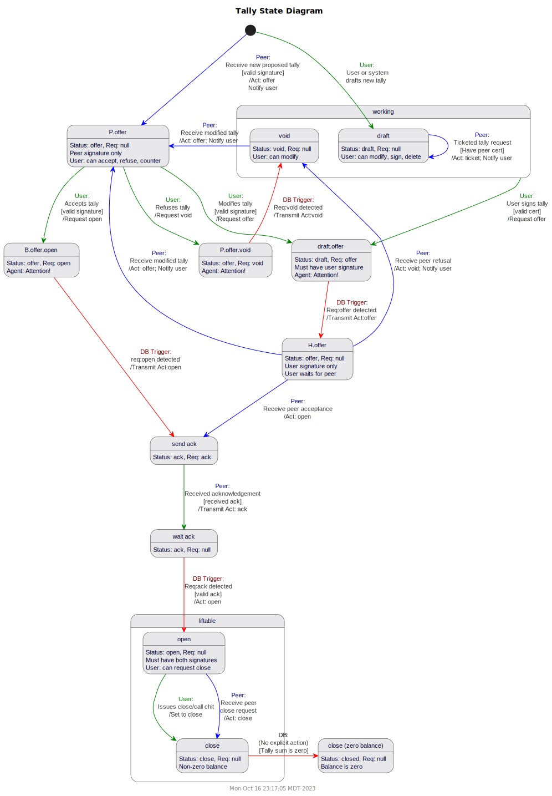

  <a href="README.md#contents">Back to Index</a>
  <a href="learn-message.md">Next</a>

## MyCHIPs Protocol Description 1.4 (working draft)
Nov 2023; Copyright MyCHIPs.org

### Overview ([TL;DR](#protocol-layers "Skip to the meat"))
As the project began, it was impossible to imagine a comprehensive top-down design for the system.
I had a basic, intuitive idea about how sites and nodes should communicate with each other,
and what types of messages they would send back and forth, but I didn't understand it
in a formal enough way to create a detailed description of the protocol.
Instead, I jumped in and started coding.

While that is probably not the most inspiring approach, it did give me a working prototype of a MyCHIPs site, albeit not yet secure.
In conjunction with the agent-model simulator, I could generate random data sets.
And with the network visualizer, I could now actually see what a network might evolve into and what type of scenarios the protocol would have to handle.

As I went, I produced documents like [this](old-lift.md) to help make sense of what I needed to do.
These still serve as a helpful reference and so remain included for the present.

Next came the DSR study, which revealed some security/liveness flaws in the way the (version 0) protocol was conceived.

As of Summer 2021, the preliminary results from the BYU study indicated that the addition of the referee would allow a distributed lift that is acceptably live and secure.
This triggered the rework of the protocol to version 1.x.
Admittedly, the referee is a compromise from the original goal of a fully distributed system.
But it is still highly decentralized, and the referee's primary role is one of time-keeping so it is a reasonable compromise to achieve safety and liveness.

Now in 2023, a working mobile application is on the horizon and a beta release of the backend seems imminent.
Much progress has been made in the way tallies and chits are negotiated between stock and foil.

More importantly, there have been breakthroughs in the way routes are discovered through the network.
Current testing indicates that routes can be discovered very efficiently in real-time.
This largely eliminates the need for caching of routes as implemented in the 1.x protocol.
Furthermore, there are early indications that the referee may be dispensed with again, in favor of a more fully distributed consensus pattern.

These developments trigger the jump to 1.4 protocol definition with the following goals:
- Tally/chit protocols have improved consensus and error recovery
- Route discovery is no longer a separate protocol layer but is instead incorporated into the first phase of the lift layer
- This new lift protocol is moved to an independent external library
- The lift protocol should remain flexible enough to support multiple methods:
  - Local lift (all parties are on a single site)
  - Refereed lift (referee rules on the timeout)
  - Ring voting/consensus (majority rules on timeout)
  - Other future methods as they may evolve

### Protocol Layers
This document defines the model state level **protocol** whereby nodes communicate with each other to:
- Establish and maintain tallies (formalized trading relationships) between entities
- Send value and adjust settings via direct Chits on a single tally
- Obtain and maintain consensus as to the content of tallies/chits
- Discover and execute local and distributed lifts across the network

At a lower level, sites will communicate with each other over an encrypted secure connection which uses
[Noise Protocol](http://noiseprotocol.org) and is discussed in more detail [here](/doc/learn-noise.md).

### State Processing
The tally/chit protocol is implemented as a state transition model.
This is important because in a distributed network, nodes are apt to go offline from time to time 
and network connections may not always be reliable.

End-users will likely be running software on mobile devices.
Those devices will communicate with a user service control-layer process which will in turn communicated with the model inside the database.
The database will communicate with a agent process which will communicate with other peer agent processes.

If/when a message is lost in all of this, the system should:
- Stay in a consistent state until the message gets through or is rightly abandoned;
- Re-transmit the message as necessary;
- Tolerate multiple messages getting through, or messages coming through late or at an unexpected time.
- Reasonably recover from errant states and/or data loss
- Eventually bring associated parties into consensus

### Tally Use Cases
A tally is established when two parties decide to formalize an existing relationship of trust using the MyCHIPs protocol.

These use-cases are explained as follows::
- **Be My Vendor**:
  The User reaches out to a potential trading Partner and asks if he would like to establish a tally.
  This must happen via some communication channel outside the MyCHIPs protocol.
  We will call this “[out-of-band communication](https://en.wikipedia.org/wiki/Out-of-band_data).”
  Examples include meeting in-person, email, teleconference or a traditional web connection.
  In this case, the User is suggesting he hold the [Foil](learn-tally.md#tally-parts) of the tally and the Partner will hold the [Stock](learn-tally.md#tally-parts).
  The partner is the vendor, or provider of services, so money (value) will normally flow from User to Partner.
  In the moment of exchange, the User will owe value to the Partner.
  In other words, the Partner will have lent money to the User.
- **Be My Client**:
  This is identical in all respects to the previous case, except the User is suggesting he be the Vendor (the Stock holder) and the Partner will be the Client (the Foil holder).
- **Transaction**:
  Once established, the tally will serve as a ledger for recording payments (pledges of credit).
  It will maintain and track a total balance owed in one direction or the other.
  And it constitutes a signed digital contract indicating the [terms and conditions](learn-tally.md#credit-terms) by which the two parties have agreed to conduct their trades.
  The tally balance is modified by entering individual atomic transactions called [chits](https://www.dictionary.com/browse/chit).
  These chits are also digitally signed and become a part of the tally.
- **Setting**:
  There are a number of parameters in a tally that can be set unilaterally by the stock or foil holder after a tally has been signed and agreed to.
  These should not violate the formal terms and conditions of the tally (i.e. those digitally signed by both parties).
  But they will clearly affect how the system will operate the tally.
  
  Settings are modeled as a special kind of chit that transmits no value--just information.
  This will facilitate verifying that each end of the tally contains the same information about settings.

  Users can make the following tally settings:
  - Adjust/change lift [trading variables](learn-lifts.md#trading-variables).
    Although these seem to be solely the business of the user's host service, the partner site needs to know certain aspects in order to properly estimate lift lading capacity.
  - Request a tally to be closed, once it's balance reaches zero.
    While this request can be made at any time, a debtor would still not have an obligation to pay down a debt any faster than specified in previously agreed-to credit terms.
  - Specify a <i>call date</i> or when the other partner is expected to pay its balance down to zero or a specified target level.
  - Change one's own agent address, agent IP number and/or agent port (not yet implemented).
  
### Tally Protocol
The steps to establish a tally are shown in the following sequence diagram.
This covers the first two tally use cases, the only difference being which entity is designated as the stock holder and which is the foil holder.
Tally initiation is also discussed in some detail [here](learn-tally.md#establishing-a-tally).

As mentioned, transactions and settings are carried out as chits, which get added to the tally.
More on chits [below](#chit-use-cases).

When one of the partners wishes to end the trading relationship, he can do so by the steps in the following sequence diagram.
If the creditor wants to close the tally and is willing to forfeit his balance owed, he can simply send the balance back to the debtor.
The tally, marked as "closing," will then close automatically.

If the creditor wants to retain what is owed to him, he will have to wait for the agreed upon payment terms to time out.
In the normal course of time, payment should be made by the debtor by way of a lift, or some other consideration of product, services or some other kind of money.

If the debtor wants to close the tally sooner, he will have to figure out how to provide value sufficient to zero the balance.

From these sequences, we will first derive the following simplified and conceptual diagram of tally states:

This flow does not consider the consequences of attempting to change state locally when the remote peer can not be reached to communicate the change.
By adding additional intermediate states each time the local user requests a change of state, we can track separately when the synchronization message has reached the other side.

We will thus derive the following full set of tally states (which follow [this format](learn-message.md#state-codes)):
- **draft**: The user is in full control of the tally to update, delete or "share."
  The user (originator) may share (invite a subject user to) the actual tally or a clone of the tally.
  Sharing the tally does not imply actually sending it anywhere--only an invitation token is sent.
  The tally uuid is considered temporary/disposable.
  If/when a subject connects using the invitation, that message will cause the state to transition to P.draft.

- **P.draft**: The subject has processed an invitation to this tally.
  It now contains the peer certificate information disclosed by the subject.
  Terms and conditions can still be freely edited by the originator.
  The tally data has still not been sent anywhere.
  The user would ideally be prohibited from sharing the tally but the consequences of doing so are not dire (the old subject is out and a new subject would be able to respond to the new invitation).

- **draft.offer**: The originator has requested that the tally be offered to the subject.
  The originator should supply an authorized signature and a fresh, unique uuid with the request.
  Entering this state should alert the originator's agent.
  The agent will:
  - Validate the originator's signature
  - Transmit the tally offer to the subject
  - Notify the model to transition to H.offer

- **H.offer**: The tally has been signed by the Holder (originator) and transmitted to the Partner (subject)
  Ideally, no editing by the user should be allowed.
  However, it should be reasonable to allow the user to void this tally--particularly after a long time has passed.
  If/when the duly signed/countersign tally is receieved from the subject, we will move to open.
  If/when a signed counteroffer is receieved from the subject, we will promote to P.offer.
  
- **P.offer**: This state can be entered ex-nihilo upon reception of a tally that is duly signed by the peer.
  In this case, we take on the subject role and are being offered a tally.
  If the user supplies a signature and sets the request to 'open', we go to offer.open.
  
- **offer.void**: The user has requested to reject this tally.
  The agent is alerted by this state, the rejection message is sent and upon success, we enter void.

- **offer.draft**: The user has requested to revise this tally.
  The agent is alerted by this state, the revision message is sent and upon success, we enter draft.

- **void**: Tallies in this state have possibly been shared before and so may contain data that are known to other peers.
  Users should still be able to clone a void tally (or any tally, for that matter) for an invitation.
  But a void tally should not be shared as it could still be revived by receiving a duly signed version of the tally from a peer.

- **offer.open**: The user has requested to accept and open the tally.
  The agent is alerted and will:
  - Transmit the tally, signed by both parties
  - Upon success, move to open
  - Initiate the chit consensus protocol to assure the tallies are consensed.

- **open**: The tally contains both parties signatures and both agents acks.  It is open for trading.
  A tally can be created ex-nihilo to open state if it is received from a peer and is duly signed by both parties and both agents.
  Either party can also apply a closing chit, which will mark the tally for closing.

- **C.open**: One or more parties has recorded a closing chit on the tally.
  If/when the system finds the tally balance at zero, the tally will move to close.
  
- **close**: The tally is fully closed.
  No further trading should occur, but full consensus transactions may/should continue.

Now we can define the following state diagram to describe the tally protocol from the perspective of a single entity:

### UI Interpretation of Tally States
The tally state is a combination of [type, status and request](learn-message.md#state-codes).
Each [state](learn-message.md#status-and-states) has implications for the user interface:

- draft:  
  If the partner certificate on the tally is blank, the tally has likely been created as a template--meaning the intention is to promote it to a usable tally at some point.
  In the reference implementation, a template can be used multiple times as a pattern for the creation of a new but separate tally.
  Or it can itself be used by promotion to 'offer' status.
  
  A tally invitation is created when a one-time connection token is generated and linked to a draft tally.
  This "ticket" is transmitted to a potential partner via link or QR code.
  When the partner processes the invitation, it causes his site to
  - establish a connection to our site
  - affix his certificate
  - transmit the tally back to us

  At this point, the tally still appears on our site as draft status, but it has partner information filled out.
  In order to complete the invitation process, we need to request the status be promoted to offer.
  But before doing so, we may review the partner's certificate information, the credit terms, and make sure we are still good to go ahead.
- void:
  The tally has been rejected at some point.
  The user doesn't normally want to see it appear again (although even a void tally could be re-offered or used as a template) if the user has a way to access it.
- H.offer:
  The tally has been signed by the local user but not by the partner yet.
  It should show as an open item because he is awaiting the other party's signature.
  But there is nothing to be done other than to wait for it.
  It needs attention, but not ours.
- P.offer:
  The tally has been signed by the partner but not by the local user yet.
  This is an action item because the other party is waiting for us to sign, counteroffer or reject.
  It needs our immediate attention.
- open:
  The tally should appear in the list of active trading partners.
  Chits may be created for an open tally.
  This includes setting chits, which includes an action to close the tally when the balance reaches zero.
- close:
  The status/state should be updated by the system when the tally is marked for closing.

### Chit Use Cases
A chit constitutes a pledge of future value from one entity to another.
There are three basic types of chits:
- **Direct Chit**:
  This is a simple promise issued by one entity, to its direct trading partner.
  It only needs to be signed by the entity pledging value.
- **Setting Chit**:
  This is a declaration by one entity that it wishes to change certain operating conditions of the tally.
  It must be properly signed by that entity.
  For most protocol purposes, it will be dealt with just like a direct chit.
  It has the additional side effect of modifying things like the tally request (close), credit terms, or trading variables.
- **Lift Chit**:
  In this case, the chit is part of a larger [credit lift](learn-lift.md).
  There will be a whole group of chits, all bound to the lift.
  A lift chit will be signed by a *agent* or *referee* certificate, where the agent belongs to the system that hosts the MyCHIPs accounts for all the users in the (local) lift or the referee is a site that arbitrates timing for a distributed lift in which multiple sites participate.
  Clearly, the idea of letting one's Chip Service Provider (or worse, some unknown referee site) sign chits on one's behalf sounds potentially dangerous.
  So there are some limitations on lift chits:
  - The net effect on an entity of a group of (typically 2) chits, belonging to a single lift, must be in accordance with the [trading variables](learn-lifts.md#trading-variables) established and signed by that user.
  - Typically this means the chits sum to zero so the entity doesn't gain or lose value through the lift.
  - But it could be non-zero if the trading variables specify a charge or allow a penalty for certain lifts.
  - It is the responsibility of a user's host site software to see that lifts are conducted securely and according to these limitations.

This diagram depicts two sets of similar use cases.
In the simpler case, an entity will negotiate a payment with a direct trading partner.
In the more complex case, we will execute a linear lift that will transmit value through the network to a peer entity our user is not directly connected to.
This lift will also involve one of our direct partners who will be the first link in a chain of entities the lift will flow through.

### Direct Chit Protocol
We will first deal with the simpler case where a single direct chit is being entered onto an existing tally between two entities.
Either entity can change a setting or make a direct payment to the other simply by making and signing a chit.

This diagram shows the first case, Sending a Setting or Direct Payment:

When requesting a direct payment from the other party, the sequence gets a little more complicated.
This involves the generation of an *invoice,* or request for payment.
Setting chits are not applicable to this sequence.

This diagram also covers the fourth use case, Pay Direct Invoice.
This is what the Payor does once he receives the proposed chit (see the alt conditional block in the previous diagram).

Note that the [consensus algorithm](#chit-chain-consensus) has nothing to do with the validity of a chit.
If a chit is signed by the party pledging value (debtor), it is a valid chit.
However, the parties eventually need to also agree about the *order* in which chits are entered into the tally.

The third use case (Request Direct Invoice) is one step before this.
For example, imagine a vendor has provided you services and you are ready to remit payment.
You may not know the exact charge, but you want to initiate the process by Requesting a Direct Invoice.

This is not strictly part of the MyCHIPs protocol.
Rather it would be conducted as out-of-band communication (paper, http, email, or text).
But the software needs to facilitate the process by issuing/scanning QR codes containing the necessary data to initiate a responsive chit or lift.

For example: “Hey, how much do I owe you for that gopher-bomb?“
“Well, here's a QR code that will take you to an https endpoint that yields a JSON object containing just the information you are asking for!”

The returned object would contain:
- The address of the entity who will receive the payment (smoke-em-out@chippies.net),
- The amount payable,
- An optional listing and descriptions of items contributing to the total,
- Optional hints about where to find this entity on the network.

This sequence will be dealt with in more detail in the section below on [lifts](#lift-protocol).
It can be generalized to the simpler case above where an invoice is requested from a direct partner.

Now we can derive the following state diagram to describe the direct chit protocol from the perspective of a single entity.
Notice the states for setting chits are shown right along with regular transaction chits, and depicted as:
- Hold.pend.good, Hold.good: Settings made by our local user (tally holder), and
- Part.good: Settings made by the remote partner peer.

### Chit Chain Consensus
The last step in the diagram above refers to a consensus process.
This is a sub-protocol by which the stock and foil agree upon the content of the tally, including the substance and order of the chits appended to it.
Chit order may not be particularly important from a theoretical standpoint but content certainly is.
MyCHIPs uses a storage mechanism called a [hash chain](https://en.wikipedia.org/wiki/Hash_chain) to assure consistency in both.

Each chit contains a hash of its other contents.
This hash is useful for detecting if anything in the chit has changed (something we don't want to happen).

Each chit also contains a copy of the hash for the chit preceeding it in a sequential chain.
In this way, the hash of the latest chit can be compared with the same point in the chain on the other end of the tally.

This *chit chain* can be thought of as a tiny blockchain, known only to the two entities who share the tally with the tally record itself being the first block on the chain.
When the data is kept this way, it is easier for the two partners to verify that they have identical information, just by comparing the hash they hold for the last consensed chit on the chain.

Manual chits (transactions or settings) may originate from either end of the tally at any time.

When chits are created as part of a distributed lift, validating signatures will propagate around the lift circuit in the downstream (typically foil to stock) direction.
So the foil holder on any given tally will usually get the signature before the stock holder.
As they attempt to reach consensus on chit order, the signature will naturally get shared with the stock.

This activity is going on as part of the normal chit creation/transmission process described above (and/or in the later lift section).
But it is an important additional mechanism that makes sure the stock and foil keep consistent versions of all chit information that gets appended to the tally.

We will accomplish the consensus algorithm with four basic messages defined more particularly [here](learn-message.md#consensus-messages).
The messages are handled as follows:
- When new chits are added locally:
  - Add the chit to local chain, calculate new endIdx, endHash
  - Send upd to partner with new chit, index, hash
  - Wait; confIdx will lag behind endIdx

- When upd command is received:
  - If no chits were included, return ack/nak on specified chit
  - Otherwise, merge the supplied chits:
    Foil (ordering authority):
    - Add new chits at end of our chain
    - Does supplied index, hash agree with our new end of chain?
    - If so, send ack
    - If not, send upd with chits from stock's confIdx+1 through prior endIdx (before this upd)
    Stock (conformer):
    - Merge included chits at specified indexes
    - Bump/unchain any chits that may be in their way
    - Does supplied index, hash agree with our new end of chain?
    - If so, send ack
    - If not, send nak
    - Send upd with any chits that got bumped

- When ack received:
  - If specified hash matches our hash at specified index, ratchet confIdx = index
  - If I have more chits beyond confIdx, send upd with those chits

- When nak received:
  - Re-validate my entire chain up through specified index
  - Is any portion of my chain invalid?
  - If so, set confIdx back to end of valid, send req for all chits after that
  - Otherwise:
    Foil: Enter error state, can not consense with stock
    Stock: set confIdx back by x (10%?) and send req for all chits beyond that

These procedures are shown in the following sequence diagram:

Both stock and foil have a duty (and a natural incentive) to recognize, accept and store a duly signed and valid chit received from the other.
But the foil is ultimately responsible to choose the order chits will be linked into the chain.
If there is disagreement, the stock must conform to that order.

The goal of the consensus protocol is then to:
- verify the two halves of the base tally are the same;
- order (link) all valid chits linked into a [hash-chain](https://en.wikipedia.org/wiki/Hash_chain);
- verify that the stock and foil both have an identical chain of valid chits;
- allow either party to recover from lost or corrupt data.

The simplest case is when one side generates a chit and that chit gets completely propagated and linked on both ends before anything else happens on the tally.
Unfortunately, real life can involve several other more messy scenarios:
1. One or more valid chits get generated on both ends of the tally and are transmitted at about the same time.
  Both stock and foil will have linked these chits already and could think they have a valid end hash.
  The stock will have to comport to the foil's version of things and reorder its chain accordingly.
  So it should only keep a *provisional* end hash (propHash) until the foil acknowledges it.
2. The network between stock and foil is disrupted during normal chit message transmission.
  The packet handling system is built to correctly detect this and use retries to eventually get the packets through sometime later when connectivity is reestablished.
  The state of a chit should remain pending (i.e. not yet good) until the transmitting node successfully connects with the other side's agent.
  As a result, this scenario should devolve into scenario 1 once connectivity is finally restored.
3. A network packet is correctly transmitted to the other side's agent but is then lost somehow.
  This could happen if the agent process loses connection to the database at just the wrong time.
  This probably would not be detected until someone tries to add another chit to the chain.
  Then it would be evident to one side that it has a stray, valid chit that is not part of the other side's chain.
  - If the stock lost a chit, it should become evident next time the foil sends a list of activitiy since the last acknowledged checkpoint.
  - If the foil lost a chit, the stock should find it has a leftover valid chit after conforming to the foil.
    It can then just resend that chit through the normal chit protocol.
4. Scenario 3 can be extended to a case where a DB becomes corrupted or lost and has to be restored from an older backup.
  In this case, chits are likely to be missing or very possibly the tally itself could be missing or not yet in open status.
  The consensus protocol should be operable even on a tally with zero chits and should be able to restore a valid tally based on information supplied from the partner.
5. Finally, it should be possible to generate a chit at an application level and share it with a trading partner even without being connected to the network.
  This could be done out of band, via a QR code or deep link.
  Both apps would have a copy of the chit, but neither server would yet have it.
  First app to regain connectivity would share the chit with its agent and it would then be up to the agents to come to consensus.

This reminds us, the system must be tolerant of a packet for the same chit (same tally and chit uuid) arriving two or more times.
This is accomplished by only processing state transitions if the chit is currently in the expected state.

Chits are ultimately identified by their UUID.
When merging a new set of chits into an existing chain, the system should assume that if it already has a chit with a given UUID, it should not accept a new chit with the same UUID but different contents.
This will guard against the case where a rogue or confused entity/agent creates and signs two different chits with the same UUID.
In other words, the chain merge algorithm can record chits to obtain consensus but it should not replace a chit it already has.
In this particular failure pattern, if one side has the original chit and the other side gets ahold of a new or corrupt chit with the same UUID, this should result in a failure state which will call for human intervention to resolve.

It may seem a little confusing to determine whether the consensus protocol is really a tally thing or a chit thing.
It seems mostly oriented around chits.
But it is the two halves of the tally that are (or are not) fully consensed at any given time.
So this must necessarily also include the signed portions of the tally itself.

Visualize it this way:
Chaining status is a sub-state of a good chit and consensus is a sub-state of an open tally.
- A valid chit can be:
  - unlinked
  - provisionally linked (stock only)
  - linked
- An open (and/or closing) tally can be:
 - fully consensed (all valid chits are linked)
 - not fully consensed (one or more valid chits are not yet linked)

In addition to the three basic chit substates shown above, it will be important to know if/when consensus messages have been successfully sent to the other side.
We will do this by queing messages and only completing state transition after the message has been sent.
This will allow for more graceful error recovery when an agent server crashes or is restarted.

It *is* possible to define distinct states for a chit within the consensus algorithm.
However, it is not particularly useful so no state diagrams are presented here.
It is enough that each node remain aware of any chit marked as good, and keep communicating with the other half (according to the sequences shown above) of the tally until a chain index is successfully recorded and acknowledged for that chit.

### Interim Lift Protocol
Starting with version protocol 1.5, it is intended to offload both
[route discovery](https://github.com/gotchoices/ChipNet)
and [lift negotiation](https://github.com/gotchoices/ChipSync)
to external libraries.
This is in support of the following objectives:
- Increase site bandwidth and scalability
- Facilitate and encourage multiple MyCHIPs-compatible implementations
- Support multiple methods for assessing lift validity/timeout

While ChipNet/ChipSync are being developed, this implementation will continue toward a 
functional system that works only as a single site.
This means support for local route discovery and local clearing and payment lifts in a way
that, from the user's perspective, will not have to change once fully distributed lifts
become possible.

Readers not already familiar with credit lifts, can refer to [this section on lifts](learn-lift.md) for more background.
It is also important to fully understand
[ChipNet](https://github.com/gotchoices/ChipNet),
[ChipSync](https://github.com/gotchoices/ChipSync), and their support libraries.

### Route Discovery
Before a lift can be performed, it is first necessary to discover whether there are
willing partners available in the network able to perform the necessary transfers.

Consider the following:

As shown, route discovery requests can be initiated in two ways:
- Manually by a user/entity; or
- By an automated scheduler running as part of the agent process.

A site containing multiple users in its database has knowledge of all the connections between its users. 
In some limited cases, it might be able to find a suitable route within these local connections.
More commonly, it will be necessary to obtain the cooperation of other sites to perform a meaningful lift.
Discovery of suitable lift pathways is accomplished by the [chipNet module](https://github.com/gotchoices/ChipNet).

In this implementation, route discovery will be modeled as the first stage (or state) of a lift and so will be incorporated into the lift protocol as described below.

### Lift Protocol

Let us first consider the use case of a user-initiated payment lift.
The agent for this user will be considered the originator of the lift and will interact with other sites and modules as follows:

Note that an automatically generated request for a circular, or clearing lift will be quite similar except the agent itself may initiate (and authorize) the process (as opposed to the user).

The originator has a unique role since it will initiate the process.
The agent for the intended recipient of the lift will also have some unique tasks to perform.
Participants in the middle mostly relay the lift information along and don't really need to concern themselves with whether it is a linear payment lift or a clearing lift.
It will turn out the same for them either way.

The sequence for non-originator nodes is as follows:

In order to maintain an orderly transition through these sequences, the site model will maintain a lift record with the following states:

NEEDS REWORK:

  <a href="README.md#contents">Back to Index</a>
  <a href="learn-message.md">Next</a>

