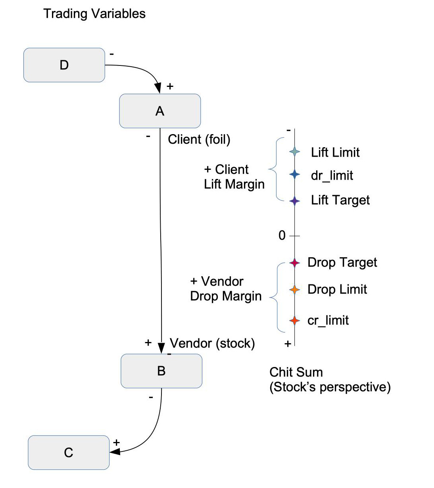

## Tallies
February 2020

A tally is, at its essence, a contract between two parties.  Using the tally, the parties
agree to "keep track" of a net amount owing between them, on mutually acceptable terms.

The MyCHIPs digital tally is modeled after the historical
[split tally,](https://www.bbc.com/news/business-40189959)
an instrument used by past cultures to keep track of private credit balances.

### Tally Parts
Like a split tally, a digital tally has two parts, a stock and a foil.
The stock (which was often longer) is held by the party who normally provides a product or service and so is 
normally owed value for the transaction.
We will call this the Vendor.
The foil (or ["short end of the stick"](https://english.stackexchange.com/questions/283103/what-is-the-origin-of-get-a-hold-of-the-short-wrong-end-of-the-stick?noredirect=1&lq=1)) 
is held by the Client, or the entity who will be expected to deliver (pay) that value at some point in the future.

It might help to remember that C is near F and V is near S in the alphabet:
- Client: holds the Foil
- Vendor: holds the Stock

Perhaps the biggest functional difference with a MyCHIPs tally is, unlike its
wooden predecessor, it can easily be amended by adding new credits or debits.
It is a living ledger, keeping constant track of what is owed by one party to the other.

As a consequence, it is also possible for the stock to accrue a credit (negative) 
balance and the foil to accrue a debit (positive) balance.  This makes the 
terms stock (Vendor) and foil (Client) potentially less clear in terms of who 
becomes the creditor (Recipient) and who is the debtor (Issuer).  However, we will
still use the terms Stock and Foil because it is helpful to differentiate the 
two ends of the credit relationship when computing [lifts](learn-lift.md) and drops.

If two parties truly have a completely bilateral trading arrangement, they
might just assign Stock and Foil at random.  Or they may choose to establish
two tallies (with opposite stocks and foils) between them.  The system should 
be able to perform lifts to keep the two tallies in equilibrium.

A tally includes the following information:
  - Tally format version (1)
  - Digital ID unique to the tally (guid)
  - Date and time of the original agreement
  - Vendor CHIP address
  - Vendor Certificate (signed personal contact information)
  - Vendor Credit Terms; debt Vendor->Client (normally 0)
  - Client CHIP address
  - Client Certificate (signed personal contact information)
  - Client Credit Terms; debt Client->Vendor (N=credit card, 0=debit card)
  - Reference to one or more standard, published contracts clauses, which
    become the operable and binding terms of the indebtedness.
  - Public key of the agent system who will execute lifts for Vendor
  - Public key of the agent system who will execute lifts for Client
  - Digital signature of Vendor, indicating binding acceptance
  - Digital signature of Client, indicating binding acceptance
  - A list of transactions, which total to the net indebtedness
  - A list of unilateral (one party) settings to various lift parameters

Each atomic change to the amount owing is referred to as a 
["chit"](https://www.dictionary.com/browse/chit) and includes:
  - Transaction date and time
  - Transaction amount, in mCHIPs (1/1000th part of a CHIP)
  - A transaction type:
    - Unearned gift
    - Payment for products/services
    - Credit lift
  - A reference number or string indicating:
    - Invoice or order that contains more detail about what was purchased
    - Lift UUID
  - Additional comments
  - Digital signature of issuer/grantor, making the money binding
  - Digital signature of recipient, acknowledging receipt (needed?)

Each setting includes:
  - Parameters of the tally to be updated/modified
  - Signature date
  - Signature of the modifying party

Tally data and chits must be duplicated exactly on the Stock and Foil.  
However, certain settings may reside only with one side and are controlled by the owner of that half of the tally.
They tell the site agent how to execute lifts on behalf of the owner.

### Credit Terms
This portion of the tally is actually comprised of a series of variables, some 
of which are optional.  The purpose is to have enough variables that virtually 
any common type of credit arrangement can be reasonably represented by a proper 
choice of values.

To understand better what we are trying to model, we will first outline a few 
examples of credit relationship:

- **Peer Accounts**:
  This might represent two companies or two individuals who regularly do
  business with each other.  There is probably a direction in which money 
  normally flows from Client to Vendor.  But there may also be occasions when 
  the normally-Client party does services for the normally-Vendor party.
  
  In such an arrangement either party should be able to choose how much he, as
  a creditor, is willing to lend to the other.  But any resulting indebtedness 
  should be solely by the choice of the party incurring the debt.
  
  On the other end of debt is a receivable--an asset.  The amount of such 
  assets an entity may accumulate is really a function of his/her wealth and
  productivity.  There is no inherent risk in accumulating too much.  The risk
  is more likely in concentrating too much of that total value in any single 
  debtor--particularly one who may not be capable of redeeming it all.
  
- **Merchants** (corporate Vendors):
  Clients of merchants may wish to accumulate value by collecting the credits 
  of the merchants where they like to shop.  This is one way of storing value,
  or in common terms, saving money.  But it can also be viewed as a loan from 
  the Client to the merchant, which can be redeemed upon demand any time the 
  Client wants to buy something.
  
  One concern for the merchant is to not accumulate too much debt, in total.  
  He should not care so much about how many credits any one Client may choose 
  to buy.  But he should not exceed the amount of debt he can reasonably redeem 
  through product sales, or other exchanges.
  
- **Secured Loans**:
  Consumers (Clients) and businesses (Vendors) alike can benefit from 
  maintaining one or more collateralized loans.  You start by purchasing an 
  asset over time from a seller who would like to earn income by financing the 
  purchase.  As you have excess credits available from your income sources, you 
  lift those credits to the party financing the debt.  As you pay down the debt, 
  your equity in the asset increases.  Ideally, you could also advance value 
  back out of the loan if you need more money for some other purchase.  In this 
  way, the asset can form a store of value--perhaps more reliable than just 
  holding the credits of your favorite vendors (who might go out of business).

- **Money Markets**:
  Since money normally flows in a single, expected direction, there is a
  natural demand for credit lifts to temporarily move that flow backward,
  resetting the potential for more purchasing power.  But such "win-win" lift 
  pathways may not always be available.  Some parties may lack sufficiently 
  strong or numerous pathways to complete all the lifts they need.  In this 
  case, they may need to provide further incentive to trading partners to 
  complete their lifts.
  
  So in addition to quantifying the trades we "want" to do, we also need to be
  able to quantify trades we are "willing" to do, for a price.  For example, we
  might be willing to exceed normal risk limits for sufficiently high rewards.
  We might even be willing to conduct extra traffic in the normal 'downhill'
  direction if we can make a little profit doing so, and we think we can later
  lift ourselves back out of the resulting transaction, using our own set of 
  trading relationships.
  
Understanding these examples, we will now explain the fixed credit terms.  By
"fixed," we mean those terms both creditor and debtor can contractually depend 
on.  This is accomplished by incorporating them into the tally and digitally 
signing the tally to make it a binding contract.

Also remember, for our terminology, the "Client Credit Terms" are those 
conditions Vendor offers to Client.  In other words, the terms of Client's 
credit, or the terms by which Client may incur debt payable to Vendor.

Credit Terms Tally Variables:
  - **Maximum Balance**:
    This indicates the most the debtor can count on borrowing against products
    or services he obtains from the creditor.  It may be expressed as a single 
    number, or as an expression, which is a function of time.  Expressions may 
    be used to amortize a loan, or to cause principal to be paid down over 
    time.
    
  - **Maximum Paydown**:
    This represents the maximum amount the debtor can pay down principal in
    advance of otherwise prevailing requirements, and have his interest 
    calculations reduced accordingly.  This can be used to create a minimum 
    interest return for a lender, while still allowing the borrower to store 
    value in the loan balance.

  - **Compound Interval**:
    The amount of time that passes before interest (or dividend, if you prefer) 
    is calculated and applied to a balance.  This may also define when payments 
    are due.  For example, if the application of such a charge raises a balance 
    above the Maximum Balance, some kind of lifting will have to occur to 
    correct this.  This value may be specified as a number, of days, weeks, 
    months, or years.

  - **Grace Period**:
    New amounts of indebtedness will not accrue interest/dividend charges until 
    this amount of time has passed.

  - **Rate**:
    An annualized rate expressed as a positive floating point number.  For 
    example, 0.05 means 5% per annum.  This number will be scaled to match the 
    Compound Interval in order to compute the interest/dividend charges to be 
    applied during that an interval.

  - **Call Notice**:
    The amount of notice required to be given by Vendor to Client in order to 
    call all principal and accrued charges due and payable (i.e. to cancel 
    further credit authorization).  If not present, the debtor has no 
    obligation to reduce principal any faster than is indicated by the Minimum 
    Payment.  The Call Notice is triggered by affixing a signed Call to the 
    tally.  The debt must be extinguished within the specified number of days 
    after the date of the Call.  For a fully amortizing debt, a creditor would 
    register an immediate call, with the number of notice days set to the term 
    of the amortization.

  - **Minimum Payment**:
    An amount, or a formula for the smallest amount that may be paid at each
    Compound Interval.

#### Some Credit Terms Examples
- Casual Peer to Peer, no interest, cancelation with notice:
    - Maximum Balance: 100
    - Call Notice: 30

- Customer (Client) to merchant (Vendor) (coupons):
    - Maximum Balance: 0

- Merchant (Vendor) to customer (Client), debit account:
    - Maximum Balance: 0

- Credit card requiring full payment every month:
    - Maximum Balance: 200
    - Minimum Payment: Bal
    - Grace Period: 1 month
    - Compound Interval: 1 month
    - Rate: 0.10

- Credit card requiring full payment over four months:
    - Maximum Balance: 300
    - Grace Period: 30
    - Minimum Payment: Min(10, Bal / 4)
    - Payment Interval: 30
    - Rate: 0.10

- 20 year fully amortizing loan with fixed payment, limited early payoff:
    - Maximum Balance: Amort(10000, 240)
    - Minimum Payment: Int
    - Maximum Paydown: 1000
    - Payment Interval: month
    - Rate: 0.06
    - Call Notice: 20 year (register call upon closing)

- Business line, pay weekly interest, can be called with 60 day notice:
    - Maximum Balance: 10000
    - Compound Interval: week
    - Rate: 0.08
    - Call Notice: 60

- 90 Day personal loan, fixed term, balloon payoff
    - Rate: 0.12
    - Call Notice: 90 day (register upon closing)

The credit terms explained above do not typically place hard limitations on the
transactions users may manually initiate.  For example, a credit limit, does
not prevent one peer from unilaterally sending value (chits) to the other
party, even if that would push a total past a credit limit.

For example, even though I might only trust you with credit for \$100, that 
wouldn't prevent you from writing a check to me for \$1000.  And I might well
accept that extra large check.  I may just decline to give you product or
services in exchange for it--at least until I had funged it into a form of
value I was more comfortable with.

### Trading Variables
MyCHIPs credits are, by design, not transferrable.  This means, if someone owes 
you value, you don't have the right to reassign that asset to a third party.  
This limitation is imposed to avoid the need for trust among unrelated parties
and it also makes CHIPs less vulnerable to theft or loss.

But it seems like a pretty serious limitation--especially on something we are 
trying to use as money.  So in order to make *value* transmittable (effectively
fungible), we need the 
[credit lift algorithm](http://gotchoices.org/mychips/acdc.html)
To facilitate lifts, each tally half (stock or foil) maintains a set of parameter 
settings that define how lifts will take place.

Lifts are largely executed autonomously (without direct user interaction).  So
the system needs a defined set of rules to know how the user wants this done.
In the absence of any more specific direction, the system could simply examine 
any credit imbalances and lift them back to zero.  While this would technically 
work, it doesn't give the user much flexibility in how and where he may choose 
to accumulate value (i.e. save money).  So for better control, users can 
manually set certain preferences themselves.  The instruction for changing 
these settings is digitally signed by the user, authorizing the system agent to 
act in accordance with the settings.

Client's (Foil) Trading Variables:
  - **Lift Target** (Vendor -> Client):	Default: 0
    The ideal amount of Vendor's credits Client wishes to accumulate.  A 
    negative tally balance is normally accomplished through credit lifts, as 
    this is in the opposite direction of normal credit flow.  This can exceed
    (override) the Vendor's normal credit limit (dr_limit) agreed to 
    bilaterally in the tally, for the purpose of lifts.  A positive amount 
    here constitutes value savings by the Client in the currency of the 
    Vendor--something he must accept in payment or as part of a future drop.

  - **Lift Limit**: (Foil bound)		Default: Debit Limit (dr_limit)
    This can exceed the dr_limit setting in the tally to allow higher 
    indebtedness of Vendor to Client, occurring as the result of a lift.  No 
    lifts should be performed which would result in a balance more negative
    than this amount.

  - **Lift Margin**: (Foil reward)	Default: 0
    This indicates Client's willingness to conducts lifts through this Foil.

    The number 0 is neutral, meaning zero cost.  A positive number
    indicates a cost, or disincentive to trade.  For example +0.02 means
    the Client would pass along only 98 chips for every 100 lifted up through 
    this Foil.  But -0.02 means the Client would pass 102 chips along for
    every 100 received.
    
    All lifts must be allowed at par (0) or better (negative) until the stock 
    balance is reduced to the Lift Target (default 0).  If a lift beyond that 
    point is requested, it may be subject to a cost (positive margin).

  - **Drop Margin**: (Foil clutch)		Default: 0
    Specifies the Client's willingness to conduct drops through this Foil.
    If the user wants to retain the chips in the foil, he can enter a
    positive number (1 disables drops altogether).  If he wants to get rid of
    the chips, he could consider entering a negative margin.
    
Vendor's (Stock) Trading Variables:

  - **Drop Target** (Client -> Vendor):	Default: 0
    The ideal amount of Client's credits Vendor wishes to accumulate or 
    maintain.  This is like collecting your payroll checks without cashing them 
    for a while.

  - **Drop Limit**: (Stock bound)	Default: Credit Limit (cr_limit)
    This can exceed the cr_limit setting in the tally to allow higher 
    indebtedness of Client to Vendor, occurring as a result of a drop. No drops 
    should be allowed resulting in a tally balance more positive of this 
    amount.

  - **Drop Margin**: (Stock reward)	Default: 0
    This indicates a willingness to conduct drops, or lifts in the opposite 
    direction of normal (downhill) through this Stock.  All drops must be
    allowed at par or better until the Drop Target (default 0) is reached.
    Drops requested beyond that point are subject to a cost at the specified 
    margin.

  - **Lift Margin**: (Stock clutch)	Default 0
    Specifies the Vendor's willingness to conduct lifts through this Stock.
    If the user wants to retain the chips in the stock, he can enter a
    positive number (1 disables lifts altogether).  If he wants to get rid of
    the chips, he could consider entering a negative margin.
  
### Invoicing
An invoice is a request for payment from one party to another.  When the 
parties [share a tally](#establishing-a-tally), this is pretty straightforward:
One party enters a draft chit on the tally and waits for the other party (who will be paying) to approve it.
The parties can negotiate over it until it is agreeable.  
Once signed by the remitter, it becomes a binding part of the tally.

If an invoice is to be sent to a party who does not share a direct tally, it is a little more complicated.
The payment request must be sent independently, off the CHIP network (such as via mail, email, QR code, etc.).
This is called an "out-of-band" communication and it is necessary because these parties don't really share any direct connection that can be trusted on-network.

The actual payment for will be accomplished by way of a linear lift.
So the invoice should include:
  - The name or IP address of the system that hosts the recipient's CHIP account
  - A connection socket endpoint for the recipient's host system
  - The ID (possibly hashed) of the user who will be receiving payment
  - A list of routing hints (downstream host systems who may be well known)
  - The amount due
  - A reference field (order or merchandise number, for example)

The payor system will attempt to generate a route to the recipient.
If successful, a linear lift can be initiated to complete the payment.

### Normal Consumer Transaction (payment without a tally)
- The vendor displays a generic invoice QR code as described in the [Invoicing section](#invoicing).
  - This can be custom generated for the transaction; or
  - It can be generic (a printed decal with no amount or reference field)
- The customer scans the invoice into his MyCHIPs app.
- In the case of a custom generated invoice, the app will automatically
  determine a route to the payee if possible.  If multiple routes are 
  discovered, the user will confirm the one he wants.
- If the invoice is generic, the app may prompt for a reference number (if
  the invoice was configured for such).  In the case of retail, for example,
  the merchant would supply a short sequence of digits verbally to be entered.
  This will allow the merchant to trace this payment to the specific register,
  transaction, etc.  The transaction then proceeds.
- The app initiates a linear lift to the recipient's system.  When the user
  signs the transaction, the lift is completed.
  
### Establishing a Tally
A MyCHIPs server will never accept a connection from anyone it doesn't already know about.
So if two parties want to create a tally between them, one of the parties will have to issue a connection ticket to the other.
Like an invoice, this information must be passed out-of-band.

The party who initiates the tally would create a draft tally on his own system and then issue a connection ticket to be used by the other party.
In the case of a commercial account like a retailer or restaurant, for example:

- The Vendor would display or transmit a ticket QR code, containing:
  - Vendor's full CHIP Address:
    - CHIP ID (username)
    - Agent ID (Agent's public connection key)
    - Connection host/IP
    - Connection port
  - A connection ticket:
    - Contains an authorization token
    - May be configured to expire after a one-time use
    - May be configured for multiple use by multiple parties (printed decal)
  - The vendor's signature public key

- The customer scans the ticket using his app
- The customer's host agent contacts the Vendor's host agent system at the specified port
  and presents the connection token.
  The system must prove its authenticity via the public agent key it supplied in the ticket.
- The two systems exchange/update account information for the two users.
- The Vendor's system will offer the draft tally (or a clone of it when the token is meant to handle multiple connections).
- The user will be given the opportunity to accept/modify/reject the tally.
- If he accepts it, we are done.  The draft tally has already been signed with its preferred terms.
- If he modifies it with a counteroffer, some human user (or authorized bot) on the 
  Vendor's end would have to re-sign the tally (assuming they are willing to) before the tally becomes active.

Once the tally is established, the customer can [set parameters](#trading-variables) on the tally to
collect extra Vendor credits, if so desired.
Once collected, those credits can be spent.

If credit has been extended to the customer as part of the tally, the customer
can begin to buy things using the tally as payment, within the specified credit terms.

### Entity Certificates
Part of the information encapsulated and digitally signed within a tally includes a
CHIP certificate (CHIPCert).  The certificate has several purposes:
  - To provide information about the entity that identifies him to the satisfaction
    of the trading partner.  For example, some partners may require a certificate
    containing a Tax ID number (like a Social Security Number in the US).  Less formal
    relationships might only require a name and email address.  Fields are optional
    but should be sufficient (in the judgement of the partner) to establish identify in
    an unmistakable way.
  - To provide sufficient information to the host system to uniquely identify the
    entity.  MyCHIPs will primarily rely on the CHIP ID, Agent ID and peer
    private key to determine a unique entity.  But the database should also contain
    valid entity names and an email address.
  - To identify how/where to contact the agent who acts officially on behalf of the
    MyCHIPs user.
    
The CHIP certificate (CHIPCert), contains:
  - CHIP ID
  - Agent ID
  - Signature public key
  - Other identifying information
    - Entity name	(company name or person's family name)
    - Given name(s)	(individuals)
    - Domain		(companies)
    - Email		(individuals)
    - Address		(optional)
    - Country		(optional)
    - National ID	(optional)

At any given time, a given entity should ideally have a single one of:
  - CHIP ID
  - Agent ID
  - Signature public key

Otherwise, an agent site might not recognize it as the same entity and therefore
might create a duplicate entity record.

If changes need to be made to the CHIP ID or Agent ID, this should be authorized by a
record signed by the peer's signature key.  If the signature key needs to be changed
this should probably be done by disabling all old tallies (close request), creating new 
tallies with the new signature key, and then moving remaining credits over from the old 
tallies to the new tallies that include the new signature key.

This way, trading partners will necessarily be involved in the process of moving to a
new signature key.

### Pathways
(Version 0 protocol)
The admin tool includes a network visualization tool that shows all users local
to the site, known foreign peers, and the tallies that interconnect them.  Each
database will store both a stock and a foil that connect local users to each
other.  But it will only contain a single stock or foil leading from or to a
foreign peer.

The first step in making sense of the network is a recursive view called
mychips.tallies_v_net.  This view joins stock and foil together on those 
segments of the network between local users, where we have both halves of the
tally.  For links from/to foreign peers, the row contains only the data we have 
and fills in nulls for the other half of the tally.

The goal is to show the effect on each user's trading variables (see
above) on the capacity "lading" of each segment of the network to carry lifts.

Specifically, we boil the trading variables down to four lift parameters:
  - lift_target
  - lift_bound
  - lift_reward
  - lift_margin

The target, bound and reward are identical in meaning to the foil trading
variables by the same name.  The margin, however is a result of the clutch
value from the corresponding stock.  The idea is, it represents the cost
charged by the stock holder (usually 0) for doing a lift through this segment.

There are also four corresponding values for drops (lifts in the opposite direction):
  - drop_target
  - drop_bound
  - drop_reward
  - drop_margin

The first three are a result of the corresponding stock trading variables.
The drop margin comes from the foil clutch value (a cost asserted by the foil
for doing a drop through the segment).

The next layer is a recursive view called mychips.tallies_v_paths.  This view
joins segments together to form chains through the local database.  Circular
chains are of interest for the possibility of doing a lift entirely locally,
within a single database.

Also of interest are linear chains which have a stock with a foreign peer at
one end, a foil with a foreign peer at the other end, and all local users in
between.  A segment like this can become part of a distributed lift where we
will cooperate with other systems to send value in a circular, or a linear
fashion (see Lift document).

The lading values get aggregated along these chains to become:

-  **lift_min:**	The smallest free liftable amount along this chain (the most we can expect to lift through this chain at no cost).
-  **lift_max:**	The smallest liftable amount along this chain, which may have a cost (the most we can expect to lift).
-  **lift_reward:**	The cost rate asserted by foils for that part of the lift greater than lift_min and less than lift_max.
-  **lift_margin:**	The aggregated cost asserted by stocks for lifting any amount through this chain.

During route discovery (see Lift document), these values are queried in order 
to determine lading capacity through pathways that span across multiple sites.

### Chit Chains
(Version 0 protocol)
One of the challenges of a distributed system is to keep different copies of 
important data in sync across systems.  This is where parts of blockchain 
technology will be helpful to us.

While we don't have the problem of thousands of different databases all trying
to reach consensus about a single data set, we do have two copies of each
ledger: Stock and Foil.  And while they are bound to get out of sync from time
to time, it is important that they converge to the same answer eventually as
they go along.

So we will employ the design pattern of a hash chain.  The chits belonging to a 
tally will form a linked list where each chit in the chain will hold a copy the 
hash of the prior chit in the chain.  This way, if our two peers can agree on 
the index number and hash value of the last chit in the chain, they can rest 
assured, they also agree on the contents of all prior chits in the chain.

Here are a some basic rules for our algorithm:
  - Either side of the tally can authorize their own chits when the result of
    that chit would be to transfer value to the other party.
  - Either side may also request a chit from the other when the result is to
    receive value.
  - But you can't unilaterally transfer value from the other party to yourself.
  - Once you sign (using your private key) a chit, you immediately send it to 
    the other party.
  - This packet includes the chain index and hash, so the other party can see
    at any time how much of the chain you may both agree on.

Foil Specifics:
  - You add signed chits to the chain as you become aware of them.  The order 
    you pick for chits in the chain is authoritative.
  - Upon receiving a signed chit from the Stock, attempt to add it to your
    own chain.
  - If it can be added at the end of your chain with the same index number,
    and your computed hash matches, send an acknowledge.  Also record for the
    tally that the Stock agrees with you up through this latest index.
  - If a received chit can not be added at the specified index, add it at the
    end of your chain and then send an adjustment record including all chits
    greater than the last agreed upon index.

Stock Specifics:
  - If you are the Stock, you must adapt to the ordering of chits selected by
    the Foil.  If the Foil refuses to acknowledge a chit, this could be a 
    reason to end the relationship.  But as long as it gets integrated at some 
    point, you don't need to worry about where it landed in the chain.
  - Upon receiving a signed chit from the Foil, attempt to add it to your
    own chain.
  - If it can be added at the end of your chain with the same index number,
    and your computed hash matches, send an acknowledge.  Also record for the
    tally that the Stock agrees with you up through this latest index.
  - Fixme: What do do if a received chit specifies an index earlier than
    the last validated index?
  - Otherwise, if a received chit specifies an index already occupied by a 
    record in your own chain, install the new chit at the specified index and
    increment the index number of the conflicting chit (and any after it).
  - If the computed hash matches for the installed record, send an Ack and
    note the latest validated index number.
  - Otherwise, if there are any records in your chain before the one you just
    inserted and with index numbers higher than the latest validated, resend
    them to the Foil (as they have probably been missed somehow).
  - If you get an adjustment record from the Foil containing multiple chits,
    insert them all in your chain at the specified indexes, moving any
    conflicting chits later in your chain.  If your computed hash matches up
    through the end of the adjustment matches, send an Ack and record the
    latest validate index.

In general, if you get a chit that already agrees with what you have on the
chain, send an Ack back.  If you get an Ack through a certain index number
move your latest valid index number forward (but not back) to that number.

See [this section](Lifts.md#lift-states) for more on treatment of chits that belong to a lift transaction.

### Chit States
(Version 0 protocol)
The state of a chit can be looked at from several different angles, depending 
on what is needed.

- **State Machine**:
The view field "state" tells us a state name, based on the values of various
physical fields in the chit record.  This field is slower because it is
computed, but it really only needs to be consulted when considering whether
various state changes are allowable.

- **Status**:
There is a physical field called "status" which should tell us whether a
chit should be considered when computing the tally total.  Available values
are: void (disregard), pend (include in projected balance), clsd (include in
available balance).

- **Verified**:
If a chit includes a hash and a chain index, it has been added to the local 
hash chain.  But it might not yet be verified.  If its index is less than or
equal to the "verified" field of the tally, then it is verified and should be
considered irrevocable.

 [Next - The Credit Lift](learn-lift.md)
 [Back to Index](README.md#contents)
