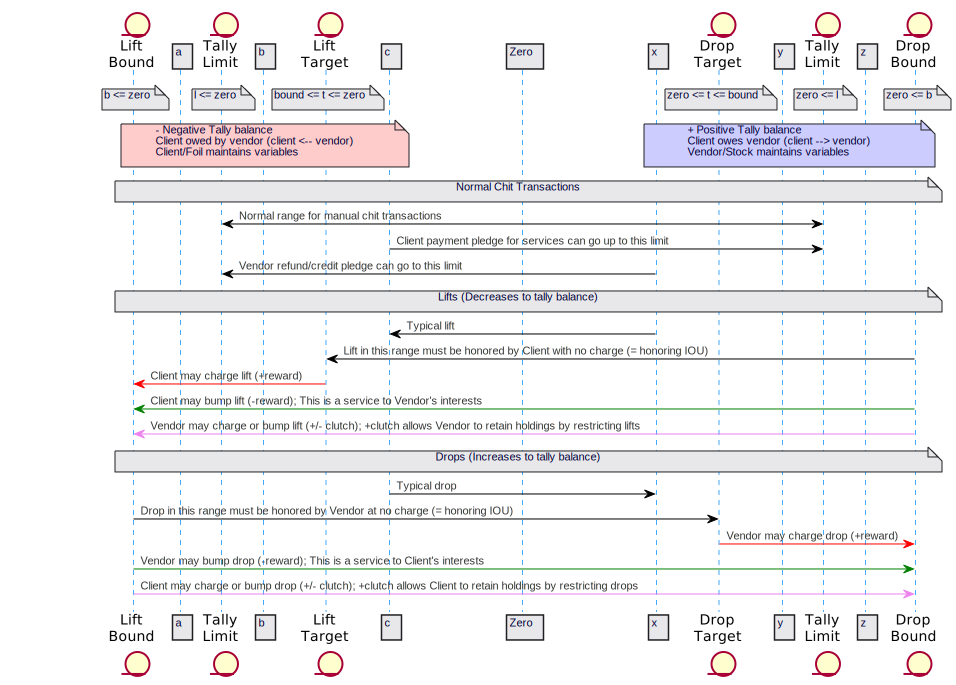

## Tallies

A tally is, at its essence, a contract between two parties.  Using the tally, the parties
agree to "keep track" of a net amount owing between them, on mutually acceptable terms.

The MyCHIPs digital tally is modeled after the historical
[split tally,](https://www.bbc.com/news/business-40189959)
an instrument used by past cultures to keep track of private credit balances.

### Tally Parts
Like a split tally, a digital tally has two parts, a stock and a foil.
The stock (which was often longer) is held by the party (the [stock holder](https://languagehat.com/stock/)) who normally provides a product or service and so is 
normally owed value for the transaction.
We will call this the Vendor.
The foil (or ["short end of the stick"](https://english.stackexchange.com/questions/283103/what-is-the-origin-of-get-a-hold-of-the-short-wrong-end-of-the-stick?noredirect=1&lq=1)) 
is held by the Client, or the entity who will be expected to deliver (pay) that value at some point in the future.

It might help to remember that C is near F and V is near S in the alphabet:
- Client: holds the Foil
- Vendor: holds the Stock

[](https://www.valens-research.com/investor-essentials-daily/this-ancient-tradition-is-the-reason-we-long-and-short-stocks-today/)

Perhaps the biggest functional difference with a MyCHIPs tally is, unlike its
wooden predecessor, it can easily be amended by adding new credits or debits.
It is a living ledger, keeping constant track of what is owed by one party to the other.

As a consequence, it is also possible for the stock to accrue a credit (negative) 
balance and the foil to accrue a debit (positive) balance.  This makes the 
terms stock (Vendor) and foil (Client) potentially less clear in terms of who 
becomes the creditor (Recipient) and who is the debtor (Issuer).  However, we will
still use the terms Stock and Foil because it is helpful to differentiate the 
two ends of the credit relationship when computing [lifts](learn-lift.md) and drops.

If two parties truly have a completely bilateral trading arrangement, they
might just assign Stock and Foil at random.  Or they may choose to establish
two tallies (with opposite stocks and foils) between them.  The system should 
be able to perform lifts to keep the two tallies in equilibrium.

A tally includes the following information:
  - Tally format version (1)
  - Digital ID unique to the tally ([UUID](https://en.wikipedia.org/wiki/Universally_unique_identifier))
  - Date and time of the original agreement
  - Vendor [Certificate](learn-tally.md#entity-certificates)
    - Vendor [CHIP address](learn-users.md#chip-addresses)
  - Vendor [Credit Terms](learn-tally.md#credit-terms); debt Vendor -> Client (normally 0)
  - Client Certificate
    - Client CHIP address
  - Client Credit Terms; debt Client -> Vendor (N=credit card, 0=debit card)
  - Reference to one or more standard, published contracts clauses, which
    become the operable and binding terms of the indebtedness.
  - Digital signature of Vendor (indicates binding acceptance of the tally)
  - Digital signature of Client
  - A list of transactions (chits), that total to the net indebtedness
  - A list of unilateral (one party) amendments (or settings) to the lift

Each atomic change to the amount owing (transaction) is referred to as a 
["chit"](https://www.dictionary.com/browse/chit) and includes:
  - Transaction date and time
  - Vesting date and time (not yet implemented)
  - Transaction amount, in mCHIPs (1/1000th part of a CHIP)
  - A transaction type:
    - Unearned gift
    - Payment for products/services
    - Credit lift
  - A reference number or string indicating an invoice or order that contains 
    more detail about what was purchased
  - Additional comments
  - For regular chits:
    - Digital signature of issuer/grantor, making the money binding
  - For lift chits:
    - Lift UUID
    - [Portal](learn-users.md#portals) where to reach lift originator
    - URL of lift referee
    - Public key of lift referee
    - Digital signature of lift referee

Tally settings are implemented as a special kind of chit so they can benefit from the existing chit exchange and consensus protocol.
Settings include:
  - The property/value being updated/modified
  - Date of the change
  - Signature of the modifying party

Tally data and chits must be maintained identically on the Stock and Foil (i.e. the two copies of the tally held by the parties to the credit agreement).
The order of chits must also (eventually) agree on both sides of the tally.
This is called [chit consensus](./learn-protocol.md#chit-chain-consensus).

### Evolution of Credit Terms

The tally fields reserved for credit terms were designed to hold parameters which could be
referred to in the tally contract to adapt the contract to the specific numbers agreed to
by the parties.  The parameters outlined below were originally designed with the idea that 
nearly any sort of credit relationship could be represented using a tally.

As development continues, the author wonders if this was too ambitious.
Some of the challenges include:
- When a chit is recorded in the present implementation, this implies that the credits being pledged
  are immediately available to be lifted (effectively transmuted) into other
  credits deemed more useful to the recipient (for example, with its own vendors).
- But longer term credit relationships (like a home loan or a car loan) entail a little different notion.
  - Certainly, the total amount owing is considered <i>due</i> to the creditor, but not right away.
  - Amounts owing are due later on, in the future.  They are not immediately payable.
- MyCHIPs is meant first, and foremost to be a payment system.  This implies a need for
  fungibility (or at least effective-fungibility).  A private note promising payment only in the future is 
  clearly not fungible.  A chit is effectively fungible only because of the novel MyCHIPs lift algorithm.
- MyCHIPs is intended primarily for use in commerce to facilitate trade--not as a mechanism for creating arbitrary
  debt which, in certain circumstances, [might be deemed a security](https://www.kramerlevin.com/en/perspectives-search/when-might-loans-be-deemed-securities.html).
- The [Trading Variables](#trading-variables) developed as the sole drivers of the lift algorithm.
  It was not initially clear how this might (or might not) be compatible with the credit terms below.
  For example, if a tally representing a home loan has a very large balance, it may suck up all available
  lift capacity, not allowing lifts for other tallies with smaller imbalances.
- There is no obvious trigger or <i>appropriate moment</i> for evaluating credit terms that are expressed as a formula.

The present direction for resolving these matters is as follows:
- Addition of the <i>vesting date</i> (not yet implemented) to the chit record.
  - Use of a vesting date would likely be limited to manual chits (i.e. not lift chits).
  - Before the vesting date, the chit would be totally ignored by the lift/route algorithm.
  - After the vesting date, it would suddenly become relevant.
  - This should have the effect of making the chit non-liquid prior to vesting and liquid thereafter.
- We will consider tally credit terms to be primarily understood by the humans party to the tally.
  Generally, credit terms will not be parsed by the computer, except to correlate them with the tally contract in a way so the parties can properly interpret their contract with each other.
- The lift algorithm will not consult the credit terms at all, but will be guided solely by the trading variables.

In the initial roll-out, MyCHIPs should concentrate primarily on chits that vest immediately and are subject to immediate lifting.
Users can carefully evaluate the viability of representing more complex credit relationships such as longer term loans.
Users will also be responsible for their own conduct should they engage in activities that may be regulated.

### Credit Terms
Some aspects of this section may not represent the current implementation.
Specifically, there is no current mechanism implemented for parsing variables or expressions in credit terms.
These values should correlate with the particular tally contract selected by the parties
and it will be up to the parties and/or the apps they use to properly interpret and enforce their agreed upon credit terms.

The tally credit terms field is a JSON object containing a series of variables (properties), some 
of which are optional.  The purpose is to have enough variables that many common types of 
credit arrangements can be reasonably represented by a suitable choice of values.

The meaning of each credit term should be defined clearly in the tally contract.
But the intended interpretations will also be described here.

To first understand better what we are trying to model, we will outline a few 
examples of common credit relationships:

- **Peer Accounts**:
  This might involve two companies or individuals who regularly exchange goods or services.
  There is probably a direction in which payment normally flows from Client to Vendor.
  But there may also be occasions when 
  the <i>normally-Client</i> party does services for the <i>normally-Vendor</i> party.
  
  In such an arrangement either party should be able to choose how much it, as
  a creditor, is willing to carry as debt owed by the other.  But any resulting 
  indebtedness actually incurred should be at the discretion of the party incurring the debt.
  
  The opposite of a debt is a receivable--an asset.  The amount of such 
  assets an entity may accumulate is really a function of his/her wealth and
  productivity.  There is not necessarily a problem with accumulating too much.
  The primary risk arises from concentrating too much of one's total assets in any single 
  debtor--particularly one who may not be capable of redeeming it all.
  
- **Merchants** (corporate Vendors):
  Clients of merchants may wish to accumulate value by collecting the credits 
  of the merchants where they like to shop.  This is one way of storing value,
  or in common terms, saving money. It can also be viewed as a loan from 
  the Client to the merchant, which may be redeemed upon demand any time the 
  Client wants to buy something.
  
  One potential concern for the merchant is to not accumulate too much debt, in total.  
  He should not care so much about how many credits any one Client may choose 
  to buy.  But he should not exceed the total amount of debt he can reasonably 
  satisfy through product sales, or other exchanges.
  
- **Secured Loans**:
  Consumers (Clients) and businesses (Vendors) alike can benefit from 
  maintaining one or more collateralized loans.  You might start by purchasing an 
  asset over time from a seller who would like to earn income by financing the 
  purchase.  As you have excess credits available from your income sources, you 
  lift those credits to the party financing the debt.  As you pay down the debt, 
  your equity in the asset increases.  Ideally, you could also advance value 
  back out of the loan if you need more money for some other purchase.  In this 
  way, the asset can form a store of value--likely more reliable and resilient than just 
  holding the credits of your favorite vendors (who could possibly go out of 
  business before you get around to redeeming the credits you're holding).
  
  Because this relationship is more than just a normal receivable in the course of
  doing business.  It may involve recording a public lien and/or seeking recourse in
  the courts.  It may also be subject to more stringent regulatory requirements in
  certain jurisdictions.

- **Money Markets**:
  Since payments normally flow in a single, expected direction, there is a natural 
  demand for [credit lifts](learn-lift.md) to temporarily move that flow backward,
  resetting the potential for more purchasing power.  But such "win-win" lift 
  pathways may not always be available.  Some parties may lack sufficiently 
  strong or numerous pathways to complete all the lifts they need.  In this 
  case, they may need to provide further incentive to trading partners to 
  complete their lifts.
  
  So in addition to quantifying the trades we *want* to do, we also need to be
  able to quantify trades we are *willing* to do, for a price.  For example, we
  might be willing to exceed normal risk limits for sufficiently high rewards.
  We might even be willing to conduct extra traffic in the normal *downhill*
  direction if we can make a little profit doing so, and we think we can later
  lift ourselves back out of the resulting transaction, using our own set of 
  trading relationships.
  
Understanding these examples, we will now explain the fixed credit terms.
By "fixed," we mean those terms both creditor and debtor can contractually depend on.
This is accomplished by incorporating them into the tally and digitally 
signing the tally to make it a binding contract.

In the following terminology, the "Client Credit Terms" are those 
conditions Vendor offers to Client.  In other words, the terms of Client's 
credit, or the terms by which Client may incur debt payable to Vendor.

Credit Terms Tally Variables:
  - **Maximum Balance** *(limit)*:  
    This indicates the most the debtor can count on borrowing (owing) against products
    or services he obtains from the creditor.
    There is not necessarily a system mechanism to prevent a debtor from pledging more 
    than his credit limit to the creditor.
    For example, one can just send an unsolicited, signed chit to a trading partner.
    However a creditor is not required by the
    tally contract to give product or services in exchange for pledges in excess of the agreed upon limit.
    
    The limit may be expressed as a single number, or as an expression, which is a function of time.
    Time-based expressions may be used to amortize a loan (to cause principal to be paid down over time).

  - **Maximum Paydown** *(mort)*:  
    This represents the maximum amount the debtor can pay down principal in
    advance of otherwise prevailing requirements, and have his interest 
    calculations reduced accordingly.  This can be used to create a minimum 
    interest return for a lender, while still allowing the borrower to store 
    value in the loan balance.

  - **Compound Interval** *(period)*:  
    The amount of time that passes before interest (or dividend, if you prefer) 
    is calculated and applied to a balance.  This may also define when payments 
    are due.  For example, if the application of such a charge raises a balance 
    above the Maximum Balance, some kind of lifting will have to occur to 
    correct this.  This value may be specified as a number, of days, weeks, 
    months, or years.

  - **Grace Period** *(grace)*:  
    New amounts of indebtedness will not accrue interest/dividend charges until 
    this amount of time has passed.

  - **Rate** *(rate)*:  
    An annualized rate expressed as a positive floating point number.
    For example, 0.05 means 5% per annum.
    This number will be scaled to match the Compound Interval in order to compute the 
    interest/dividend charges to be applied against an outstanding balance during that an interval.

  - **Call Notice** *(call)*:  
    The amount of time required to be given by Vendor to Client in order to 
    call all principal and accrued charges due and payable (i.e. to cancel 
    further credit authorization).  If not specified, a default value may be specified
    by the tally contract and the debtor may have no obligation to reduce principal 
    any faster than is indicated by the Minimum Payment.

    The Call Notice is triggered by affixing a signed Call to the 
    tally.  The debt must be extinguished within the specified number of days 
    after the date of the Call.  For a fully amortizing debt, a creditor would 
    register an immediate call, with the number of notice days set to the term 
    of the amortization.

  - **Minimum Payment** *(pay)*:  
    An amount, or a formula for the smallest amount that may be paid at each
    Compound Interval.  The tally contract should specify a default for this if
    it is not specified.

#### Credit Terms Examples
A party's credit terms are encoded in a JSON format to be incorporated into a
tally.  Property values may be expressed as a formula that references certain 
pre-defined variables or other properties.

- Casual Peer to Peer, no interest, cancelation with notice:
```
{
    limit: 100,
    call: 30
} ```

- Customer (Client) to merchant (Vendor) (coupons):
```
{ limit: 0 } ```

- Merchant (Vendor) to customer (Client), debit account:
```
{ limit: 0 } ```

- Credit card requiring full payment every month:
```
{
    limit: 200,
    pay: "balance",
    grace: "1 month",
    period: "1 month",
    rate: 0.10,
} ```

- Credit card requiring full payment over four months:
```
{
    limit: 300,
    grace: 30,
    pay: "min(10, balance / 4)",
    period: 30,
    rate: 0.10
} ```

- 20 year fully amortizing loan with fixed payment, limited early payoff:
```
{
    limit: "amort(10000, 240)",
    pay: "interest",
    mort: 1000,
    period: "month",
    rate: 0.06,
    call: "20 year"		//will register call upon closing
} ```

- Business line, pay weekly interest, can be called with 60 day notice:
```
{
    - limit: 10000,
    - period: "week",
    - rate: 0.08,
    - call: 60
} ```

- 90 Day personal loan, fixed term, balloon payoff
```
{
    rate: 0.12,
    call: "90 day"		//will register call upon closing
} ```

The credit terms explained above do not typically place hard limitations on the
transactions users may manually initiate.  For example, a credit limit, does
not prevent one peer from unilaterally sending value (chits) to the other
party, even if that would push a total past a credit limit.

For example, even though I might only trust you with credit for 
<span>$</span>100, 
that wouldn't prevent you from writing a check to me for
<span>$</span>1000.
And I might well accept that extra large check.
I may just decline to give you product or services in exchange for it--at least 
until I had funged it into a form of value I was more comfortable with.

### Trading Variables
MyCHIPs credits are, by design, not transferrable.  This means, if someone owes 
you value, you don't have the right (or even the ability) to reassign that asset to a third party.
This limitation is imposed purposely to avoid the need for trust among unrelated parties
and it also makes CHIPs less vulnerable to theft or loss.
But it seems like a pretty serious limitation--especially on a system we intend to use as money.

Thankfully, the [credit lift algorithm](http://gotchoices.org/mychips/acdc.html)
makes it possible to virtually transmit *value*, if not the CHIP tokens themselves.
This *effective fungibility* is enough to make CHIPs useful as a medium of exchange.

[](http://gotchoices.org/figures/money_ac.svg "Click to see/run a decentralized private credit model")

Circular lifts are typically executed autonomously by one's host service and without direct user interaction.
Therefore, the system needs a defined set of rules to know how the user wants this done.

In the absence of such specific direction, the system might just examine any credit 
imbalances and lift them back to zero.  While this would technically work, it 
doesn't give the user much flexibility in how and where he may choose 
to accumulate value (i.e. save money).

For better control, each tally half (stock or foil) contains trading parameter 
settings (implemented as a special kind of chit) that control how lifts will take place.
Users can manually adjust these values themselves.
The instruction for making such changes will be digitally signed by the user, 
authorizing the site to act in accordance with the new settings.

<p align="center">		<!--- Github disables svg scripts -->
  <embed src="figures/lifts.svg" width="500" title="Visualizing Trading Variables">
</p>

This
[interactive figure](https://cdn.jsdelivr.net/gh/gotchoices/MyCHIPs/doc/figures/lifts.svg)
allows you to drag settings to see visually the way trading parameters 
determine if/when lifts or drops will be performed.

Lifts are the critical method used for reducing accumulated tally balances.
MyCHIPs also includes the notion of a *credit drop.*
A drop is just a lift in reverse--a way of trading to increase a tally's balance.
It will only occur if the trading variables are configured to allow it.

In general, the stock holder (Vendor) controls the drop parameters and the foil holder (Client) controls the lift parameters.
But regardless of such settings, each party *must* allow lifts/drops without restriction to the extent they are the pledging party (IOU grantor) and a balance is outstanding.
A simpler way of saying this is: “IOU's must be honored without charge or restriction.”

Beyond that exception, parties can optionally charge a fee for lifts or drops.
Or if so motivated, they can effectively *pay* a fee to facilitate their own lifts or drops.

Lift transactions are managed using four basic trading variables controlled by each of the parties:

Client's (Foil) Trading Variables:
  - **Lift Target** (target):	Default: 0  
    The ideal amount of Vendor's credits Client wishes to accumulate.
    This implies negative tally balance and so is normally accomplished through credit lifts.
    This can exceed (override) the Vendor's normal credit limit (dr_limit) agreed to 
    bilaterally in the tally, for the purpose of lifts.  A positive amount 
    here constitutes value savings by the Client in the currency of the 
    Vendor--something the Vendor must accept in payment or as part of a future drop.

  - **Lift Limit**: (bound)	Default: Tally Debit Limit (dr_limit)  
    This can override the credit limit agreed to in the tally to allow higher or lower
    indebtedness of Vendor to Client, occurring as the result of a lift.
    No lifts should be performed which would result in a balance more negative than this amount.

  - **Lift Margin**: (reward)	Default: 0  
    All lifts must be allowed at par (0) or better (negative) until the stock 
    balance is reduced to the Lift Target (default 0).
    Reward indicates Client's willingness to conduct lifts through this Foil beyond that point.

    The number 0 is neutral, meaning zero cost.
    A positive number indicates a cost, or disincentive to trade.
    For example +0.02 means the Client would pass along only 98 chips for every 100 lifted up through this Foil.
    But -0.02 means the Client would pass 102 chips along for every 100 received.

  - **Drop Margin**: (clutch)	Default: 0  
    Specifies the Client's willingness to conduct drops through this Foil.
    If the user wants to retain the chips in the foil, he can enter a
    positive number (1 disables drops altogether).  If he wants to get rid of
    the chips, he could consider entering a negative margin.
    
Vendor's (Stock) Trading Variables:
  - **Drop Target** (target):	Default: 0  
    The ideal amount of Client's credits Vendor wishes to accumulate or maintain.
    This is like collecting your payroll checks without cashing them for a while.

  - **Drop Limit**: (bound)	Default: Credit Limit (cr_limit)
    This can override the credit limit agreed to in the tally to allow higher or lower
    indebtedness of Client to Vendor, occurring as a result of a drop.
    No drops should be allowed resulting in a tally balance more positive of this amount.

  - **Drop Margin**: (reward)	Default: 0
    This indicates a willingness to conduct drops, or lifts in the opposite 
    direction of normal (downhill) through this Stock.  All drops must be
    allowed at par or better until the Drop Target (default 0) is reached.
    Drops requested beyond that point are subject to a cost at the specified 
    margin.

  - **Lift Margin**: (clutch)	Default 0
    Specifies the Vendor's willingness to conduct lifts through this Stock.
    If the user wants to retain the chips in the stock, he can enter a
    positive number (1 disables lifts altogether).  If he wants to get rid of
    the chips, he could consider entering a negative margin.

Here is another diagram showing how lifts and drops are computed.  Note that the Tally
Limits shown are actually part of the credit terms.
These are primarily for users to observe when making manual transactions.
They are not consulted by the system for lifts/drops.

<p align="center"></p>

The above figure also shows how/where the margin and clutch values come into play.
As of May 2022, margin and clutch have not been fully implemented in the lift code.

  
### Simplified Credit Terms
(May 2022)  
It was mentioned [above](#evolution-of-credit-terms)
that the credit terms will be simplified for the initial MyCHIPs rollout.
The following are the anticipated initial credit terms:
  - **Maximum Balance** *(limit)*:  
    The current limit of credit.
    This can be overridden (either increased or decreased) by a setting asserted by the user
  - **Call Notice** *(call)*:  
    This describes how much notice is required in order to call a tally balance due that has not
    been satisfied solely by way of lifts.
    This is roughly synonomous with reducing the limit and demanding the balance to be brought in line with the new, reduced limit.
    There will be no system control to enforce this, but it may be referred to by the parties in any enforcement action.
  - **Default Interest** *(defint)*:  
    In the event that a debtor does not satisfy an amount due upon demand, the credit balance will begin to accrue
    interest at this rate after the call period has elapsed.
    Again, this value is not processed by the software but should be referenced by the tally contract.

### Invoicing Overview
An invoice is a request for payment from one party to another.  When the 
parties [share a tally](#establishing-a-tally), this is pretty straightforward:
One party enters a draft chit on the tally and waits for the other party (who will be paying) to approve it.
The parties can negotiate over it until it is agreeable.  
Once signed by the remitter, it becomes a binding part of the tally.
This process is more formally described [here](learn-protocol.md#direct-chit-protocol).

If an invoice is to be sent to a party who does not share a direct tally, it is a little more complicated.
The payment request must be sent independently, off the CHIP network (such as via mail, email, QR code, etc.).
This is called an "out-of-band" communication and it is necessary because these parties don't really share 
any direct connection that can be trusted on-network.

The actual payment will be accomplished by way of a [linear lift](learn-protocol.md#credit-lifts-explained).
The invoice (issued from recipient to payor) should include:
  - The recipient CHIP ID (possibly [obscured](learn-users.md#obscured-cid))
  - Recipient agent key
  - Recipient agent portal
  - Transaction type
  - The amount due
  - A reference field (order or merchandise number, for example)
  - Optional comments
  - Optional list of routing hints: domains/IP/addresses of downstream host systems who may 
    be well known and have a known, upstream path to recipient

The payor system will attempt to discover a route to the recipient.
If successful, a linear lift can be initiated to complete the payment.

### Consumer Transactions
This is an example of a typical consumer payment where there is not a shared tally between 
the payor and the recipient

- The vendor displays a generic invoice QR code as described in the [Invoicing section](#invoicing).
  - This can be custom generated for the transaction; or
  - It can be generic (a printed decal with no amount or reference field)
- The customer scans the invoice into his MyCHIPs app.
- In the case of a custom generated invoice, the app will automatically
  determine a route to the payee if possible.  If multiple routes are 
  discovered, the user may confirm the one he wants.
- If the invoice is generic, the app may prompt for a reference number (if
  the invoice was configured for such).  In the case of retail, for example,
  the merchant could supply a short sequence of digits verbally to be entered.
  This will allow the merchant to trace this payment to the specific register,
  transaction, etc.  The transaction then proceeds.
- The invoice itself might also contain a register or department number to avoid
  the need for the user to enter anything.
- The app initiates a linear lift to the recipient's system.  When the user
  signs the transaction, the lift is completed.
- The receipient's system will recognize the transaction with the related
  reference number and recognize the purchase as complete.
  
### Establishing a Tally
Version 1.0 of the tally protocol is described formally [here](learn-protocol.md#tally-protocol).
In addition to this higher-level negotiation of the tally record itself, peer sites need to 
open a channel over which they can communicate securely.
That process is discussed [here](learn-noise.md).
In the case of a first-time tally, these two levels are more tightly coupled.

A MyCHIPs server should not normally accept a connection from anyone it doesn't already know about.
So if two parties want to create a tally between them, one of the parties will have to issue a tally ticket to the other.
Like an invoice, this information must be passed out-of-band.

The process is conducted according to the following example.

- User A3 will build a suggested tally and then request from his host system a ticket associated with that tally.
  This authorizes a peer site to establish a connection, absent pre-shared key information.
  It will also trigger site A to proffer the tally when the connection is made.
  
- The ticket will be disclosed to User B1, via a reliable out-of-band pathway.
  For example, User B1 may scan a QR code on User A3's mobile device or User A3 may email or text the code to User B1.

<p align="center"></p>

- The ticket contains:
  - User A3's [CHIP address](learn-users.md#chip-addresses)(CHAD), indicating how/where to
    connect with Site A on behalf of user A3.
  - An expiring, one-time token, authorizing connection without any other key information.
    The token will internally specify that it is for establishing a new tally;
  - The token expiration date/time;

- Once in possession of the connection ticket,
  Site B connects (on behalf of B1) to site A.
  It sends a structure encrypted with the site A's public agent key, containing
    - The connection ticket;
      - B1's CHIP Certificate, added into the ticket;
    - The public key of the site B agent (inherent in establishingn the NPF connection);

  If site A can decrypt the message, and the token is still valid, it will:
    - Finalize opening of the connection (including agent key exchange);
    - Build a tally as drafted in its own DB in association with the token;
    - Add B1's certificate information into the tally;
    - Present the drafted tally for signature by entity A3
      (this signing step could be automated in certain larger-scale situations);
    - Once signed, the draft tally will be transmitted to B1 for review, counter or acceptance;

  If the initiation message fails, site A should silently close the connection
  and may opt to initiate defensive measures (such as firewall blocking) against
  possible [DOS](https://en.wikipedia.org/wiki/Denial-of-service_attack).

For a real-world example, let's consider the case of a commercial account like a retailer or restaurant:

- The Vendor displays or transmits a ticket QR code, containing the connection ticket;
- The customer scans the ticket using his app;
- The customer's host agent contacts the Vendor's host agent system at the specified port
  and presents the connection token;
  The vendor's system must prove its authenticity via the public agent key it supplied in the ticket;
- The customer proves authenticity simply by possessing the token;
- The customer system provides the [customer's certificate](#entity-certificates).
- The vendor's system will complete the draft tally (or a clone of it when the token is meant to handle multiple connections).
- The vendor system will send the tally to a human (or an authorized bot) for signing.
- The customer will be given the opportunity to accept/modify/reject the tally.
- If he accepts it, we are done.  The draft tally has already been signed with its preferred terms.
- If he modifies it with a counteroffer, some (probably human) user on the 
  vendor's end would have to re-sign the tally (assuming they are willing to) before the tally becomes active.
  The vendor (or vendor system) would also have the option of re-counterign or refusing the modified tally.

Once the tally is established, the customer can [set parameters](#trading-variables) on the tally to
collect extra Vendor credits, if so desired.
Once collected, those credits can be spent.

If credit has been extended to the customer as part of the tally, the customer
can begin to buy things using the tally as payment, within the specified credit terms.

### Entity Certificates
Part of the information encapsulated and digitally signed within a tally includes a
CHIP certificate.  The certificate has several purposes:
  - To provide information about the entity that identifies it to the satisfaction
    of the other trading partner.  For example, some partners may require a certificate
    containing a Tax ID number (like a US Social Security Number).  Less formal
    relationships might only require a name and email address.  Some fields are optional
    but should be sufficient (in the judgement of the partner) to establish identity in
    an unmistakable and legally sufficient way.
  - To identify how/where to contact the agent server acting officially on behalf of the
    MyCHIPs user.
  - (OBSOLETE:) To provide sufficient information to the host system to uniquely identify the
    entity and create the approprate database record (or properly recognize that it
    already exists).

During a transaction involving a connection ticket, there is a point where the subject
entity presents the ticket, along with its own certificate.  In the original design, 
the intent was that the proffering system would decide whether it already has a valid DB
record for the peer or if it should add a new record.  This turns out to be one of the 
trickiest parts of the protocol.

There are 4 possible pieces of information in the database that should be unique to
a particular entity:
- CHIP ID and Agent [(suzie:6j9z7de95UMTnZzWobwtob6Mc3MDGDntdhSNR80pGXE)](learn-users.md#chip-addresses)
- Public signing key
- Birth ID record (which could change in small ways and still represent the same person)
- National tax ID (if provided)

The agent part of the CHIP address uniquely points to a process server
(address and port) that is responsible for properly managing the associated chip ID.
We hope a service provider behind that agent process will reliably provide accurate 
information about its users.  But we can't always be sure.
What we ***will*** accept is that an incoming connection with an authorized token is 
initiated by a peer our *local* user wants to connect with.

It seems reasonable to disallow two peer records to have the same public signing key.
If a user decides to have multiple trading accounts, he could likely create a separate
key for each account.  It might be possible for a service provider to service a single 
entity (with a single signing key) at more than one agent address.  But the reference 
implementation will likely not allow this. Perhaps the strongest argument against a
strict 1:1 relationship between CID and key is that a user may just lose his key and
have to create a new one.  More on that later.

A birth ID is optional.  If it *is* provided, it can be very helpful for humans to determine
the identity of an individual.  But someone could provide essentially the same birth ID
information (from a human-interpreted standpoint) to two different services and yet have
the birth records differ enough that a computer would likely consider them different.
So this one will be good for contract enforcement, but not so much for computer decisions.

The national tax ID will be used for serious partners who need to know your identity in a
very secure way.  It would certainly be nice to not have two different records in a system
that have the same tax ID (i.e. Social Security number).  However, like the signing key,
it is certainly possible for one person to have more than one CHIP account.  If an 
implementation is going to insist on uniqueness here, it might have to support
multiple CHIP ID's per entity.

More than anything, perhaps these issues expose a flaw in the original schema design.
It assumed that host systems would maintain normalized entity records 
(i.e. one per entity) for foreign peers who were connected by tallies to its own local 
user entities.  That assumption may just not be possible without the need for periodic
human intervention to sort out problematic edge cases such as:
- A user modifying key information in his certificate and then reconnecting to a foreign 
  system (perhaps to make a tally with another user there).
- A user losing his key, regenerating a new one, and then trying to establish a new
  tally with an existing peer.
- A user changing his CID or agent server key.

So as of Jan 2022, we will pursue the following design approach:
- A user is responsible for building and maintaining his certificate data on his host site.
- New tallies incorporate the certificates of both users, so the digital signatures will
  attest to the certificate data as it existed when the tally was consummated.
- Host systems should take reasonable steps to make sure they only have a single entity
  record for their own local users (such as making a tax ID, or signing key unique)
- But a host system will not attempt to store a normalized entity record for foreign peers
  at all.  Rather, it will maintain a separate copy of the peer certificate for each
  individual tally.
- This approach seems bulky in some ways.  But it should allow a server to operate much
  more autonomously.  The idea is:
  - Users are responsible for the accuracy of their identifying data on their own host system.
  - Users are responsible to review ID information of the peers they choose to execute tallies with.
  - It is not the job of a host system to make any judgement about the accuracy of foreign peer data.
  - If a foreign agent process can properly open an encrypted connection using its expected public 
    keys, that is sufficient to validate the agent.
  - If a foreign peer can properly sign activity on a tally using the key that originally signed 
    the tally, that is sufficient to validate the transaction.
- If a user loses his signing key:
  - He should be able to regenerate one as needed without being hassled too much by his host system.
  - He should be aware that he will lose the ability to transact on any existing tallies.
  - He will have to talk existing partners into executing new tallies using the new key (and possibly a different agent/provider).
  - And he will have to arrange with them to void out, or *lift out* any existing balances
    and move them over to the new tally with the new key.
- This approach introduces some potential challenges in the DB views used for calculating
  lift pathways.  Hopefully there is sufficient data in the tally/certificate to maintain
  the same views (just drawing their data from a different table).

Now when a new tally connection is being considered, the system will consider:  
- If the sending agent is also managed by our local system:
  - If so, this should be a local user of ours as well;
  - Mark the tally partner as a local user so we can build lift segments properly.
- Otherwise, just store the certificate with the tally and don't make any attempt to
  store any additional peer data.
- The notable exception to this is, each server should not continue to rely on the physical
  address of the agent server stored in the tally.  Rather, we should maintain a normalized
  physical address of each known agent server, external to the tallies.  That way an agent
  can change its physical address and we will adapt to the change easily, as long as it
  continues to use the same key.
  
### The Entity Certificate
The CHIP certificate contains:
```
  - Personal or entity contact information
  - Information for addressing the entity's CHIP account
  - Information about the entity's identity
```
In JSON format, the certificate would look like this
(properties shown as arrays can be a single object or an array):
```
CHIPCert: {
  cid,
  agent,
  type,
  name:        [{name, given, prefer, aka}],
  connect:     [{spec, type, comment}],
  place:       [{address, city, state, code, country, type, comment}],
  identity:    {
    state:     [{country, id}],
    birth:     {
      name:    [{name, type, comment}],
      date,
      place:   {address, city, state, code, country, type, comment},
    },
  public,
  date,
  signature,
}
```

At any given time, a given entity should ideally have a single:
  - CHIP ID
  - Agent ID
  - Signature public key

Any time a site receives a certificate for a user it already has record of, it should
validate the authenticity of the certificate using the public key it already has on file.
If the information is authentic by this measure, the site should update any contact
information from the certificate.

If the public keys don't match, it should probably just create a new user or alert
a human to determine the correct course of action.
  
If changes need to be made to the CHIP ID or Agent ID, this can be done automatically if
duly authorized by a record signed by the peer's signature key.

If a user's signature key needs to be changed
this should probably be done by:
- disabling all old tallies with a close request by the partner holding a remaining 
  good signing key;
- creating new tallies with the new signature key, and then moving remaining credits over 
  from the old tallies to the new tallies that include the new signature key.

This way, trading partners will necessarily be involved in the process of moving to a
new signature key.

### Tally Exchange Format
A MyCHIPs server may store tallies, chits and other objects in any format that makes
the most sense.  But when communicating with other compliant servers, it should send
the tally in the following format, shown as JSON:
```
tally: {
  version: 1,
  uuid: "9e61301c-86aa-5835-9ea1-25adf13eaf3c",
  date: <Begin date of contract>,
  note: <Additional Comments>,
  stock: {
    cert: <CHIP Certificate>
    terms: <Credit Terms>
  }
  foil: {
    cert: <CHIP Certificate>
    terms: <Credit Terms>
  }
  agree: {
    domain: "mychips.org",
    name: "standard"
    version: 0.99
  }
  sign: {
    foil: <Foil Holder Signature>,
    stock: <Stock Holder Signature>>
    digest: <Hash of the rest of the tally>
  },
}
```
A tally may contain any number of sequential chits.
Chits are transmitted in the following format:
```
chit: {
  tally: "9e61301c-86aa-5835-9ea1-25adf13eaf3c",
  uuid: "2d5d4167-dcdf-5743-861c-e6ae1e62bbb8",
  type: "tran",				//or "lift"
  date: <creation date/time>,
  units: 432123,			//milli-CHIPs
  for: <External invoice number or other reference or comment>,
  digest: <Hash of the rest of the chit>,
  signed: <Pledgor's signature>
}
```

### Pathways
The admin tool includes a network visualization tool that shows all users local
to the site, known foreign peers, and the tallies that interconnect them.
Each site database will store both a stock and a foil that connect local users to each other.
But it will only contain a single stock or foil leading from or to a foreign peer.

The first step in making sense of the network is a recursive view called
mychips.tallies_v_net.  This view looks at each tally (stock or foil) in terms of whether it
has current capacity for a lift.

If the lift will move value from stock to foil, this is a traditional, upstream lift.
If the combination of balance and trading values call for a possible transfer from foil to stock,
this is a downstream transfer or <i>drop.</i>.
This is all abstracted by thinking of the <i>input node</i> and the <i>output node</i>.

Everything will be then thought of generally as a lift, whether it is specifically a lift or a drop.

The trading variables get boiled down to four lift parameters:
  - target
  - bound
  - reward
  - margin

The target, bound and reward are identical in meaning to the trading variables by the same name.
The margin, however is a result of the clutch value from the other half of the tally.
The idea is, it represents the cost charged by the partner (usually 0) for doing a lift through this segment.

The next view, tallies_v_paths joins individual tallies together, output to input, in linear groups.
This allows us to see segments within the database that can be acted on together in a lift transaction
as though they were a single tally.

The lift also computes a segment <i>lift capacity</i> (sometimes called <i>lading</i>) that explains
how big a lift can be and what it might cost.

The view tallies_v_paths will also show certain paths that are circular within the local database.
These are of interest for the possibility of doing a lift entirely locally without having to deal with other sites at all.

Lading values get aggregated along segments to become:
-  **min:**	The smallest free liftable amount along this chain (the most we can expect to lift through this chain at no cost).
-  **max:**	The smallest liftable amount along this chain, which may have a cost (the most we can expect to lift).
-  **reward:**	The cost rate asserted by foils for that part of the lift greater than lift_min and less than lift_max.
-  **margin:**	The aggregated cost asserted by stocks for lifting any amount through this chain.

During route discovery (see Lift document), these values are queried in order 
to determine lading capacity through pathways that span across multiple sites.

### Chit Chains
(Deprecated version 0 protocol!  See [newer 1.0+ protocol](learn-protocol.md#chit-consensus).)
One of the challenges of a distributed system is to keep different copies of 
important data in sync across systems.  This is where parts of blockchain 
technology will be helpful to us.

While we don't have the problem of thousands of different databases all trying
to reach consensus about a single data set, we do have two copies of each
ledger: Stock and Foil.  And while they are bound to get out of sync from time
to time, it is important that they converge to the same answer eventually as
they go along.

So we will employ the design pattern of a hash chain.  The chits belonging to a 
tally will form a linked list where each chit in the chain will hold a copy the 
hash of the prior chit in the chain.  This way, if our two peers can agree on 
the index number and hash value of the last chit in the chain, they can rest 
assured, they also agree on the contents of all prior chits in the chain.

Here are a some basic rules for our algorithm:
  - Either side of the tally can authorize their own chits when the result of
    that chit would be to transfer value to the other party.
  - Either side may also request a chit from the other when the result is to
    receive value.
  - But you can't unilaterally transfer value from the other party to yourself.
  - Once you sign (using your private key) a chit, you immediately send it to 
    the other party.
  - This packet includes the chain index and hash, so the other party can see
    at any time how much of the chain you may both agree on.

Foil Specifics:
  - You add signed chits to the chain as you become aware of them.  The order 
    you pick for chits in the chain is authoritative.
  - Upon receiving a signed chit from the Stock, attempt to add it to your
    own chain.
  - If it can be added at the end of your chain with the same index number,
    and your computed hash matches, send an acknowledge.  Also record for the
    tally that the Stock agrees with you up through this latest index.
  - If a received chit can not be added at the specified index, add it at the
    end of your chain and then send an adjustment record including all chits
    greater than the last agreed upon index.

Stock Specifics:
  - If you are the Stock, you must adapt to the ordering of chits selected by
    the Foil.  If the Foil refuses to acknowledge a chit, this could be a 
    reason to end the relationship.  But as long as it gets integrated at some 
    point, you don't need to worry about where it landed in the chain.
  - Upon receiving a signed chit from the Foil, attempt to add it to your
    own chain.
  - If it can be added at the end of your chain with the same index number,
    and your computed hash matches, send an acknowledge.  Also record for the
    tally that the Stock agrees with you up through this latest index.
  - Fixme: What do do if a received chit specifies an index earlier than
    the last validated index?
  - Otherwise, if a received chit specifies an index already occupied by a 
    record in your own chain, install the new chit at the specified index and
    increment the index number of the conflicting chit (and any after it).
  - If the computed hash matches for the installed record, send an Ack and
    note the latest validated index number.
  - Otherwise, if there are any records in your chain before the one you just
    inserted and with index numbers higher than the latest validated, resend
    them to the Foil (as they have probably been missed somehow).
  - If you get an adjustment record from the Foil containing multiple chits,
    insert them all in your chain at the specified indexes, moving any
    conflicting chits later in your chain.  If your computed hash matches up
    through the end of the adjustment matches, send an Ack and record the
    latest validate index.

In general, if you get a chit that already agrees with what you have on the
chain, send an Ack back.  If you get an Ack through a certain index number
move your latest valid index number forward (but not back) to that number.

See [this section](learn-lift.md#lift-states) for more on treatment of chits that belong to a lift transaction.

<br>[Next - The Credit Lift](learn-lift.md)
<br>[Back to Index](README.md#contents)
