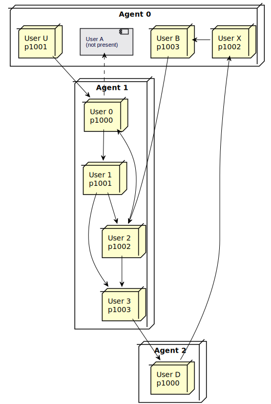

## Testing the Server
- Now we will add some sample test data to the database:
  Edit the settings file to set IP number of the test machine your database is
  on, and then run the kickstart file.
```  
    cd test
    vi settings.js
    cd sample
    ./kickstart
```
  Reload the user preview in the admin GUI and you should now see 4 users.

- View the live network graph (Network tab)
  See your users on the graph
  Use the graph menu (Upper Right) to Reset or Arrange if necessary

- Add sample tallies/chits (while watching the live Network display)
  Still in test/sample:
```
    psql mychips admin -f tallies.sql
    psql mychips admin -f chits.sql
```  
  Remove them again with
```
    psql mychips admin -c "delete from mychips.tallies"
```
- Add more random users (while still watching the graph)
```
  ./randuser					# or:
  ./randuser -n Number_of_Users_to_Add
```  
  Press Arrange button (or hold it) in graph menu to arrange nodes better

- Launch the agent-based modeler simulation:
```
  cd ../sim
  ./modeler -m 1		#Very basic version
```  
  You can watch as the user nodes will begin to form tallies with each other 
  and begin to trade chits over the tallies.
  
- Lifts
  When the graph accumulates some debits and credits, you can try executing
  some local credit lifts.  Keep in mind, this is not a network simulation
  but only working with a set of users within a single database.
  To work with distributed lifts, see the [docker simulation](../test/sim/README.dock).
  
  To examine the local lift path table, execute this SQL:
```
    select * from mychips.tallies_v_lifts  
```  
  To run a single credit lift, execute this SQL:
```  
    select mychips.lift_cycle(1)		-- Argument = max number of lifts
```

## Unit Testing
The software also comes with a suite of regression tests.  These are by no means
complete but do offer a helpful baseline.  You can run the test suite with this command:

```
npm test
```
Individual tests may be run by a command such as:
```
cd test/mocha
npx mocha impexp
```
Note that many of the tests depend upon other tests being run first,
so to work properly, you may have to run them in just the right order:
```
npx mocha impexp user2 sch-path sch-route route sch-lift.js
```
If you find a test that is failing, the best thing to do is to isolate such a
command and execute it from the commmand line.  Then go into the script for
the failing test and put a leading comment (/*) just after the failing test
(so it is the very last one to run).

Then enable debugging with:
```
export NODE_DEBUG=debug
```
and look in your system's temp directory (such as /tmp/wyatt) for log files
that are receiving lots of debugging information.  On MacOS, it is particularly
hard to find the location of this temporary file, so there is a script:
```
mocha/watch <test-name>
```
that should *tail* the file for you.

To run these tests, you will need an instance of PostgreSQL running in reach of
the running mocha process.  For a native installation, that shouldn't be a problem.
When testing on docker, make sure you are running the *dev* version of the
docker compose file
```
docker-compose docker-dev up
```
Also, make sure the settings and environment variables in test/settings.js can
find your postgres service OK.

## Unit Testing Paths, Routes and Lifts
For testing that involves pathways between nodes, the test suite will create
a simplified network of tallies as follows:

[](uml/test-paths.svg)

This provides examples of many of the basic scenarios that may occur when
discovering and/or using pathways and routes for credit lifts.

<br>[Next - User Application](use-pki.md)
<br>[Back to Index](README.md#contents)
