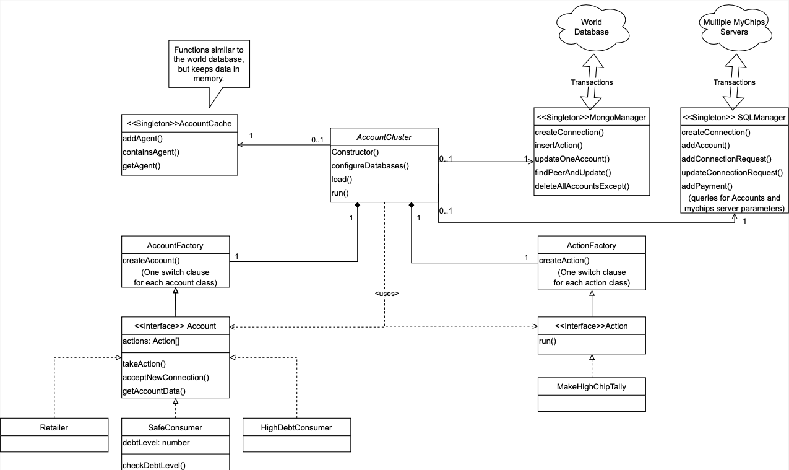

# Agent 3 Simulation

The Agent 3 simulation extends the basic structure Agent 2 was built on and adds key features that result in more realistic spending patterns.

## Primary Goals

- Improve code readability for future developers (Completed)
  - Update variable names
  - Implement classes that adhere to the Single Responsibility Principle
  - Convert JavaScript to TypeScript (Object Oriented programming allows for more extendibility)
- Collect data from simulation that can later be analyzed
  - Add analytics table to WorldDB that records both server and world information
  - Export to single file
- Add configurable actions to simulation
  - Easily allow other developers to create their own actions
  - Actions (such as purchase a house, buy a car, or get a paycheck) can be configured with their frequency depending on the account type
- Perform credit lifts when criteria is met
- Make agents and actions classes easily extendable

## Running the Simulation

To run the simulation you need to run `npm install` and then follow the [setup instructions](/doc/sim-docker.md). Specific instructions for Agent 3 are at the bottom.

## Development

<ins>_ Do not edit any Agent 3 JavaScript files directly _</ins>

The Agent 3 Model of the simulation was developed using TypeScript to allow for clear data typing, therefore any changed `*.ts` files must be transpiled before execution. The overall work flow should look something like this:

1. Edit `*.ts` files.
2. Run `npm tsc` before running the simulation.
3. Run `./simdock startup`, `./simdock tickets`, and then `./simdock start sim --runs=50` as outlined [here](/doc/sim-docker.md)

\*Instead of running these four commands individually, developers may find it useful to run the `runsim.sh` bash script within the `lib/agent3` directory, which executes these steps in sequence. Since the simulation is run asynchronously, the script should be run from the command line. We've seen some issues with using VS Code's NPM SCRIPTS runner.

## Prettier & ESLint

This project uses esLint and Prettier to format and check the simulation TypeScript files for syntax errors. Make sure to set up your IDE to use these tools (preferably Prettier formats on each save). To format everything at once, run `npx prettier --write .`. Before committing, make sure to run npm tsc to apply style changes to JS files as well.

## Structure Overview

The MyCHIPs project and Agent 3 code have a lot of moving pieces that come together to make the simulation work. Along with Kyle's well-written and thorough documentation, we wanted to provide a sort of summary of the pieces at play that are crucial for the Agent 3 model.

Details on low-level implementation are provided in the code as Javadoc comments, and this README contains high-level explanations that will help you see how the different pieces fit together. We encourage you to add clear documentation as you develop to mantain continuity during the development process.

Here is a basic description of the flow of data through the simulation:

1. `simdock.sh` takes care of setting up the environment required by the simulation.

   - Starts the local SQL databases (one container per site) and world database (MongoDB)
   - Creates and inserts users into the local SQL databases
   - Runs `sim-c.sh` which starts the simulation by creating one 'agent' docker container per site, each running an AgentCluster process (the entrypoint is `test/sim/agent` which instantiates the main class in `agent3.ts`)

2. Each 'agent' (by running AccountCluster) loads the config file parameters, connects to their respective local SQL databases, and connects to the shared Mongo 'World' database.
3. Accounts stored in local SQL databases are loaded into their respective sites' AccountCache, and are loaded into the shared WorldDB.
4. 'agents' iterate through their local accounts, performing allowed actions, (such as purchase item, take out a loan, sell a good, etc...). For example, let's say Dave initiates a 'purchase item' action. To do so, he needs to find a new spending target. His account goes through these steps:

   1. Find peer in world DB (Mongo)

   2. Do we have the peer's info already downloaded?
      1. If yes, look up the peer's ID in our cache
      2. If not, add peer to our MyCHIPs DB (PG)
         This gives the peer a new ID on our server (different than their ID on their server)
         . If they are on a different server, ask them to download our info to their server
   3. Once our info is on the peer's server...
   4. Use the peer's ID (not peer_cid) to make a connection (tally) request with SQLManager

5. Once the peers and SQLManager approve the connection, then the peers perform the tally behind the scenes of the simulation.

6. Listeners to the SQL databases' peers or tallies will notify the 'agent' container of new change, and the 'agent' reacts accordingly

### Simulation Sequence UML

### Agent 3 Class UML Diagram

## Debugging Tools

- To query SQL databases, use `./simdock q <int-for-server-num> "<sql-query>"`
  - \*Example: `./test/sim/simdock q 0 "select id, peer_cid from mychips.peers_v"`
- SQL DB field name mappings can be found in the `baseAccounts.ts` getAccount() method
- Relevant PostGres Schemas
  - Users
  - Tally
  - Chit (like a check) (payment of X chips)

## Gotchas

- The Actions collection in the World DB is a shared queue where servers can tell eachother perform actions. No relation to our actions class.
- Currently a user's id is unique only on their host server, while the peer_cid is unique to the world. This means two users with different peer_cids could have the same id on a server when one is downloaded as a peer. Kyle is working to make peer_cids the only identification needed and remove the need to download a user as a peer.

## Glossary

CHIP - A unit of digital credit in the MyCHIPs system

Chit - A payment of X amount of CHIPs. Can be thought of it similar to writing a check.

Tallies

- Tally is a contract between two accounts that consists of a stock and foil
  - \*Multiple transactions result in an increase in stock/foil amount, rather than an increase in the amount of tallies.
  - Stock - an income source
- someone (client) is paying you (vendor)

Foil - a spending target

- person (vendor) you (client) are paying

Process of making a payment

- Account (you) finds a vendor (walmart) to sell you something
- Asynchronously check for peer inside worldDB (right now it's random)
  - Find someone that isn't ourselves that we aren't connected to
- If failed, try again
- If success, check if person exists in our cache, add then add them if not. (TODO: See if we need a way to update this info or not)
- Add them to our peer server which gives us
- ID's are different on different servers

TODO:

- Change SQL schema to allow ent_type to have more that one VARCHAR
- Move usergeneration from ./simdock start sim to Agent Cluster setup code
- Add environment variables to runsim.sh
- Use async/await and promises instead of callback hell
