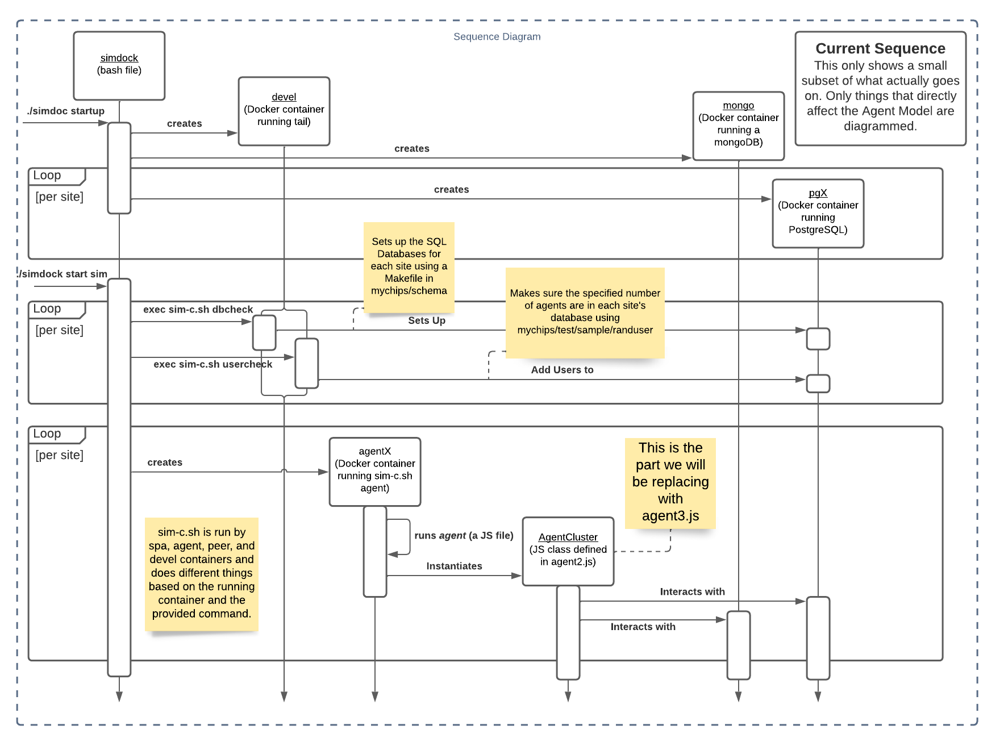

# Model 3 Simulation

The Model 3 simulation extends the basic structure Model 2 was built on and adds key features that result in more realistic spending patterns.

## Primary Changes

- Improve code readability for future developers
  - Update variable names
  - Implement classes that adhere to the Single Responsibility Principle
  - Convert JavaScript to TypeScript (Object Oriented programming allows for more extendibility)

- Collect data from simulation that can later be analyzed
  - Add analytics table to WorldDB that records both server and world information
  - Export to useable files

- Add extendable accounts classes to simulation
    - Future deveopers/interested parties can add different account types to represent real world entities
        - retailers
        - investors
        - consumers
        - manufacturers
        - etc
    - The amount of each account type present in the simulation can be changed in the configuration file

- Add extendable action classes to simulation (these are the actions that accounts will take while the simulation runs)
  - Future developers/interested parties can create actions that accounts will take during the simulation
    - find clients
    - sell merchandise
    - get paycheck
    - give loan
    - etc
  - Actions can be added to various accounts
  - The frequency of occurence for each action is determined by the account class they are assigned to

- Perform credit lifts during simulation run time when criteria are met

## Running the Simulation

<ins>_ Make sure test/sim/local/config.dock has `modversion=3` to run Model 3 _</ins>

To run the simulation you need to follow these steps:
1) Run `npm install` 
2) Export environment variables*
3) Follow steps 4-5 under Developement (below)
    
\*For an in-depth explanation, please see the [setup instructions](/doc/sim-docker.md).

### Large Scale Simulations

Without the ability to scale the simulation to large numbers of users and servers, the simulation is not as useful as it could be. The current solution to run the solution at scale is to use a large container with a web service. Specifically, we have implemented the simuulation on an AWS EC2 instance.
Using the elastic containers allows us to provide massive amounts of memory and disk space for the simulation on an efficient headless server, expanding the scale dramatically.

To do this varies by web service and by the container it is used with. Any distribution of Linux that supports Nodejs, Docker, and MongoDB should be able to run the simulation. We have specifically tested Ubuntu Server and Amazon Linux 2. Spin up an instance (using the LTS version of your prefered distro) and make sure to install Nodejs, Docker, and Mongo with the package manager. Your instance must support Node 16+, Docker 20+, and Mongo 7+. Once you have this done, download or clone the mychips repository, install node packages, and follow the [setup instructions](/doc/sim-docker.md). 

This is an area that needs future development. Simulations on windows and mac containers, memory usage testing, and discovering bounds (number of servers / accounts able to run) of different instances are all in need of development effort.

### Analytics

One of the primary goals of the simulation is to gather analytical data to prove the viability of MyCHIPs in the real world. The simulation exports data to MongoDB throughout execution, but the data must be exported after the simulation is complete. We have created a script that exports the MongoDB data to a local folder in JSON files. 

Run ``./../../lib/model3/exportAnalytics.sh`` after the simulation ends but before running `./simdock shutdown` to export simulation analytics to the `test/sim/local/analytics` directory. (See step 4 under Developement below)
## Development

<ins>_ Do not edit Model 3 JavaScript files directly _</ins>

The simulation Model 3 was developed using TypeScript to allow clear data typing, extendable classes, and inheritance. Changes must be made to the `*.ts` files. Any changed `*.ts` files must be transpiled before execution. 

The easiest way to run steps 2-3 is by running the npm script ``./../../lib/model3/runsim.sh`` (\*see note below). The overall work flow should look something like this:

1. Edit `*.ts` files.
2. Run `npm tsc` before running the simulation.
3. Run `./simdock startup`, `./simdock tickets`, and then `./simdock start sim --runs=50` as outlined [here](/doc/sim-docker.md).
4. (Optional) Run `./../../lib/model3/exportAnalytics.sh` after the simulation ends but before running `./simdock shutdown` to export simulation analytics to the `test/sim/local/analytics` directory.
5. Run `./simdock shutdown` to end the simulation (this stops all simulation docker containers)

\*Instead of running steps 2-3 individually, developers may find it useful to run the `./../../lib/model3/runsim.sh` bash script within the `lib/agent3` directory, which executes these steps in sequence.
## Creating Accounts/Actions

For greater depth and flexibility in the simulation, different types of user accounts can be implemented from the base class to represent various entities in a single simulation. They can represent different kinds of businesses, various consumers, financial entities, or any other type of my chips account that needs to be simulated. The extended classes can be modified to have any data or behavior desired, and can be programmed to interact with eachother as desired (For example, you could have an employee class that will seek employment from business classes within a specific salary range. See example "Employee" and "Retailer" classes in the model 3 code). With the ability to extend the functionality of accounts and actions, contributors, researchers, and potential users can all run the simulation to suit their unique needs.

To add new accounts, implement "account.ts" and place the new account class file in the "/accounts" directory. Typescript will enforce implementation of class methods.

``` 
import Account from '../account'

class NewAccountType implements Account { ...
```
The process to add new actions follows the same pattern: implement "actions.ts" and place the new account class file in the "/actions" directory. Typescript will enforce implementation of class methods.

```
import Actions from '../actions'

class NewAction implements Action { ...
```
Actions are added to accounts by pushing them into the given account's actions collection. Any new actions should be added to the ActionFactory and created using the factory. The code in the account class should look like this:
    ``` this.actions.push(ActionFactory.createAction('FindEmployer', this)) ```


## Prettier & ESLint

This project uses esLint and Prettier to format and check the simulation TypeScript files for syntax errors. Make sure to set up your IDE to use these tools (preferably Prettier formats on each save). To format everything at once, run `npx prettier --write .` . Before committing, make sure to run `npm tsc` to apply style changes to JS files as well.

## Structure Overview

The MyCHIPs project and Model 3 code have a lot of moving pieces that come together to make the simulation work. We wanted to provide a sort of summary of the pieces at play that are crucial for the simulation Model 3.

Details on low-level implementation are provided in the code as Javadoc comments, and this README contains high-level explanations that will help you see how the different pieces fit together. We encourage you to add clear documentation as you develop to mantain continuity during the development process.

Here is a basic description of the flow of data through the simulation:

1. `simdock.sh` takes care of setting up the environment required by the simulation.

   - Starts the local SQL databases (one container per site) and world database (MongoDB)
   - Creates and inserts users into the local SQL databases
   - Runs `sim-c.sh` which starts the simulation by creating one 'model' docker container per site, each running an AccountCluster process (the entrypoint is `test/sim/account` which instantiates the main class in `model3.ts`)

2. Each server (by running AccountCluster) loads the config file parameters, connects to their respective local SQL databases, and connects to the shared Mongo 'World' database.
3. Each server grabs the data for all of its local accounts from the local SQL database and creates an Account object for each account based on parameters pulled from the config file (more information on this in the Configuration section below).
4. Each server iterates through their local accounts and performs allowed actions (such as purchase item, take out a loan, sell a good, etc...). For example, let's say Dave initiates a 'purchase item' action. To do so, he needs to find a new spending target. His account goes through these steps:

   1. Find peer in world DB (Mongo)

   2. Use the peer's CHAD to make a connection (tally) request with SQLManager

4. Once the peers and SQLManager approve the connection, then the peers perform the tally behind the scenes of the simulation.

5. Listeners on the SQL databases' peers or tallies will notify the 'model' container of new change, and the model3 server and its respective accounts react accordingly

### Simulation Sequence UML


[Link to LucidChart](https://lucid.app/lucidchart/01cc31e8-003b-4500-9702-52adfe2f75ba/edit?invitationId=inv_15760f04-75d9-412a-9a84-d63d8f6f8536)

### Model 3 Class UML Diagram


## Configuration

We designed the simulation to be easily configured between runs of the simulation. This is mostly achieved with the paramConfig.yaml file. This file specifies the time to spend on each round of the simulation, how often to run automatic lifts, and the details of the account types that should be included in the simulation. 

The schema for this yaml file is described in the @types/global.d.ts file with the AdjustableSimParams and AdjustableAccountParams interfaces. The only required parameters are the type and percentOfTotal. All other parameters will have default values in the TypeScript that will be filled in when the account object is instantiated. All of the parameters may be provided in paramConfig.yaml however and these values will override any default values set in the account type's constructor. For example, the default BaseAccount type will set a default value of 3 to maxIncomeSources, but if we provided a value of 5 for maxIncomeSources in the paramConfig.yaml, all instantiated default accounts will have 5 as their maxIncomeSources value.

The parameters are pulled into the simulation in the loadParamsConfig() method inside model3.ts. Account objects are then created in the eatAccounts() method in model3.ts. Each account object pulled from the local SQL database is assigned an account type from paramConfig.yaml and an Account object is created of the matching variety and stored.

The method explained above is used because account objects are created and stored in the SQL database by the simdock script before the model simulation is ever started. We recommend that future developers delay the account creation until model3.ts is running to simplify this process. This way, the percentOfTotal parameter can be replaced by numberOfAccounts and the total number of accounts and the number of each type can be controlled completely by the paramConfig.yaml file.

## Debugging Tools

- To query SQL databases, use `./simdock q <int-for-server-num> "<sql-query>"`
  - \*Example: `./test/sim/simdock q 0 "select id, peer_cid from mychips.peers_v"`
- SQL DB field name mappings can be found in the `baseAccounts.ts` getAccount() method
- Relevant PostGres Schemas
  - Users
  - Tally
  - Chit (like a check) (payment of X chips)

## Gotchas

- Before running the simulation for the first time, make sure you ran `npm install` and exported the correct environment variables as indicated in the [setup instructions](/doc/sim-docker.md)
- Currently a user's local id (p100x) is meaningful only on their host server and should not be shared outside the context of their own server.
- If you modify the config before you run ./simdock shutdown, the command will not work correctly. Make sure you only make changes to config.dock after you kill a simulation. (For example, if you change from 10 sites to 4, then run ./simdock shutdown it will only destroy containers and data for the first 4 servers, but will leave all of the others)

## Glossary

CHIP - A unit of digital credit in the MyCHIPs system

Chit - A payment of X amount of CHIPs. Can be thought of similar to writing a check.

[CHIP address](/doc/learn-users.md#chip-addresses) - A chad is the current way of identifying an account. When an account is trying to create a tally, it finds a random chad and makes a tally request to the account associated with that chad.

[Tallies](/doc/learn-tally.md)

- A tally is a contract between two accounts that consists of a stock and foil
  - \*Multiple transactions can happen on a single tally 
  - As you make multiple transactions it results in an increase to the stock/foil amount, rather than an increase in the amount of tallies.
  
Stock - an income source / positive change to your balance
- someone (client) is paying you (vendor)

Foil - a spending target / negative change to your balance

- person (vendor) you (client) are paying

Process of making a payment

- Account (you) finds a vendor (walmart) to give money to. (This represents a loan, gift, payment, etc.)
- Find someone that isn't ourselves that we aren't connected to
- If failed, try again
- If success, check if person exists in our cache, add then add them if not.
- Make payment (taken care of by MyCHIPs engine).
- ID's are different on different servers

## Future Development (TODO's):

- Change SQL schema to allow ent_type to have more that one VARCHAR
- Move usergeneration from ./simdock start sim to Agent Cluster setup code so the simulation model can manage account creation.
- Use async/await and promises instead of callback hell
- Create a version of simdock for large scale simulations that does not open terminals or browser windows
- Get performance data for large scale simulations and discover limitations on memory and disk space.
- Figure out why the touch command can't create files and make sure they are deleted in killsim
- Simulation memory can work sporadically with asynchronous calls in large simulations. We need to look into synchronous container creation.
- Add criteria for credit lifts to the config file to test various lift scenarios
- implement accepting / rejecting tally requests (all are accepted automatically now)
- Ensure that more than one tally can not be created between the same two accounts.
