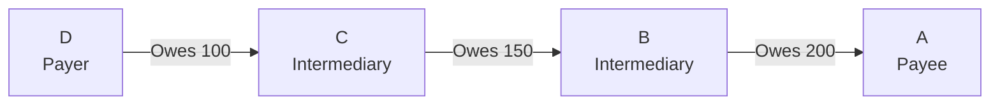
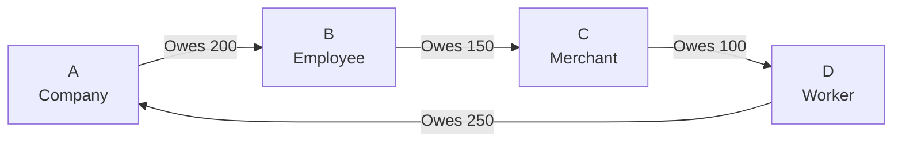
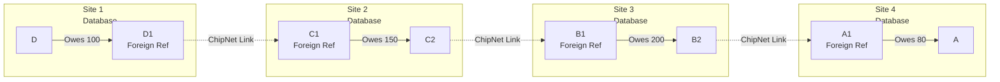
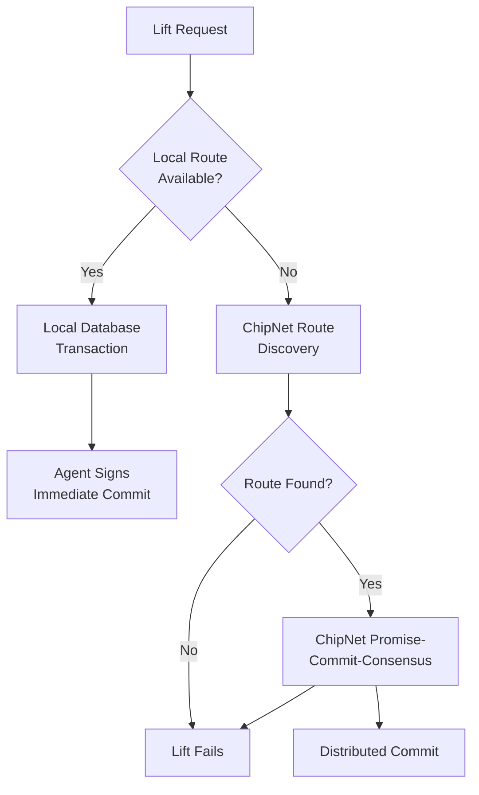

# Byzantine Failure Analysis for MyCHIPs Credit Lifts

## Overview
This workspace is dedicated to analyzing potential Byzantine (malicious/malfunction) attacks on MyCHIPs credit lift transactions. The analysis considers both linear and circular lifts, examining how malicious or malfunctioning nodes might attempt to disrupt the ACID (Atomic, Consistent, Isolated, Durable) properties of lift transactions.

## Core Concepts

### Credit Lift Fundamentals
- A credit lift is a transaction that allows entities to clear mutual credits without requiring actual money transfer
- Credits are non-transferable but transmutable through lifts
- Each node maintains private credit relationships only with direct partners
- Lifts can be either circular (clearing credits) or linear (transmitting value)

### Transaction Properties
1. **Atomic**: All credit transfers in the lift must succeed or none should
2. **Consistent**: No participant should lose value unfairly
3. **Isolated**: Concurrent lifts shouldn't interfere
4. **Durable**: Once committed, changes should persist

### ChipNet Consensus Mechanism
The sophisticated three-phase consensus protocol that enables distributed atomic transactions:

#### Phase 1: Promise (All-or-Nothing Commitment)
- **Originator Validation**: Creates and signs transaction proposal
- **Ring Propagation**: Proposal sent in both directions around participant ring
- **Individual Promises**: Each participant validates terms and adds signature
- **Convergence Detection**: When promises meet, all participants have committed
- **Resource Allocation**: Participants reserve resources for the transaction
- **Timeout Handling**: Participants can add "pre-promise void" if timeout exceeded

#### Phase 2: Commit (Referee Voting)
- **Fully Promised Record**: Complete record sent to all referees
- **Vote Generation**: Referees vote commit/void based on validation rules
- **Majority Requirement**: Configurable majority (>50%) required for consensus
- **Vote Propagation**: Commit votes distributed to all participants
- **Convergence Node**: Node receiving votes from both directions becomes consensus point

#### Phase 3: Consensus (Finalization)
- **Majority Detection**: Nodes recognize when majority reached
- **Resource Release**: Participants commit or rollback based on consensus
- **Record Propagation**: Final consensus record distributed network-wide
- **Durability**: All participants update persistent storage

#### Consensus Properties
- **Byzantine Fault Tolerance**: Handles up to (n-1)/2 malicious referees
- **Network Partition Resilience**: Minority partitions wait for reconnection
- **Timeout Coordination**: Synchronized timeouts prevent indefinite resource locks
- **Cryptographic Integrity**: All messages signed and verified

### Key Roles
- **Participants**: Nodes directly involved in the lift
- **Referees**: Nodes voting on transaction commitment (can include participants)
- **Listeners**: Nodes receiving transaction records
- **Replicas**: Listeners that can recall transactions

## Trading Variables and Lift Control

### Purpose
Trading variables are the fundamental mechanism that determines when, how much, and at what cost lifts occur. These user-configurable parameters drive the autonomous lift algorithm and are critical to understanding Byzantine attack vectors.

### Client (Foil) Trading Variables
- **Lift Target**: Desired accumulation of vendor's credits (default: 0)
  - Negative tally balance indicating value savings
  - Can override vendor's normal credit limit for lift purposes
- **Lift Bound**: Maximum credit exposure allowed (default: tally debit limit)
  - Prevents lifts that would exceed safe indebtedness levels
- **Lift Reward**: Fee structure for lifts beyond target (default: 0)
  - Positive values indicate cost/disincentive (+0.02 = pass 98 chips for 100 received)
  - Negative values indicate payment/incentive (-0.02 = pass 102 chips for 100 received)

### Vendor (Stock) Trading Variables
- **Drop Target**: Desired accumulation of client's credits (default: 0)
- **Drop Bound**: Maximum client indebtedness allowed (default: credit limit)
- **Drop Reward**: Fee for drops beyond target (default: 0)
- **Lift Clutch**: Vendor's fee for allowing lifts through their stock (default: 0)

### Economic Behavior
- **IOU Honoring Rule**: Debts must be honored without charge up to target levels
- **Fee Propagation**: Costs accumulate using formula: `NewRate = PriorRate + MyRate * (1 - PriorRate)`
- **Autonomous Operation**: Trading variables enable system to make lift decisions without user intervention

### Byzantine Implications
- Variables create natural economic barriers to malicious behavior
- Misconfigured variables can enable or amplify certain attacks
- Fee structures provide defense mechanisms against exploitation

## Route Discovery and Network Pathfinding

### ChipNet Distributed Graph Search
MyCHIPs uses sophisticated distributed search algorithms to discover lift pathways without centralized routing tables.

### Discovery Process
1. **Session Initiation**: Originator creates cryptographically random session code
2. **Nonce Generation**: Link identifiers anonymized using SHA-256(linkId + sessionCode)
3. **Breadth-First Search**: Parallel queries across network depths
4. **Time Synchronization**: THIST (Thresholded Histogram Sub-timing) coordinates timing

### Search Types
- **Unidirectional**: Find path from origin to specific target
- **Bidirectional**: Search from both ends simultaneously (future feature)
- **Circular Discovery**: Find complete circuits for credit clearing

### Address Resolution
- **Direct**: Search proceeds to target node itself
- **Indirect**: Discovery by finding nodes that "know" the target
- **Anonymized**: Target provides session ID and anonymizing nonce

### Query Economics
- **Cost Accumulation**: Each node tracks total query cost
- **Fan-out Limitations**: High-cost nodes limited in propagation breadth
- **Incentive Alignment**: Excessive searching accumulates costs against originator

### Byzantine Implications
- **Discovery Attacks**: Malicious nodes can lie about routes or inject false pathways
- **Resource Exhaustion**: Excessive queries can overload network participants
- **Privacy Concerns**: Route discovery potentially leaks network topology

## Lift Capacity and Lading Calculation

### Lading Components
Lading describes a route's capacity to handle lifts of various sizes:

- **min**: Minimum amount liftable for free along the route
- **max**: Maximum amount liftable (possibly at cost)
- **margin**: Combined base fees for any lift amount
- **reward**: Additional fees for lift amounts exceeding min

### Capacity Aggregation
1. **Individual Assessment**: Each tally evaluated against trading variables
2. **Segment Combination**: Linear chains of tallies treated as single unit
3. **Route Compilation**: Multi-site pathways aggregate capacity across segments
4. **Bottleneck Identification**: Route capacity limited by weakest link

### Calculation Process
```
For each tally in segment:
  current_balance = tally.balance
  target_balance = trading_variables.target
  lift_capacity = calculate_capacity(current_balance, target_balance, variables)

segment_capacity = min(individual_capacities)
route_capacity = aggregate(segment_capacities)
```

### Database Views
- **tallies_v_net**: Evaluates individual tally lift capacity
- **tallies_v_paths**: Combines tallies into actionable segments
- **Circular Detection**: Identifies local-only lift opportunities

### Byzantine Implications
- **Capacity Lying**: Nodes may misrepresent their actual lift capacity
- **Selective Availability**: Malicious nodes might offer capacity to some but not others
- **Resource Lock-up**: Fake capacity claims can reserve resources unnecessarily

## Detailed Lift State Machine

### State Progression
```
[draft] → [init] → [seek] → [exec] → [good/void]
     ↓       ↓        ↓        ↓
   [void]  [void]   [void]   [part]
```

### State Definitions
- **draft**: Lift record created, awaiting validation
- **init**: User/system signature validated, ready for discovery
- **seek**: Route discovery in progress via ChipNet
- **exec**: Route found, lift transaction initiated
- **part**: Participating in distributed lift (non-originator)
- **good**: Lift completed successfully with consensus
- **void**: Lift failed or timed out

### Transition Triggers
- **User Action**: Manual payment requests
- **Agent Automation**: Autonomous circular lift detection
- **Network Events**: ChipNet consensus responses
- **Timeout Events**: Predetermined time limits exceeded
- **Validation Results**: Signature and route verification

### Byzantine Attack Points
Each state transition represents potential attack vectors:
- **Draft→Void**: Signature validation attacks
- **Init→Seek**: Route discovery manipulation
- **Seek→Exec**: False route information
- **Exec→Good/Void**: Consensus manipulation

## Implementation Architecture

### Core Components
1. **MyCHIPs Database**: Stores tallies, chits, and lift records
2. **Agent Process**: Makes autonomous lift decisions
3. **ChipNet Library**: Handles distributed consensus
4. **Crypto Components**: ChipCrypt, ChipCode for security

### Lift Types by Scope
- **Local Lifts**: Entirely within single database
  - Uses local database transactions for atomicity
  - Agent signs chits on behalf of users
  - No ChipNet consensus required

- **Distributed Lifts**: Span multiple sites
  - Requires ChipNet promise-commit-consensus protocol
  - Referee nodes vote on transaction validity
  - Complex state synchronization across sites

### Agent Responsibilities
- **Route Evaluation**: Select optimal paths from discovered routes
- **Trading Variable Enforcement**: Ensure lifts comply with user settings
- **Signature Management**: Sign lift chits within authorized parameters
- **State Coordination**: Interface with ChipNet for distributed lifts

### Database Integration
- **Trigger-Driven**: Database changes trigger agent notifications
- **View-Based**: Computed views provide lift capacity analysis
- **Transaction Safety**: Local atomicity for multi-tally segments

### Byzantine Resistance
- **Cryptographic Validation**: All messages cryptographically signed
- **Agent Authorization**: Limited signing authority prevents overreach
- **State Persistence**: Database ensures durable record of decisions

## Mitigation Rating Scale

### Purpose
This scale measures the degree to which each attack vector has been addressed by the current ChipNet/MyCHIPs protocol design. It focuses on effectiveness of existing mitigations rather than potential damage of a successful attack.

### Rating Levels

1. **FULLY MITIGATED**
   - Attack is theoretically possible but completely prevented by protocol design
   - Cryptographic or mathematical proof of prevention exists
   - No known edge cases or vulnerabilities
   - Example: Replay attacks prevented by unique transaction IDs and signatures

2. **EFFECTIVELY MITIGATED**
   - Core attack vector is blocked by protocol design
   - May have edge cases but they don't compromise system integrity
   - Remaining risk is to attackers themselves
   - Example: Deadbeat attack where only the attacker can lose value

3. **SUBSTANTIALLY MITIGATED**
   - Major attack vectors are addressed
   - Some edge cases exist that need monitoring
   - System can detect and recover from attempts
   - Example: Network partition with majority consensus rules

4. **PARTIALLY MITIGATED**
   - Some defenses in place but significant gaps remain
   - System can detect but not always prevent
   - Recovery mechanisms exist but may be manual
   - Example: Selective communication requiring operator intervention

5. **MINIMALLY MITIGATED**
   - Basic defenses only
   - Significant exposure remains
   - Detection may be unreliable
   - Example: Complex timing attacks requiring further research

### Usage Guidelines
Each attack analysis includes:
1. **Origin and Documentation**
   - Direct quotes from MyCHIPs/ChipNet documentation if applicable
   - Reference to distributed systems concepts if hypothesized
   - Reasoning for inclusion in analysis

2. **Mitigation Rating**
   - Status from scale above
   - Primary/secondary defenses
   - Remaining exposures
   - Rating justification

This rating system helps:
- Prioritize which attacks need more analysis
- Track improvement of defenses over time
- Focus research on less mitigated attacks
- Document the reasoning behind each attack's inclusion

## Attack Surface Analysis Framework

### Critical System Components
Understanding the credit lift algorithm reveals key attack surfaces for Byzantine analysis:

#### 1. Trading Variables Layer
**Attack Vectors**:
- **Manipulation**: Compromised agents could modify trading variables
- **Misconfiguration**: Users could unknowingly create exploitable settings
- **Economic Attacks**: Coordinated variable changes to manipulate lift behavior

**Defenses**:
- User signature requirements for variable changes
- Economic incentives align with honest behavior
- Local database protection of variable storage

#### 2. Route Discovery Layer
**Attack Vectors**:
- **False Route Injection**: Malicious nodes claiming non-existent pathways
- **Resource Exhaustion**: Excessive discovery queries consuming network resources
- **Privacy Attacks**: Analysis of discovery patterns revealing network topology
- **Selective Route Hiding**: Nodes concealing available routes from certain participants

**Defenses**:
- Cryptographic nonce anonymization
- Query economic costs limiting abuse
- Distributed validation of route claims
- Multiple discovery path redundancy

#### 3. Capacity Calculation Layer
**Attack Vectors**:
- **Capacity Lying**: Misrepresenting actual lift capacity
- **Lading Manipulation**: False aggregation of multi-hop capacity
- **Selective Availability**: Offering capacity to some participants but not others

**Defenses**:
- Real-time capacity verification during execution
- Economic penalties for false capacity claims
- Multiple route options reducing single-point dependencies

#### 4. State Machine Layer
**Attack Vectors**:
- **State Transition Manipulation**: Forcing invalid state changes
- **Timeout Attacks**: Coordinated delays to cause state timeouts
- **Signature Attacks**: Preventing valid state progression through signature withholding

**Defenses**:
- Cryptographic validation of all state transitions
- Redundant communication paths for state synchronization
- Timeout handling with multiple retry mechanisms

#### 5. Consensus Protocol Layer
**Attack Vectors**:
- **Split Voting**: Referees sending different votes to different participants
- **Selective Communication**: Isolating participants from consensus process
- **Timing Attacks**: Coordinated delays to disrupt consensus formation

**Defenses**:
- Majority voting requirements
- Redundant communication channels
- Synchronized timeout mechanisms
- Cryptographic message integrity

### Integration with Byzantine Attack Categories
This comprehensive understanding enables more precise analysis of attack vectors:

1. **Participant-Level Attacks** now consider trading variable dependencies
2. **Referee-Level Attacks** account for consensus protocol complexities  
3. **Network-Level Attacks** incorporate route discovery vulnerabilities
4. **Implementation-Level Attacks** address state machine and database interactions

### Analysis Methodology Enhancement
Each attack analysis should now consider:
1. **Component Dependencies**: How attacks affect multiple algorithm layers
2. **Economic Incentives**: Whether attacks are economically rational
3. **Implementation Specifics**: Database, agent, and ChipNet integration points
4. **Defense Interactions**: How multiple defense mechanisms interact
5. **Recovery Scenarios**: Specific recovery mechanisms for each component layer

## Social Trust as Defense

### Fundamental Principle
MyCHIPs is designed to operate on existing trust relationships rather than creating new ones. Users are encouraged to establish tallies only with entities they have inherent reasons to trust:
- Employers (regular income sources)
- Vendors (regular trading partners)
- Service providers (ongoing business relationships)
- Community members (established social connections)

### Defense Characteristics
1. **Relationship Requirements**
   - Real-world identity verification
   - Established business/social connections
   - Regular trading patterns
   - Community reputation

2. **Attack Barriers**
   - Time investment for trust building
   - Real value commitment
   - Business presence establishment
   - Trading history development

3. **Social Consequences**
   - Permanent relationship damage
   - Community-wide reputation loss
   - Legal liability exposure
   - Business opportunity costs

### Impact on Attack Analysis
When analyzing attack vectors, consider:
1. **Social Trust Cost**
   - Resources required to establish trust
   - Value locked in relationships
   - Time investment in trading history
   - Business infrastructure needs

2. **Detection Channels**
   - Direct communication paths
   - Community information sharing
   - Real-world identity verification
   - Social pressure mechanisms

3. **Recovery Methods**
   - Existing business relationships
   - Alternative contact methods
   - Legal recourse availability
   - Community support networks

## Reference Scenarios

### Scenario 1: Simple Linear Lift


**Lift Execution**: D wants to pay 50 chips to A
- **Trading Variables**: Each node has target=0, allowing 50 chip reduction
- **Route Discovery**: ChipNet finds D→C→B→A pathway with capacity ≥50
- **Promise Phase**: All nodes conditionally commit to 50 chip transfers
- **Commit Phase**: Referees vote to validate the transaction
- **Result**: Each balance reduced by 50, D effectively pays A

**Byzantine Vulnerabilities**:
- C or B could lie about their capacity or refuse to participate
- Referees could vote inconsistently or selectively communicate
- Network partitions could prevent consensus completion

### Scenario 2: Simple Circular Lift


**Autonomous Clearing**: System detects circular imbalance
- **Capacity Calculation**: min(200,150,100,250) = 100 chips clearable
- **Agent Decision**: Trading variables indicate all parties benefit from 100 chip clearing
- **Local Execution**: If all on same site, uses database atomicity
- **Result**: All balances reduced by 100, eliminating need for external payments

**Byzantine Vulnerabilities**:
- Agents could be compromised to prevent beneficial clearings
- False capacity reporting could reduce clearing efficiency
- Malicious timing could interfere with autonomous detection

### Scenario 3: Multi-Site Distributed Lift


**Complex Distributed Execution**:
- **Route Discovery**: Multi-hop ChipNet search across 4 sites
- **Segment Validation**: Each site validates local tally capacity
- **ChipNet Consensus**: Promise-commit-consensus across all sites
- **Atomic Segments**: Each site commits its local segment atomically
- **Failure Recovery**: Complex rollback if any site fails to commit

**Byzantine Vulnerabilities**:
- **Split-brain**: Sites could reach different consensus decisions
- **Selective Communication**: Malicious sites could isolate others
- **Resource Exhaustion**: False routes could consume search resources
- **Timing Attacks**: Coordinated delays could cause timeouts

### Scenario 4: Local vs Distributed Decision Points


**Decision Complexity**:
- **Route Preference**: Local routes preferred for speed and reliability
- **Discovery Overhead**: Distributed discovery has significant cost
- **Failure Modes**: More failure points in distributed execution
- **Attack Surface**: Local lifts have minimal attack surface vs distributed lifts

## Byzantine Attack Vectors

### Participant-Level Attacks
1. [**Deadbeat Attack**](attacks/deadbeat.md): Node disappears between promise and commit phases
2. [**Double-Commit Attack**](attacks/double-commit.md): Node attempts to use same credits in parallel lifts
3. [**Signature Withholding**](attacks/signature-withholding.md): Node refuses to propagate final signatures
4. [**False Promise Attack**](attacks/false-promise.md): Node makes promises it can't fulfill

### Referee-Level Attacks
1. [**Split Vote Attack**](attacks/split-vote.md): Referee sends different votes to different participants
2. [**Delayed Vote Attack**](attacks/delayed-vote.md): Referee intentionally delays voting to cause timeouts
3. [**Selective Communication**](attacks/selective-communication.md): Referee communicates only with subset of nodes

### Network-Level Attacks
1. [**Network Partition**](attacks/network-partition.md): Communication breaks between subsets of nodes
2. [**Message Tampering**](attacks/message-tampering.md): Modification of messages between nodes
3. [**Replay Attacks**](attacks/replay-attacks.md): Reuse of old transaction messages

## Defense Mechanisms

### ChipNet Protections
1. **Majority Consensus**: Requires majority of referees to agree
2. **Timeout Handling**: Defined behavior for non-responsive nodes
3. **Signature Verification**: Cryptographic validation of all messages
4. **Reputation System**: Track and respond to node behavior

### Transaction Safety
1. **Conditional Commitments**: Signed promises before execution
2. **Two-Way Propagation**: Messages flow both upstream and downstream
3. **Direct Referee Contact**: Backup communication path for signatures
4. **Compensating Transactions**: Recovery mechanisms for partial failures

## Analysis Framework
For each attack scenario, we analyze:
1. **Attack Vector**: How the attack is executed
2. **Impact**: Potential damage to system/participants
3. **Detection**: How to identify the attack
4. **Mitigation**: Existing and potential countermeasures
5. **Recovery**: Steps to restore system consistency

## References
- MyCHIPs Credit Lift Documentation
- ChipNet Cluster Protocol
- Byzantine Fault Tolerance Literature 