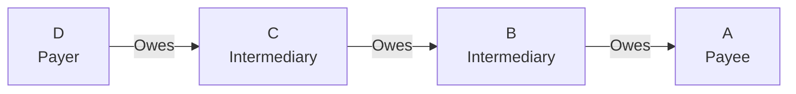
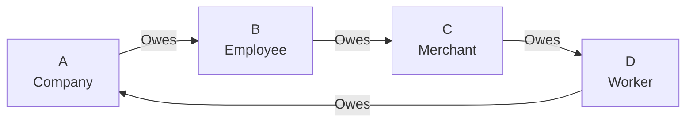
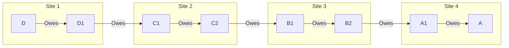

# Byzantine Failure Analysis for MyCHIPs Credit Lifts

## Overview
This workspace is dedicated to analyzing potential Byzantine (malicious/malfunction) attacks on MyCHIPs credit lift transactions. The analysis considers both linear and circular lifts, examining how malicious or malfunctioning nodes might attempt to disrupt the ACID (Atomic, Consistent, Isolated, Durable) properties of lift transactions.

## Core Concepts

### Credit Lift Fundamentals
- A credit lift is a transaction that allows entities to clear mutual credits without requiring actual money transfer
- Credits are non-transferable but transmutable through lifts
- Each node maintains private credit relationships only with direct partners
- Lifts can be either circular (clearing credits) or linear (transmitting value)

### Transaction Properties
1. **Atomic**: All credit transfers in the lift must succeed or none should
2. **Consistent**: No participant should lose value unfairly
3. **Isolated**: Concurrent lifts shouldn't interfere
4. **Durable**: Once committed, changes should persist

### ChipNet Consensus Mechanism
1. **Promise Phase**: All participants sign conditional commitments
2. **Commit Phase**: Referees vote on transaction validity
3. **Consensus Phase**: Majority decision propagates to all nodes

### Key Roles
- **Participants**: Nodes directly involved in the lift
- **Referees**: Nodes voting on transaction commitment (can include participants)
- **Listeners**: Nodes receiving transaction records
- **Replicas**: Listeners that can recall transactions

## Mitigation Rating Scale

### Purpose
This scale measures the degree to which each attack vector has been addressed by the current ChipNet/MyCHIPs protocol design. It focuses on effectiveness of existing mitigations rather than potential damage of a successful attack.

### Rating Levels

1. **FULLY MITIGATED**
   - Attack is theoretically possible but completely prevented by protocol design
   - Cryptographic or mathematical proof of prevention exists
   - No known edge cases or vulnerabilities
   - Example: Replay attacks prevented by unique transaction IDs and signatures

2. **EFFECTIVELY MITIGATED**
   - Core attack vector is blocked by protocol design
   - May have edge cases but they don't compromise system integrity
   - Remaining risk is to attackers themselves
   - Example: Deadbeat attack where only the attacker can lose value

3. **SUBSTANTIALLY MITIGATED**
   - Major attack vectors are addressed
   - Some edge cases exist that need monitoring
   - System can detect and recover from attempts
   - Example: Network partition with majority consensus rules

4. **PARTIALLY MITIGATED**
   - Some defenses in place but significant gaps remain
   - System can detect but not always prevent
   - Recovery mechanisms exist but may be manual
   - Example: Selective communication requiring operator intervention

5. **MINIMALLY MITIGATED**
   - Basic defenses only
   - Significant exposure remains
   - Detection may be unreliable
   - Example: Complex timing attacks requiring further research

### Usage Guidelines
Each attack analysis includes:
1. **Origin and Documentation**
   - Direct quotes from MyCHIPs/ChipNet documentation if applicable
   - Reference to distributed systems concepts if hypothesized
   - Reasoning for inclusion in analysis

2. **Mitigation Rating**
   - Status from scale above
   - Primary/secondary defenses
   - Remaining exposures
   - Rating justification

This rating system helps:
- Prioritize which attacks need more analysis
- Track improvement of defenses over time
- Focus research on less mitigated attacks
- Document the reasoning behind each attack's inclusion

## Social Trust as Defense

### Fundamental Principle
MyCHIPs is designed to operate on existing trust relationships rather than creating new ones. Users are encouraged to establish tallies only with entities they have inherent reasons to trust:
- Employers (regular income sources)
- Vendors (regular trading partners)
- Service providers (ongoing business relationships)
- Community members (established social connections)

### Defense Characteristics
1. **Relationship Requirements**
   - Real-world identity verification
   - Established business/social connections
   - Regular trading patterns
   - Community reputation

2. **Attack Barriers**
   - Time investment for trust building
   - Real value commitment
   - Business presence establishment
   - Trading history development

3. **Social Consequences**
   - Permanent relationship damage
   - Community-wide reputation loss
   - Legal liability exposure
   - Business opportunity costs

### Impact on Attack Analysis
When analyzing attack vectors, consider:
1. **Social Trust Cost**
   - Resources required to establish trust
   - Value locked in relationships
   - Time investment in trading history
   - Business infrastructure needs

2. **Detection Channels**
   - Direct communication paths
   - Community information sharing
   - Real-world identity verification
   - Social pressure mechanisms

3. **Recovery Methods**
   - Existing business relationships
   - Alternative contact methods
   - Legal recourse availability
   - Community support networks

## Reference Scenarios

### Scenario 1: Simple Linear Lift

In this scenario:
- D wants to pay A through intermediaries C and B
- Arrows show direction of existing credit obligations
- Lift moves value upstream (against arrows)
- Each node has direct credit relationship only with neighbors

### Scenario 2: Simple Circular Lift

In this scenario:
- Each entity has accumulated credits from upstream partner
- Lift clears credits in a complete circuit
- All participants potentially benefit from credit clearing
- Arrows show normal payment/credit flow direction

### Scenario 3: Multi-Site Linear Lift

In this scenario:
- Multiple sites host different segments of the lift
- Each site has limited knowledge of the total network
- Inter-site communication required for lift completion
- Shows realistic distributed system challenges

## Byzantine Attack Vectors

### Participant-Level Attacks
1. [**Deadbeat Attack**](attacks/deadbeat.md): Node disappears between promise and commit phases
2. [**Double-Commit Attack**](attacks/double-commit.md): Node attempts to use same credits in parallel lifts
3. [**Signature Withholding**](attacks/signature-withholding.md): Node refuses to propagate final signatures
4. [**False Promise Attack**](attacks/false-promise.md): Node makes promises it can't fulfill

### Referee-Level Attacks
1. [**Split Vote Attack**](attacks/split-vote.md): Referee sends different votes to different participants
2. [**Delayed Vote Attack**](attacks/delayed-vote.md): Referee intentionally delays voting to cause timeouts
3. [**Selective Communication**](attacks/selective-communication.md): Referee communicates only with subset of nodes

### Network-Level Attacks
1. [**Network Partition**](attacks/network-partition.md): Communication breaks between subsets of nodes
2. [**Message Tampering**](attacks/message-tampering.md): Modification of messages between nodes
3. [**Replay Attacks**](attacks/replay-attacks.md): Reuse of old transaction messages

## Defense Mechanisms

### ChipNet Protections
1. **Majority Consensus**: Requires majority of referees to agree
2. **Timeout Handling**: Defined behavior for non-responsive nodes
3. **Signature Verification**: Cryptographic validation of all messages
4. **Reputation System**: Track and respond to node behavior

### Transaction Safety
1. **Conditional Commitments**: Signed promises before execution
2. **Two-Way Propagation**: Messages flow both upstream and downstream
3. **Direct Referee Contact**: Backup communication path for signatures
4. **Compensating Transactions**: Recovery mechanisms for partial failures

## Analysis Framework
For each attack scenario, we analyze:
1. **Attack Vector**: How the attack is executed
2. **Impact**: Potential damage to system/participants
3. **Detection**: How to identify the attack
4. **Mitigation**: Existing and potential countermeasures
5. **Recovery**: Steps to restore system consistency

## References
- MyCHIPs Credit Lift Documentation
- ChipNet Cluster Protocol
- Byzantine Fault Tolerance Literature 