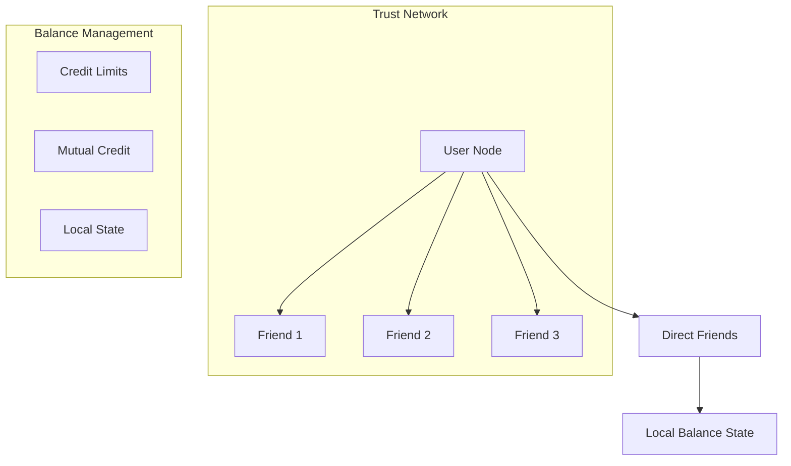

# Offset Credit Analysis

## Core Architecture



## Key Design Principles

1. **Local Trust Model**:
   - No global consensus required
   - Direct relationships only
   - User-defined credit limits
   - Trust-based security

2. **Balance Structure**:
   - Always sums to zero between pairs
   - Local state maintenance
   - No global ledger
   - Atomic transactions

## Comparison with MyCHIPs

### Similarities

1. **Trust Foundation**:
   - Both rely on real relationships
   - Both use credit limits
   - Both avoid global consensus
   - Both have local state

2. **Money Creation**:
   - Created through mutual credit
   - Automatically adjusts to market
   - No mining or central issuance
   - Natural market scaling

### Key Differences

1. **Network Structure**:
   ```mermaid
   graph TD
       subgraph "Offset"
           A1[User] --> B1[Friend]
           B1 --> C1[Direct Only]
       end
       
       subgraph "MyCHIPs"
           A2[User] --> B2[Partner]
           B2 --> C2[Lift Path]
           C2 --> D2[Extended Network]
       end
   ```

2. **Transaction Scope**:
   - **Offset**: Direct friends only
   - **MyCHIPs**: Network-wide lifts
   - **Impact**: Different scaling properties

## Distributed Properties

### Strengths

1. **Local Operations**:
   - Fully distributed state
   - No central authority
   - Direct peer connections
   - Fast transactions

2. **Trust Model**:
   - Real-world relationships
   - User-defined limits
   - Natural Sybil resistance
   - Social enforcement

### Limitations

1. **Network Reach**:
   ```mermaid
   graph TD
       A[Transaction Needs] --> B{Direct Friend?}
       B -->|Yes| C[Direct Payment]
       B -->|No| D[Cannot Transact]
       
       E[MyCHIPs Alternative] --> F{Direct Partner?}
       F -->|Yes| G[Direct Payment]
       F -->|No| H[Find Lift Path]
   ```

2. **Scalability Issues**:
   - Limited to direct relationships
   - No transitive credit
   - Network growth challenges
   - Liquidity constraints

## Byzantine Fault Tolerance

### Security Model

1. **Trust-Based Protection**:
   - Credit limits contain risk
   - Social relationship value
   - Real-world accountability
   - Local damage limitation

2. **Attack Resistance**:
   ```mermaid
   graph TD
       A[Attack Vector] --> B[Limited Scope]
       B --> C[Credit Limit]
       C --> D[Social Cost]
       D --> E[Natural Defense]
   ```

### Failure Modes

1. **Network Partitions**:
   - Only affects direct links
   - Local state consistency
   - No global impact
   - Simple recovery

2. **Byzantine Behavior**:
   - Limited to direct relationships
   - Credit limits bound damage
   - Social consequences
   - Natural deterrence

## Implementation Insights

### Valuable Features

1. **Simplicity**:
   - No global consensus
   - Simple state management
   - Clear trust boundaries
   - Easy implementation

2. **Privacy**:
   - Local information only
   - No global visibility
   - Direct relationship privacy
   - Natural compartmentalization

### Limitations

1. **Transaction Range**:
   - Direct friends only
   - No extended network
   - Limited utility
   - Network growth needed

2. **Economic Impact**:
   - Limited market reach
   - Liquidity constraints
   - Growth challenges
   - Network effect issues

## Implications for MyCHIPs

### Validation Points

1. **Trust Model**:
   - Confirms social trust value
   - Validates credit limits
   - Supports local state
   - Endorses relationship focus

2. **Distributed Design**:
   - Supports no-consensus approach
   - Validates local state model
   - Confirms atomic transactions
   - Endorses trust boundaries

### Enhancement Ideas

1. **Simplification**:
   - Could simplify some paths
   - Local-first operations
   - Clear boundaries
   - Trust emphasis

2. **Privacy**:
   - Natural compartments
   - Information locality
   - Relationship privacy
   - State isolation

## Conclusions

### Key Insights

1. **Architecture**:
   - Simpler but more limited than MyCHIPs
   - Validates core trust principles
   - Shows value of local state
   - Demonstrates natural defenses

2. **Trade-offs**:
   - Simplicity vs reach
   - Privacy vs utility
   - Local control vs network effect
   - Direct trust vs extended trust

### Final Assessment

Offset Credit provides a simpler but more limited approach compared to MyCHIPs. While it validates many of MyCHIPs' core principles around trust and local state, its limitation to direct relationships makes it less practical for widespread adoption. However, its implementation of these principles offers valuable insights for potential simplification and privacy enhancements in MyCHIPs.

The key difference is that MyCHIPs extends trust transitively through lift paths while maintaining similar security properties, whereas Offset stays strictly local but sacrifices broader network utility. This suggests MyCHIPs has found a good balance between the simplicity of direct trust and the utility of extended network reach. 