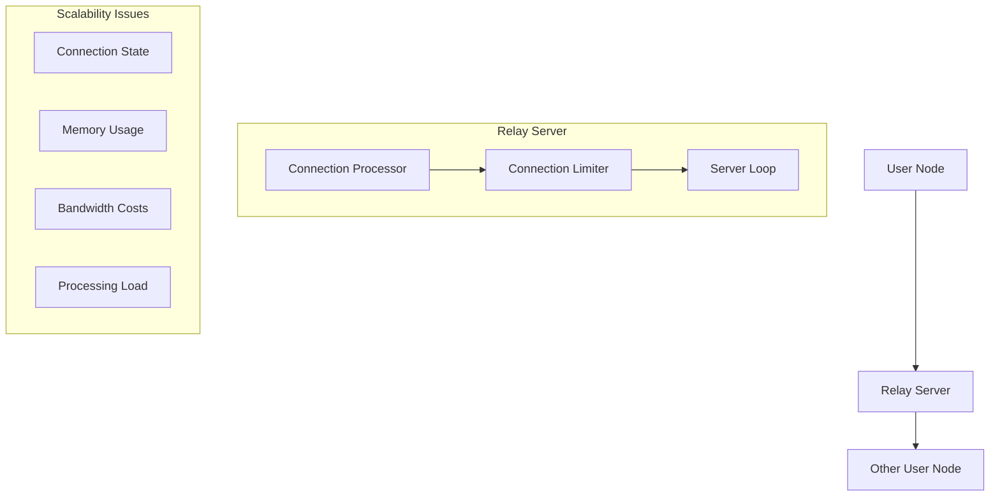

# Offset Relay Server Analysis

## Architecture Overview



## Scalability Analysis

### Technical Limitations

1. **Connection Management**:
   - Each relay maintains active connections
   - Memory usage scales with connections
   - Processing overhead per connection
   - Limited by server resources

2. **Bandwidth Requirements**:
   - Must relay all messages
   - Grows linearly with users
   - No message aggregation
   - Full duplex connections

3. **State Overhead**:
   ```mermaid
   graph TD
       A[Per Connection] --> B[Memory]
       A --> C[Processing]
       A --> D[Network Sockets]
       
       E[Total Load] --> F[O(n) Scaling]
       F --> G[Resource Limits]
   ```

### World Scale Challenges

1. **Resource Constraints**:
   - Not horizontally scalable
   - Single server bottlenecks
   - Growing resource needs
   - No load distribution

2. **Network Topology**:
   - Point-to-point relay
   - No message routing
   - Direct connection required
   - Geographic limitations

## Incentive Structure

### Current Model

1. **No Built-in Incentives**:
   - Volunteer operation
   - No compensation mechanism
   - Pure cost to operator
   - No economic model

2. **Operating Costs**:
   - Server infrastructure
   - Bandwidth costs
   - Maintenance overhead
   - Administrative time

### Missing Elements

1. **Economic Sustainability**:
   ```mermaid
   graph TD
       A[Costs] --> B[Server Hardware]
       A --> C[Bandwidth]
       A --> D[Administration]
       
       E[Revenue] --> F[None]
       
       G[Sustainability] --> H[Not Viable]
   ```

2. **Growth Barriers**:
   - No operator incentives
   - Growing costs
   - No revenue model
   - Limited adoption

## System Dependencies

### Relay Dependency Analysis

1. **Current Requirements**:
   - Required for non-direct connections
   - Essential for network operation
   - No built-in alternatives
   - Critical infrastructure

2. **Operational Impact**:
   ```mermaid
   graph TD
       A[No Relay] --> B[Direct Only]
       B --> C[Limited Reach]
       C --> D[Reduced Utility]
   ```

### Alternative Possibilities

1. **Direct Connections**:
   - Possible between friends
   - Requires public IP/ports
   - NAT traversal issues
   - Limited applicability

2. **Missing Features**:
   - No P2P discovery
   - No NAT piercing
   - No alternate routing
   - No fallback mechanism

## Critical Issues

### Scalability Problems

1. **Resource Scaling**:
   - Linear with users
   - No sharding possible
   - Growing costs
   - Performance limits

2. **Network Effects**:
   - Centralization pressure
   - Single points of failure
   - Geographic constraints
   - Reliability concerns

### Incentive Problems

1. **Economic Viability**:
   - No sustainable model
   - Growing cost burden
   - No value capture
   - Limited operators

2. **Network Growth**:
   - Restricted by resources
   - Limited by volunteers
   - No expansion model
   - Adoption barriers

## Implications

### System Viability

1. **Current State**:
   - Not world-scale viable
   - Missing economic model
   - Critical dependencies
   - Structural limitations

2. **Required Changes**:
   - Economic incentives needed
   - Alternative routing required
   - P2P capabilities
   - Resource scaling

### Architectural Needs

1. **Technical Requirements**:
   ```mermaid
   graph TD
       A[Scalability] --> B[P2P Routing]
       A --> C[Resource Distribution]
       A --> D[Load Balancing]
       
       E[Sustainability] --> F[Economic Model]
       E --> G[Incentive Structure]
       E --> H[Value Capture]
   ```

2. **Design Changes**:
   - P2P message routing
   - Economic incentives
   - Resource distribution
   - Alternative paths

## Conclusions

### Current Status
The relay server architecture in Offset has fundamental limitations that make it unsuitable for world-scale deployment:
1. No built-in scaling mechanisms
2. Missing economic incentives
3. Critical infrastructure dependency
4. Resource concentration issues

### Required Evolution
To achieve world-scale viability, Offset needs:
1. A sustainable economic model for infrastructure operators
2. P2P routing capabilities
3. Resource distribution mechanisms
4. Alternative communication paths

The system cannot operate effectively without relay servers under the current design, and the lack of incentives for operating them creates a significant barrier to adoption and scaling. This represents a critical architectural limitation that would need to be addressed for real-world deployment. 