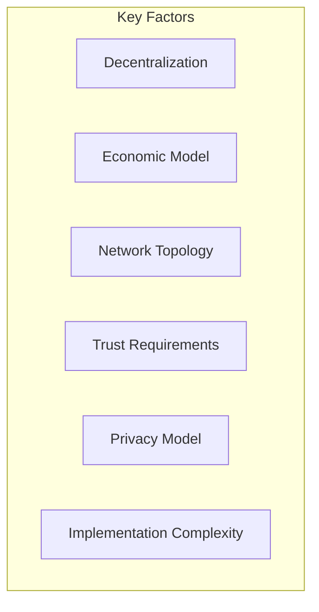
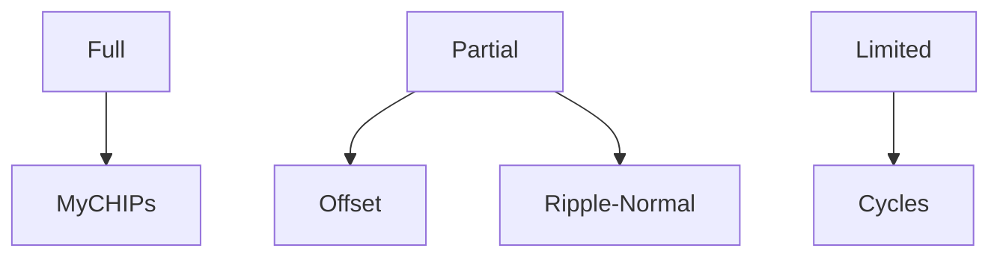
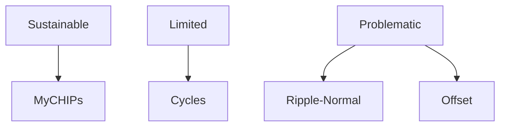
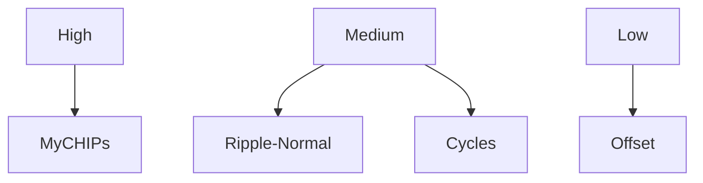
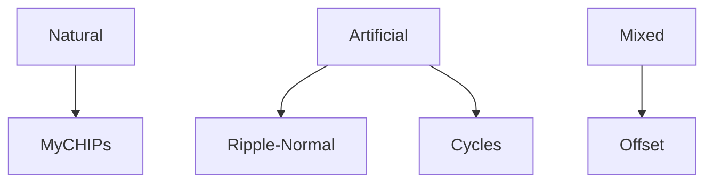
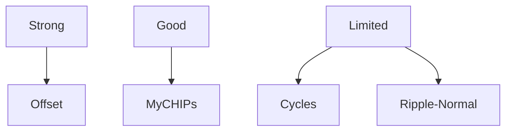
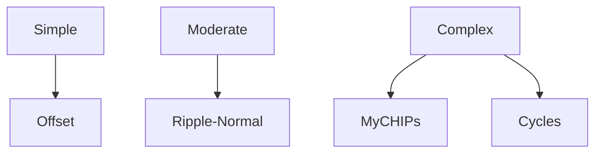

# Credit Clearing System Comparison

## Systems Analyzed

1. **MyCHIPs/ChipNet**
   - Distributed credit clearing with lift paths
   - Contract-based security
   - Social trust foundation
   - Network-wide transactions

2. **Ripple-Normal**
   - Penalty-based clearing
   - Algorithmic incentives
   - Recursive security model
   - Global transaction scope

3. **Offset Credit**
   - Direct friend-to-friend clearing
   - Local-only transactions
   - Strong privacy model
   - Relay-based networking

4. **Cycles Protocol**
   - Graph-based optimization
   - Global clearing efficiency
   - Centralized solver
   - Privacy-preserving computation

## Comparative Analysis

### Global Scalability Factors

### Rating Matrix
Scale: 1 (Poor) to 5 (Excellent)

| Factor | MyCHIPs | Ripple-Normal | Offset | Cycles |
|--------|---------|---------------|---------|---------|
| Decentralization | 5 | 3 | 4 | 2 |
| Economic Viability | 4 | 2 | 1 | 3 |
| Network Scalability | 4 | 3 | 2 | 3 |
| Trust Model Practicality | 5 | 2 | 3 | 2 |
| Privacy Protection | 4 | 2 | 5 | 3 |
| Implementation Feasibility | 3 | 4 | 5 | 2 |
| Byzantine Fault Tolerance | 5 | 2 | 4 | 2 |
| Global Reach Potential | 4 | 3 | 2 | 3 |
| **Overall Score** | **4.25** | **2.63** | **3.25** | **2.50** |

### Detailed Analysis

#### 1. Decentralization

- **MyCHIPs**: Fully distributed, no central authorities
- **Offset**: Distributed but relies on relay servers
- **Ripple-Normal**: Partially distributed with central elements
- **Cycles**: Centralized solver required

#### 2. Economic Viability

- **MyCHIPs**: Built-in incentives and value capture
- **Cycles**: Possible but complex incentive structure
- **Ripple-Normal**: Recursive penalty issues
- **Offset**: No infrastructure incentives

#### 3. Network Scalability

- **MyCHIPs**: Efficient lift paths and local consensus
- **Ripple-Normal**: Global but manageable scaling
- **Cycles**: Limited by central solver
- **Offset**: Limited by relay infrastructure

#### 4. Trust Model Practicality

- **MyCHIPs**: Leverages existing relationships
- **Offset**: Direct friend model but limited reach
- **Ripple-Normal**: Complex penalty system
- **Cycles**: Technical trust requirements

#### 5. Privacy Protection

- **Offset**: Complete transaction privacy
- **MyCHIPs**: Good balance of privacy and reach
- **Cycles**: Privacy-preserving but central solver
- **Ripple-Normal**: Limited privacy considerations

#### 6. Implementation Feasibility

- **Offset**: Straightforward friend-to-friend model
- **Ripple-Normal**: Moderate complexity
- **MyCHIPs**: Complex but manageable
- **Cycles**: Sophisticated solver requirements

## System-Specific Strengths

### MyCHIPs
1. **Core Strengths**:
   - Natural trust model
   - Efficient lift paths
   - Strong fault tolerance
   - Sustainable economics

2. **Key Innovations**:
   - Contract-based security
   - Social trust leverage
   - Distributed consensus
   - Transitive credit

### Ripple-Normal
1. **Core Strengths**:
   - Simple implementation
   - Clear incentives
   - Global reach
   - Direct penalties

2. **Key Innovations**:
   - Penalty-based compliance
   - Automatic enforcement
   - Economic incentives
   - Global settlement

### Offset
1. **Core Strengths**:
   - Strong privacy
   - Simple model
   - Direct relationships
   - Clear boundaries

2. **Key Innovations**:
   - Hash lock atomicity
   - Friend-to-friend model
   - Complete privacy
   - Local verification

### Cycles
1. **Core Strengths**:
   - Optimal clearing
   - Global efficiency
   - Multiple assets
   - Privacy tech

2. **Key Innovations**:
   - Graph optimization
   - Multi-asset support
   - Privacy preservation
   - Efficient clearing

## Conclusions

### Overall Assessment
1. **MyCHIPs** emerges as the most balanced and practical system for global-scale credit clearing, with:
   - Strong decentralization
   - Practical trust model
   - Good scalability
   - Sustainable economics

2. **Offset** shows excellent privacy and simplicity but faces scaling limitations:
   - Perfect for local communities
   - Limited global reach
   - Infrastructure challenges
   - Missing incentives

3. **Ripple-Normal** offers interesting ideas but has fundamental issues:
   - Recursive security problem
   - Complex penalties
   - Limited privacy
   - Artificial incentives

4. **Cycles** provides valuable optimization insights but is too centralized:
   - Not truly distributed
   - Central solver dependency
   - Complex implementation
   - Limited fault tolerance

### Future Directions
The ideal system might combine:
1. MyCHIPs' trust model and economics
2. Offset's privacy mechanisms
3. Cycles' optimization techniques
4. Improved network scaling solutions 