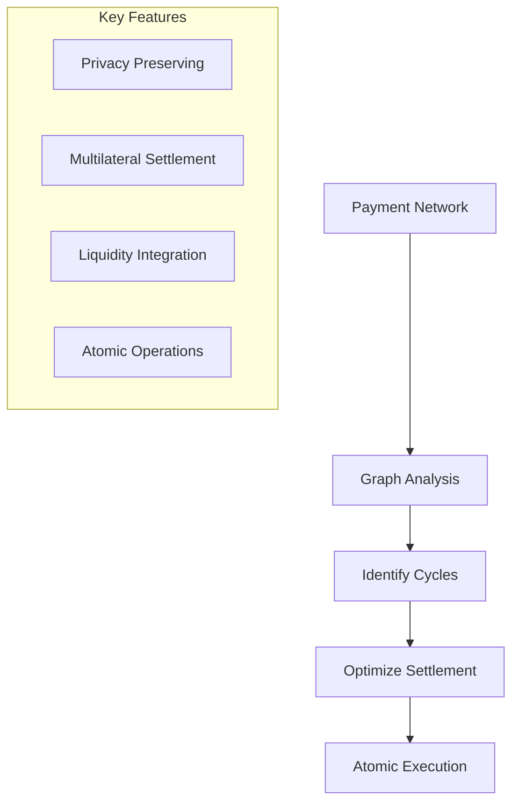

# Cycles Protocol Analysis

## Overview
The Cycles protocol ([Cycles Whitepaper, 2024](https://cycles.money/whitepaper.pdf)) presents a novel approach to distributed credit clearing that focuses on optimizing multilateral settlements through graph analysis. Unlike MyCHIPs and Ripple-Normal, Cycles emphasizes finding and executing optimal clearing paths across the entire network.

## Key Innovations

### Graph-Based Optimization


1. **Network Structure Focus**:
   - Treats payment obligations as a graph
   - Identifies cyclic settlement opportunities
   - Optimizes for maximum debt reduction
   - Minimizes liquidity requirements

2. **Privacy Architecture**:
   - Privacy-preserving debt pooling
   - Secure preference sharing
   - Protected settlement execution
   - Confidential optimization

## Comparison with MyCHIPs/ChipNet

### Architectural Differences

1. **Settlement Approach**:
   - **Cycles**: Global optimization across network
   - **MyCHIPs**: Local lift paths with consensus
   - **Impact**: Different scaling characteristics

2. **Trust Model**:
   - **Cycles**: Privacy-tech based trust
   - **MyCHIPs**: Social/contract based trust
   - **Impact**: Different security assumptions

### Unique Contributions

1. **Graph Optimization**:
   ```mermaid
   graph TD
       A[Network State] --> B[Graph Analysis]
       B --> C[Identify Optimal Paths]
       C --> D[Minimize Liquidity]
       D --> E[Atomic Settlement]
       
       subgraph "Benefits"
           F[Maximum Clearing]
           G[Minimum Money Used]
           H[Network Efficiency]
       end
   ```

2. **Liquidity Integration**:
   - Multiple asset types
   - Stablecoin support
   - Lending protocol integration
   - Diverse liquidity sources

## New Insights for MyCHIPs

### Potential Enhancements

1. **Graph Analysis**:
   - Could enhance lift path selection
   - Optimize for network efficiency
   - Reduce liquidity requirements
   - Improve clearing rates

2. **Privacy Technology**:
   - Could complement social trust
   - Enhance confidentiality
   - Protect sensitive data
   - Maintain accountability

### Implementation Considerations

1. **Technical Requirements**:
   ```mermaid
   graph TD
       A[Graph Analysis] --> B[Performance Impact]
       A --> C[Scalability Concerns]
       A --> D[Privacy Overhead]
       
       B --> E[Implementation Trade-offs]
       C --> E
       D --> E
   ```

2. **Integration Challenges**:
   - Complex optimization logic
   - Privacy tech requirements
   - Performance considerations
   - Network coordination

## Comparative Analysis

### Strengths and Weaknesses

1. **Cycles Protocol**:
   - **Strengths**:
     - Global optimization
     - Privacy preservation
     - Liquidity efficiency
     - Multiple assets
   - **Weaknesses**:
     - Complex implementation
     - Coordination overhead
     - Technical dependencies
     - Privacy tech risks

2. **MyCHIPs/ChipNet**:
   - **Strengths**:
     - Social trust foundation
     - Contract enforcement
     - Simple implementation
     - Natural incentives
   - **Weaknesses**:
     - Local optimization only
     - Limited asset types
     - Trust requirements
     - Privacy concerns

### Synthesis Opportunities

1. **Technical Integration**:
   - Graph analysis for lift paths
   - Privacy enhancements
   - Asset integration
   - Optimization tools

2. **Conceptual Merger**:
   - Social trust + privacy tech
   - Local + global optimization
   - Contract + technical enforcement
   - Multiple clearing approaches

## Practical Impact

### Implementation Considerations

1. **Resource Requirements**:
   - Graph analysis compute
   - Privacy infrastructure
   - Network coordination
   - Asset integration

2. **Operational Overhead**:
   - Complex algorithms
   - Privacy mechanisms
   - Multiple assets
   - Network management

### Real-World Applications

1. **Trade Credit Networks**:
   - Invoice clearing
   - Supply chain finance
   - Working capital optimization
   - Payment efficiency

2. **Community Networks**:
   - Local trading systems
   - Business networks
   - Credit circles
   - Payment communities

## Conclusions

### Key Takeaways

1. **Complementary Approaches**:
   - Different optimization strategies
   - Distinct trust models
   - Various technical requirements
   - Multiple implementation paths

2. **Integration Potential**:
   - Graph analysis benefits
   - Privacy enhancements
   - Asset flexibility
   - Optimization improvements

### Future Directions

1. **Research Areas**:
   - Graph optimization in ChipNet
   - Privacy technology integration
   - Asset type expansion
   - Hybrid trust models

2. **Development Paths**:
   - Technical prototypes
   - Integration experiments
   - Performance testing
   - Security analysis

## Unique Contributions
The Cycles protocol offers several insights not previously considered in our analysis:

1. **Graph-Based Optimization**:
   - Global network analysis
   - Cyclic settlement identification
   - Liquidity minimization
   - Efficiency maximization

2. **Privacy Architecture**:
   - Technical trust model
   - Confidential clearing
   - Protected preferences
   - Secure execution

3. **Asset Integration**:
   - Multiple asset types
   - Stablecoin support
   - Lending protocols
   - Diverse liquidity

These contributions suggest potential enhancements to MyCHIPs while validating its core design choices around social trust and contract-based enforcement. 