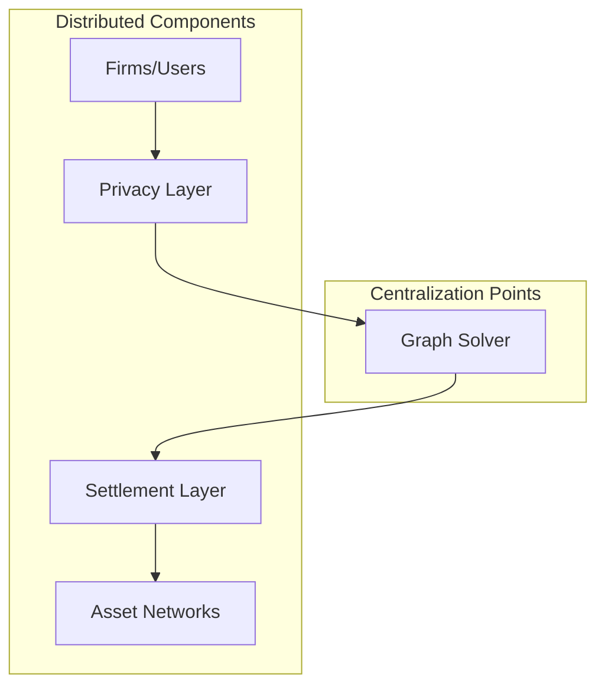
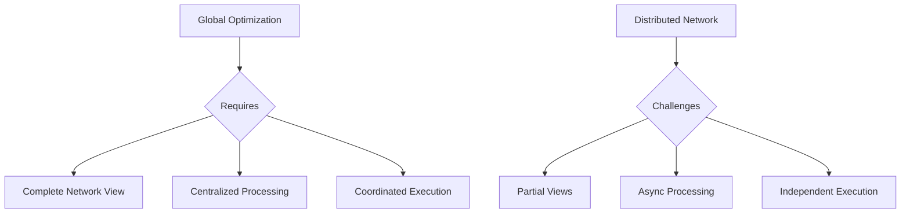
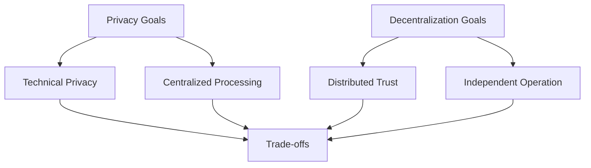

# Cycles Protocol: Centralization Analysis

## Architecture Overview



## Key Findings

1. **Centralization Requirements**
   - Graph solver appears to be centralized
   - Global optimization needs complete network view
   - Single point for cycle detection
   - Coordinated settlement execution

2. **Distributed Aspects**
   - Privacy layer can be distributed
   - Settlement execution can use multiple networks
   - Asset integration is decentralized
   - User participation is distributed

## Core Challenge

The protocol faces a fundamental tension:



## Comparison with MyCHIPs

### Architectural Differences

1. **MyCHIPs/ChipNet**:
   - Fully distributed design
   - Local decision making
   - Independent lift paths
   - No central coordination
   - Byzantine fault tolerant

2. **Cycles**:
   - Centralized optimization
   - Global decision making
   - Coordinated settlements
   - Central graph solver
   - Privacy-focused but centralized

## Distributed System Challenges Not Addressed

1. **Network Partitions**
   - No clear handling of network splits
   - Relies on central solver availability
   - No partition recovery mechanism
   - Global coordination required

2. **Byzantine Behavior**
   - Limited discussion of malicious nodes
   - Assumes trusted central components
   - No consensus mechanism detailed
   - Unclear fault tolerance

3. **Asynchronous Operation**
   - Requires synchronous optimization
   - Global state coordination
   - Time-bound execution
   - Lock-step settlement

## Privacy vs. Decentralization



1. **Privacy Approach**:
   - Uses privacy-preserving computation
   - Centralized but confidential
   - Protected data processing
   - Secure multi-party computation

2. **Decentralization Needs**:
   - Not fully addressed
   - Central coordination remains
   - Single point of failure
   - Limited autonomy

## Implications for MyCHIPs

### What's Not Helpful
1. **Global Optimization**:
   - Requires centralization
   - Conflicts with distributed goals
   - Creates single point of failure
   - Reduces network resilience

2. **Coordinated Settlement**:
   - Needs central orchestration
   - Reduces independence
   - Increases complexity
   - Adds synchronization overhead

### What Could Be Valuable
1. **Privacy Techniques**:
   - Could enhance local privacy
   - Protect sensitive data
   - Secure communication
   - Confidential processing

2. **Asset Integration**:
   - Multiple asset types
   - Diverse liquidity sources
   - Settlement flexibility
   - Network interoperability

## Technical Limitations

1. **Scalability**:
   ```mermaid
   graph TD
       A[Network Growth] --> B[Increased Complexity]
       B --> C[Processing Bottleneck]
       C --> D[Central Point Limits]
       D --> E[Network Capacity Cap]
   ```

2. **Reliability**:
   - Central solver dependency
   - Single point of failure
   - Global state requirements
   - Coordination overhead

## Conclusion

### Core Issues
1. **Centralization**:
   - Required for global optimization
   - Fundamental to design
   - Not easily distributed
   - Creates vulnerabilities

2. **Distributed Operation**:
   - Not fully addressed
   - Major challenges remain
   - Byzantine problems unsolved
   - Network splits problematic

### Final Assessment
The Cycles protocol does not present significant new solutions for distributed network operation. Its reliance on centralized graph optimization makes it fundamentally different from MyCHIPs' fully distributed approach. While its privacy and asset integration features are interesting, they don't solve the core challenges of distributed credit clearing that MyCHIPs addresses through its local consensus and social trust model. 