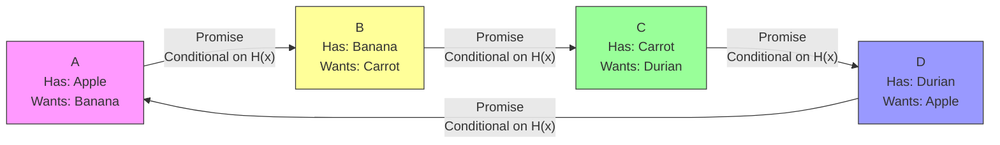

# LedgerLoops

## Narrative Overview

Imagine a small town where everyone sits in a circle, but each person can only talk to the neighbors directly next to them. Each person has something they want to trade, but here's the catch: they only want what the person to their right has, and can only offer what they have to the person on their left. How can they all trade successfully when they can't coordinate directly?

This is the "Whispering Merchants" problem that LedgerLoops sets out to solve. Instead of trying to create a global currency or complex consensus system, LedgerLoops takes a remarkably simple approach: it uses cryptographic "triggers" (hashlocks) to coordinate trades between people who might not even know each other exists.

Here's how it works in practice: Let's say we have four people in a circle - Alice, Bob, Charlie, and David. Alice has an apple and wants a banana, Bob has a banana and wants a carrot, Charlie has a carrot and wants a durian, and David has a durian and wants an apple. None of them can trade directly because no two adjacent people want what the other has.

LedgerLoops solves this by having each person make a conditional promise to their neighbor: "I promise to give you my item IF you can show me a specific secret number." This same condition is used all around the circle. The clever part is that when the secret number is revealed, it triggers all the trades simultaneously - like a row of dominoes falling.

What makes this approach powerful is that:
1. You only need to trust your immediate neighbors
2. You don't need to know who else is in the circle
3. The cryptographic trigger ensures everyone trades or no one does
4. There's no need for global currency or complex consensus

The system is built entirely on local trust relationships and cryptographic guarantees. It's like having a series of locked doors where a single key opens them all at once, but you only need to trust the person you're directly trading with.

However, this elegant simplicity comes with its own challenges. The biggest one is finding these trading circles in the first place - especially when people can only communicate with their immediate neighbors. It's like trying to organize a massive trade fair where everyone can only whisper to the person next to them.

This is fundamentally different from MyCHIPs/ChipNet's approach of using referees and global consensus, or Ripple Normal's penalty system. Instead of trying to coordinate everyone or create incentives for good behavior, LedgerLoops simply creates a cryptographic mechanism that makes it impossible for the trade to happen unless everyone participates correctly.

## Overview
LedgerLoops is an alternative approach to distributed credit clearing that uses hashlocks to coordinate multi-lateral trades without requiring global consensus or currency. It's based on the "Whispering Merchants" model where participants only trust and communicate with their immediate neighbors.

### Key Properties
- Local trust relationships only
- No global currency required
- Hashlock-based coordination
- Peer-to-peer credit tracking
- Neighbor-only communication

### Design Goals
- Eliminate need for global trust
- Enable multilateral clearing without currency
- Maintain privacy between non-neighbors
- Minimize trust requirements
- Enable local credit relationships

### Core Innovations
- Use of hashlocks as trade triggers rather than value tokens
- Neighbor-only trust model
- Loop-based clearing mechanism
- Private bilateral ledgers
- Conditional promises linked by hashlocks

### Main Limitations
- Requires complete loops for clearing
- Limited to existing trust relationships
- No global state or consensus
- Potential for deadlocks in value negotiation
- Early stage/theoretical implementation

## Protocol Description

### Basic Mechanism

1. **Promise Phase**:
   - Each node makes conditional promise to neighbor
   - Promises linked by common hashlock
   - Only trust immediate neighbors
   - No global coordination needed

2. **Trigger Phase**:
   - Hashlock solution revealed
   - Triggers all promises simultaneously
   - No intermediate value transfer
   - All-or-nothing execution

3. **Settlement**:
   - Direct item/value exchange between neighbors
   - No global currency involved
   - Local credit relationships only
   - Bilateral settlement

## Attack Analysis

### Vulnerability to Known Attacks

1. **Deadbeat Attack**
   - More resistant due to local trust
   - Only affects immediate neighbors
   - No global ripple effects
   - Clear attribution of fault

2. **Double-Commit**
   - Not possible due to hashlock mechanism
   - Local promises only
   - No global state to manipulate
   - Clear ownership chain

3. **Network Partition**
   - Affects only partitioned loops
   - No global consensus needed
   - Clear recovery path
   - Local impact only

4. **Split Vote**
   - Not applicable (no voting)
   - Uses cryptographic triggers
   - Local trust only
   - No referee needed

### Unique Attack Vectors

1. **Loop Formation**
   - Difficulty finding complete loops
   - Value matching challenges
   - Privacy vs. discovery tradeoff
   - Potential for deadlocks

2. **Hashlock Timing**
   - Solution withholding attacks
   - Selective revelation
   - Timeout coordination
   - Recovery complexity

## Comparison with MyCHIPs/ChipNet

### Advantages
1. **Trust Model**
   - Simpler trust requirements
   - No global consensus needed
   - Clear fault attribution
   - Local relationship focus

2. **Privacy**
   - Better transaction privacy
   - No global knowledge needed
   - Local relationship only
   - Limited information spread

3. **Simplicity**
   - No complex consensus
   - No referee system
   - Simple cryptographic primitives
   - Clear failure modes

### Disadvantages
1. **Maturity**
   - Theoretical stage only
   - No production implementation
   - Limited practical testing
   - Unproven at scale

2. **Functionality**
   - More limited use cases
   - Requires complete loops
   - Value matching challenges
   - Discovery complexity

3. **Scalability**
   - Loop finding overhead
   - Value coordination challenges
   - Limited to local networks
   - Path discovery issues

## Implementation Analysis

### Current Status
- Theoretical proposal
- No production implementation
- Limited proof of concept
- Active research project

### Technical Requirements
- Hashlock implementation
- Bilateral ledger system
- Loop discovery mechanism
- Value negotiation protocol

### Operational Considerations
- Loop formation complexity
- Value matching overhead
- Discovery mechanism needed
- Timeout handling required

## Open Questions

1. **Loop Discovery**
   - Efficient path finding
   - Privacy preservation
   - Value matching
   - Deadlock prevention

2. **Value Coordination**
   - Exchange rate handling
   - Value comparison
   - Profit distribution
   - Fairness mechanisms

3. **Practical Implementation**
   - Network bootstrapping
   - Integration with existing systems
   - User interface design
   - Error handling

4. **Scaling Challenges**
   - Large network operation
   - Loop discovery efficiency
   - Value coordination
   - Network growth

## References
- [LedgerLoops Description](https://ledgerloops.com/description)
- Original "Whispering Merchants" model
- Hashlock cryptographic primitive
- Bilateral credit systems 