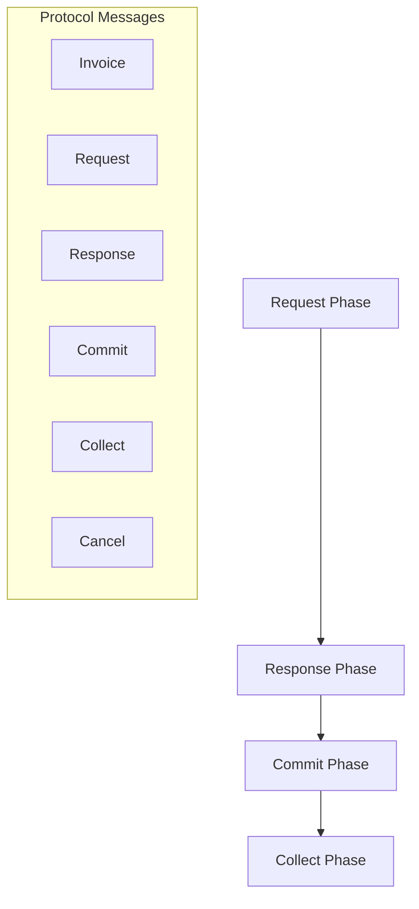
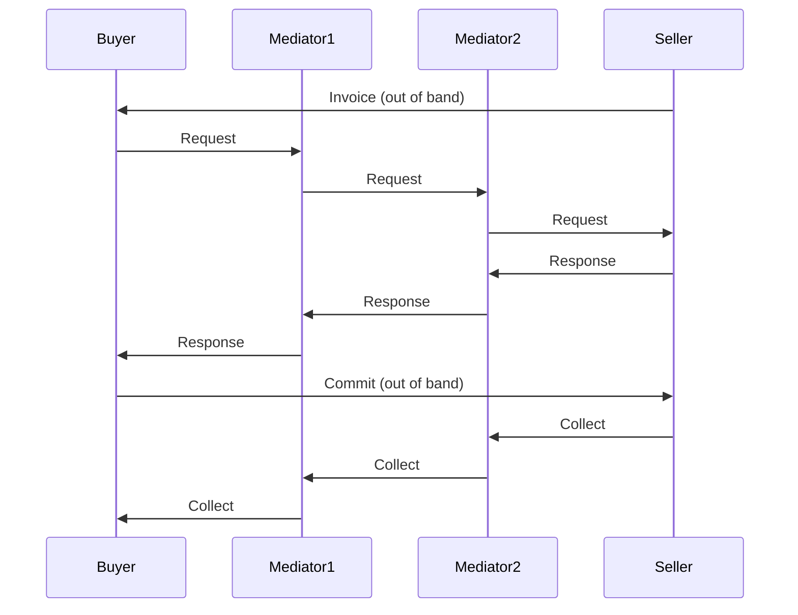
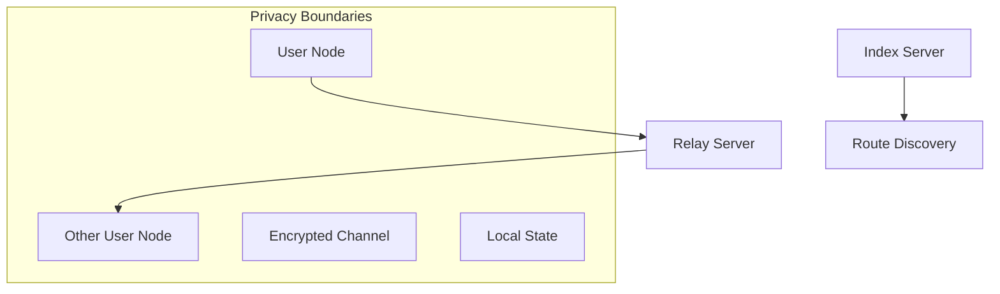

# Offset Credit: Distributed Architecture Analysis

## Protocol Overview



## Distributed Properties

### Core Architecture
1. **Fully Distributed**:
   - No central servers
   - Direct peer connections
   - Local state only
   - No global consensus

2. **Trust Model**:
   - Direct friend relationships
   - Mutual credit limits
   - Social trust foundation
   - Contract-based enforcement

## Transaction Flow

### Multi-Party Payment


### Atomic Properties
1. **Hash Lock Security**:
   - Buyer creates `srcHashedLock`
   - Seller creates `destHashedLock`
   - Two-way commitment
   - Atomic execution

2. **State Management**:
   - Local state tracking
   - Credit freezing
   - Atomic updates
   - Rollback capability

## Comparison with MyCHIPs

### Architectural Similarities

1. **Trust Foundation**:
   - Both use social trust
   - Both have credit limits
   - Both avoid global consensus
   - Both use local state

2. **Distributed Nature**:
   - Fully peer-to-peer
   - No central authority
   - Direct relationships
   - Local decisions

### Key Differences

1. **Protocol Complexity**:
   ```mermaid
   graph TD
       subgraph "Offset"
           A1[Simple Protocol] --> B1[Direct Friends]
           B1 --> C1[Limited Reach]
       end
       
       subgraph "MyCHIPs"
           A2[Complex Protocol] --> B2[Extended Network]
           B2 --> C2[Greater Reach]
       end
   ```

2. **Network Scope**:
   - **Offset**: Direct friends only
   - **MyCHIPs**: Network-wide lifts
   - **Impact**: Different utility/complexity trade-offs

## Byzantine Fault Analysis

### Attack Resistance

1. **Direct Attacks**:
   - Limited to friend relationships
   - Credit limits contain damage
   - Social consequences
   - Local impact only

2. **Network Attacks**:
   ```mermaid
   graph TD
       A[Attack Vector] --> B[Local Scope]
       B --> C[Credit Limit]
       C --> D[Social Cost]
       D --> E[Natural Defense]
   ```

### Failure Modes

1. **Network Partitions**:
   - Only affects direct links
   - Simple recovery
   - Local consistency
   - No global impact

2. **Byzantine Behavior**:
   - Limited to direct friends
   - Credit limits bound damage
   - Social enforcement
   - Natural deterrence

## Protocol Security

### Hash Lock Mechanism

1. **Two-Way Security**:
   - Buyer: `srcHashedLock`
   - Seller: `destHashedLock`
   - Atomic reveal
   - Receipt verification

2. **State Protection**:
   - Credit freezing
   - Atomic updates
   - Cancellation support
   - Timeout handling

## Implementation Insights

### Valuable Features

1. **Protocol Simplicity**:
   - Clear message flow
   - Direct relationships
   - Local state only
   - Simple recovery

2. **Security Model**:
   - Hash lock atomicity
   - Credit limit protection
   - Social enforcement
   - Local verification

### Limitations

1. **Network Reach**:
   - Direct friends only
   - Limited transitivity
   - Growth challenges
   - Network effect issues

2. **Scalability**:
   - Friend network size
   - Route discovery
   - State management
   - Network coordination

## Implications for MyCHIPs

### Validation Points

1. **Trust Model**:
   - Confirms social trust value
   - Validates credit limits
   - Supports local state
   - Endorses relationship focus

2. **Protocol Design**:
   - Hash lock mechanism
   - Atomic transactions
   - Credit freezing
   - Local verification

### Enhancement Ideas

1. **Protocol Simplification**:
   - Hash lock adoption
   - Simpler message flow
   - Clear state transitions
   - Local verification

2. **Security Features**:
   - Two-way commitments
   - Credit freezing
   - Receipt verification
   - Timeout handling

## Conclusions

### Key Insights

1. **Architecture**:
   - Truly distributed design
   - Simple but limited scope
   - Strong security properties
   - Natural Byzantine resistance

2. **Trade-offs**:
   - Simplicity vs reach
   - Security vs complexity
   - Local vs global
   - Direct vs transitive

### Final Assessment

Offset Credit demonstrates a fully distributed mutual credit system that achieves Byzantine fault tolerance through strict locality - all operations are between direct friends only. While this makes the system simpler and more secure than MyCHIPs, it also significantly limits its utility since payments can only occur between direct friends.

The protocol's hash lock mechanism and atomic transaction design offer valuable insights for MyCHIPs, particularly around simplifying certain operations while maintaining security. However, MyCHIPs' more complex design enables greater utility through transitive credit relationships while maintaining similar security properties through its social trust model and contract framework. 

## Privacy Analysis

### Network Architecture


### Privacy Model

1. **Direct Communication**:
   - End-to-end encrypted channels
   - Relay servers only see encrypted traffic
   - No intermediary can read transaction content
   - Public keys used for routing only

2. **State Privacy**:
   - Balance state kept locally
   - Only shared with direct friends
   - No central state repository
   - No authoritative intermediaries

3. **Route Discovery**:
   - Index servers only see public keys
   - No transaction details exposed
   - No balance information shared
   - Minimal metadata leakage

### Intermediary Roles

1. **Relay Servers**:
   - Pure message forwarding
   - Cannot read message content
   - No state maintenance
   - No trust requirements

2. **Index Servers**:
   - Public key routing only
   - No private data access
   - No transaction visibility
   - Optional/replaceable service

### Privacy Guarantees

1. **Transaction Privacy**:
   - Only participants know amounts
   - Only friends see balances
   - Encrypted communication
   - Local state management

2. **Network Privacy**:
   - Minimal metadata exposure
   - No central authority
   - Replaceable intermediaries
   - Friend-to-friend model 