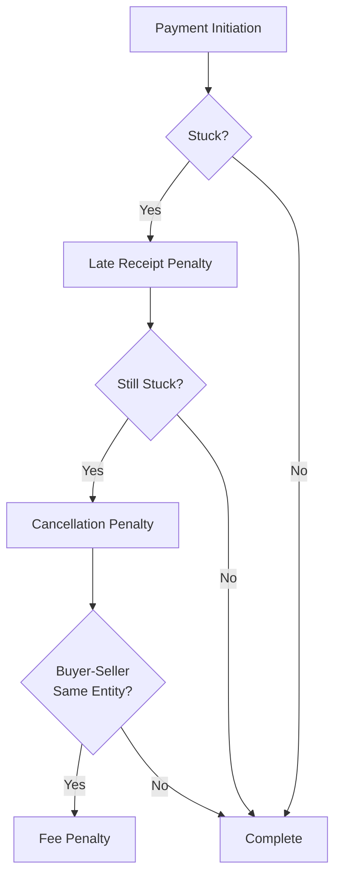

# Ripple Normal (Penalty-Based Protocol)

## Narrative Overview

Imagine you're trying to organize a group of people to all move at once - like a group of friends all agreeing to switch seats at a table. The challenge is that each person only wants to move if everyone else does. In distributed credit networks, we face a similar challenge: how do we get everyone to agree to complete their part of a transaction, when no one wants to commit unless everyone else does?

The Ripple Normal protocol takes an interesting approach to this problem: instead of trying to force everyone to move at exactly the same time (which is nearly impossible in distributed systems), it creates a system of escalating penalties that make it increasingly expensive to delay or disrupt the process.

Think of it like this: Imagine you're organizing a meeting and you institute a late fee that doubles every minute. Very quickly, being late becomes so expensive that everyone shows up on time. This protocol applies that same principle to credit clearing, but with three layers of penalties:

1. First, there's a penalty for being slow to complete your part of the transaction. This is like the basic late fee.

2. If that's not enough, there's a second penalty that kicks in if someone tries to hold up the process by not making a decision. This is like adding an extra fee for not even calling to say you'll be late.

3. Finally, there's a special penalty designed to prevent a particularly sneaky attack where someone tries to profit by being both the buyer and seller in a transaction and intentionally causing delays. This is like charging an extra fee to someone who schedules two conflicting meetings and then profits from the late fees of others.

What makes this approach unique is that it doesn't try to solve the coordination problem directly. Instead, it makes any attempt to disrupt or delay the process automatically unprofitable. The longer someone tries to hold up the process, the more they have to pay.

The system is self-enforcing: you don't need a central authority or complex voting system. Instead, the economics of the penalties naturally push everyone to complete their part of the transaction promptly. It's like having a market mechanism that automatically punishes bad behavior and rewards good behavior.

However, this elegant solution comes with its own challenges. The system of penalties needs to be carefully balanced - too low and they don't prevent bad behavior, too high and they might discourage legitimate transactions. There's also significant complexity in tracking and calculating all these penalties, and ensuring that the state of each transaction is properly maintained across the network.

## Overview
A unique implementation of the Ripple credit network concept that uses a cascading penalty system to solve the "stuck decision" problem in distributed credit clearing. Based on Ryan Fugger's 2006 idea of "late-receipt penalty rate" but extends it significantly.

### Key Properties
- Penalty-based decision enforcement
- Single-user server design
- UDP-based transport
- State-based architecture
- Go implementation

### Design Goals
- Solve "stuck decision" problems
- Enforce timely transaction completion
- Prevent buyer-seller collusion
- Incentivize proper behavior
- Maintain network efficiency

### Core Innovations
- Cascading penalty system
- Buyer cancellation rights
- Fee-based attack prevention
- Time-proportional penalties
- Multi-level decision enforcement

### Main Limitations
- Complex penalty calculation
- Multiple decision points
- State management overhead
- Network coordination requirements
- Implementation complexity

## Protocol Description

### Penalty System


1. **Base Level**
   - Late-receipt penalty rate
   - Enforces payment completion
   - Time-based escalation
   - Participant accountability

2. **Cancellation Level**
   - Buyer cancellation rights
   - Enforced propagation
   - Decision timeouts
   - State tracking

3. **Fee Level**
   - Attack prevention
   - Time-proportional fees
   - Collusion resistance
   - Cost distribution

### Implementation Details
1. **Server Architecture**
   - Single-user design
   - UDP transport
   - State persistence
   - Signal handling

2. **Network Protocol**
   - UDP-based messaging
   - Reliable delivery
   - State synchronization
   - Connection management

3. **State Management**
   - Persistent storage
   - Transaction tracking
   - Penalty calculation
   - Fee accounting

## Attack Analysis

### Known Attack Vectors

1. **Stuck Decision**
   - Addressed by penalties
   - Time-based escalation
   - Clear resolution path
   - Cost to attacker

2. **Buyer-Seller Collusion**
   - Prevented by fees
   - Time-proportional costs
   - Benefit distribution
   - Attack unprofitability

3. **Delayed Resolution**
   - Penalized by system
   - Cost increases with time
   - Clear incentives
   - Automatic resolution

### Unique Considerations

1. **Penalty Calculation**
   - Complexity management
   - Rate determination
   - Time tracking
   - State consistency

2. **State Management**
   - Persistence requirements
   - Synchronization needs
   - Recovery procedures
   - Consistency maintenance

## Critical Analysis: The Penalty Recursion Problem

### The Fundamental Dilemma
There's a potentially serious recursive flaw in the penalty-based approach that warrants careful examination. The core issue can be stated as follows:

1. **The Initial Problem**:
   - We need to secure a payment transaction
   - We want to ensure all parties behave correctly
   - We need a mechanism to enforce good behavior

2. **The Proposed Solution**:
   - Introduce penalties for misbehavior
   - Make delays/attacks economically unfavorable
   - Use escalating costs to force timely completion

3. **The Recursive Flaw**:
   ```mermaid
   graph TD
       A[Payment needs security] --> B[Add penalties]
       B --> C[Penalties are payments]
       C --> D[These payments need security]
       D --> E[Add meta-penalties?]
       E --> F[These are also payments...]
       F --> G[Infinite recursion]
   ```

### The Core Issue
The fundamental problem is that penalties are themselves payments, which leads to a recursive security requirement:
- To secure a payment, we add penalties
- But how do we secure the penalty payments?
- Do we need meta-penalties to secure the penalties?
- Do we then need meta-meta-penalties?

### Possible Resolutions

1. **External Authority**
   - Use fiat currency for penalties
   - Rely on traditional banking system
   - Leverage legal enforcement
   - **Problem**: Defeats the purpose of a distributed credit system

2. **Blockchain Integration**
   - Use cryptocurrency for penalties
   - Leverage smart contracts
   - Rely on blockchain consensus
   - **Problem**: Introduces external dependencies

3. **Collateral System**
   - Require upfront deposits
   - Lock collateral in escrow
   - Automatic penalty execution
   - **Problem**: Reduces system liquidity

4. **Trust Requirements**
   - Require higher trust for penalty handling
   - Use trusted intermediaries
   - Implement reputation systems
   - **Problem**: Increases centralization

### Impact on System Design

1. **Architectural Implications**
   - Need for external payment systems
   - Additional trust requirements
   - Complex state management
   - Integration challenges

2. **Security Model**
   - Mixed trust assumptions
   - Multiple security domains
   - Increased attack surface
   - Complex failure modes

3. **Practical Deployment**
   - Implementation complexity
   - Operational overhead
   - Integration requirements
   - Deployment constraints

### Comparison with Other Approaches

1. **MyCHIPs/ChipNet**:
   - Uses referee system instead of penalties
   - Avoids recursive security problem
   - Clear consensus mechanism
   - Self-contained security model

2. **LedgerLoops**:
   - Uses cryptographic triggers
   - No penalty system needed
   - Local trust relationships
   - Atomic execution

### Conclusions

The penalty recursion problem represents a significant challenge to the Ripple Normal approach:

1. **Theoretical Issues**:
   - Fundamental recursive security flaw
   - No clear resolution within the system
   - Requires external dependencies
   - Compromises system independence

2. **Practical Impact**:
   - Increased implementation complexity
   - Additional trust requirements
   - External system dependencies
   - Deployment challenges

3. **Design Implications**:
   - May need fundamental redesign
   - Consider alternative approaches
   - Hybrid solutions possible
   - Clear limitations identified

This analysis suggests that while the penalty-based approach is innovative, its reliance on penalties as a security mechanism introduces a fundamental recursive problem that either:
- Requires external systems (compromising independence)
- Creates an infinite regression of security requirements
- Needs a fundamentally different approach to security

This might explain why other systems like MyCHIPs/ChipNet and LedgerLoops have chosen different approaches to solving the distributed consensus problem.

## Comparison with MyCHIPs/ChipNet

### Advantages
1. **Decision Resolution**
   - Automatic through penalties
   - Self-enforcing
   - Clear incentives
   - Time-based escalation

2. **Attack Prevention**
   - Economic disincentives
   - Built-in penalties
   - Fee-based protection
   - Time-proportional costs

3. **Implementation**
   - Simpler architecture
   - Single-user focus
   - Clear state model
   - UDP efficiency

### Disadvantages
1. **Complexity**
   - Multiple penalty levels
   - Complex calculations
   - State management
   - Coordination requirements

2. **Scalability**
   - Single-user limitation
   - State overhead
   - Network coordination
   - Implementation challenges

3. **Maturity**
   - Experimental stage
   - Limited testing
   - Complex interactions
   - Unproven at scale

## Implementation Analysis

### Current Status
- Working implementation
- Go language
- UDP transport
- State persistence

### Technical Requirements
- Go runtime
- UDP networking
- State storage
- Signal handling

### Operational Considerations
- Penalty management
- State persistence
- Network reliability
- Recovery procedures

## Open Questions

1. **Penalty Optimization**
   - Rate determination
   - Time factors
   - Cost distribution
   - Incentive balance

2. **State Management**
   - Persistence strategies
   - Synchronization methods
   - Recovery procedures
   - Consistency guarantees

3. **Network Scaling**
   - Multi-user extension
   - State distribution
   - Penalty coordination
   - Performance optimization

4. **Implementation Challenges**
   - State complexity
   - Network reliability
   - Recovery procedures
   - Testing methodology

## References
- Original Ripple concept (Ryan Fugger, 2006)
- Late-receipt penalty rate concept
- UDP reliability protocols
- Distributed state management 