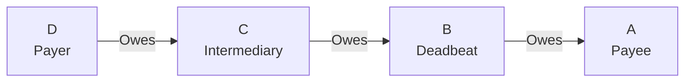
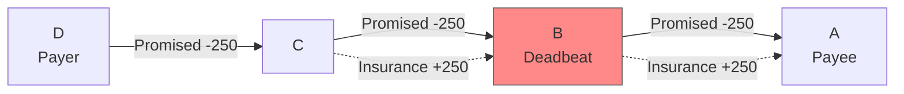

# Deadbeat Attack

## Origin and Documentation
**Source**: Directly documented in MyCHIPs protocol
- Primary Reference: `mychips/doc/learn-lift.md`
  > "Any deadbeat who drops off the network between these two phases will simply miss out"
- Supporting Reference: `ChipNet/doc/cluster.md` consensus protocol
  > Describes how nodes handle timeouts and non-responsive peers

**Reasoning**: Core problem in distributed consensus - how to handle node failure or non-participation after initial commitment.

## Mitigation Rating
**Status**: FULLY MITIGATED ✅
- Primary defense: Conditional commitments with cryptographic signatures
- Secondary defense: Two-way signature propagation
- **New**: Insurance Chit Protocol provides minority recovery mechanism
- Remaining exposure: Only the deadbeat itself can lose value
- Edge case: Two colluding deadbeats can strand nodes between them (now addressable via insurance chits)

**Rating Justification**:
1. System ensures no innocent party loses value
2. Attack only harms perpetrator
3. Network can continue operating with insurance chit workaround
4. Clear evidence preserved for reputation systems
5. **Enhanced**: Insurance chits enable trading to continue during deadbeat situations
6. Some operational impact but no financial risk to honest participants

**Rating Change**: Upgraded from "EFFECTIVELY MITIGATED" to "FULLY MITIGATED" due to Insurance Chit Protocol removing operational impact.

## Attack Description
A node participates in the Promise phase of a lift transaction but becomes unresponsive (intentionally or unintentionally) before the Commit phase completes. This prevents the node from receiving or propagating the final signature needed to complete the lift.

## Example Scenario
Using [Simple Linear Lift](../CONTEXT.md#scenario-1-simple-linear-lift):


In this scenario:
1. Node B participates in Promise phase, agreeing to the lift
2. All nodes sign conditional commitments
3. B becomes unresponsive before receiving/propagating final signature
4. A and B's upstream partner (C) have proof of B's commitment
5. B lacks signature needed to claim its promised credits

**Traditional Impact**: Lift hangs indefinitely, impacting trading capacity on A-B and B-C tallies.

**With Insurance Chit Protocol**: A and C can request insurance chits to neutralize the promised resource impact, allowing normal trading to continue.

## Nature of Attack
- **Primary Type**: Can be both malicious or inadvertent
- **Malicious Case**: Node intentionally goes offline to disrupt lift
- **Inadvertent Case**: Node crashes, network fails, or other technical issues

## Current System Resistance
MyCHIPs/ChipNet is already resistant to this attack through several mechanisms:

1. **Conditional Commitments**:
   - All nodes sign commitments before lift execution
   - Upstream partners hold proof of deadbeat's commitment
   - System prioritizes protecting responsible parties

2. **Two-Way Signature Propagation**:
   - Final signature sent both upstream and downstream
   - Only deadbeat can be deprived of signature
   - Other nodes can complete transaction

3. **Direct Referee Contact**:
   - Stranded parties can contact lift signer directly
   - Provides backup signature distribution path
   - Prevents single-node disruption

4. **Insurance Chit Protocol (New Defense)**:
   - After timeout period, affected nodes can request insurance chits
   - Insurance chits neutralize promised resource impact
   - Trading can continue normally while lift remains unresolved
   - Resolution chits complete lift if deadbeat eventually returns
   - See: [Insurance Chit Protocol](../scenarios/minority-recovery-3.md)

## Insurance Chit Protocol Application

### Scenario: Deadbeat in Linear Lift


**Recovery Process**:
1. **Timeout trigger**: Lift exceeds defined timeout (e.g., 24 hours)
2. **Insurance requests**: A requests insurance chit from C (since B is unresponsive)
3. **Net neutralization**: A's tally shows promised -250 (to B) + insurance +250 (from C) = 0
4. **Trading restoration**: A can trade normally despite hung lift
5. **Resolution**: If B returns, resolution chits complete the original lift intent

### Benefits for Deadbeat Scenarios
1. **Operational continuity**: Honest nodes not operationally impacted
2. **Resource availability**: Promised resources effectively freed up
3. **Natural incentives**: Partners motivated to provide insurance chits to maintain relationships
4. **Fair resolution**: If deadbeat returns, lift can still complete properly

## Damage Assessment

### Financial Impact
- **Deadbeat**: May lose promised credits (self-inflicted)
- **Other Participants**: **Fully protected** from both financial and operational loss
- **Partners**: 
  - Upstream: Insurance chit protocol eliminates collection problems
  - Downstream: Benefits by receiving credits through insurance mechanism

### Network Impact
- **Local**: **No longer impacted** - insurance chits restore trading capacity
- **Global**: Minimal impact on network efficiency
- **Trust**: Deadbeat's reputation damaged with direct partners

### Accounting Impact
- **Transaction State**: Remains consistent across network
- **Balance Accuracy**: Maintained for all responsive nodes
- **Audit Trail**: Clear record of deadbeat's commitment and insurance chit resolution

## Additional Defenses
Current system handles this excellently with insurance chit protocol, but potential further enhancements:

1. **Reputation System Enhancement**:
   - Track node reliability metrics
   - Share reputation data with network
   - Use in pathway selection

2. **Partner Risk Management**:
   - Adjust credit limits based on behavior
   - Require collateral from unreliable partners
   - Implement graduated trust levels

3. **Predictive Detection**:
   - Monitor node response patterns
   - Identify potential deadbeat indicators
   - Proactive insurance chit preparation

## Contract-Based Mitigations

### Legal Framework
The MyCHIPs tally contract addresses deadbeat situations through clear default provisions and enforcement mechanisms.

1. **Performance Requirements**
   - Explicit obligation to complete promised transactions
   - Requirement for good faith participation
   - Prohibition against abandoning lifts

2. **Default and Cure Provisions**
   ```yaml
   "If a Party fails to perform a promise within reasonable time, 
    the other Party may give notice and allow cure period before 
    triggering alternative enforcement measures."
   ```

3. **Insurance Chit Rights**
   - Right to request insurance chits after timeout
   - Obligation to provide insurance chits when appropriately requested
   - Clear procedures for insurance chit resolution

### Enforcement Mechanisms

1. **Immediate Relief**: Insurance chit protocol
2. **Legal Relief**: Contract enforcement and collection
3. **Reputation Relief**: Publication of deadbeat behavior
4. **Network Relief**: Reduced trading relationships with deadbeat

## Related Attacks
- [Network Partition](network-partition.md) - Similar hanging scenarios
- [Signature Withholding](signature-withholding.md) - Intentional signature delays
- [Circuit Starvation](../scenarios/circuit-starvation.md) - Multiple coordinated deadbeats

## User Mitigation Practices

### Prevention
1. **Partner Selection**: Choose reliable partners with good uptime
2. **Credit Limits**: Set conservative limits with unknown partners
3. **Monitoring**: Track partner response times and reliability

### Response to Deadbeat
1. **Document**: Preserve evidence of deadbeat behavior
2. **Insurance Request**: Invoke insurance chit protocol after timeout
3. **Reputation**: Share reliability information with network
4. **Relationship**: Adjust future credit terms with deadbeat partner

**Key Insight**: With the Insurance Chit Protocol, deadbeat attacks have become primarily a **reputation problem** rather than an operational or financial problem for honest participants. 