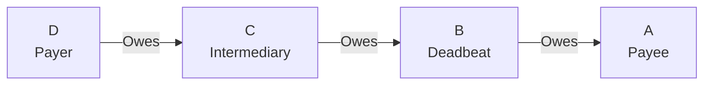

# Deadbeat Attack

## Origin and Documentation
**Source**: Directly documented in MyCHIPs protocol
- Primary Reference: `mychips/doc/learn-lift.md`
  > "Any deadbeat who drops off the network between these two phases will simply miss out"
- Supporting Reference: `ChipNet/doc/cluster.md` consensus protocol
  > Describes how nodes handle timeouts and non-responsive peers

**Reasoning**: Core problem in distributed consensus - how to handle node failure or non-participation after initial commitment.

## Mitigation Rating
**Status**: EFFECTIVELY MITIGATED
- Primary defense: Conditional commitments with cryptographic signatures
- Secondary defense: Two-way signature propagation
- Remaining exposure: Only the deadbeat itself can lose value
- Edge case: Two colluding deadbeats can strand nodes between them

**Rating Justification**:
1. System ensures no innocent party loses value
2. Attack only harms perpetrator
3. Network can continue operating
4. Clear evidence preserved for reputation systems
5. Some operational impact but no financial risk to honest participants

## Attack Description
A node participates in the Promise phase of a lift transaction but becomes unresponsive (intentionally or unintentionally) before the Commit phase completes. This prevents the node from receiving or propagating the final signature needed to complete the lift.

## Example Scenario
Using [Simple Linear Lift](../CONTEXT.md#scenario-1-simple-linear-lift):


In this scenario:
1. Node B participates in Promise phase, agreeing to the lift
2. All nodes sign conditional commitments
3. B becomes unresponsive before receiving/propagating final signature
4. A and B's upstream partner (C) have proof of B's commitment
5. B lacks signature needed to claim its promised credits

## Nature of Attack
- **Primary Type**: Can be both malicious or inadvertent
- **Malicious Case**: Node intentionally goes offline to disrupt lift
- **Inadvertent Case**: Node crashes, network fails, or other technical issues

## Current System Resistance
MyCHIPs/ChipNet is already resistant to this attack through several mechanisms:

1. **Conditional Commitments**:
   - All nodes sign commitments before lift execution
   - Upstream partners hold proof of deadbeat's commitment
   - System prioritizes protecting responsible parties

2. **Two-Way Signature Propagation**:
   - Final signature sent both upstream and downstream
   - Only deadbeat can be deprived of signature
   - Other nodes can complete transaction

3. **Direct Referee Contact**:
   - Stranded parties can contact lift signer directly
   - Provides backup signature distribution path
   - Prevents single-node disruption

## Damage Assessment

### Financial Impact
- **Deadbeat**: May lose promised credits (self-inflicted)
- **Other Participants**: Protected from direct financial loss
- **Partners**: 
  - Upstream: May have collection problem if balance goes negative
  - Downstream: Benefits by receiving credits without giving up others

### Network Impact
- **Local**: Temporary hold on affected tallies
- **Global**: Minimal impact on network efficiency
- **Trust**: Deadbeat's reputation damaged with direct partners

### Accounting Impact
- **Transaction State**: Remains consistent across network
- **Balance Accuracy**: Maintained for all responsive nodes
- **Audit Trail**: Clear record of deadbeat's commitment

## Additional Defenses
Current system handles this well, but potential enhancements:

1. **Reputation System Enhancement**:
   - Track node reliability metrics
   - Share reputation data with network
   - Use in pathway selection

2. **Partner Risk Management**:
   - Adjust credit limits based on behavior
   - Require collateral from unreliable partners
   - Implement graduated trust levels

## Contract-Based Mitigations

### Legal Framework
The MyCHIPs tally contract provides strong additional protections against deadbeat behavior:

1. **Default Conditions**
   - Explicit definition of deadbeat behavior:
     ```yaml
     "Failure to complete a Credit Lift transactions previously committed to,
      due to intentional manipulation of software and/or the network"
     ```
   - Clear breach of contract terms
   - Legally enforceable consequences
   - Documented misbehavior

2. **Notice and Cure Process**
   - Formal notification requirement
   - 10-day cure period
   - Clear resolution path
   - Documented process

3. **Escalating Consequences**
   ```mermaid
   graph TD
       A[Deadbeat Behavior] --> B[Notice of Default]
       B --> C{Cured within<br/>10 days?}
       C -->|Yes| D[Resolution]
       C -->|No| E[Publication Rights]
       E --> F[Legal Enforcement]
       F --> G[Alternative Payment]
       F --> H[Collateral Claims]
   ```

### Enforcement Mechanisms

1. **Direct Partner Recourse**
   - Contractual obligations
   - Alternative payment requirements:
     - Government currency
     - Precious commodities
     - Acceptable product
   - Collateral claims
   - Legal action rights

2. **Network Effects**
   - Publication of breach
   - Reputation damage
   - Network isolation
   - Trading limitation

3. **Recovery Options**
   - Multiple payment methods
   - Collateral execution
   - Legal enforcement
   - Reputation restoration upon cure

### Impact on Attack Assessment

1. **Mitigation Rating**: EFFECTIVELY MITIGATED
   - Technical protections (unchanged)
   - Plus contractual protections
   - Plus legal recourse
   - Plus reputation effects

2. **Attack Cost**:
   - Legal liability
   - Reputation damage
   - Alternative payment obligation
   - Potential collateral loss

3. **Recovery Paths**:
   - Clear cure process
   - Multiple payment options
   - Legal framework
   - Reputation restoration

## Open Questions

1. **Multiple Deadbeats**:
   - How does system handle two deadbeats working together?
   - What is maximum safe distance between colluding deadbeats?
   - Can we detect coordinated deadbeat attacks?

2. **Recovery Process**:
   - What is optimal timeout before direct referee contact?
   - How to handle deadbeat returning after long absence?
   - Should system support automated reconciliation?

3. **Prevention Strategies**:
   - Can we predict potential deadbeats?
   - What behavioral patterns indicate impending attack?
   - How to balance prevention vs. network efficiency?

4. **Reputation Mechanics**:
   - How to quantify deadbeat impact?
   - What is fair reputation penalty?
   - How to handle inadvertent vs. malicious cases?

## Related Attacks
- [Signature Withholding](signature-withholding.md)
- [Double-Commit Attack](double-commit.md)
- [Network Partition](network-partition.md) 

## User Mitigation Practices

### Tally Establishment
1. **Trust Relationship Requirements**
   - Only create tallies with long-term business partners
   - Require real-world identity verification
   - Establish tallies through in-person meetings
   - Document relationship basis (employer, vendor, etc.)

2. **Credit Management**
   - Start with small credit limits
   - Increase limits gradually based on history
   - Monitor trading patterns for consistency
   - Maintain credit reserves for uncertainties

3. **Contact Information**
   - Maintain multiple contact methods
   - Verify contact details periodically
   - Keep offline communication channels
   - Document physical business location

### Lift Participation
1. **Circuit Validation**
   - Verify known partners in circuit
   - Limit exposure to unknown nodes
   - Check total circuit length
   - Validate referee selection

2. **Value Limits**
   - Set maximum lift participation amounts
   - Use smaller amounts for unfamiliar circuits
   - Maintain lift value diversity
   - Consider partner history in limits

3. **Timing Controls**
   - Avoid lifts during partner off-hours
   - Consider business cycle timing
   - Set reasonable timeout periods
   - Monitor completion patterns

### Recovery Preparation
1. **Documentation**
   - Keep records of all trading relationships
   - Document unusual behavior patterns
   - Maintain communication logs
   - Track resolution history

2. **Alternative Paths**
   - Establish multiple trading routes
   - Maintain backup trading partners
   - Know partner's partners
   - Plan for route diversity

3. **Legal Framework**
   - Understand legal recourse options
   - Maintain relevant documentation
   - Know jurisdiction requirements
   - Have legal contacts ready

These practices help individual users:
- Prevent deadbeat situations
- Minimize impact when they occur
- Enable faster recovery
- Maintain trading network health 

## Contract Integration

### System Design Impact
1. **Technical Layer**
   - Protocol-level protections
   - Cryptographic guarantees
   - Network timeout handling
   - State management

2. **Contract Layer**
   - Legal framework
   - Default conditions
   - Cure process
   - Enforcement options

3. **Social Layer**
   - Reputation system
   - Publication rights
   - Network effects
   - Trust relationships

### Implementation Requirements

1. **Software Components**
   - Default detection
   - Notice generation
   - State tracking
   - Publication mechanism

2. **Legal Components**
   - Contract enforcement
   - Default documentation
   - Cure tracking
   - Resolution recording

3. **Operational Procedures**
   - Default notification
   - Cure monitoring
   - Resolution processing
   - Publication management

## Practical Considerations

### Prevention Strategy
1. **Pre-Transaction**
   - Contract review
   - Partner validation
   - Collateral assessment
   - Risk evaluation

2. **During Transaction**
   - Protocol compliance
   - State monitoring
   - Timeout management
   - Communication tracking

3. **Post-Default**
   - Notice issuance
   - Cure monitoring
   - Resolution pursuit
   - Documentation maintenance

### Recovery Process

1. **Immediate Actions**
   - Issue default notice
   - Document breach
   - Preserve evidence
   - Monitor response

2. **Resolution Phase**
   - Monitor cure period
   - Evaluate response
   - Consider alternatives
   - Document outcomes

3. **Enforcement Phase**
   - Publication decision
   - Legal action evaluation
   - Alternative payment pursuit
   - Collateral consideration 