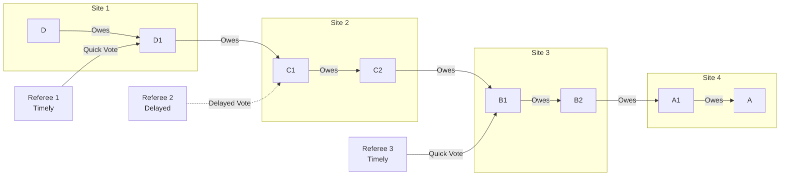

# Delayed Vote Attack

## Origin and Documentation
**Source**: Derived from ChipNet protocol with extension
- Primary Reference: `ChipNet/doc/cluster.md`
  > Discusses timeout handling and node-level protocol
- Supporting Reference: `ChipNet/doc/cluster.md` consensus protocol
  > Details referee voting mechanisms and timing requirements

**Reasoning**: Timing attacks are a common vector in distributed systems. Any consensus system with timeouts is potentially vulnerable to strategic delays.

## Mitigation Rating
**Status**: PARTIALLY MITIGATED
- Primary defense: Timeout mechanisms and majority rules
- Secondary defense: Performance monitoring and reputation impact
- Remaining exposure: Transaction delays and resource consumption
- Edge case: Coordinated delays by multiple referees

**Rating Justification**:
1. System can proceed with majority consensus
2. Timeout mechanisms prevent indefinite delays
3. Performance impact but no financial risk
4. Detection mechanisms need improvement
5. Optimal timeout parameters still under research

## Attack Description
A malicious referee intentionally delays its voting response to force timeouts or create uncertainty in the lift transaction. This can be used to manipulate transaction timing, force retries, or create opportunities for other attacks.

## Lift Type Applicability
- **Linear Lifts**: Vulnerable - delays can disrupt payment completion
- **Circular Lifts**: Vulnerable - delays can break credit clearing
- **Mixed Impact**: Both types equally affected, but circular lifts may have more complex recovery due to multiple interdependent participants

## Example Scenario
Using [Multi-Site Linear Lift](../CONTEXT.md#scenario-3-multi-site-linear-lift) with delayed voting:

In this scenario:
1. Referee 2 intentionally delays its vote
2. Other referees vote promptly
3. Transaction may timeout waiting for majority
4. Forces system to either:
   - Wait for delayed vote
   - Timeout and retry
   - Proceed with partial consensus

## Nature of Attack
- **Primary Type**: Malicious (requires intentional misconduct)
- **Variants**:
  - Single referee delay
  - Coordinated multi-referee delays
  - Variable delay patterns
  - Selective delay targeting

## Current System Resistance
ChipNet includes several mitigations:

1. **Timeout Management**:
   - Defined timeout parameters
   - Automatic retry mechanisms
   - Alternative referee paths

2. **Majority Rules**:
   - Can proceed with majority consensus
   - Non-responsive referees can be bypassed
   - Timeout votes counted as void

3. **Referee Monitoring**:
   - Performance tracking
   - Response time measurement
   - Reputation impact

## Damage Assessment

### Financial Impact
- **Direct Loss**: None if properly handled
- **Indirect Costs**:
  - Transaction delays
  - Resource consumption
  - Opportunity costs

### Network Impact
- **Performance**: Increased latency
- **Resources**: Wasted on retries
- **Throughput**: Reduced transaction rate

### Accounting Impact
- **Consistency**: Maintained but delayed
- **Timing**: Transaction completion uncertain
- **Audit**: Delay patterns detectable

## Additional Defenses

1. **Dynamic Timeouts**:
   - Adaptive timing based on network conditions
   - Per-referee timeout profiles
   - Progressive retry intervals

2. **Referee Selection**:
   - Performance-based selection
   - Geographic distribution
   - Backup referee pool

3. **Response Monitoring**:
   - Real-time latency tracking
   - Pattern analysis
   - Automated referee rotation

## Open Questions

1. **Timeout Optimization**:
   - What are optimal timeout values?
   - How to adapt to network conditions?
   - Balance between speed and reliability?

2. **Detection Accuracy**:
   - How to distinguish attacks from congestion?
   - What patterns indicate malicious intent?
   - How to measure referee reliability?

3. **Recovery Efficiency**:
   - When to trigger retries?
   - How to select alternative referees?
   - What is acceptable delay threshold?

4. **Prevention Strategies**:
   - Can we predict referee behavior?
   - How to incentivize timely responses?
   - What penalties deter attacks?

## Related Attacks
- [Network Partition](network-partition.md)
- [Selective Communication](selective-communication.md)
- [Split Vote Attack](split-vote.md) 

## User Mitigation Practices

### Referee Selection
1. **Performance Requirements**
   - Set maximum response time expectations
   - Require service level agreements
   - Check historical performance
   - Verify processing capacity

2. **Reliability Verification**
   - Review uptime statistics
   - Check load handling capability
   - Verify backup systems
   - Assess resource allocation

3. **Infrastructure Assessment**
   - Evaluate technical capabilities
   - Check geographic distribution
   - Verify redundancy measures
   - Review scaling ability

### Lift Configuration
1. **Timing Controls**
   - Set strict timeout limits
   - Define escalation points
   - Specify retry policies
   - Configure abort conditions

2. **Value Management**
   - Scale value to referee responsiveness
   - Set limits based on timing risk
   - Consider performance history
   - Adjust for time sensitivity

3. **Circuit Design**
   - Minimize circuit complexity
   - Choose efficient paths
   - Consider timing requirements
   - Plan for delays

### Operational Practices
1. **Performance Monitoring**
   - Track response times
   - Document delay patterns
   - Measure completion rates
   - Analyze timing trends

2. **Risk Management**
   - Identify critical timeframes
   - Plan for peak periods
   - Maintain timing buffers
   - Consider business cycles

3. **Alternative Planning**
   - Have backup referees ready
   - Know escalation paths
   - Maintain alternative routes
   - Plan for timing failures

These practices help individual users:
- Minimize voting delays
- Ensure timely completion
- Manage timing risks
- Maintain operational efficiency 