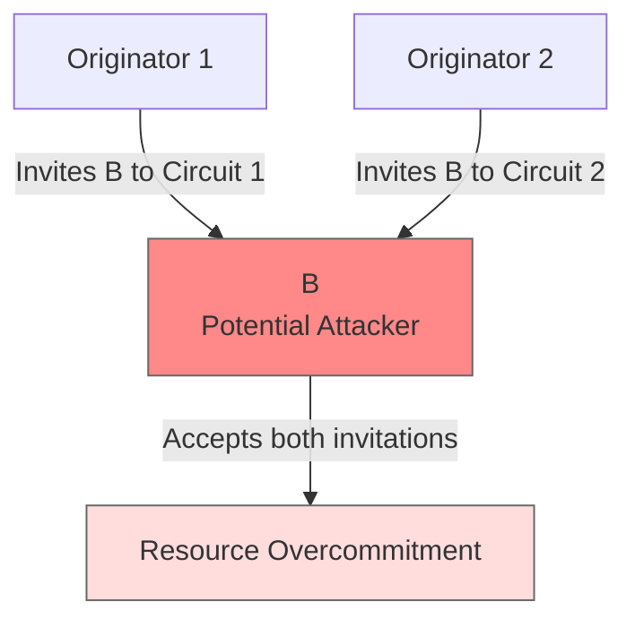
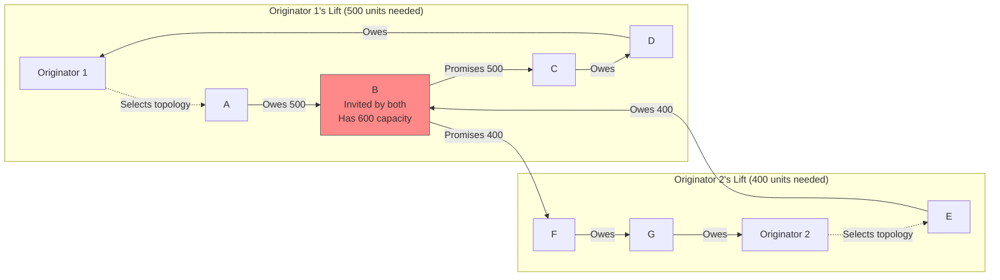

# Double-Commit Attack (Resource Overcommitment)

## Origin and Documentation
**Source**: Hypothesized from distributed systems principles
- Primary Concept: Resource overcommitment in distributed credit systems
- Supporting Reference: `ChipNet/doc/cluster.md` consensus protocol
  > Describes transaction locking and state validation
- Related Concept: Double-spending in cryptocurrencies, but applied to credit capacity

**Reasoning**: Any distributed credit system must prevent the same credit capacity from being committed multiple times simultaneously. This is **not about corrupting the consensus mechanism** (which is cryptographically protected), but about a node attempting to overcommit its credit resources.

## Attack Clarification

**What This Attack IS**: A node attempts to participate in multiple concurrent lifts that exceed its available credit capacity.

**What This Attack IS NOT**: An attempt to manipulate consensus signatures or create contradictory majority decisions (which is cryptographically impossible).

## Mitigation Rating
**Status**: SUBSTANTIALLY MITIGATED ⚠️ → NEARLY FULLY MITIGATED ✅
- Primary defense: **Lift topology control by originator** prevents unauthorized participation
- Secondary defense: Local credit validation by direct partners
- Tertiary defense: Transaction locking during Promise phase
- Remaining exposure: **Very limited** - requires originator cooperation or multiple coordinators
- Edge case: **Highly unlikely** coordination across multiple independent lift originators

**Rating Justification**:
1. **Originator controls topology** - nodes can't inject themselves into arbitrary lifts
2. **Discovery phase defines participation** before any commitments are made
3. **Direct partner validation** provides additional protection
4. **Transaction locking** prevents resource double-booking
5. **Attack requires complex coordination** across multiple originators
6. **Extremely limited practical viability** given protocol structure

**Rating Improvement**: Understanding of lift topology protocol reveals much stronger defenses than initially assessed.

## Lift Topology Protocol and Its Defensive Role

### **How Lift Topology Actually Works**:

1. **Discovery Phase**:
   - **Originator builds a plan** defining the complete topology of the lift
   - **Defines all participating nodes** and their roles in the circuit
   - **Specifies public keys** for all participants
   - **No commitments made** - this is just pathway discovery

2. **Proposal Phase**:
   - **Originator proposes the specific topology** for the actual lift
   - **Invitation goes only to specified nodes** in the predetermined topology
   - **Nodes choose to participate or pass** on this specific lift
   - **Cannot add themselves** to lifts they weren't invited to

3. **Promise Phase**:
   - Only invited nodes participate in the selected topology
   - Each node makes promises based on their assigned role
   - **No way to participate in unauthorized lifts**

### **Why This Protocol Defeats Double-Commit Attacks**:

**Key Insight**: **Nodes cannot arbitrarily involve themselves in multiple concurrent lifts** because:

1. **Originator Permission Required**: Node B cannot participate in a lift unless specifically invited by the originator
2. **Topology Pre-Defined**: The lift structure is determined before any commitments
3. **No Self-Injection**: Nodes cannot add themselves to lift topologies they weren't invited to
4. **Multiple Originators Required**: For double-commit to work, B would need invitations from multiple independent originators

### **Revised Attack Scenario Assessment**:

For the previously described attack to work, Node B would need:

**Required Conditions (Much More Difficult)**:
1. **Two independent originators** must both discover routes through B
2. **Both originators** must select topologies including B
3. **Both must propose lifts simultaneously** (timing coordination)
4. **B must accept both invitations** despite knowing overcommitment
5. **Partners must fail to detect** the overcommitment during validation

## Attack Description (Revised Understanding)
A malicious node attempts to accept invitations to multiple concurrent lift transactions that collectively exceed its available credit capacity. However, **the node cannot inject itself into lifts** - it can only participate in lifts where it has been specifically invited by the originator.

**Critical Limitation**: **Attack requires coordination across multiple independent lift originators**, not just the malicious node acting alone.

**Key Point**: This attack targets **resource management across multiple independent lifts**, not **consensus integrity** or **unauthorized participation**. The ChipNet consensus mechanism and topology control remain cryptographically secure.

## Lift Type Applicability
- **Linear Lifts**: Requires multiple originators to independently invite same node
- **Circular Lifts**: Requires multiple originators to independently select circuits through same node
- **Mixed Impact**: Attack difficulty equal in both types - depends on originator coordination

## Example Scenario (Revised)
Node B can only overcommit if **multiple independent originators** happen to invite B simultaneously:

**The Problem**: B has 600 units capacity but accepts invitations totaling 900 units (500 + 400).

**Why This Is Much Harder Than Initially Thought**:
1. **B cannot create these lifts** - must be invited by independent originators
2. **Two originators must independently discover** routes through B
3. **Timing must coincide** for simultaneous proposals
4. **B must accept both** despite knowing overcommitment (reputation risk)

## Nature of Attack (Revised)
- **Primary Type**: **Opportunistic resource overcommitment** (requires external coordination, not just malicious intent)
- **Complexity**: **Much higher than initially assessed** due to topology control requirements
- **Variants**:
  - **Coordinated originators** (conspiracy - very unlikely)
  - **Coincidental timing** (accidental overcommitment opportunity)
  - **Rapid sequential acceptance** (very narrow timing window)

## Current System Resistance (Enhanced Understanding)

MyCHIPs has **much stronger protections** than initially assessed:

1. **Lift Topology Control**:
   - **Originator controls participation** - nodes cannot self-inject into lifts
   - **Discovery phase pre-defines** all participants before commitments
   - **No unauthorized participation** possible in lift protocols
   - **Multiple originators required** for overcommitment opportunity

2. **Direct Partner Validation**:
   - **Each tally partner** validates B's credit availability before agreeing to lift
   - **Real-time credit checking** prevents obvious overcommitment
   - **Historical pattern analysis** can detect suspicious behavior

3. **Transaction Locking**:
   - **Credits locked during Promise phase** should prevent concurrent usage
   - **Database constraints** enforce local credit limits
   - **State management** tracks pending commitments

4. **Economic Disincentives**:
   - **B risks reputation damage** with all partners for short-term gain
   - **Failed lifts create evidence** of irresponsible behavior
   - **Social trust model** makes reputation crucial for future participation

## Why This Attack Has Very Limited Viability (Enhanced Analysis)

### **Protocol-Level Barriers**:
1. **Cannot participate without invitation** - topology control is fundamental
2. **Multiple independent originators required** - coordination extremely unlikely
3. **Timing window extremely narrow** - proposals must be nearly simultaneous
4. **Partners validate before commitment** - additional detection layer

### **Social/Economic Barriers**:
1. **Reputation damage affects all relationships** - not worth temporary gain
2. **Evidence preservation** makes detection certain
3. **Partners likely know each other** in social trust model
4. **Economic irrationality** - attack primarily harms attacker

### **Detection Certainty**:
- **Failed lifts leave clear evidence** of overcommitment attempts
- **Partner communication** can reveal pattern
- **Credit utilization monitoring** shows anomalous behavior
- **Reputation systems** will flag unreliable behavior

## Practical Assessment (Revised)

### **Why This Attack Almost Never Succeeds**:
1. **Topology Control**: Originator permission required for participation
2. **Multiple Originator Coordination**: Extremely unlikely coincidence or conspiracy
3. **Social Trust Model**: Partners know and validate each other
4. **Economic Irrationality**: Attack primarily harms the attacker
5. **Detection Certainty**: Evidence preservation and partner communication

### **Most Likely Scenarios**:
- **Accidental overcommitment**: Node accepts second invitation without realizing conflict
- **Detection during Promise phase**: Partners catch overcommitment before execution
- **One lift fails**: System handles failed commitment gracefully
- **Reputation consequences**: Node faces reduced future opportunities

### **Attack Prevention by Design**:
The lift topology protocol creates **structural barriers** that make this attack **much more difficult** than traditional double-spending attacks in other systems.

## Damage Assessment (Revised)

### Financial Impact
- **If Prevented (Highly Likely)**: No financial loss, minimal operational impact
- **If Partially Successful**: One circuit may fail during execution; partners experience temporary delays
- **If Fully Successful (Extremely Unlikely)**: B creates unfulfillable obligations but faces severe reputation consequences

### Network Impact
- **Performance**: **Minimal** - validation overhead is normal operational cost
- **Trust**: **Clear evidence** of irresponsible behavior damages B's reputation
- **Reliability**: **System design prevents** most attack scenarios

### Accounting Impact
- **Integrity**: **Maintained** through originator control and partner validation
- **Transparency**: **Attack attempts clearly visible** in audit trails
- **Recovery**: **Standard procedures** handle failed commitments

## Additional Defenses

1. **Originator Best Practices**:
   - **Check recent lift history** before including nodes in topology
   - **Monitor partner credit utilization** during discovery
   - **Coordinate timing** with known lift patterns

2. **Partner Communication**:
   - **Cross-validation** with other tally partners
   - **Real-time credit utilization** sharing
   - **Coordinated promise timing**

3. **Reputation Integration**:
   - **Track reliability metrics** across all lifts
   - **Share overcommitment evidence** with network
   - **Use history in partner and originator selection**

## Related Attacks
- [False Promise Attack](false-promise.md) - Related credit validation bypass
- [Deadbeat Attack](deadbeat.md) - Related to unfulfilled obligations
- [Split Vote Attack](split-vote.md) - Different attack vector (consensus level)

## User Mitigation Practices

### **For Lift Originators**:
1. **Topology Planning**: Check recent lift activity of potential participants
2. **Timing Coordination**: Avoid simultaneous lifts through same high-utilization nodes
3. **Partner Validation**: Verify credit capacity during discovery phase

### **For Direct Partners**:
1. **Credit Validation**: Always verify partner's available capacity before agreeing to lifts
2. **Pattern Monitoring**: Track partner's lift frequency and credit utilization
3. **Communication**: Coordinate with partner's other tally partners when in doubt

### **For Network Participants**:
1. **Responsible Acceptance**: Only accept lift invitations within available capacity
2. **Reputation Management**: Maintain consistent, reliable participation patterns
3. **Communication**: Alert partners to potential capacity conflicts

## Conclusion

**The double-commit attack represents a resource management challenge that is significantly constrained by MyCHIPs' lift topology protocol.** The requirement for **originator permission to participate** creates structural barriers that make this attack **much more difficult** than initially assessed.

**Key Insight**: MyCHIPs' **originator-controlled topology model** prevents nodes from arbitrarily injecting themselves into multiple lifts, requiring **coordination across multiple independent originators** for any overcommitment attack to be possible.

**Updated Threat Assessment**: **VERY LOW** - Attack requires highly unlikely coordination between multiple independent originators, plus timing precision, plus partner validation failures, making it **extremely impractical** in real-world scenarios.

**Protocol Strength**: The lift topology control mechanism demonstrates **sophisticated attack prevention by design** rather than just post-hoc detection and mitigation. 