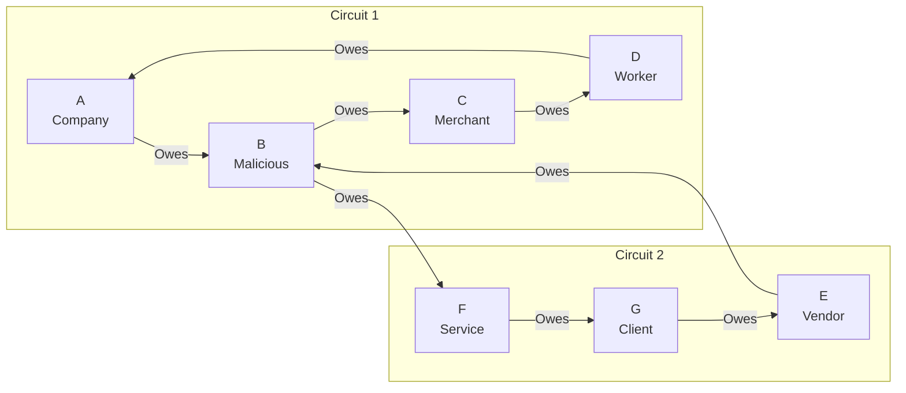

# Double-Commit Attack

## Origin and Documentation
**Source**: Hypothesized from distributed systems principles
- Primary Concept: Double-spending problem from cryptocurrency systems
- Supporting Reference: `ChipNet/doc/cluster.md` consensus protocol
  > Describes transaction locking and state validation
- Related Concept: Race conditions in distributed transactions

**Reasoning**: Any distributed credit system must prevent the same credits from being used multiple times simultaneously. Similar to double-spending in cryptocurrencies but in context of credit obligations.

## Mitigation Rating
**Status**: EFFECTIVELY MITIGATED
- Primary defense: Transaction locking during Promise phase
- Secondary defense: Referee validation and consensus
- Remaining exposure: Temporary resource locking during attempts
- Edge case: Complex timing attacks might cause extra validation overhead

**Rating Justification**:
1. Credits locked during Promise phase prevents parallel usage
2. Multiple referee validation ensures consistent state
3. Local database constraints provide additional protection
4. Attack attempts are clearly detectable
5. No financial risk due to layered validations

## Attack Description
A malicious node attempts to participate in multiple concurrent lift transactions using the same credits, trying to commit them simultaneously. This is analogous to a double-spending attack in traditional cryptocurrencies but in the context of credit obligations.

## Lift Type Applicability
- **Linear Lifts**: Vulnerable - attacker can attempt to make multiple payments using same credits
- **Circular Lifts**: Vulnerable - attacker can join multiple clearing circuits with same credits
- **Mixed Impact**: Attack is equally dangerous in both scenarios as it attempts to create multiple conflicting obligations

## Example Scenario
Using [Simple Circular Lift](../CONTEXT.md#scenario-2-simple-circular-lift) with a parallel attempt:

In this scenario:
1. Node B participates in two different lift circuits
2. B uses same credit capacity in both circuits
3. Attempts to get both lifts to commit phase simultaneously
4. If successful, creates obligations it cannot fulfill

## Nature of Attack
- **Primary Type**: Malicious (requires intentional misconduct)
- **Variants**:
  - Parallel circuit participation
  - Mixed linear/circular attempts
  - Coordinated multi-node attack
  - Time-delayed double commit

## Current System Resistance
ChipNet/MyCHIPs has several protections:

1. **Transaction Locking**:
   - Credits locked during Promise phase
   - Prevents concurrent usage
   - Enforced by local database constraints

2. **Referee Validation**:
   - Referees can detect concurrent lifts
   - Multiple referee consensus required
   - Time-window checking possible

3. **Partner Validation**:
   - Direct partners validate credit availability
   - Credit limits enforced locally
   - Transaction history maintained

## Damage Assessment

### Financial Impact
- **If Prevented**: No direct financial loss
- **If Successful**: 
  - Partners receive invalid credit promises
  - Double-obligation of same credits
  - Potential cascading defaults

### Network Impact
- **Performance**: Additional validation overhead
- **Throughput**: Possible legitimate transaction delays
- **Trust**: Damages network confidence if successful

### Accounting Impact
- **Credit Tracking**: Requires careful reconciliation
- **Balance Accuracy**: Could create phantom credits
- **Audit Trail**: Evidence of attempt preserved

## Additional Defenses

1. **Enhanced Credit Locking**:
   - Global credit usage tracking
   - Distributed lock management
   - Timeout-based lock release

2. **Circuit Analysis**:
   - Check for node participation in multiple circuits
   - Analyze credit capacity across circuits
   - Track historical lift patterns

3. **Timing Controls**:
   - Enforce minimum lift duration
   - Synchronize commit windows
   - Implement cool-down periods

## Open Questions

1. **Detection Optimization**:
   - How to efficiently detect parallel attempts?
   - What timing thresholds are appropriate?
   - Can we predict attack patterns?

2. **Recovery Process**:
   - How to handle partially committed lifts?
   - What is the correct rollback sequence?
   - How to compensate affected parties?

3. **Prevention Strategies**:
   - Should we limit concurrent lift participation?
   - How to balance security vs. legitimate use?
   - What reputation penalties are appropriate?

4. **Coordination Detection**:
   - How to identify coordinated attacks?
   - Can we detect time-delayed attempts?
   - What patterns indicate malicious intent?

## Related Attacks
- [False Promise Attack](false-promise.md)
- [Split Vote Attack](split-vote.md)
- [Replay Attacks](replay-attacks.md) 

## User Mitigation Practices

### Circuit Participation
1. **Partner Verification**
   - Only participate in lifts with known partners
   - Verify partner's trading history
   - Check partner's credit utilization
   - Monitor partner's lift patterns

2. **Circuit Analysis**
   - Limit circuit size
   - Avoid circuits with repeated nodes
   - Check for unusual circuit patterns
   - Verify circuit composition

3. **Timing Controls**
   - Set maximum promise duration
   - Monitor promise-to-commit delays
   - Track partner response times
   - Enforce timeout policies

### Value Management
1. **Credit Limits**
   - Set per-partner lift limits
   - Implement aggregate lift caps
   - Use graduated limit increases
   - Monitor concurrent lifts

2. **Resource Allocation**
   - Reserve credit capacity
   - Maintain lift diversity
   - Track resource commitments
   - Monitor pending promises

3. **Risk Distribution**
   - Spread lifts across partners
   - Vary lift timing
   - Diversify trading routes
   - Balance credit exposure

### Operational Controls
1. **Transaction Monitoring**
   - Track concurrent promises
   - Monitor partner behavior
   - Document lift patterns
   - Analyze timing anomalies

2. **Partner Assessment**
   - Review trading history
   - Check credit utilization
   - Monitor lift frequency
   - Evaluate partner reliability

3. **Recovery Planning**
   - Document resolution procedures
   - Maintain contact information
   - Know escalation paths
   - Understand legal options

These practices help individual users:
- Detect double-commit attempts
- Prevent resource overcommitment
- Maintain trading capacity
- Protect credit relationships 