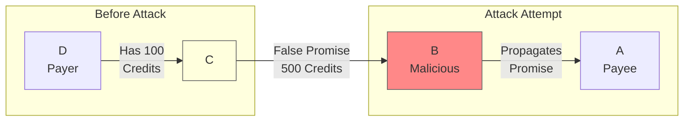

# False Promise Attack

## Origin and Documentation
**Source**: Derived from MyCHIPs credit validation requirements
- Primary Reference: `mychips/doc/learn-lift.md`
  > Discusses credit validation and promise requirements
- Supporting Reference: `ChipNet/doc/cluster.md`
  > Details about promise validation in consensus

**Reasoning**: Fundamental concern in credit-based systems - participants must not be able to create invalid credit obligations. Similar to traditional banking reserve requirements.

## Mitigation Rating
**Status**: SUBSTANTIALLY MITIGATED
- Primary defense: Credit validation during Promise phase
- Secondary defense: Partner verification and state validation
- Remaining exposure: Resource consumption during validation
- Edge case: Complex credit relationship validation

**Rating Justification**:
1. Direct partner oversight prevents invalid promises
2. Multiple validation layers catch attempts
3. Credit limits strictly enforced
4. Clear audit trail of attempts
5. Some performance impact but no financial risk

## Attack Description
A malicious node makes promises in a lift transaction that it cannot or does not intend to fulfill, attempting to manipulate the transaction state or create invalid credit obligations. This attack specifically targets the Promise phase of the lift protocol.

## Lift Type Applicability
- **Linear Lifts**: Primary target - attacker can make false payment promises
- **Circular Lifts**: Less impacted - credit clearing requires existing valid relationships
- **Mixed Impact**: More dangerous in linear lifts where new credit relationships are being established

## Example Scenario
Using [Simple Linear Lift](../CONTEXT.md#scenario-1-simple-linear-lift):



In this scenario:
1. Node B knows C only has 100 credits available
2. B makes false promise to transfer 500 credits
3. B attempts to:
   - Override credit limits
   - Create invalid obligations
   - Manipulate transaction state
4. Promise propagates to other nodes before validation

## Nature of Attack
- **Primary Type**: Malicious (requires intentional deception)
- **Variants**:
  - Credit limit violation
  - Balance misrepresentation
  - Capacity overstatement
  - Authorization forgery
  - Collateral misrepresentation

## Current System Resistance
ChipNet/MyCHIPs has several protections:

1. **Credit Validation**:
   - Balance verification
   - Limit enforcement
   - Capacity checking

2. **Promise Requirements**:
   - Digital signatures
   - Partner verification
   - State validation

3. **Local Controls**:
   - Direct partner oversight
   - Transaction history
   - Credit relationship validation

## Damage Assessment

### Financial Impact
- **Direct Loss**: Prevented by validation
- **Potential Risk**: Credit exposure if validation fails
- **Recovery Cost**: Resources spent on detection

### Network Impact
- **Performance**: Validation overhead
- **Reliability**: False promises waste resources
- **Trust**: Damages network confidence

### Accounting Impact
- **Balance Integrity**: Protected by validation
- **Credit Limits**: Must be strictly enforced
- **Audit Trail**: False attempts recorded

## Additional Defenses

1. **Enhanced Validation**:
   - Multi-stage promise checking
   - Cross-partner verification
   - History-based validation

2. **Credit Management**:
   - Stricter limit enforcement
   - Progressive credit building
   - Collateral requirements

3. **Reputation System**:
   - Track promise behavior
   - Rate partner reliability
   - Share reputation data

## Contract-Based Mitigations

### Legal Framework
The MyCHIPs tally contract directly addresses false promises through multiple provisions:

1. **Good Faith Requirement**
   - Explicit obligation:
     ```yaml
     "Each Party shall behave honestly and with integrity in the 
      transactions facilitated by the Tally. Neither Party shall 
      use the Tally to intentionally cheat, defraud, or steal 
      value from the other Party or any third parties."
     ```
   - Prohibits deceptive practices
   - Requires honest dealings
   - Enforces integrity

2. **Disclosure Requirements**
   ```yaml
   "Each Party shall honestly inform the other Party of information 
    relevant to its decision to execute this Tally and/or its 
    associated Pledges of Value... information about one's ability 
    or past performance in fulfilling Pledges of Value made to 
    other parties."
   ```
   - Mandates honest disclosure
   - Requires capability revelation
   - Enforces transparency
   - Prevents concealment

3. **Default Process**
   ```mermaid
   graph TD
       A[False Promise] --> B[Contract Breach]
       B --> C[Notice of Default]
       C --> D{Cured within<br/>10 days?}
       D -->|Yes| E[Resolution]
       D -->|No| F[Consequences]
       F --> G[Publication Rights]
       F --> H[Legal Action]
       F --> I[Alternative Payment]
       F --> J[Collateral Claims]
   ```

### Enforcement Mechanisms

1. **Direct Consequences**
   - Contract breach
   - Legal liability
   - Alternative payment requirement
   - Collateral forfeiture

2. **Network Effects**
   - Publication rights
   - Reputation damage
   - Network isolation
   - Trust degradation

3. **Recovery Options**
   - Multiple payment paths
   - Collateral execution
   - Legal enforcement
   - Reputation restoration

### Impact on Attack Assessment

1. **Mitigation Rating**: SUBSTANTIALLY MITIGATED
   - Technical protections
   - Plus contractual obligations
   - Plus legal framework
   - Plus reputation effects

2. **Attack Cost**:
   - Legal consequences
   - Reputation damage
   - Financial liability
   - Collateral loss

3. **Recovery Paths**:
   - Alternative payments
   - Collateral claims
   - Legal recourse
   - Reputation repair

## Contract Integration

### System Design Impact
1. **Protocol Layer**
   - Promise validation
   - Capability verification
   - State tracking
   - Evidence collection

2. **Contract Layer**
   - Legal framework
   - Disclosure requirements
   - Enforcement options
   - Resolution paths

3. **Social Layer**
   - Reputation system
   - Trust relationships
   - Network effects
   - Community standards

### Implementation Requirements

1. **Software Components**
   - Promise validation
   - Capability checking
   - State monitoring
   - Evidence tracking

2. **Legal Components**
   - Contract enforcement
   - Disclosure verification
   - Resolution tracking
   - Documentation management

3. **Operational Procedures**
   - Promise monitoring
   - Disclosure verification
   - Resolution handling
   - Documentation maintenance

## Practical Considerations

### Prevention Strategy
1. **Pre-Transaction**
   - Capability verification
   - History checking
   - Risk assessment
   - Collateral evaluation

2. **During Transaction**
   - Promise monitoring
   - State tracking
   - Evidence collection
   - Disclosure verification

3. **Post-Detection**
   - Breach documentation
   - Notice issuance
   - Resolution pursuit
   - Record maintenance

### Recovery Process

1. **Immediate Actions**
   - Document breach
   - Issue notice
   - Preserve evidence
   - Monitor response

2. **Resolution Phase**
   - Evaluate response
   - Process payments
   - Execute collateral
   - Document outcomes

3. **Enforcement Phase**
   - Publication decision
   - Legal action
   - Alternative payment
   - Collateral execution

## Open Questions

1. **Detection Methods**:
   - How to identify sophisticated false promises?
   - What patterns indicate deception?
   - How to validate complex credit relationships?

2. **Prevention Strategies**:
   - What additional checks needed?
   - How to handle edge cases?
   - Balance security vs. performance?

3. **Recovery Process**:
   - How to handle detected attempts?
   - What evidence to preserve?
   - When to adjust credit limits?

4. **Trust Management**:
   - How to rebuild trust after attempts?
   - What penalties are appropriate?
   - How to share reputation data?

## Related Attacks
- [Double-Commit Attack](double-commit.md)
- [Message Tampering](message-tampering.md)
- [Replay Attacks](replay-attacks.md) 

## User Mitigation Practices

### Partner Validation
1. **Relationship Requirements**
   - Establish real-world business relationships
   - Verify physical presence
   - Check business history
   - Document relationship basis

2. **Credit History**
   - Start with small transactions
   - Build credit gradually
   - Monitor trading patterns
   - Track promise fulfillment

3. **Business Verification**
   - Check business registration
   - Verify physical location
   - Review financial statements
   - Assess operational capacity

### Value Management
1. **Credit Limits**
   - Set conservative initial limits
   - Increase based on history
   - Consider relationship depth
   - Match to business volume

2. **Promise Controls**
   - Limit total promises
   - Set promise expiration
   - Monitor promise patterns
   - Track fulfillment rates

3. **Risk Distribution**
   - Diversify trading partners
   - Balance credit exposure
   - Maintain reserve capacity
   - Consider partner interdependence

### Operational Controls
1. **Transaction Monitoring**
   - Track promise patterns
   - Monitor fulfillment rates
   - Document exceptions
   - Analyze trends

2. **Documentation**
   - Keep relationship records
   - Document credit decisions
   - Maintain promise history
   - Record resolution patterns

3. **Recovery Planning**
   - Know legal recourse
   - Maintain collateral requirements
   - Document enforcement options
   - Plan for defaults

These practices help individual users:
- Prevent false promises
- Manage credit exposure
- Enable quick detection
- Maintain trading safety 