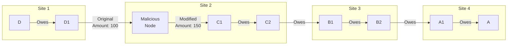

# Message Tampering Attack

## Origin and Documentation
**Source**: Hypothesized from cryptographic security principles
- Primary Concept: Message integrity in distributed systems
- Supporting Reference: `ChipNet/doc/cluster.md`
  > Discusses signature verification and message validation
- Related Concept: Man-in-the-middle attacks

**Reasoning**: Any distributed system must protect against message modification. Critical in financial systems where message integrity directly impacts value transfer.

## Mitigation Rating
**Status**: FULLY MITIGATED
- Primary defense: Cryptographic signatures on all messages
- Secondary defense: End-to-end message validation
- Remaining exposure: None for properly signed messages
- Edge case: Cryptographic algorithm vulnerabilities (theoretical)

**Rating Justification**:
1. All critical fields cryptographically protected
2. Tampering immediately detectable
3. Chain of custody verifiable
4. Strong cryptographic guarantees
5. No known practical attack vectors

## Attack Description
An attacker attempts to modify messages exchanged during a lift transaction, potentially altering credit amounts, routing information, or consensus messages. This attack targets the integrity of the transaction data rather than just its flow or timing.

## Lift Type Applicability
- **Linear Lifts**: Vulnerable - attacker can modify payment amounts or routing
- **Circular Lifts**: Vulnerable - attacker can alter clearing amounts or circuit structure
- **Mixed Impact**: Both types equally vulnerable, but circular lifts have more points of attack due to more participants

## Example Scenario
Using [Multi-Site Linear Lift](../CONTEXT.md#scenario-3-multi-site-linear-lift):

In this scenario:
1. Malicious node M intercepts lift messages
2. M attempts to modify transaction details:
   - Credit amounts
   - Routing information
   - Signature data
   - Consensus messages
3. Modified messages propagated to other nodes

## Nature of Attack
- **Primary Type**: Malicious (requires active interference)
- **Variants**:
  - Amount modification
  - Routing table corruption
  - Signature manipulation
  - Protocol message alteration
  - Metadata tampering

## Current System Resistance
ChipNet has strong cryptographic protections:

1. **Digital Signatures**:
   - All messages cryptographically signed
   - Signature covers all critical fields
   - Chain of custody verification

2. **Message Integrity**:
   - Cryptographic hashes
   - End-to-end encryption
   - Protocol version validation

3. **State Verification**:
   - Cross-node validation
   - Consensus requirements
   - Transaction replay protection

## Damage Assessment

### Financial Impact
- **Direct Loss**: None if properly detected
- **Potential Loss**: Severe if cryptography compromised
- **Recovery Cost**: Resources spent on detection/verification

### Network Impact
- **Integrity**: Attempted corruption of transaction data
- **Performance**: Additional verification overhead
- **Trust**: Potential loss of confidence

### Accounting Impact
- **Accuracy**: Protected by cryptographic verification
- **Audit**: Attack attempts clearly visible
- **Reconciliation**: May require investigation

## Additional Defenses

1. **Enhanced Validation**:
   - Multi-layer integrity checks
   - Cross-protocol verification
   - Redundant message paths

2. **Monitoring Systems**:
   - Real-time integrity checking
   - Pattern analysis
   - Anomaly detection

3. **Protocol Hardening**:
   - Version control enforcement
   - Schema validation
   - Field type checking

## Open Questions

1. **Attack Vectors**:
   - What message fields are most vulnerable?
   - How to protect metadata?
   - What new attack patterns might emerge?

2. **Detection Methods**:
   - How quickly can tampering be detected?
   - What patterns indicate tampering?
   - How to distinguish from corruption?

3. **Prevention Strategies**:
   - What additional integrity checks needed?
   - How to handle protocol upgrades?
   - What fields need extra protection?

4. **Recovery Process**:
   - How to handle detected tampering?
   - What evidence to preserve?
   - When to trigger investigation?

## Related Attacks
- [Replay Attacks](replay-attacks.md)
- [False Promise Attack](false-promise.md)
- [Double-Commit Attack](double-commit.md) 