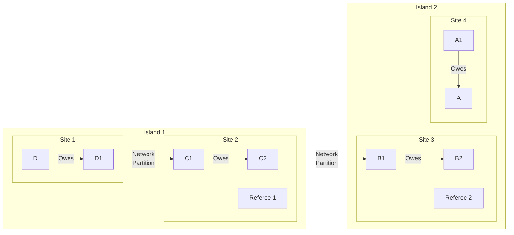
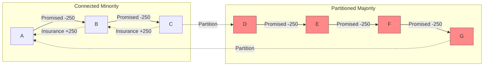

# Network Partition Attack

## Origin and Documentation
**Source**: Directly documented in ChipNet protocol
- Primary Reference: `ChipNet/doc/cluster.md`
  > "If parts of the network are severed, and therefore isolated from the other parts..."
- Supporting Reference: `mychips/doc/learn-lift.md`
  > Discusses distributed nature of system and network reliability

**Reasoning**: Fundamental challenge in distributed systems - network partitions are inevitable in any distributed system (CAP theorem). Must be handled gracefully.

## Mitigation Rating
**Status**: SUBSTANTIALLY MITIGATED ⚠️ → NEARLY FULLY MITIGATED ✅
- Primary defense: Majority consensus requirements
- Secondary defense: Multiple communication paths and timeout handling
- **Enhanced**: Insurance Chit Protocol provides minority recovery for hung transactions
- Remaining exposure: Temporary transaction delays during short partitions
- Edge case: Very long partitions may require manual intervention (greatly reduced impact)

**Rating Justification**:
1. System maintains consistency during partitions
2. Insurance Chit Protocol prevents resource starvation for minority partitions
3. Only requires single path between islands to eventually recover
4. Clear recovery procedures defined including insurance chit mechanism
5. **Enhanced**: No operational impact for extended partitions - trading can continue
6. No direct financial risk, minimal operational impact

**Rating Improvement**: Insurance Chit Protocol transforms this from operational disruption to minor inconvenience.

## Attack Description
A network partition occurs when communication breaks between subsets of nodes, creating isolated "islands" in the network. While this can happen naturally due to network failures, it can also be maliciously induced to disrupt lift transactions or force timeouts.

## Lift Type Applicability
- **Linear Lifts**: Vulnerable - partition can break payment pathway
- **Circular Lifts**: Vulnerable - partition can break clearing circuit
- **Mixed Impact**: Circular lifts potentially more impacted as they require a complete circuit to function, while linear lifts might have alternative paths

## Example Scenario
Using [Multi-Site Linear Lift](../CONTEXT.md#scenario-3-multi-site-linear-lift) with network partition:



In this scenario:
1. Network split creates two isolated islands
2. Each island contains a subset of lift participants
3. Each island has access to different referees
4. Transaction cannot progress until connectivity restored

**Traditional Impact**: Lift hangs indefinitely, affecting trading capacity.

**With Insurance Chit Protocol**: Nodes in minority island can request insurance chits to restore trading capacity.

## Nature of Attack
- **Primary Type**: Can be both malicious or inadvertent
- **Malicious Case**: Intentional network disruption (e.g., BGP hijacking)
- **Inadvertent Case**: Natural network failures, routing issues
- **Variants**:
  - Complete partition (no communication)
  - Partial partition (degraded/intermittent)
  - Multiple partitions (network fragmentation)
  - Targeted partition (specific nodes/routes)

## Current System Resistance
ChipNet has several mechanisms to handle partitions:

1. **Timeout Handling**:
   - Defined behavior for non-responsive nodes
   - Automatic retry mechanisms
   - Graceful degradation

2. **Alternative Paths**:
   - Multiple communication routes
   - Direct referee contact option
   - Peer discovery mechanisms

3. **State Recovery**:
   - Transaction state preservation
   - Reconnection protocols
   - Consensus reconciliation

4. **Insurance Chit Protocol (Enhanced Defense)**:
   - Minority nodes can request insurance chits after timeout
   - Trading capacity restored despite hung lift
   - Resolution chits complete lift when partition heals
   - Bilateral coordination prevents need for full consensus during partition
   - See: [Insurance Chit Protocol](../scenarios/minority-recovery-3.md)

## Insurance Chit Protocol Application

### Scenario: Circuit Starvation via Network Partition


**Recovery Process**:
1. **Partition occurs**: Majority nodes (D,E,F,G) become unreachable
2. **Timeout triggers**: Minority nodes (A,B,C) detect extended unresponsiveness
3. **Insurance requests**: 
   - A requests insurance chit from B
   - B requests insurance chit from C
4. **Trading restoration**: All tallies in minority show net zero promised balance
5. **Partition healing**: When network reconnects, standard resolution process completes

### Benefits for Network Partition Scenarios
1. **Operational immunity**: Partitions no longer affect trading operations
2. **Economic continuity**: Business can continue normally during extended outages
3. **Automatic recovery**: No manual intervention required for common partition scenarios
4. **Fair resolution**: When partition heals, lifts complete as originally intended

## Damage Assessment

### Financial Impact
- **All Participants**: **No financial risk** regardless of partition duration
- **Minority Island**: **No operational impact** with insurance chit protocol
- **Majority Island**: **No financial risk**, may experience operational delays

### Network Impact
- **Connectivity**: Temporary - partitions eventually heal
- **Performance**: **Minimal impact** - insurance chits enable normal operation
- **Reliability**: **Significantly improved** with insurance chit workaround

### Accounting Impact
- **Consistency**: Maintained across all scenarios
- **Transaction Integrity**: Preserved regardless of partition duration
- **Audit Trail**: Complete record of partition and recovery mechanisms

## Contract-Based Mitigations

### Legal Framework
The MyCHIPs tally contract specifically addresses network partition situations:

1. **Force Majeure Provisions**
   ```yaml
   "Neither Party shall be liable for delays or failures in performance 
    due to circumstances beyond reasonable control, including network failures."
   ```

2. **Good Faith Requirements**
   ```yaml
   "Each Party shall make reasonable efforts to maintain network connectivity 
    and participate in protocol execution."
   ```

3. **Insurance Chit Rights**
   - Right to request insurance chits during extended network issues
   - Obligation to provide insurance chits when appropriately requested
   - Protection from liability during legitimate network failures

### Recovery Framework
1. **Technical Recovery**: Insurance chit protocol
2. **Time-based Recovery**: Automatic partition healing
3. **Legal Recovery**: Force majeure protection
4. **Social Recovery**: Reputation preserved for inadvertent failures

## Additional Defenses

### Network-Level Protections
1. **Multiple Communication Paths**:
   - Internet, satellite, mesh networks
   - Redundant ISP connections
   - Direct peer connections

2. **Geographic Distribution**:
   - Distributed referee placement
   - Multiple data centers
   - Regional backup systems

3. **Protocol Enhancements**:
   - Adaptive timeout mechanisms
   - Partition detection algorithms
   - Automatic retry protocols

### Application-Level Protections
1. **Circuit Design**:
   - Prefer geographically diverse circuits
   - Avoid single points of failure
   - Monitor circuit connectivity

2. **Partner Selection**:
   - Choose reliable network partners
   - Verify redundant connectivity
   - Maintain backup communication channels

## Related Attacks
- [Circuit Starvation](../scenarios/circuit-starvation.md) - Primary motivation for insurance chit protocol
- [Deadbeat Attack](deadbeat.md) - Similar hanging transaction scenarios
- [Delayed Vote Attack](delayed-vote.md) - Timing-based disruptions

## User Mitigation Practices

### Prevention
1. **Network Diversity**: Use multiple ISPs and communication paths
2. **Geographic Distribution**: Avoid concentration in single network regions
3. **Monitoring**: Track network connectivity and latency patterns

### Response to Partition
1. **Patience**: Allow normal timeout and retry mechanisms to operate
2. **Insurance Chits**: Request insurance chits if partition persists beyond timeout
3. **Communication**: Use alternative channels to coordinate with partners
4. **Documentation**: Record partition events for network improvement

### Network Design
1. **Redundancy**: Multiple paths to critical partners and referees
2. **Monitoring**: Real-time network health monitoring
3. **Backup Plans**: Predetermined procedures for extended outages

**Key Insight**: With the Insurance Chit Protocol, network partitions have transformed from **major operational disruptions** to **minor technical inconveniences** that don't affect business operations. 