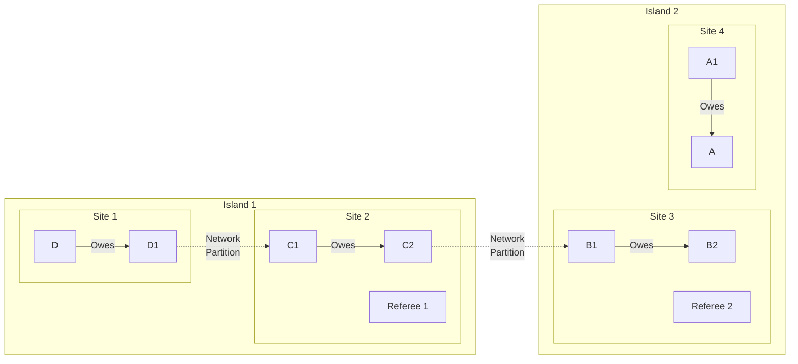

# Network Partition Attack

## Origin and Documentation
**Source**: Directly documented in ChipNet protocol
- Primary Reference: `ChipNet/doc/cluster.md`
  > "If parts of the network are severed, and therefore isolated from the other parts..."
- Supporting Reference: `mychips/doc/learn-lift.md`
  > Discusses distributed nature of system and network reliability

**Reasoning**: Fundamental challenge in distributed systems - network partitions are inevitable in any distributed system (CAP theorem). Must be handled gracefully.

## Mitigation Rating
**Status**: SUBSTANTIALLY MITIGATED
- Primary defense: Majority consensus requirements
- Secondary defense: Multiple communication paths and timeout handling
- Remaining exposure: Transaction delays during partition
- Edge case: Long-term partitions could lock resources

**Rating Justification**:
1. System maintains consistency during partitions
2. Resources eventually released through timeouts
3. Only requires single path between islands to recover
4. Clear recovery procedures defined
5. No direct financial risk, only operational impact

## Attack Description
A network partition occurs when communication breaks between subsets of nodes, creating isolated "islands" in the network. While this can happen naturally due to network failures, it can also be maliciously induced to disrupt lift transactions or force timeouts.

## Lift Type Applicability
- **Linear Lifts**: Vulnerable - partition can break payment pathway
- **Circular Lifts**: Vulnerable - partition can break clearing circuit
- **Mixed Impact**: Circular lifts potentially more impacted as they require a complete circuit to function, while linear lifts might have alternative paths

## Example Scenario
Using [Multi-Site Linear Lift](../CONTEXT.md#scenario-3-multi-site-linear-lift) with network partition:



In this scenario:
1. Network split creates two isolated islands
2. Each island contains a subset of lift participants
3. Each island has access to different referees
4. Transaction cannot progress until connectivity restored

## Nature of Attack
- **Primary Type**: Can be both malicious or inadvertent
- **Malicious Case**: Intentional network disruption (e.g., BGP hijacking)
- **Inadvertent Case**: Natural network failures, routing issues
- **Variants**:
  - Complete partition (no communication)
  - Partial partition (degraded/intermittent)
  - Multiple partitions (network fragmentation)
  - Targeted partition (specific nodes/routes)

## Current System Resistance
ChipNet has several mechanisms to handle partitions:

1. **Timeout Handling**:
   - Defined behavior for non-responsive nodes
   - Automatic retry mechanisms
   - Graceful degradation

2. **Alternative Paths**:
   - Multiple communication routes
   - Direct referee contact option
   - Peer discovery mechanisms

3. **State Recovery**:
   - Transaction state preservation
   - Reconnection protocols
   - Consensus reconciliation

## Contract-Based Mitigations

### Legal Framework
The MyCHIPs tally contract specifically addresses network partition situations:

1. **Resolution Requirement**
   - Explicit obligation:
     ```yaml
     "Should a Party fail, within the applicable Call Terms, to provide or 
      maintain suitable connections and contributions to satisfy one or more 
      outstanding Pledges of Value by way of Credit Lifts, it shall provide 
      payment upon demand in some other medium satisfactory to the Receiver."
     ```
   - Alternative payment paths
   - Clear resolution mechanism
   - Enforced connectivity duty

2. **Good Faith Requirements**
   ```yaml
   "Each Party shall make reasonable efforts to use software which 
    faithfully executes the MyCHIPs protocol... Each Party's server, 
    having completed the conditional phase of a Lift transaction, 
    shall then make every effort to commit the final phase"
   ```
   - Requires connectivity maintenance
   - Mandates protocol compliance
   - Enforces resolution efforts

3. **Resolution Process**
   ```mermaid
   graph TD
       A[Network Partition] --> B[Connection Failure]
       B --> C[Resolution Attempt]
       C --> D{Credit Lift<br/>Possible?}
       D -->|Yes| E[Normal Resolution]
       D -->|No| F[Alternative Payment]
       F --> G[Government Currency]
       F --> H[Precious Commodities]
       F --> I[Acceptable Product]
   ```

### Enforcement Mechanisms

1. **Direct Resolution**
   - Alternative payment requirements
   - Multiple payment options:
     - Government currency
     - Precious commodities
     - Acceptable product
   - Reasonable acceptance duty
   - Legal enforcement rights

2. **Network Effects**
   - Connection requirements
   - Protocol compliance
   - Resolution obligations
   - Reputation impact

3. **Recovery Options**
   - Multiple payment paths
   - Alternative mediums
   - Legal recourse
   - Reputation restoration

### Impact on Attack Assessment

1. **Mitigation Rating**: SUBSTANTIALLY MITIGATED
   - Technical protections
   - Plus contractual obligations
   - Plus alternative paths
   - Plus legal framework

2. **Attack Cost**:
   - Alternative payment obligation
   - Legal liability
   - Reputation damage
   - Network isolation

3. **Recovery Paths**:
   - Alternative payments
   - Multiple mediums
   - Legal enforcement
   - Reputation repair

## Contract Integration

### System Design Impact
1. **Protocol Layer**
   - Connection monitoring
   - Partition detection
   - Resolution tracking
   - State management

2. **Contract Layer**
   - Resolution requirements
   - Alternative paths
   - Enforcement options
   - Payment flexibility

3. **Social Layer**
   - Reputation effects
   - Trust relationships
   - Network obligations
   - Community standards

### Implementation Requirements

1. **Software Components**
   - Partition detection
   - Resolution tracking
   - Payment handling
   - State management

2. **Legal Components**
   - Contract enforcement
   - Resolution documentation
   - Payment verification
   - Compliance tracking

3. **Operational Procedures**
   - Connection monitoring
   - Resolution initiation
   - Payment processing
   - Documentation maintenance

## Practical Considerations

### Prevention Strategy
1. **Pre-Transaction**
   - Connection assessment
   - Partner verification
   - Risk evaluation
   - Backup planning

2. **During Partition**
   - Detection mechanisms
   - Resolution attempts
   - Alternative paths
   - State tracking

3. **Post-Resolution**
   - Payment processing
   - Documentation
   - State reconciliation
   - Relationship maintenance

### Recovery Process

1. **Immediate Actions**
   - Detect partition
   - Attempt resolution
   - Document situation
   - Notify partners

2. **Resolution Phase**
   - Evaluate options
   - Process payments
   - Track progress
   - Document outcomes

3. **Normalization Phase**
   - Restore connections
   - Reconcile state
   - Update relationships
   - Document resolution

## Damage Assessment

### Financial Impact
- **Direct Loss**: None if properly handled
- **Indirect Costs**:
  - Delayed transactions
  - Locked credits during partition
  - Potential opportunity costs

### Network Impact
- **Availability**: Reduced transaction completion rate
- **Latency**: Increased transaction times
- **Efficiency**: Resource consumption from retries

### Accounting Impact
- **Consistency**: Temporary divergence possible
- **Reconciliation**: Required after partition heals
- **Audit**: Clear evidence of network issues

## Additional Defenses

1. **Network Diversity**:
   - Multiple communication paths
   - Protocol-level redundancy
   - Geographic distribution

2. **Partition Detection**:
   - Network health monitoring
   - Connectivity testing
   - Early warning systems

3. **Recovery Automation**:
   - State synchronization
   - Transaction reconciliation
   - Automatic failover

## Open Questions

1. **Partition Detection**:
   - How quickly can partitions be detected?
   - What metrics indicate partition?
   - How to distinguish from other failures?

2. **Recovery Strategy**:
   - Optimal timeout parameters?
   - When to attempt alternative paths?
   - How to prioritize pending transactions?

3. **Prevention Methods**:
   - Network diversity requirements?
   - Redundancy vs. cost tradeoffs?
   - Geographic distribution guidelines?

4. **Impact Analysis**:
   - Maximum safe partition duration?
   - Resource allocation during partition?
   - Performance impact of mitigation?

## Related Attacks
- [Delayed Vote Attack](delayed-vote.md)
- [Selective Communication](selective-communication.md)
- [Deadbeat Attack](deadbeat.md) 

## User Mitigation Practices

### Network Diversity
1. **Connection Requirements**
   - Maintain multiple internet connections
   - Use different network providers
   - Consider geographic diversity
   - Have backup communication paths

2. **Partner Selection**
   - Prefer partners with robust connectivity
   - Verify business continuity plans
   - Check network infrastructure
   - Consider geographic location

3. **Technical Setup**
   - Configure automatic failover
   - Set up redundant DNS
   - Use multiple entry points
   - Implement backup systems

### Operational Controls
1. **Lift Timing**
   - Schedule critical lifts during stable periods
   - Avoid known maintenance windows
   - Consider partner time zones
   - Set appropriate timeouts

2. **Value Management**
   - Limit exposure during network instability
   - Set lower limits for remote partners
   - Consider partner connectivity in limits
   - Maintain reserve capacity

3. **Monitoring**
   - Track network health
   - Monitor connection quality
   - Document outage patterns
   - Keep performance history

### Recovery Preparation
1. **Communication Alternatives**
   - Maintain offline contact details
   - Have backup communication methods
   - Know partner escalation paths
   - Keep emergency contacts updated

2. **Business Continuity**
   - Plan for extended outages
   - Maintain trading alternatives
   - Document recovery procedures
   - Test backup systems

3. **Documentation**
   - Record network issues
   - Track resolution times
   - Document impact patterns
   - Maintain incident logs

These practices help individual users:
- Minimize partition impact
- Enable faster recovery
- Maintain trading capability
- Reduce operational risk 