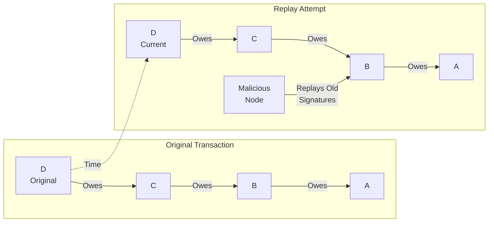

# Replay Attacks

## Origin and Documentation
**Source**: Hypothesized from distributed systems security principles
- Primary Concept: Message replay protection in distributed protocols
- Supporting Reference: `ChipNet/doc/cluster.md`
  > Discusses transaction identifiers and state tracking
- Related Concept: Nonce usage in cryptographic protocols

**Reasoning**: Standard attack vector in distributed systems. Any system handling valuable transactions must prevent message replay to maintain transaction uniqueness.

## Mitigation Rating
**Status**: FULLY MITIGATED
- Primary defense: Unique transaction IDs and timestamps
- Secondary defense: State transition validation
- Remaining exposure: None for properly implemented nodes
- Edge case: Clock synchronization issues (handled by protocol)

**Rating Justification**:
1. Each transaction cryptographically unique
2. State tracking prevents replay
3. Timestamps provide additional protection
4. Protocol enforces message ordering
5. No known practical replay vectors

## Attack Description
An attacker captures valid lift transaction messages and attempts to replay them later, trying to reuse previously valid signatures, promises, or consensus messages. This attack attempts to exploit the distributed nature of the system by reintroducing old but valid messages.

## Lift Type Applicability
- **Linear Lifts**: Vulnerable - attacker can attempt to replay payment authorizations
- **Circular Lifts**: Vulnerable - attacker can try to reuse clearing circuit validations
- **Mixed Impact**: Both types affected similarly, with focus on reusing authorization signatures

## Example Scenario
Using [Simple Linear Lift](../CONTEXT.md#scenario-1-simple-linear-lift):

In this scenario:
1. Attacker captures valid messages from original transaction
2. Later attempts to replay these messages in new context:
   - Promise signatures
   - Commit votes
   - Authorization tokens
3. Tries to make old messages appear current
4. May modify timestamps or sequence numbers

## Nature of Attack
- **Primary Type**: Malicious (requires message capture and replay)
- **Variants**:
  - Full transaction replay
  - Partial message replay
  - Modified timestamp replay
  - Cross-transaction message reuse
  - Delayed message injection

## Current System Resistance
ChipNet includes several anti-replay protections:

1. **Transaction Identifiers**:
   - Unique transaction IDs
   - Timestamp validation
   - Sequence numbering

2. **State Tracking**:
   - Transaction history maintained
   - Message ordering enforced
   - State transition validation

3. **Cryptographic Protection**:
   - Nonce inclusion
   - Time-bound signatures
   - Session-specific keys

## Damage Assessment

### Financial Impact
- **Direct Loss**: None if properly detected
- **Potential Loss**: Could duplicate transactions if successful
- **Resource Cost**: System overhead for replay protection

### Network Impact
- **Performance**: Additional validation overhead
- **Bandwidth**: Wasted on replay attempts
- **Storage**: Transaction history requirements

### Accounting Impact
- **Consistency**: Protected by replay detection
- **History**: Attack attempts logged
- **Verification**: Additional checking required

## Additional Defenses

1. **Enhanced Validation**:
   - Stricter timestamp checks
   - Cross-node verification
   - History-based validation

2. **Protocol Hardening**:
   - Improved nonce generation
   - Better sequence tracking
   - Transaction expiration

3. **Monitoring Systems**:
   - Pattern detection
   - Anomaly identification
   - Real-time alerting

## Open Questions

1. **Detection Methods**:
   - How long to maintain history?
   - What patterns indicate replay?
   - How to handle clock skew?

2. **Prevention Strategies**:
   - Optimal nonce design?
   - Transaction lifetime limits?
   - History pruning rules?

3. **Performance Impact**:
   - History storage requirements?
   - Validation overhead costs?
   - Scalability concerns?

4. **Edge Cases**:
   - Valid message reuse scenarios?
   - Recovery from failed lifts?
   - Network partition handling?

## Related Attacks
- [Message Tampering](message-tampering.md)
- [Double-Commit Attack](double-commit.md)
- [False Promise Attack](false-promise.md) 