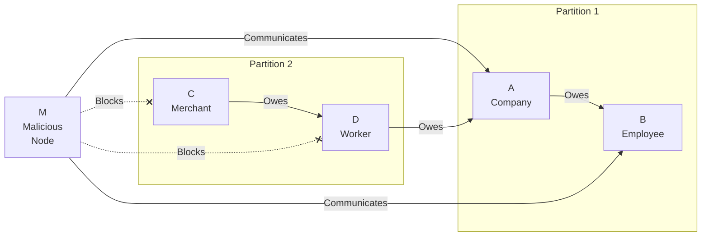

# Selective Communication Attack

## Origin and Documentation
**Source**: Derived from ChipNet protocol with extension
- Primary Reference: `ChipNet/doc/cluster.md`
  > Discusses network splits and communication paths
- Supporting Reference: `mychips/doc/learn-lift.md`
  > Details about distributed communication requirements

**Reasoning**: More sophisticated variant of network partition attack, where node intentionally creates information asymmetry. Common consideration in Byzantine fault tolerance.

## Mitigation Rating
**Status**: PARTIALLY MITIGATED
- Primary defense: Multiple communication paths
- Secondary defense: State verification and reconciliation
- Remaining exposure: Information delays and inconsistency
- Edge case: Strategic isolation of specific nodes

**Rating Justification**:
1. Alternative paths provide redundancy
2. State reconciliation catches divergence
3. Detection mechanisms need improvement
4. Manual intervention may be required
5. Impact primarily operational, not financial

## Attack Description
A malicious node or referee communicates selectively with different participants, creating information asymmetry in the network. This can be used to manipulate transaction timing, create inconsistent views of the network state, or facilitate other attacks.

## Lift Type Applicability
- **Linear Lifts**: Vulnerable - attacker can disrupt payment path by isolating nodes
- **Circular Lifts**: Vulnerable - attacker can break circuit consensus by partitioning communication
- **Mixed Impact**: More damaging in circular lifts where consensus among all participants is critical

## Example Scenario
Using [Simple Circular Lift](../CONTEXT.md#scenario-2-simple-circular-lift):

In this scenario:
1. Malicious node M acts as intermediary
2. M maintains communication with Partition 1 (A, B)
3. M selectively blocks communication with Partition 2 (C, D)
4. Creates inconsistent views of transaction state
5. Can manipulate timing and consensus

## Nature of Attack
- **Primary Type**: Malicious (requires intentional misconduct)
- **Variants**:
  - Selective node isolation
  - Information filtering
  - Delayed propagation to subset
  - False status reporting

## Current System Resistance
ChipNet includes several protections:

1. **Multiple Communication Paths**:
   - Redundant routing options
   - Direct referee contact
   - Peer discovery mechanisms

2. **State Verification**:
   - Cross-node validation
   - Consensus requirements
   - State reconciliation

3. **Network Monitoring**:
   - Communication pattern analysis
   - Connection health checks
   - Timeout detection

## Damage Assessment

### Financial Impact
- **Direct Loss**: None if properly handled
- **Indirect Costs**:
  - Transaction delays
  - Resource waste
  - Operational inefficiency

### Network Impact
- **Consistency**: Temporary state divergence
- **Performance**: Increased latency
- **Reliability**: Reduced success rate

### Accounting Impact
- **State Management**: Requires reconciliation
- **Transaction Timing**: Unpredictable delays
- **Audit Trail**: Attack patterns visible

## Additional Defenses

1. **Communication Verification**:
   - Mandatory acknowledgments
   - Message receipt tracking
   - Path diversity requirements

2. **Pattern Detection**:
   - Communication analysis
   - Behavior profiling
   - Anomaly detection

3. **Routing Enhancement**:
   - Dynamic path selection
   - Reputation-based routing
   - Automatic path failover

## Open Questions

1. **Detection Methods**:
   - How to identify selective behavior?
   - What patterns indicate attack?
   - How to measure communication fairness?

2. **Prevention Strategies**:
   - Required communication patterns?
   - Minimum connectivity standards?
   - Path diversity requirements?

3. **Recovery Process**:
   - When to trigger alternative paths?
   - How to restore consistency?
   - What penalties are appropriate?

4. **Impact Analysis**:
   - Performance vs. security tradeoffs?
   - Resource costs of redundancy?
   - Optimal timeout parameters?

## Related Attacks
- [Network Partition](network-partition.md)
- [Delayed Vote Attack](delayed-vote.md)
- [Signature Withholding](signature-withholding.md) 

## User Mitigation Practices

### Communication Strategy
1. **Path Diversity**
   - Establish multiple communication routes
   - Use different network paths
   - Maintain alternative channels
   - Verify path independence

2. **Partner Requirements**
   - Verify communication capabilities
   - Check infrastructure redundancy
   - Assess communication patterns
   - Review reliability history

3. **Network Design**
   - Implement redundant connections
   - Use multiple service providers
   - Configure automatic failover
   - Plan for path failures

### Information Verification
1. **Status Checking**
   - Verify message delivery
   - Cross-validate information
   - Check partner status directly
   - Monitor communication patterns

2. **Consistency Validation**
   - Compare information sources
   - Verify transaction status
   - Check partner confirmations
   - Monitor state consistency

3. **Documentation**
   - Record communication attempts
   - Log delivery confirmations
   - Track message patterns
   - Document inconsistencies

### Circuit Management
1. **Partner Selection**
   - Prefer reliable communicators
   - Check communication history
   - Verify infrastructure quality
   - Consider geographic location

2. **Value Controls**
   - Limit exposure to poor communicators
   - Scale value to reliability
   - Consider communication quality
   - Set appropriate limits

3. **Timing Management**
   - Allow for verification time
   - Set communication timeouts
   - Plan for delays
   - Monitor response times

These practices help individual users:
- Detect selective behavior
- Maintain communication quality
- Ensure information consistency
- Reduce operational risk 