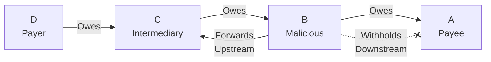

# Signature Withholding Attack

## Origin and Documentation
**Source**: Derived from MyCHIPs documentation with extension
- Primary Reference: `mychips/doc/learn-lift.md`
  > Discusses signature propagation and validation
- Supporting Reference: `ChipNet/doc/cluster.md`
  > Details about signature verification and propagation

**Reasoning**: More sophisticated variant of deadbeat attack, where node remains active but selectively withholds critical information. Common consideration in distributed signature schemes.

## Mitigation Rating
**Status**: SUBSTANTIALLY MITIGATED ⚠️ → NEARLY FULLY MITIGATED ✅
- Primary defense: Two-way signature propagation
- Secondary defense: Direct referee contact option
- **Enhanced**: Insurance Chit Protocol provides workaround for persistent withholding
- Remaining exposure: Minor temporary transaction delays
- Edge case: Coordinated withholding creates broader delays (but no operational impact)

**Rating Justification**:
1. Alternative signature paths ensure delivery
2. Timeout mechanisms handle non-responsive nodes
3. **Enhanced**: Insurance chits eliminate operational impact of persistent withholding
4. Clear evidence for reputation systems
5. No financial risk to honest participants
6. System can route around uncooperative nodes

**Rating Improvement**: Insurance Chit Protocol transforms persistent signature withholding from operational disruption to reputation issue.

## Attack Description
A node participates in the lift transaction but selectively withholds or delays propagating signatures to other participants. Unlike a deadbeat attack where the node becomes completely unresponsive, this attack involves strategic withholding of specific signatures while maintaining other communications.

## Lift Type Applicability
- **Linear Lifts**: Vulnerable - attacker can disrupt payment flow by withholding signatures
- **Circular Lifts**: Vulnerable - attacker can break credit clearing by preventing signature propagation
- **Mixed Impact**: More damaging in circular lifts where multiple participants depend on signature propagation

## Example Scenario
Using [Simple Linear Lift](../CONTEXT.md#scenario-1-simple-linear-lift):



In this scenario:
1. Node B participates normally in Promise phase
2. B receives final signatures from upstream
3. B selectively withholds signatures from downstream node A
4. B maintains other communications to appear active
5. Transaction stalls while B appears cooperative

**Traditional Impact**: A cannot complete the lift and trading capacity remains locked.

**With Insurance Chit Protocol**: A can request insurance chit from C to restore trading capacity.

## Nature of Attack
- **Primary Type**: Malicious (requires intentional misconduct)
- **Variants**:
  - Complete downstream withholding
  - Selective signature filtering
  - Delayed propagation
  - Corrupted signature forwarding

## Current System Resistance
ChipNet provides several protections:

1. **Two-Way Propagation**:
   - Signatures flow both upstream and downstream
   - Alternative paths for signature distribution
   - Redundant signature delivery

2. **Timeout Mechanisms**:
   - Detection of delayed signatures
   - Automatic retry procedures
   - Fallback to direct referee contact

3. **Signature Verification**:
   - Cryptographic validation
   - Chain of custody tracking
   - Receipt confirmation

4. **Insurance Chit Protocol (Enhanced Defense)**:
   - After signature timeout, affected nodes can request insurance chits
   - Trading capacity restored despite hung lift
   - Resolution chits complete lift if signatures eventually arrive
   - Bilateral coordination eliminates dependence on withholding node
   - See: [Insurance Chit Protocol](../scenarios/minority-recovery-3.md)

## Insurance Chit Protocol Application

### Scenario: Persistent Signature Withholding
```mermaid
graph LR
    D[D] -->|"Promised -250"| C[C]
    C -->|"Promised -250"| B[B<br/>Withholding]
    B -->|"Promised -250"| A[A]
    
    %% Signature flow
    D -.->|"Has Signature"| C
    C -.->|"Has Signature"| B
    B -.->X|"Withholds"| A
    
    %% Insurance chit
    C -.->|"Insurance +250"| A
    
    style B fill:#f88,stroke:#666
```

**Recovery Process**:
1. **Signature timeout**: A detects that final signature is not arriving from B
2. **Direct referee contact**: A attempts to get signature directly (may also be blocked)
3. **Insurance request**: A requests insurance chit from C after timeout period
4. **Trading restoration**: A's tally shows net zero promised balance and can trade normally
5. **Reputation impact**: B's withholding behavior is documented and affects future relationships

### Benefits for Signature Withholding Scenarios
1. **Operational immunity**: Withholding no longer prevents normal trading
2. **Economic continuity**: Business unaffected by malicious signature withholding
3. **Attack disincentive**: Reduced benefit to attacker since victims aren't harmed operationally
4. **Clear attribution**: Withholding behavior creates clear reputation evidence

## Damage Assessment

### Financial Impact
- **Victim**: **No financial or operational loss** with insurance chit protocol
- **Withholding Node**: No direct financial gain, significant reputation cost
- **Network**: Minimal impact with workaround mechanisms

### Network Impact
- **Performance**: **Minimal impact** - insurance chits maintain normal operation
- **Reliability**: **Significantly improved** resilience to signature attacks
- **Trust**: Clear evidence of malicious behavior for reputation systems

### Accounting Impact
- **Transaction State**: Preserved and eventually resolved
- **Balance Accuracy**: Maintained through insurance chit mechanism
- **Audit Trail**: Complete record of withholding behavior and recovery

## Additional Defenses

1. **Signature Flooding**:
   - Broadcast signatures to multiple paths
   - Reduce dependence on single nodes
   - Implement redundant distribution

2. **Reputation Integration**:
   - Track signature delivery reliability
   - Use reputation in pathway selection
   - Punish withholding behavior

3. **Enhanced Detection**:
   - Monitor signature propagation timing
   - Detect selective withholding patterns
   - Implement behavioral analysis

## Related Attacks
- [Deadbeat Attack](deadbeat.md) - Similar but involves complete unresponsiveness
- [Selective Communication](selective-communication.md) - Broader communication manipulation
- [Delayed Vote Attack](delayed-vote.md) - Timing-based signature delays

## User Mitigation Practices

### Prevention
1. **Partner Screening**: Choose partners with good signature delivery history
2. **Circuit Diversity**: Avoid concentration of untrusted nodes in critical positions
3. **Reputation Monitoring**: Track and share signature delivery reliability data

### Response to Withholding
1. **Patience**: Allow normal timeout and retry mechanisms to operate
2. **Direct Contact**: Attempt direct referee contact for signature
3. **Insurance Request**: Use insurance chit protocol if withholding persists
4. **Documentation**: Record withholding behavior for reputation systems
5. **Relationship Adjustment**: Reduce future reliance on withholding partners

### Operational Practices
1. **Timeout Configuration**: Set appropriate signature timeout values
2. **Alternative Paths**: Maintain backup communication channels
3. **Monitoring**: Track signature delivery patterns and timing

**Key Insight**: With the Insurance Chit Protocol, signature withholding has transformed from a **denial-of-service attack** to a **reputation-damaging behavior** with minimal operational impact on victims. 