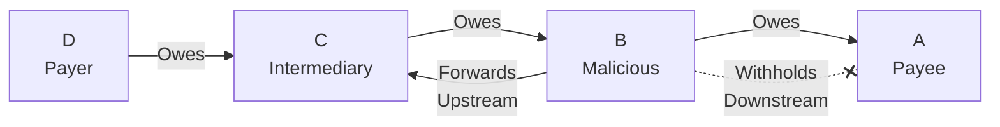

# Signature Withholding Attack

## Origin and Documentation
**Source**: Derived from MyCHIPs documentation with extension
- Primary Reference: `mychips/doc/learn-lift.md`
  > Discusses signature propagation and validation
- Supporting Reference: `ChipNet/doc/cluster.md`
  > Details about signature verification and propagation

**Reasoning**: More sophisticated variant of deadbeat attack, where node remains active but selectively withholds critical information. Common consideration in distributed signature schemes.

## Mitigation Rating
**Status**: EFFECTIVELY MITIGATED
- Primary defense: Two-way signature propagation
- Secondary defense: Direct referee contact option
- Remaining exposure: Temporary transaction delays
- Edge case: Coordinated withholding could increase delays

**Rating Justification**:
1. Alternative signature paths ensure delivery
2. Timeout mechanisms handle non-responsive nodes
3. Clear evidence for reputation systems
4. No financial risk to honest participants
5. System can route around uncooperative nodes

## Attack Description
A node participates in the lift transaction but selectively withholds or delays propagating signatures to other participants. Unlike a deadbeat attack where the node becomes completely unresponsive, this attack involves strategic withholding of specific signatures while maintaining other communications.

## Lift Type Applicability
- **Linear Lifts**: Vulnerable - attacker can disrupt payment flow by withholding signatures
- **Circular Lifts**: Vulnerable - attacker can break credit clearing by preventing signature propagation
- **Mixed Impact**: More damaging in circular lifts where multiple participants depend on signature propagation

## Example Scenario
Using [Simple Linear Lift](../CONTEXT.md#scenario-1-simple-linear-lift):

In this scenario:
1. Node B participates normally in Promise phase
2. B receives final signatures from upstream
3. B selectively withholds signatures from downstream node A
4. B maintains other communications to appear active
5. Transaction stalls while B appears cooperative

## Nature of Attack
- **Primary Type**: Malicious (requires intentional misconduct)
- **Variants**:
  - Complete downstream withholding
  - Selective signature filtering
  - Delayed propagation
  - Corrupted signature forwarding

## Current System Resistance
ChipNet provides several protections:

1. **Two-Way Propagation**:
   - Signatures flow both upstream and downstream
   - Alternative paths for signature distribution
   - Redundant signature delivery

2. **Timeout Mechanisms**:
   - Detection of delayed signatures
   - Automatic retry procedures
   - Fallback to direct referee contact

3. **Signature Verification**:
   - Cryptographic validation
   - Chain of custody tracking
   - Receipt confirmation

## Damage Assessment

### Financial Impact
- **Direct Loss**: None if properly handled
- **Indirect Costs**:
  - Transaction delays
  - Locked credits during resolution
  - Operational inefficiency

### Network Impact
- **Performance**: Increased latency
- **Reliability**: Reduced transaction success rate
- **Trust**: Damaged node reputation

### Accounting Impact
- **Consistency**: Maintained but delayed
- **Reconciliation**: May require manual intervention
- **Audit**: Attack pattern detectable

## Additional Defenses

1. **Enhanced Monitoring**:
   - Signature propagation tracking
   - Pattern analysis
   - Performance metrics

2. **Direct Communication**:
   - Bypass suspicious nodes
   - Alternative routing paths
   - Emergency signature distribution

3. **Reputation System**:
   - Track signature behavior
   - Rate node reliability
   - Adjust trust levels

## Open Questions

1. **Detection Methods**:
   - How quickly can withholding be detected?
   - What patterns indicate malicious intent?
   - How to distinguish from network issues?

2. **Recovery Process**:
   - When to trigger alternative paths?
   - How to handle partial propagation?
   - What is optimal timeout period?

3. **Prevention Strategies**:
   - Can we predict withholding behavior?
   - How to incentivize proper propagation?
   - What technical constraints help?

4. **Impact Mitigation**:
   - How to minimize transaction delays?
   - What fallback mechanisms work best?
   - How to handle repeated offenders?

## Related Attacks
- [Deadbeat Attack](deadbeat.md)
- [Delayed Vote Attack](delayed-vote.md)
- [Selective Communication](selective-communication.md) 