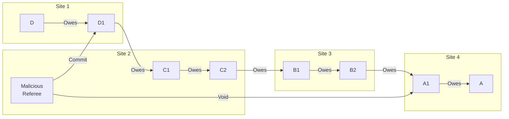

# Split Vote Attack

## Origin and Documentation
**Source**: Directly documented in ChipNet protocol
- Primary Reference: `ChipNet/doc/cluster.md`
  > "Referee may intentionally or unintentionally 'lie' and give out contradictory votes"
- Supporting Reference: `ChipNet/doc/cluster.md` consensus protocol
  > Details majority voting mechanism and referee coordination

**Reasoning**: Classic Byzantine Generals Problem - how to achieve consensus when participants may be malicious or faulty.

## Mitigation Rating
**Status**: SUBSTANTIALLY MITIGATED
- Primary defense: Majority consensus requirement
- Secondary defense: Vote propagation and cross-validation
- Remaining exposure: Possible temporary inconsistency if referee is tie-breaker
- Edge case: Multiple colluding referees could delay resolution

**Rating Justification**:
1. Single malicious referee cannot compromise system
2. Vote propagation ensures contradictions are detected
3. Majority consensus prevents split-brain scenarios
4. System can recover through compensating transactions
5. Some timing/performance impact but financial integrity maintained

## Attack Description
A referee intentionally sends different votes (commit vs. void) to different participants in the lift transaction. This can potentially cause some nodes to commit the transaction while others void it, leading to inconsistent state across the network.

## Example Scenario
Using [Multi-Site Linear Lift](../CONTEXT.md#scenario-3-multi-site-linear-lift):


In this scenario:
1. Malicious referee R sends "commit" vote to upstream nodes (D1, C1, C2)
2. Same referee sends "void" vote to downstream nodes (B1, B2, A1, A)
3. Attempts to create inconsistent transaction state

## Nature of Attack
- **Primary Type**: Malicious (requires intentional misconduct)
- **Variants**: 
  - Single referee acting alone
  - Multiple colluding referees
  - Combination with network partition

## Current System Resistance
ChipNet has strong protection against this attack:

1. **Majority Consensus**:
   - Requires majority of referees to agree
   - Single referee cannot determine outcome
   - Multiple referees reduce impact of individual bad actors

2. **Vote Propagation**:
   - Votes propagate through network
   - Nodes share received votes
   - Contradictions become visible

3. **Signature Verification**:
   - All votes cryptographically signed
   - Contradictory votes provable
   - Evidence preserved for reputation system

## Damage Assessment

### Financial Impact
- **Direct Loss**: None if majority of referees honest
- **Potential Loss**: Possible if referee is tie-breaker
- **Recovery**: Compensating transactions can correct imbalances

### Network Impact
- **Consistency**: Temporary divergence possible
- **Performance**: Additional verification overhead
- **Trust**: Referee reputation damaged when detected

### Accounting Impact
- **Short Term**: Possible temporary inconsistencies
- **Long Term**: System converges to consistent state
- **Audit**: Clear evidence of referee misconduct

## Contract-Based Mitigations

### Legal Framework
The MyCHIPs tally contract provides additional protections against split vote attacks:

1. **Protocol Compliance**
   - Explicit requirement:
     ```yaml
     "Each Party shall make reasonable efforts to use software which 
      faithfully executes the MyCHIPs protocol, as published by MyCHIPs.org, 
      in good faith."
     ```
   - Mandates unmodified software use
   - Requires honest execution
   - Prevents malicious behavior

2. **Good Faith Requirement**
   ```yaml
   "Each Party shall behave honestly and with integrity in the 
    transactions facilitated by the Tally."
   ```
   - Prohibits intentional manipulation
   - Requires honest participation
   - Enforces protocol compliance
   - Prevents malicious voting

3. **Default Conditions**
   ```mermaid
   graph TD
       A[Split Vote Attack] --> B[Protocol Violation]
       B --> C[Contract Breach]
       C --> D[Notice Process]
       D --> E{Cured?}
       E -->|Yes| F[Resolution]
       E -->|No| G[Consequences]
       G --> H[Publication]
       G --> I[Legal Action]
       G --> J[Alternative Payment]
   ```

### Enforcement Mechanisms

1. **Direct Consequences**
   - Contract breach
   - Legal liability
   - Alternative payment obligation
   - Reputation damage

2. **Network Effects**
   - Publication rights
   - Trust degradation
   - Trading limitations
   - Network isolation

3. **Recovery Options**
   - Protocol correction
   - Alternative payment
   - Legal enforcement
   - Reputation restoration

### Impact on Attack Assessment

1. **Mitigation Rating**: SUBSTANTIALLY MITIGATED
   - Technical protections
   - Plus contractual obligations
   - Plus legal framework
   - Plus reputation effects

2. **Attack Cost**:
   - Legal consequences
   - Reputation damage
   - Network isolation
   - Financial liability

3. **Recovery Paths**:
   - Protocol compliance
   - Alternative payment
   - Legal recourse
   - Reputation repair

## Contract Integration

### System Design Impact
1. **Protocol Layer**
   - Software requirements
   - Compliance monitoring
   - Violation detection
   - State tracking

2. **Contract Layer**
   - Legal framework
   - Breach conditions
   - Enforcement options
   - Resolution paths

3. **Social Layer**
   - Reputation system
   - Publication rights
   - Network effects
   - Trust relationships

### Implementation Requirements

1. **Software Components**
   - Protocol validation
   - Violation detection
   - State monitoring
   - Evidence collection

2. **Legal Components**
   - Contract enforcement
   - Breach documentation
   - Resolution tracking
   - Publication management

3. **Operational Procedures**
   - Violation monitoring
   - Notice issuance
   - Resolution handling
   - Documentation maintenance

## Practical Considerations

### Prevention Strategy
1. **Pre-Transaction**
   - Software validation
   - Partner verification
   - Risk assessment
   - Protocol review

2. **During Transaction**
   - Vote monitoring
   - Protocol compliance
   - State tracking
   - Evidence collection

3. **Post-Violation**
   - Breach documentation
   - Notice issuance
   - Resolution pursuit
   - Record maintenance

### Recovery Process

1. **Immediate Actions**
   - Document violation
   - Issue notice
   - Preserve evidence
   - Monitor response

2. **Resolution Phase**
   - Evaluate response
   - Consider alternatives
   - Track progress
   - Document outcomes

3. **Enforcement Phase**
   - Publication decision
   - Legal action evaluation
   - Alternative payment
   - Network notification

## Additional Defenses

1. **Vote Broadcasting**:
   - Require referees to broadcast votes to all participants
   - Cross-validate received votes
   - Implement vote receipt confirmation

2. **Enhanced Detection**:
   - Monitor vote patterns
   - Compare vote receipts
   - Implement referee auditing

3. **Referee Selection**:
   - Use reputation in selection
   - Require stake or bond
   - Implement rotation policy

## Open Questions

1. **Referee Coordination**:
   - How many honest referees needed for safety?
   - Can we detect referee collusion?
   - What is optimal referee selection strategy?

2. **Vote Timing**:
   - How to handle delayed vote revelation?
   - What are optimal timeout parameters?
   - How to prevent timing-based manipulation?

3. **Recovery Mechanics**:
   - Best practices for compensating transactions?
   - How to handle partially-completed lifts?
   - When to trigger automated recovery?

4. **Prevention Strategies**:
   - Can we predict malicious referee behavior?
   - How to incentivize honest voting?
   - What behavioral patterns indicate attack?

## Related Attacks
- [Delayed Vote Attack](delayed-vote.md)
- [Selective Communication](selective-communication.md)
- [Network Partition](network-partition.md) 

## User Mitigation Practices

### Referee Selection
1. **Primary Referee Requirements**
   - Require highly-available, trusted referee
   - Prefer institutional referees over individuals
   - Verify referee's operational history
   - Check referee's business continuity plans

2. **Referee Diversity**
   - Limit total number of referees
   - Avoid referees from same organization
   - Check referee independence
   - Validate communication paths to each

3. **Trust Verification**
   - Research referee reputation
   - Verify institutional backing
   - Check technical capabilities
   - Review service level agreements

### Lift Configuration
1. **Voting Rules**
   - Require super-majority for decisions
   - Set minimum referee participation
   - Define clear timeout policies
   - Specify conflict resolution paths

2. **Circuit Requirements**
   - Limit circuit complexity
   - Verify all participants know referee
   - Check referee accessibility
   - Validate timeout mechanisms

3. **Value Controls**
   - Scale value to referee reliability
   - Set limits based on referee count
   - Consider referee stake/bonding
   - Match value to referee reputation

### Operational Practices
1. **Monitoring**
   - Track referee response times
   - Monitor vote patterns
   - Document inconsistencies
   - Maintain performance history

2. **Communication**
   - Establish direct referee contact
   - Maintain backup channels
   - Document communication attempts
   - Keep timeout records

3. **Recovery Planning**
   - Know escalation procedures
   - Maintain referee alternatives
   - Document resolution paths
   - Understand compensation options

These practices help individual users:
- Prevent split vote situations
- Ensure reliable referee service
- Enable quick resolution
- Maintain lift integrity 