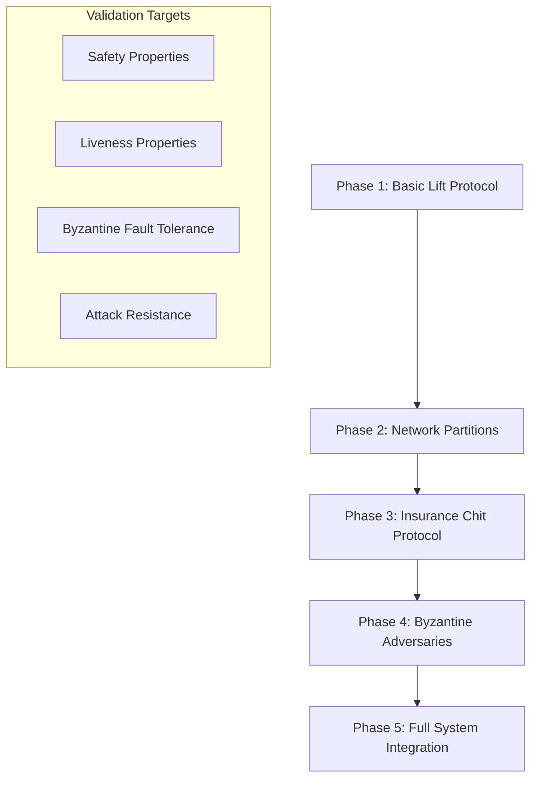

# Formal Verification and Modeling

## Purpose

This folder contains formal specifications and verification models for MyCHIPs protocol components, with particular focus on validating the Byzantine fault tolerance claims and security properties documented in the broader [byzantine analysis](../README.md).

**Primary Goals**:
1. **Validate security assertions** made throughout the Byzantine analysis
2. **Verify correctness** of critical protocol components (lifts, consensus, recovery)
3. **Quantify Byzantine fault tolerance** with mathematical precision
4. **Document system boundaries** and assumptions clearly
5. **Provide formal specifications** for implementation guidance

## Historical Context and Protocol Evolution

MyCHIPs has undergone significant protocol evolution, each analyzed through formal verification:

### Phase 1: Original Protocol (2020) - DSR Analysis
**Location**: [`../dsr/`](../dsr/)
- **Problem**: DSR Corporation found fundamental **safety vs. liveness tradeoffs**
- **Key Finding**: "No clear way to assure both [safety and liveness] at the same time"
- **Tools Used**: TLA+ specifications with comprehensive model checking
- **Result**: Protocol revision required due to identified issues
- **Files**: 
  - [`../dsr/phase-1/results.md`](../dsr/phase-1/results.md) - Detailed analysis results
  - [`../dsr/phase-1/spec/`](../dsr/phase-1/spec/) - Original TLA+ specifications

### Phase 2: Single Referee Protocol - BYU Analysis  
**Location**: [`../byu/`](../byu/)
- **Solution**: Introduction of single referee to resolve commit/rollback decisions
- **Verification Approach**: Multi-tool validation strategy
- **Tools Used**: 
  - **SPIN**: Model checking for safety/liveness properties (2-entity base case)
  - **Coq**: Machine-checked proofs for scalability to arbitrary entities
  - **TLA+**: Supplementary formal specifications
- **Result**: Verified safety and liveness properties for referee-based protocol
- **Files**:
  - [`../byu/spin/`](../byu/spin/) - SPIN model checking specifications
  - [`../byu/coq/`](../byu/coq/) - Coq proofs for conformance
  - [`../byu/tla/`](../byu/tla/) - TLA+ specifications

### Phase 3: ChipNet Consensus Protocol (Current) - This Analysis
**Location**: `./` (this folder)
- **Evolution**: ChipNet enables **flexible consensus mechanisms**
  - Can devolve to single referee (backward compatibility)
  - Can use multiple external referees or participating nodes
  - Participants choose consensus mechanism at runtime
- **New Challenges**: 
  - Byzantine fault tolerance with variable referee sets
  - [Circuit starvation attacks](../scenarios/circuit-starvation.md) and recovery
  - [Insurance Chit Protocol](../scenarios/minority-recovery-3.md) validation
- **This Analysis Goal**: Formal verification of the latest ChipNet-based protocol

## Formal Verification Approach

### Primary Tool: TLA+ (Temporal Logic of Actions)

**Why TLA+**:
- **Industry standard** for distributed system verification (Amazon, Microsoft, etc.)
- **Perfect fit** for modeling concurrent, distributed credit protocols
- **Mature ecosystem** with extensive documentation and community support
- **Excellent for Byzantine fault tolerance** analysis
- **Proven track record** with similar distributed consensus protocols

### Alternative Tools Considered

| Tool | Strengths | Use Case | Status |
|------|-----------|----------|---------|
| **TLA+/TLC** | Distributed systems, temporal logic | Primary choice | ✅ Recommended |
| **Promela/SPIN** | Protocol verification, simpler syntax | Secondary option | 🔄 Consider for simple models |
| **Alloy** | Structural analysis, relational modeling | Complement to TLA+ | 🔄 For static analysis |
| **Coq/Lean** | Theorem proving, mathematical rigor | Advanced verification | 🔄 Future consideration |

## Modeling Strategy

### Phase-Based Development Approach



## Planned Models and Specifications

### 1. Core Lift Protocol (`BasicLift.tla`)

**Target**: Fundamental lift transaction mechanics

**Key Properties to Verify**:
- **Atomicity**: Either all nodes in a lift commit, or all rollback
- **Safety**: No node loses credits inappropriately
- **Consistency**: All nodes maintain consistent view of final state
- **Progress**: Honest lifts eventually complete (liveness)

**Scenarios Modeled**:
```tla
\* Simple 3-node linear lift: A -> B -> C
\* Variables: node states, promises, commitments, balances
\* Invariants: balance conservation, atomic completion
```

**Attack Vectors**:
- Single malicious node behavior
- Promise phase failures
- Commit phase disruptions

### 2. Network Partition Handling (`PartitionedLift.tla`)

**Target**: Lift behavior under network failures

**Key Properties to Verify**:
- **Partition tolerance**: System maintains consistency during splits
- **Recovery properties**: Correct behavior when partitions heal
- **Resource preservation**: No credit loss during network issues

**Scenarios Modeled**:
- Minority-majority partitions during different phases
- Complete network splits
- Intermittent connectivity
- Partition healing with state reconciliation

### 3. Insurance Chit Protocol (`MinorityRecovery.tla`)

**Target**: [Minority Recovery Protocol](../scenarios/minority-recovery-3.md) correctness

**Key Properties to Verify**:
- **Race condition safety**: Correct behavior when majority returns
- **Resource neutralization**: Insurance chits create true net zero effect
- **Resolution completeness**: All scenarios lead to correct final state
- **Bilateral coordination**: No global coordination required

**Critical Scenarios**:
```tla
\* Circuit starvation: majority offline after Promise phase
\* Insurance chit creation and validation
\* Majority return with commit decision
\* Majority return with void decision
\* Resolution chit execution and final balancing
```

**Race Condition Analysis**:
- Timing of majority return vs. insurance chit execution
- Double-execution prevention
- State consistency across all scenarios

### 4. Byzantine Adversary Models (`ByzantineLift.tla`)

**Target**: System behavior with coordinated malicious actors

**Key Properties to Verify**:
- **Fault tolerance bounds**: f < n/2 honest nodes requirement
- **Attack resistance**: Specific attacks from [attacks folder](../attacks/) fail
- **Collusion resistance**: Coordinated attacks cannot compromise safety

**Attack Scenarios**:
- [Circuit starvation attacks](../scenarios/circuit-starvation.md)
- Coordinated promise-and-abandon
- Split-vote referee attacks
- Network partition exploitation

### 5. ChipNet Consensus (`ChipNetConsensus.tla`)

**Target**: Underlying consensus mechanism validation

**Key Properties to Verify**:
- **Consensus safety**: No conflicting decisions possible
- **Consensus liveness**: Decisions eventually reached with honest majority
- **Byzantine agreement**: Correct decisions despite malicious referees

**Components Modeled**:
- Referee voting mechanisms
- Message propagation protocols
- Signature validation chains
- Timeout and retry handling

## Implementation Plan

### Learning and Setup Phase (Weeks 1-4)

#### **Week 1-2: TLA+ Fundamentals**
- [ ] Complete Lamport's TLA+ video course
- [ ] Work through "Specifying Systems" book chapters 1-8
- [ ] Practice with simple examples (Peterson's algorithm, etc.)
- [ ] Set up TLA+ Toolbox and VS Code extension

#### **Week 3-4: Domain Familiarization and Historical Review**
- [ ] **Study existing DSR TLA+ specifications** ([`../dsr/phase-1/spec/`](../dsr/phase-1/spec/))
  - Review original lift protocol modeling approach
  - Understand identified safety/liveness issues
  - Extract reusable specification patterns
- [ ] **Analyze BYU verification approach** ([`../byu/`](../byu/))
  - Study SPIN model structure for lift protocols
  - Review Coq proofs for protocol conformance
  - Understand referee-based consensus modeling
- [ ] **Review current ChipNet differences** from previous protocols
  - Flexible consensus mechanisms vs. single referee
  - New attack vectors (circuit starvation, etc.)
  - Insurance chit protocol requirements
- [ ] **Identify modeling continuity and divergence**
  - What can be adapted from DSR/BYU models
  - What requires completely new modeling approaches
  - Bridge single-referee to multi-referee consensus verification

### Development Phase (Weeks 5-16)

#### **Week 5-7: Basic Lift Protocol**
- [ ] Model simple 3-node lift (A→B→C)
- [ ] Define state variables and transitions
- [ ] Implement Discover→Promise→Commit phases
- [ ] Verify basic atomicity and safety properties

#### **Week 8-10: Network Partition Scenarios**
- [ ] Extend model with network partition capabilities
- [ ] Model minority-majority splits during different phases
- [ ] Verify consistency and recovery properties
- [ ] Test partition healing scenarios

#### **Week 11-13: Insurance Chit Protocol**
- [ ] Model circuit starvation scenario (7-node circuit)
- [ ] Implement insurance chit creation and management
- [ ] Model resolution chit execution
- [ ] Verify race condition handling

#### **Week 14-16: Byzantine Adversaries**
- [ ] Add malicious node behaviors
- [ ] Model coordinated attacks
- [ ] Verify fault tolerance bounds
- [ ] Test attack resistance claims

### Validation Phase (Weeks 17-20)

#### **Property Verification**
- [ ] Run comprehensive model checking
- [ ] Verify all stated invariants
- [ ] Test boundary conditions
- [ ] Document verified properties

#### **Attack Validation**
- [ ] Model specific attacks from attacks folder
- [ ] Verify they fail as claimed
- [ ] Quantify attack success conditions
- [ ] Document attack resistance bounds

## Expected Verification Properties

### Safety Properties (Must Always Hold)

```tla
\* No double spending
NoDoubleSpending == \A node \in Nodes :
  \A lift1, lift2 \in Lifts :
    (node \in lift1.participants /\ node \in lift2.participants /\
     lift1 # lift2) => NoResourceOverlap(node, lift1, lift2)

\* Atomic commitment
AtomicCommitment == \A lift \in Lifts :
  (Committed(lift) => AllParticipantsCommitted(lift)) /\
  (Voided(lift) => AllParticipantsVoided(lift))

\* Balance conservation
BalanceConservation == \A node \in Nodes :
  node.initialBalance + SumIncomingCredits(node) = 
  node.currentBalance + SumOutgoingCredits(node)
```

### Liveness Properties (Things That Eventually Happen)

```tla
\* Honest lifts eventually complete
HonestLiftCompletion == \A lift \in HonestLifts :
  <>((Committed(lift) \/ Voided(lift)))

\* Insurance chits eventually enable trading
InsuranceChitEffectiveness == \A partition \in MinorityPartitions :
  <>(CanTrade(partition.honestNodes))

\* Network partitions eventually heal
PartitionRecovery == \A partition \in NetworkPartitions :
  <>(Connected(partition.part1, partition.part2))
```

### Byzantine Fault Tolerance Properties

```tla
\* System remains safe with minority of honest nodes
ByzantineTolerance == 
  (HonestNodes >= FaultyNodes + 1) => 
    (SafetyInvariant /\ LivenessProperty)

\* Specific attack resistance
AttackResistance == \A attack \in DocumentedAttacks :
  attack.executesAgainstModel => ~attack.compromisesSafety
```

## Leveraging Historical Models

### Protocol Evolution Modeling Strategy

| Aspect | DSR Models (Phase 1) | BYU Models (Phase 2) | This Work (Phase 3) |
|--------|---------------------|---------------------|---------------------|
| **Protocol** | Original distributed consensus | Single referee | ChipNet flexible consensus |
| **TLA+ Focus** | Basic lift mechanics, safety/liveness issues | Referee interaction, formal verification | Byzantine scenarios, insurance chits |
| **SPIN Usage** | ❌ Not used | ✅ Primary verification tool | 🔄 Consider for simple protocols |
| **Coq Proofs** | ❌ Not used | ✅ Scalability proofs | 🔄 Advanced verification later |
| **Key Findings** | Fundamental safety/liveness conflicts | Verified properties with referee | TBD: ChipNet Byzantine tolerance |
| **Reusable Components** | Basic lift state machines, tally mechanics | Referee consensus patterns | Build on both for multi-referee |

### Model Adaptation Strategy

#### **From DSR Models: Foundation Building Blocks**
- **Lift State Machine**: Basic `Seek → Pend → Good/Void` transitions
- **Tally Operations**: Balance and projected balance calculations
- **Message Passing**: Distributed protocol communication patterns
- **Property Definitions**: Safety and liveness property structures

#### **From BYU Models: Consensus Verification Patterns**  
- **Referee Interaction**: External decision authority modeling
- **Base Case Verification**: 2-entity lift protocols as building blocks
- **Inductive Scaling**: Proven approaches for larger systems
- **Multi-Tool Validation**: SPIN + Coq + TLA+ verification pipeline

#### **New for ChipNet: Extended Capabilities**
- **Variable Referee Sets**: Dynamic consensus participant selection
- **Byzantine Fault Tolerance**: Malicious referee behavior modeling
- **Circuit Starvation**: Coordinated abandonment attack scenarios
- **Insurance Chit Protocol**: Minority recovery mechanism verification

## Integration with Byzantine Analysis

### Cross-Reference Validation

This modeling effort directly validates claims made in:

1. **[Attack Analysis](../attacks/)**: Verify that documented attacks actually fail
2. **[Scenario Analysis](../scenarios/)**: Confirm minority recovery protocols work
3. **[Alternative Systems](../alternatives/)**: Validate comparative security claims
4. **[CONTEXT Analysis](../CONTEXT.md)**: Verify stated Byzantine fault tolerance bounds

### Historical Verification Continuity

This work extends and validates the evolution from previous analyses:

5. **[DSR Analysis](../dsr/)**: Confirm that ChipNet resolves identified safety/liveness conflicts
6. **[BYU Analysis](../byu/)**: Verify that multi-referee consensus maintains single-referee properties

### Documentation Standards

All models will include:
- **Clear property statements** linking to Byzantine analysis claims
- **Comprehensive comments** explaining modeling choices
- **Validation results** documenting what was verified
- **Assumptions and limitations** clearly stated
- **Cross-references** to relevant analysis documents

## Success Metrics

### Technical Validation
- [ ] **All safety properties verified** for basic lift protocol
- [ ] **Race condition analysis complete** for insurance chit protocol
- [ ] **Byzantine fault tolerance bounds quantified** mathematically
- [ ] **Attack resistance claims validated** for documented attacks

### Documentation Quality
- [ ] **Formal specifications** available for all critical components
- [ ] **Property statements** clearly linked to security claims
- [ ] **Verification results** documented and reproducible
- [ ] **Implementation guidance** derived from formal specifications

### Research Value
- [ ] **Academic publication potential** from rigorous analysis
- [ ] **Open source contribution** to formal verification community
- [ ] **Industry credibility** through formal validation
- [ ] **Developer confidence** in protocol correctness

## Getting Started

### For Contributors

1. **Install TLA+ Toolbox**: Download from [official site](https://lamport.azurewebsites.net/tla/toolbox.html)
2. **Learn basics**: Work through Lamport's video course
3. **Study examples**: Review existing distributed system TLA+ specs
4. **Start simple**: Begin with BasicLift.tla model
5. **Iterate**: Gradually add complexity and verify properties

### For Reviewers

1. **Read specifications**: TLA+ files are human-readable
2. **Check properties**: Verify stated invariants match security claims
3. **Review assumptions**: Ensure modeling assumptions are realistic
4. **Validate results**: Run TLC model checker to reproduce results

**Bottom Line**: This formal verification effort provides mathematical confidence in MyCHIPs' security properties, validates the extensive Byzantine analysis, and creates formal specifications for secure implementation. 