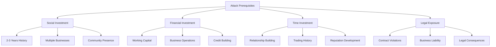
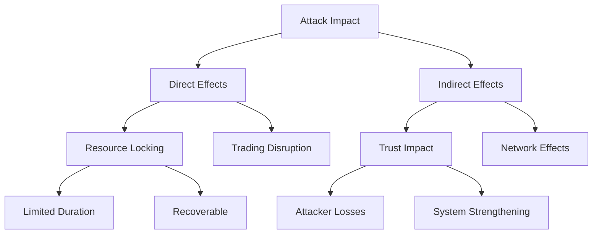
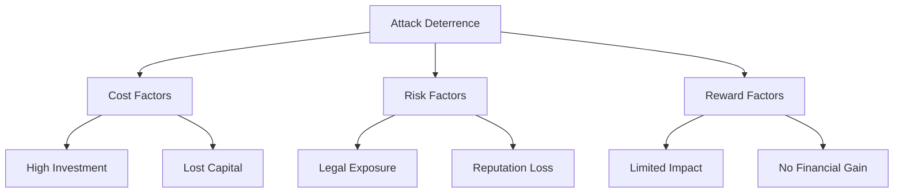

# Circuit Starvation Attack: Practical Analysis

## Attack Cost-Benefit Analysis

### Required Investment

1. **Social Investment**:
   - 2-3 years building legitimate relationships
   - Multiple real business establishments
   - Community presence and reputation
   - Regular trading patterns
   - Estimated Cost: Very High

2. **Financial Investment**:
   - Working capital for businesses
   - Credit establishment
   - Regular trading volume
   - Operational costs
   - Estimated Cost: $100K-$1M+ per node

3. **Time Investment**:
   - Business setup and operation
   - Relationship building
   - Trading history development
   - Community integration
   - Estimated Time: 2-3 years minimum

4. **Legal Exposure**:
   - Contract violations
   - Business liability
   - Potential fraud charges
   - Civil litigation risk
   - Estimated Risk: Severe

## Attack Impact Assessment

### Potential Damage

1. **Direct Effects**:
   - Temporary resource locking (days/weeks)
   - Limited trading disruption
   - Recoverable through timeouts
   - Minimal permanent impact
   - Impact Rating: Low to Moderate

2. **Indirect Effects**:
   - Strengthens trust verification
   - Improves monitoring systems
   - Enhances recovery protocols
   - Builds community resilience
   - Impact Rating: Positive Long-term

3. **Attacker Consequences**:
   - Permanent reputation loss
   - Business relationship destruction
   - Legal liability exposure
   - Financial losses
   - Impact Rating: Severe

## Practical Likelihood Assessment

### Deterrence Factors

1. **Cost vs. Benefit**:
   - Very high setup costs
   - Limited damage potential
   - No financial gain
   - Permanent losses
   - Rating: Highly Unfavorable

2. **Risk vs. Reward**:
   - Severe legal exposure
   - Guaranteed detection
   - Limited impact duration
   - No strategic advantage
   - Rating: Extremely Poor

3. **Alternative Attack Vectors**:
   - Traditional business competition
   - Legal market strategies
   - Conventional disruption
   - Marketing/PR campaigns
   - Rating: More Practical

## Real-World Barriers

### Natural Protections

1. **Business Reality**:
   - Real businesses value reputation
   - Long-term relationships matter
   - Community trust essential
   - Market presence valuable
   - Protection Level: Very High

2. **Legal Framework**:
   - Contract enforcement
   - Business law protection
   - Fraud prosecution
   - Civil remedies
   - Protection Level: Strong

3. **Social Network**:
   - Community monitoring
   - Reputation systems
   - Information sharing
   - Collective memory
   - Protection Level: Extensive

## Conclusions

### Attack Practicality
1. **Overall Likelihood**: Extremely Low
   - Cost prohibitive
   - Risk excessive
   - Benefits minimal
   - Better alternatives exist

2. **Rational Actor Analysis**:
   - No rational motivation
   - Negative ROI guaranteed
   - Permanent disadvantages
   - Self-destructive strategy

### System Implications

1. **Design Validation**:
   - Social trust model works
   - Contract framework effective
   - Natural deterrence strong
   - Recovery mechanisms adequate

2. **Improvement Areas**:
   - Circuit composition rules
   - Timeout optimization
   - Monitoring enhancement
   - Recovery automation

### Final Assessment

The circuit starvation attack, while theoretically possible, is highly impractical in the real world due to:

1. **Prohibitive Requirements**:
   - Multi-year preparation
   - Major financial investment
   - Complex coordination
   - Legal exposure

2. **Limited Impact**:
   - Temporary effects only
   - System resilience
   - Quick recovery
   - Strengthens trust

3. **Severe Consequences**:
   - Permanent reputation loss
   - Business destruction
   - Legal liability
   - Financial ruin

The attack represents more of a theoretical exercise than a practical threat, validating MyCHIPs' design choices around social trust and contract-based security. 