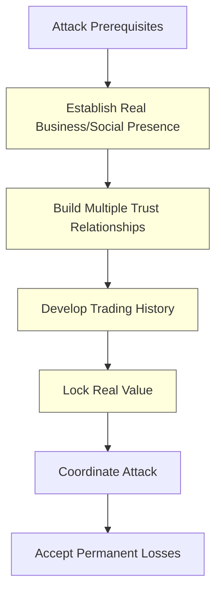
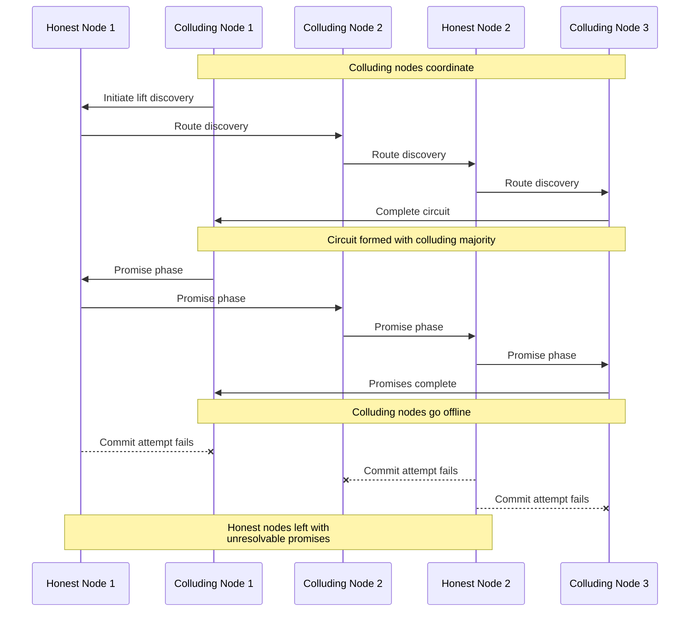
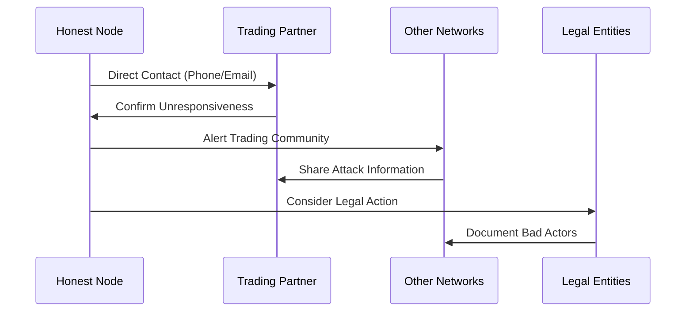
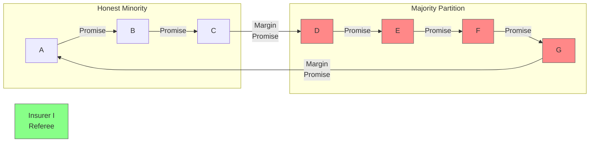
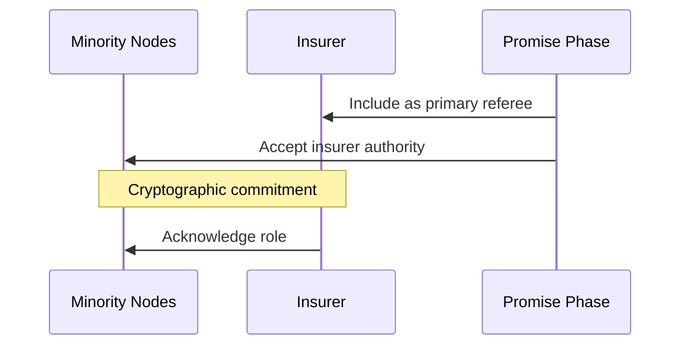
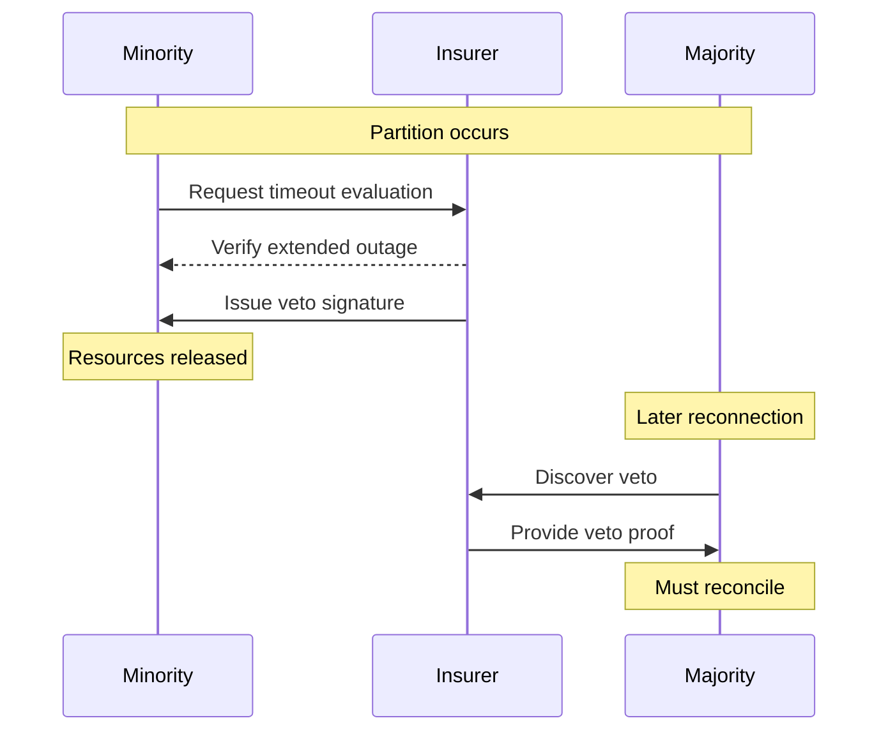
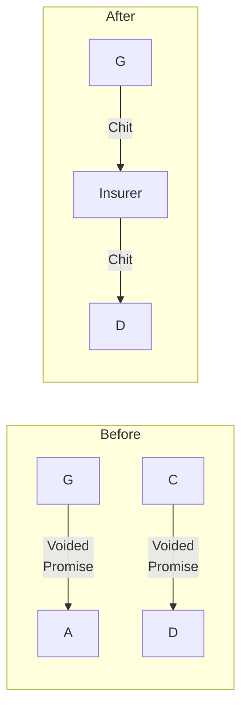

# Circuit Starvation Attack

## Overview

### Attack Objective
Degrade network trading capacity by creating unresolvable promised lifts that lock resources on non-colluding nodes.

### Required Capabilities
- Multiple colluding nodes (>50% of circuit)
- Ability to participate in lift discovery
- Coordination for synchronized withdrawal
- **Critical Addition: Social Trust Requirements**
  - Established real-world business/social relationships
  - Legitimate trading history with honest nodes
  - Multiple trust relationships per colluding node
  - Demonstrated credit worthiness
  - Regular value exchange patterns

### Expected Impact
- Locked credit capacity on honest nodes
- Trading uncertainty due to unresolved promises
- Resource consumption from stuck transactions
- Reduced network efficiency

### Business Motivation
- Damage competitor trading capacity
- Create uncertainty in credit system
- Force manual intervention costs
- Demonstrate system vulnerability

### Attack Cost Analysis
- **Social Investment**:
  - Time to build legitimate relationships
  - Real business/social presence establishment
  - Regular trading activity maintenance
  - Credit history development

- **Value Requirements**:
  - Actual value locked in relationships
  - Working capital for trading
  - Business operation costs
  - Relationship maintenance expenses

- **Permanent Losses**:
  - Burned trust relationships
  - Damaged business reputation
  - Lost trading partnerships
  - Potential legal consequences

## Component Attacks

### Primary Attack Vectors
1. [Delayed Vote Attack](../attacks/delayed-vote.md)
   - Coordinated withholding of commit votes
   - Exploits timeout mechanisms
   - Prevents transaction resolution

2. [Selective Communication](../attacks/selective-communication.md)
   - Strategic offline behavior
   - Information asymmetry creation
   - Coordinated partition

3. [Deadbeat Attack](../attacks/deadbeat.md)
   - Multiple simultaneous node disappearance
   - Promise phase participation only
   - Resource locking through non-completion

### Novel Combination Aspects
- Uses majority control within circuit
- Exploits promise-to-commit gap
- Creates persistent unresolved state
- Targets business impact over direct value theft

## Detailed Flow

### Social Trust Barriers

### Attack Progression

### Social Response Flow

### State Transitions
1. **Discovery Phase**
   - Colluders participate normally
   - Ensure circuit has colluding majority
   - Position colluders strategically

2. **Promise Phase**
   - All nodes sign conditional commitments
   - Honest nodes lock resources
   - Promises recorded in tallies

3. **Attack Execution**
   - Colluders withdraw simultaneously
   - Prevent commit phase completion
   - Leave promises in limbo

## Impact Analysis

### Direct Financial Impact
- No immediate value transfer
- Potential opportunity costs
- Recovery process expenses

### Operational Disruption
- Locked credit capacity
- Uncertain tally states
- Manual intervention required
- Reduced trading efficiency

### Resource Consumption
- Database space for promises
- Network capacity for retries
- Administrative overhead
- Investigation costs

### Trust/Reputation Effects
- Uncertainty in credit system
- Reduced participant confidence
- Trust network degradation
- Protocol reliability questions

### Social Trust Impact
- **Relationship Damage**:
  - Broken business partnerships
  - Lost trading opportunities
  - Community trust violations
  - Reputation network effects

- **Detection Advantages**:
  - Direct communication channels
  - Real-world identity verification
  - Community information sharing
  - Social pressure mechanisms

- **Recovery Channels**:
  - Existing business relationships
  - Alternative contact methods
  - Legal recourse availability
  - Community support networks

## Detection Points

### Observable Indicators
- Multiple nodes offline post-promise
- Pattern of unresolved promises
- Coordinated timing of failures
- Circuit composition anomalies

### Social Indicators
- Unusual relationship formation patterns
- Accelerated trust building attempts
- Inconsistent trading behaviors
- Multiple relationship establishments

### Monitoring Requirements
- Circuit participant diversity
- Promise resolution timing
- Node reliability metrics
- Coordination pattern detection

## Mitigation Analysis

### Existing Mitigation Interaction
1. **Timeout Mechanisms**
   - Help but don't fully resolve
   - May take too long
   - Resource still locked

2. **Majority Consensus**
   - Ineffective when attackers have circuit majority
   - Doesn't prevent promise phase
   - Can't force resolution

3. **Reputation Systems**
   - Can identify participants after the fact
   - Doesn't prevent initial attack
   - Helps prevent repeat attacks

### Social Trust Layer
1. **Relationship Requirements**
   - Real-world identity verification
   - Established business connections
   - Regular trading patterns
   - Community reputation

2. **Value Lock**
   - Actual asset commitment
   - Ongoing business operations
   - Trading history requirements
   - Relationship investment

3. **Social Consequences**
   - Permanent relationship damage
   - Community-wide reputation loss
   - Legal liability exposure
   - Business opportunity costs

### Mitigation Rating: EFFECTIVELY MITIGATED
- **Primary Defense**: Social trust requirements
- **Secondary Defense**: Technical consensus mechanisms
- **Remaining Exposure**: Temporary resource locking
- **Edge Cases**: High-value, short-term relationships

**Rating Justification**:
1. Attack requires extensive social investment
2. High cost-to-impact ratio for attackers
3. Clear attribution through real relationships
4. Strong social recovery mechanisms
5. Permanent consequences for attackers

### Gaps Identified
1. No circuit composition requirements
2. Lack of promise phase protections
3. Insufficient resource locking limits
4. Missing coordination detection

### Recommended Improvements
1. **Circuit Requirements**
   - Minimum honest node percentage
   - Reputation-based participation limits
   - Geographic/domain diversity rules

2. **Promise Phase Protection**
   - Resource reservation limits
   - Progressive commitment stages
   - Collateral requirements

3. **Resolution Mechanisms**
   - Automatic timeout cleanup
   - Forced resolution protocols
   - Resource recovery procedures

## Recovery Process

### Immediate Response
1. Identify affected tallies
2. Document promise chain
3. Notify affected parties
4. Begin timeout countdown

### Resource Recovery
1. Wait for timeout completion
2. Release locked resources
3. Update tally states
4. Record attack pattern

### Social Recovery Steps
1. Contact trading partners directly
2. Alert connected community members
3. Document relationship violations
4. Consider legal remedies
5. Update trust policies

### Long-term Prevention
1. Update circuit formation rules
2. Enhance monitoring systems
3. Adjust timeout parameters
4. Improve coordination detection

## Open Questions

1. **Circuit Formation**
   - Optimal honest node percentage?
   - How to verify node independence?
   - Balance between security and efficiency?

2. **Resource Management**
   - Maximum safe promise duration?
   - Automatic vs. manual cleanup?
   - Resource reservation limits?

3. **Attack Evolution**
   - Potential attack variations?
   - Other resource targeting methods?
   - Combined attack patterns?

### Social Trust Dynamics
- How to balance trust requirements vs. network growth?
- What defines a legitimate trading relationship?
- How to measure relationship authenticity?
- What are optimal trust building timeframes? 

## Partition Healing Mechanism

### Original Circuit Scenario

### Initial Problem
1. **Circuit Composition**:
   - Minority (A,B,C): Honest/accessible
   - Majority (D,E,F,G): Malicious or partitioned
   - Critical promises at margins:
     * G → A (first node)
     * C → D (partition boundary)

2. **Voting Issues**:
   - Participant-based voting fails
   - Majority can force outcome
   - Minority resources locked
   - No resolution mechanism

### Insurer-Based Solution

#### Setup Phase

1. **Insurer Role**:
   - Designated primary referee
   - Agreed during promise phase
   - Cryptographically committed
   - Timeout authority

#### Healing Process

#### Margin Resolution

1. **Margin Imbalance**:
   - G ahead (owes nothing, promised to A)
   - D behind (owed by C, promise voided)
   - Need value transfer mechanism

2. **Resolution Process**:
   - I creates tallies with G and D
   - G→I chit validated by majority result
   - I→D chit balances the equation
   - All parties made whole

### Implementation Requirements

1. **Protocol Changes**:
   - Insurer as primary referee
   - Timeout evaluation criteria
   - Veto mechanism
   - Margin resolution process

2. **Cryptographic Needs**:
   - Insurer authority validation
   - Timeout proof mechanism
   - Veto signature format
   - Chit validation chain

3. **State Management**:
   - Original lift reference
   - Timeout evidence
   - Veto records
   - Resolution tracking

### Advantages

1. **Simplification**:
   - Single authoritative referee
   - Clear resolution path
   - Deterministic outcome
   - Automatic healing

2. **Fairness**:
   - Minority protected
   - Majority can complete
   - Value preserved
   - Minimal penalties

3. **Prevention**:
   - Discourages partitioning
   - Clear consequences
   - Built-in resolution
   - Automatic healing

### Limitations

1. **Trust Requirements**:
   - Insurer must be reliable
   - Pre-agreed authority
   - Cannot be partitioned
   - Must be available

2. **Operational Impact**:
   - New tally creation
   - Forced relationships
   - Additional overhead
   - Complex state tracking

### Conclusions

1. **Prevention vs Cure**:
   - Better to prevent with proper referee
   - Healing mechanism as backup
   - Clear resolution path needed
   - Trust relationships critical

2. **Design Implications**:
   - Prefer single trusted referee
   - Build in timeout handling
   - Plan for margin resolution
   - Consider forced relationships

3. **Future Considerations**:
   - Multiple insurer options
   - Automated resolution
   - Reputation effects
   - Prevention mechanisms 