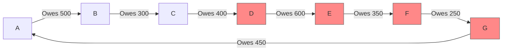
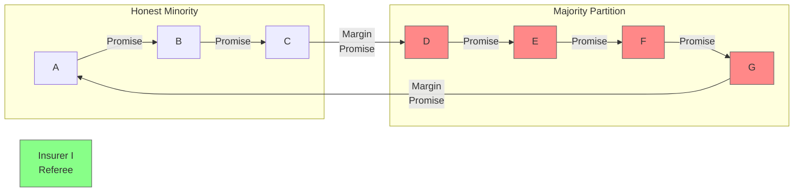
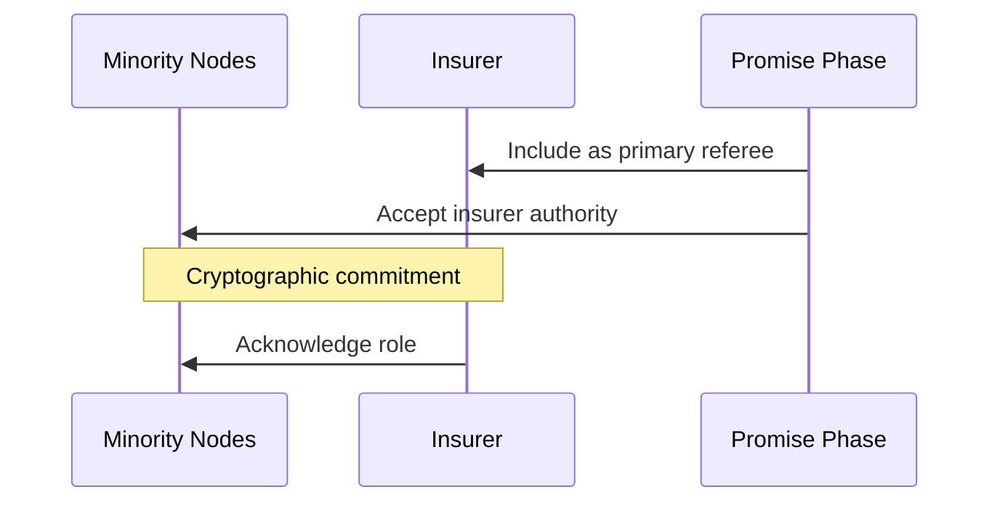
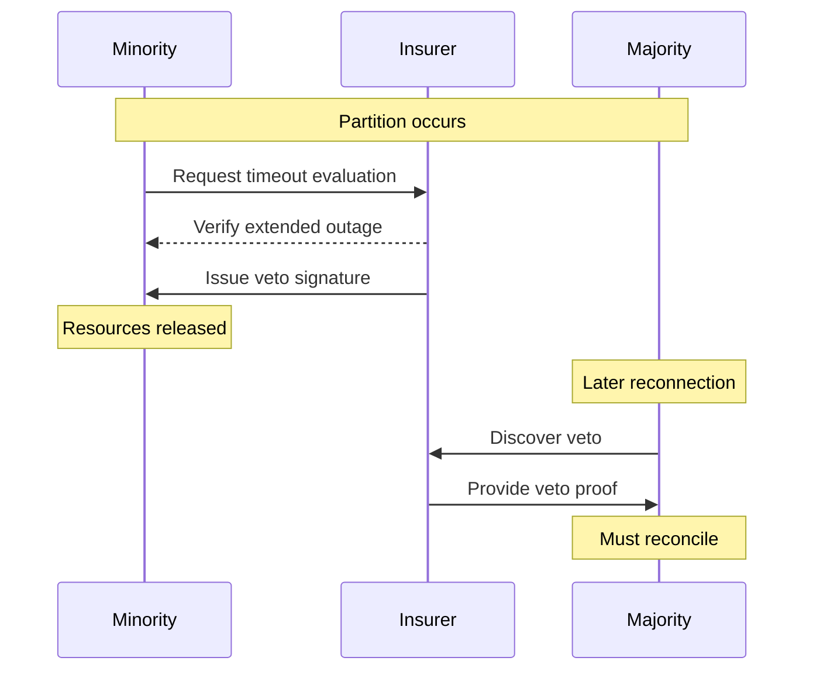
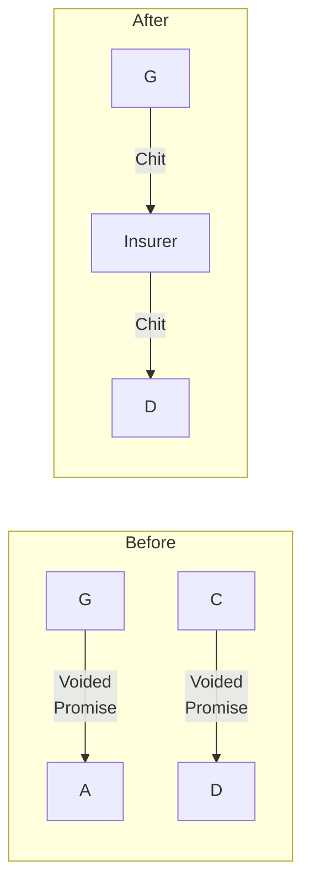

# Circuit Starvation Attack

## Attack Scenario Overview

### What is Circuit Starvation?
Circuit Starvation is a coordinated Byzantine attack where a majority of nodes in a credit lift circuit complete the **Promise Phase** but then deliberately go offline during the **Commit Phase**, leaving minority honest nodes with locked resources that cannot be resolved. This creates a persistent "limbo" state where honest participants have promised credits but cannot complete or cancel the transaction.

### The Core Problem
In MyCHIPs' three-phase consensus protocol (Discover → Promise → Commit/Rollback), the Promise Phase locks resources across all participants before seeking final commitment. If enough participants disappear after promising but before committing, the honest minority is left holding unresolvable promises that tie up their trading capacity indefinitely.

## Concrete Attack Example

### Scenario: The Coordinated Circuit Attack

Consider a seven-node trading circuit:

**The Setup**:
- **Honest Nodes**: A, B, C - 3 nodes (43%)
- **Colluding Nodes**: D, E, F, G - 4 nodes (57% majority)
- **Target Lift**: 250 unit credit clearing

### Phase 1: Discover Phase
1. **Node A initiates** a circular lift to clear 250 units from the accumulated credits
2. **Route Discovery**: ChipNet finds the A→B→C→D→E→F→G→A circuit with sufficient capacity

### Phase 2: Promise Phase
3. **Promise Phase Begins**: All seven participants receive the lift proposal
4. **Everyone Signs**: All nodes, including the colluding ones, sign conditional promises:
   - A promises to reduce debt to G by 250
   - B promises to reduce debt to A by 250
   - C promises to reduce debt to B by 250
   - D promises to reduce debt to C by 250
   - E promises to reduce debt to D by 250
   - F promises to reduce debt to E by 250
   - G promises to reduce debt to F by 250

### Phase 3: The Attack - Coordinated Disappearance
5. **Critical Moment**: Just as the Commit Phase should begin, the four colluding nodes execute their attack:
   - **Node D**: Goes offline
   - **Node E**: Becomes unreachable
   - **Node F**: Disconnects from network
   - **Node G**: Stops responding
6. **Honest Nodes Left Hanging**: A, B, and C have signed promises but cannot complete the lift because they need majority consensus (4 out of 7 nodes) to commit

### Phase 4: Resource Starvation Impact
7. **Locked Resources**: A, B, and C now have 250 units each in "promised" credits that they cannot:
   - **Use** (because the lift isn't committed)
   - **Cancel** (because they need majority to rollback)
   - **Recover** (because promises are cryptographically binding)
8. **Trading Capacity Reduced**: All three honest nodes have reduced capacity for future lifts
9. **Ripple Effects**: Other potential lifts involving A, B, or C may fail due to reduced available capacity

### Phase 5: Recovery Attempts
10. **Limited Options**: 
    - Technical timeouts may take hours or days
    - Social contact with colluding nodes fails
    - Manual intervention requires complex state reconstruction
11. **Network Impact**:
    - Trading capacity degraded for honest participants
    - Uncertainty about promise resolution affects network confidence

## Why This Attack Is Devastating

### 1. **Resource Lock-Up Without Value Transfer**
Unlike traditional theft, this attack doesn't steal money - it makes money **unusable**. The honest participants still have their credits, but those credits are trapped in a limbo state.

### 2. **Majority Consensus Exploitation**
The attack exploits MyCHIPs' strength (majority consensus prevents single bad actors) by using it as a weakness (majority bad actors can prevent any resolution).

### 3. **Promise Phase Vulnerability**
The attack targets the gap between **promising** resources (which locks them) and **committing/rolling back** the transaction (which resolves them). This gap is necessary for atomic transactions but creates an attack window.

### 4. **No Clear Recovery Path**
Unlike network partitions or individual node failures, this attack creates a persistent state where:
- Technical timeouts may take too long (hours or days)
- Social resolution is hampered by coordinated unresponsiveness
- Manual intervention requires complex state reconstruction

### 5. **Scalable Impact**
Attackers can participate in multiple circuits simultaneously, multiplying the impact across the network.

## Attack Prerequisites and Costs

### Social Trust Investment Required
This isn't a simple technical attack - it requires significant real-world investment:

1. **Relationship Building**: Attackers must establish legitimate business relationships with honest nodes
2. **Trading History**: Need months or years of normal trading to build trust and credit limits
3. **Business Presence**: Must maintain actual businesses or trading operations
4. **Value Lock-Up**: Real money/credits must be committed to trading relationships
5. **Reputation Risk**: Attacking burns all established relationships permanently

### Coordination Requirements
1. **Multiple Entities**: Need majority control (often 3-4+ separate entities)
2. **Timing Synchronization**: Must coordinate simultaneous disappearance
3. **Communication**: Secure channels for attack coordination
4. **Persistence**: Must remain offline/unresponsive for extended periods

### Financial Costs
1. **Relationship Investment**: Time and resources to build trading partnerships
2. **Operating Capital**: Working capital tied up in trading relationships
3. **Opportunity Cost**: Lost legitimate trading profits
4. **Burned Assets**: All invested relationship value becomes worthless
5. **Legal Risk**: Potential fraud or breach of contract liability

## Technical Attack Mechanics

### Component Attack Vectors
This coordinated attack combines several individual Byzantine attack patterns:

1. **[Delayed Vote Attack](../attacks/delayed-vote.md)**:
   - Colluding nodes withhold commit votes indefinitely
   - Exploits timeout mechanisms by never responding
   - Prevents transaction resolution through non-participation

2. **[Selective Communication](../attacks/selective-communication.md)**:
   - Strategic offline behavior coordinated across multiple nodes
   - Creates information asymmetry between honest and colluding nodes
   - Coordinated network partition at the application layer

3. **[Deadbeat Attack](../attacks/deadbeat.md)**:
   - Multiple simultaneous node disappearance after promise participation
   - Participation in Promise Phase only, then abandonment
   - Resource locking through intentional non-completion

### What Makes This Attack Novel
- **Majority Control**: Uses majority control within a specific circuit rather than network-wide
- **Promise-Commit Gap Exploitation**: Targets the vulnerable window between resource locking and transaction completion
- **Persistent Unresolved State**: Creates a limbo state that doesn't naturally resolve
- **Business Impact Focus**: Aims to degrade network utility rather than steal value directly

## Core Technical Impact

### Projected Balance Problem
The primary technical damage occurs because **promised chits alter projected tally balances** before the lift commits:

- **Balance Uncertainty**: Tallies show pending promises that may or may not resolve
- **Lift Decision Impairment**: Nodes cannot accurately assess capacity for new lifts
- **Trading Hesitation**: Uncertainty about final balances makes risk assessment difficult
- **Capacity Fragmentation**: Available trading capacity appears reduced due to unresolved promises

### ChipNet Detection Mechanism
ChipNet's **any-to-any communication** protocol provides strong attack detection:

- **Distributed Validation**: Any node can attempt to reach any other node for signature validation
- **Coordinated Failure Pattern**: Complete unreachability of all 4 colluding nodes is highly suspicious
- **Network-Wide Verification**: Multiple honest nodes can independently verify the communication failure
- **Attack Confirmation**: Simultaneous total unresponsiveness strongly indicates coordination rather than technical failure

## Impact Analysis

### Direct Financial Impact
- No immediate value transfer
- Potential opportunity costs
- Recovery process expenses

### Operational Disruption
- Locked credit capacity
- Uncertain tally states
- Manual intervention required
- Reduced trading efficiency

### Resource Consumption
- Database space for promises
- Network capacity for retries
- Administrative overhead
- Investigation costs

### Trust/Reputation Effects
- Uncertainty in credit system
- Reduced participant confidence
- Trust network degradation
- Protocol reliability questions

### Social Trust Impact
- **Relationship Damage**:
  - Broken business partnerships
  - Lost trading opportunities
  - Community trust violations
  - Reputation network effects

- **Detection Advantages**:
  - Direct communication channels
  - Real-world identity verification
  - Community information sharing
  - Social pressure mechanisms

- **Recovery Channels**:
  - Existing business relationships
  - Alternative contact methods
  - Legal recourse availability
  - Community support networks

## Detection Points

### Observable Indicators
- Multiple nodes offline post-promise
- Pattern of unresolved promises
- Coordinated timing of failures
- Circuit composition anomalies

### Social Indicators
- Unusual relationship formation patterns
- Accelerated trust building attempts
- Inconsistent trading behaviors
- Multiple relationship establishments

### Monitoring Requirements
- Circuit participant diversity
- Promise resolution timing
- Node reliability metrics
- Coordination pattern detection

## Mitigation Analysis

### Existing Mitigation Interaction
1. **Timeout Mechanisms**
   - Help but don't fully resolve
   - May take too long
   - Resource still locked

2. **Majority Consensus**
   - Ineffective when attackers have circuit majority
   - Doesn't prevent promise phase
   - Can't force resolution

3. **Reputation Systems**
   - Can identify participants after the fact
   - Doesn't prevent initial attack
   - Helps prevent repeat attacks

### Social Trust Layer
1. **Relationship Requirements**
   - Real-world identity verification
   - Established business connections
   - Regular trading patterns
   - Community reputation

2. **Value Lock**
   - Actual asset commitment
   - Ongoing business operations
   - Trading history requirements
   - Relationship investment

3. **Social Consequences**
   - Permanent relationship damage
   - Community-wide reputation loss
   - Legal liability exposure
   - Business opportunity costs

### Mitigation Rating: EFFECTIVELY MITIGATED
- **Primary Defense**: Social trust requirements
- **Secondary Defense**: Technical consensus mechanisms
- **Remaining Exposure**: Temporary resource locking
- **Edge Cases**: High-value, short-term relationships

**Rating Justification**:
1. Attack requires extensive social investment
2. High cost-to-impact ratio for attackers
3. Clear attribution through real relationships
4. Strong social recovery mechanisms
5. Permanent consequences for attackers

### Gaps Identified
1. No circuit composition requirements
2. Lack of promise phase protections
3. Insufficient resource locking limits
4. Missing coordination detection

### Recommended Improvements
1. **Circuit Requirements**
   - Minimum honest node percentage
   - Reputation-based participation limits
   - Geographic/domain diversity rules

2. **Promise Phase Protection**
   - Resource reservation limits
   - Progressive commitment stages
   - Collateral requirements

3. **Resolution Mechanisms**
   - Automatic timeout cleanup
   - Forced resolution protocols
   - Resource recovery procedures

## Recovery Process

### Immediate Response
1. Identify affected tallies
2. Document promise chain
3. Notify affected parties
4. Begin timeout countdown

### Resource Recovery
1. Wait for timeout completion
2. Release locked resources
3. Update tally states
4. Record attack pattern

### Social Recovery Steps
1. Contact trading partners directly
2. Alert connected community members
3. Document relationship violations
4. Consider legal remedies
5. Update trust policies

### Long-term Prevention
1. Update circuit formation rules
2. Enhance monitoring systems
3. Adjust timeout parameters
4. Improve coordination detection

## Open Questions

1. **Circuit Formation**
   - Optimal honest node percentage?
   - How to verify node independence?
   - Balance between security and efficiency?

2. **Resource Management**
   - Maximum safe promise duration?
   - Automatic vs. manual cleanup?
   - Resource reservation limits?

3. **Attack Evolution**
   - Potential attack variations?
   - Other resource targeting methods?
   - Combined attack patterns?

### Social Trust Dynamics
- How to balance trust requirements vs. network growth?
- What defines a legitimate trading relationship?
- How to measure relationship authenticity?
- What are optimal trust building timeframes? 

## Partition Healing Mechanism

### Original Circuit Scenario

### Initial Problem
1. **Circuit Composition**:
   - Minority (A,B,C): Honest/accessible
   - Majority (D,E,F,G): Malicious or partitioned
   - Critical promises at margins:
     * G → A (first node)
     * C → D (partition boundary)

2. **Voting Issues**:
   - Participant-based voting fails
   - Majority can force outcome
   - Minority resources locked
   - No resolution mechanism

### Insurer-Based Solution

#### Setup Phase

1. **Insurer Role**:
   - Designated primary referee
   - Agreed during promise phase
   - Cryptographically committed
   - Timeout authority

#### Healing Process

#### Margin Resolution

1. **Margin Imbalance**:
   - G ahead (owes nothing, promised to A)
   - D behind (owed by C, promise voided)
   - Need value transfer mechanism

2. **Resolution Process**:
   - I creates tallies with G and D
   - G→I chit validated by majority result
   - I→D chit balances the equation
   - All parties made whole

### Implementation Requirements

1. **Protocol Changes**:
   - Insurer as primary referee
   - Timeout evaluation criteria
   - Veto mechanism
   - Margin resolution process

2. **Cryptographic Needs**:
   - Insurer authority validation
   - Timeout proof mechanism
   - Veto signature format
   - Chit validation chain

3. **State Management**:
   - Original lift reference
   - Timeout evidence
   - Veto records
   - Resolution tracking

### Advantages

1. **Simplification**:
   - Single authoritative referee
   - Clear resolution path
   - Deterministic outcome
   - Automatic healing

2. **Fairness**:
   - Minority protected
   - Majority can complete
   - Value preserved
   - Minimal penalties

3. **Prevention**:
   - Discourages partitioning
   - Clear consequences
   - Built-in resolution
   - Automatic healing

### Limitations

1. **Trust Requirements**:
   - Insurer must be reliable
   - Pre-agreed authority
   - Cannot be partitioned
   - Must be available

2. **Operational Impact**:
   - New tally creation
   - Forced relationships
   - Additional overhead
   - Complex state tracking

### Conclusions

1. **Prevention vs Cure**:
   - Better to prevent with proper referee
   - Healing mechanism as backup
   - Clear resolution path needed
   - Trust relationships critical

2. **Design Implications**:
   - Prefer single trusted referee
   - Build in timeout handling
   - Plan for margin resolution
   - Consider forced relationships

3. **Future Considerations**:
   - Multiple insurer options
   - Automated resolution
   - Reputation effects
   - Prevention mechanisms 