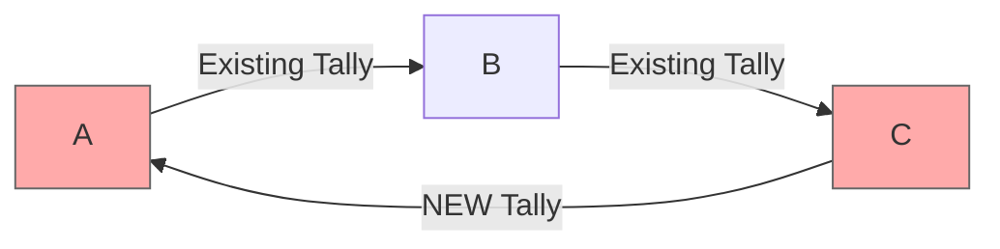

# Minority Recovery: Direct Tally Method

## Problem Statement

In a circuit starvation attack, honest minority nodes (A, B, C) are left with unresolved promises when the majority nodes (D, E, F, G) go offline. This creates locked resources and uncertain tally balances.


## Proposed Recovery Method: Minority Settlement Circle

### The Approach
Form a new closed circuit among only the honest minority nodes by creating a direct tally between A and C:



### Implementation Steps

1. **Create New A↔C Tally**:
   - A and C establish a new trading relationship
   - Initial balance reflects the settlement amount (250 units)
   - C owes A 250 units on the new tally

2. **Execute Minority Lift**:
   - Complete the 250-unit lift within the A→B→C→A circuit
   - All promises resolve successfully
   - Resources are unlocked on existing tallies

3. **Final State**:
   - Original A↔B and B↔C tallies: Reduced by 250 units as intended
   - New C↔A tally: C owes A 250 units
   - All promises resolved, resources unlocked

### Why This Might Work

**Technical Feasibility**:
- Creates a complete circuit with only honest nodes
- Uses standard MyCHIPs lift mechanism
- Resolves promises through normal consensus
- Unlocks stuck resources immediately

**Practical Advantages**:
- No waiting for long timeouts
- No dependency on unresponsive nodes
- Clear resolution of uncertain state
- Maintains normal MyCHIPs operations

## Why This Is Probably Impractical

### Violates Core MyCHIPs Principle

**Trust Requirement Problem**:
MyCHIPs is designed around the principle that **users only create tallies with people they already know and trust** through real-world relationships:
- Employment relationships
- Regular trading partners  
- Community members
- Established business connections

In circuit starvation scenarios, nodes A and C are typically:
- **Complete strangers** who happened to be in the same circuit
- **Connected only through intermediaries** (B, and the offline nodes)
- **Have no business relationship** or reason to trade directly
- **No basis for establishing credit terms** or trust limits

### Practical Barriers

**Trust Assessment**:
- A has no way to evaluate C's creditworthiness
- C has no business reason to owe A money
- Neither party knows the other's business situation
- No natural trading relationship exists

**Credit Terms**:
- What credit limit should A extend to C?
- What payment terms are appropriate?
- How do they verify each other's identity?
- What happens if C defaults on the new debt?

**Business Logic**:
- Why would A and C want to trade with each other?
- How do they establish fair credit terms quickly?
- What's their recourse if the relationship fails?
- Does this create more risk than just waiting for timeouts?

### Forced Relationship Problem

This approach essentially forces two strangers to:
1. **Immediately trust each other** with substantial credit
2. **Create artificial business relationship** for technical reasons
3. **Accept new counterparty risk** to solve an existing problem
4. **Bypass natural relationship-building** that makes MyCHIPs secure

## Assessment: Technically Possible, Practically Flawed

### When It Might Work
- **Small, tight-knit communities** where A and C actually know each other
- **Business networks** where connections exist beyond the circuit
- **Emergency situations** where parties are willing to take risks

### Why It Usually Won't Work
- **Violates trust model** that makes MyCHIPs secure against Byzantine attacks
- **Creates new risks** (A-C relationship) to solve existing problems
- **Requires rapid trust decisions** without proper relationship building
- **Most circuit participants** are connected through intermediaries, not directly

## Critical Flaw: Race Condition Problem

### The Fundamental Issue

This proposal **does not actually solve the promised chit problem**. Here's why:

When A, B, C execute their minority lift, they create a **race condition** with the original promises:

**Current State**: A, B, C all have promised chits (-250 each) in limbo
**Minority Action**: Execute new A→B→C→A lift (-250 each)

### Race Condition Scenarios

**Scenario 1: Majority Returns and COMMITS Original Lift**
```
Original promises execute:    A: -250, B: -250, C: -250
Minority lift also executed:  A: -250, B: -250, C: -250
Result: DOUBLE REDUCTION      A: -500, B: -500, C: -500
```
**Balances are wrong by 250 units each!**

**Scenario 2: Majority Returns and VOIDS Original Lift**
```
Original promises voided:     A: +0,   B: +0,   C: +0
Minority lift executed:       A: -250, B: -250, C: -250
Result: CORRECT SINGLE REDUCTION
```
**This happens to be correct, but only by luck.**

### The Core Problem

A, B, C have **no way to predict** which scenario will occur when they make their minority recovery decision. The majority could:
- Come back online and commit (creating double reduction)
- Come back online and void (making minority lift correct)
- Never come back (making minority lift correct)

### Why This Doesn't Work

1. **No Resolution of Original Promises**: The minority lift doesn't cancel or resolve the original promised chits - it just adds new transactions on top
2. **Unpredictable Outcomes**: Honest nodes can't know if they'll end up with correct or incorrect balances
3. **Potential Double-Spending**: Same value could be lifted twice
4. **No Consensus Coordination**: Two separate consensus processes could both succeed

## Conclusion

The direct tally method is **fundamentally flawed** because it doesn't address the core issue: **resolving the uncertain state of the original promised chits**.

Instead of solving the problem, it creates a **race condition** where honest nodes risk having incorrect balances depending on what the majority nodes decide to do later.

**Assessment**: This approach **does not solve the circuit starvation problem** and could make things worse by creating double-execution scenarios.

**Recommendation**: This method should be **avoided** as it creates more problems than it solves. The promised chit state must be definitively resolved, not bypassed with additional transactions. 