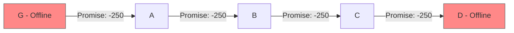

# Minority Recovery: Chain-Based Settlement

## Problem Statement

In circuit starvation, honest minority nodes (A, B, C) have unresolved promised chits:
- A promised to reduce debt to G by 250 (G offline)
- B promised to reduce debt to A by 250
- C promised to reduce debt to B by 250

Unlike proposal 1, this approach avoids creating new trust relationships between A and C.



## Proposed Method: Bilateral Adjustments

### Core Concept
Instead of creating new tallies, adjust existing A↔B and B↔C tallies to achieve the same effect as the intended lift, while preserving claims against the offline majority.

### Implementation Steps

#### Step 1: Document Original State
```json
{
  "original_promises": {
    "A_to_G": {"amount": -250, "status": "promised", "majority_node": "G"},
    "B_to_A": {"amount": -250, "status": "promised"},
    "C_to_B": {"amount": -250, "status": "promised"}
  },
  "current_balances": {
    "A_B_tally": {"A_balance": -100, "B_balance": 100},
    "B_C_tally": {"B_balance": 200, "C_balance": -200}
  }
}
```

#### Step 2: Execute Coordinated Bilateral Adjustments

**A↔B Tally Adjustment:**
- Current: A owes B 100 units
- Adjustment: Reduce A's debt by 250 (the promised amount)
- New balance: A has credit of 150 with B
- **Rationale**: This achieves what B's promise to A would have done

**B↔C Tally Adjustment:**
- Current: C owes B 200 units  
- Adjustment: Reduce C's debt by 250 (the promised amount)
- New balance: C has credit of 50 with B
- **Rationale**: This achieves what C's promise to B would have done

#### Step 3: Document Claims Against Majority
```json
{
  "minority_settlement": {
    "A_B_adjustment": -250,
    "B_C_adjustment": -250,
    "rationale": "Bilateral execution of promised lift amounts"
  },
  "preserved_claims": {
    "A_claim_against_G": {
      "amount": 250,
      "basis": "A executed promise but G did not reciprocate",
      "evidence": "timeout_logs"
    }
  }
}
```

### How This Addresses the Race Condition

#### Critical Insight: Partial Execution Strategy
Unlike proposal 1, this approach **acknowledges that the minority cannot execute the full original lift**. Instead:

1. **Execute what can be executed**: B→A and C→B promises (bilateral)
2. **Document what cannot be executed**: A→G promise (requires offline node)
3. **Preserve claims**: A maintains claim against G for the unexecuted portion

#### Race Condition Analysis

**Scenario 1: Majority Returns and COMMITS Original Lift**
```
Original A→G promise executes:    A: -250 (to G)
Minority B→A executed:           A: +250 (from B)
Minority C→B executed:           B: +250 (from C)
Net result:                      A: 0, B: +250, C: -250
```

**Problem**: This is **still incorrect!** B and C have wrong balances.

**Scenario 2: Majority Returns and VOIDS Original Lift**  
```
Original A→G promise voided:     A: 0
Minority B→A executed:           A: +250 (from B)  
Minority C→B executed:           B: +250 (from C)
Net result:                      A: +250, B: +250, C: -250
```

**Problem**: This is **also incorrect!** All balances are wrong.

## Critical Analysis: This Approach Also Fails

### The Fundamental Problem Remains

This proposal **still suffers from the same race condition issue** as proposal 1:

1. **Cannot predict majority decision**: A, B, C don't know if majority will commit or void
2. **Partial execution creates inconsistency**: Executing some promises but not others breaks the atomic nature of the original lift
3. **No coordination mechanism**: Minority actions are independent of majority resolution

### Why Bilateral Adjustments Don't Work

**The Original Lift Was Atomic**: All promises were meant to execute together or not at all. Executing some promises independently **breaks the atomicity guarantee** that makes lifts safe.

**Example of the Problem**:
- Original intent: Everyone's balance reduces by 250
- Bilateral execution: Only B→A and C→B promises execute
- Result: Unbalanced outcome regardless of what majority does

### Specific Failure Modes

1. **B Bears Unfair Risk**: In all scenarios, B ends up with incorrect balance
2. **No True Settlement**: The "settlement" doesn't actually settle anything - it creates new imbalances
3. **Claims Are Unclear**: What exactly can A claim against G? The lift never completed properly.

## Assessment: Not Viable

### Why This Doesn't Solve Circuit Starvation

1. **Same Race Condition**: Minority actions still conflict with potential majority resolution
2. **Breaks Atomicity**: Partial execution violates the fundamental lift principle
3. **Creates New Problems**: Generates incorrect balances in all scenarios
4. **No Real Coordination**: Doesn't actually coordinate with the original consensus mechanism

### The Core Issue

**Both proposals 1 and 2 attempt to bypass the consensus mechanism rather than resolve it.** This creates race conditions because:
- The original promises still exist in the consensus system
- Minority actions are separate from the original transaction
- No coordination exists between minority recovery and majority resolution

## Conclusion

The chain-based settlement approach **fails to solve the circuit starvation problem** for the same fundamental reason as proposal 1: **it doesn't resolve the original promised chits, it bypasses them**.

Any viable recovery mechanism must either:
1. **Definitively resolve** the original promise state (commit or void)
2. **Coordinate with** the original consensus mechanism
3. **Wait for timeout** to naturally resolve the uncertain state

**Assessment**: This approach is **not viable** and should be avoided.

**Recommendation**: Look for recovery mechanisms that actually resolve the original consensus state rather than attempting to bypass it with independent transactions. 