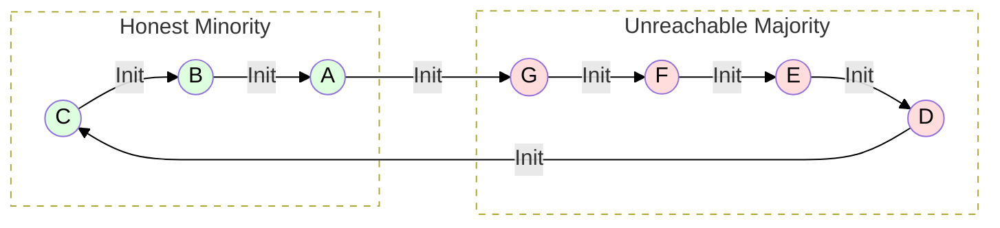
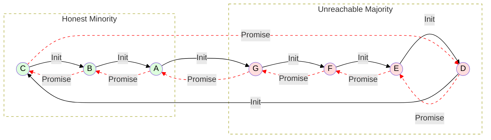
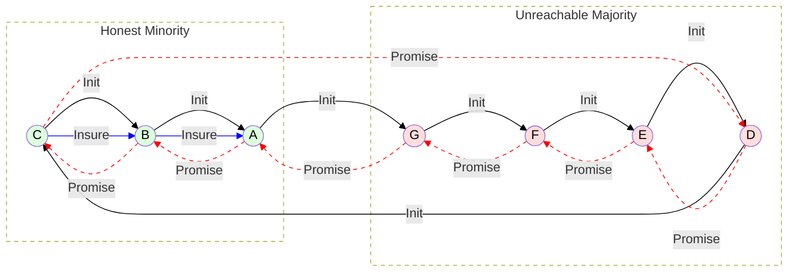
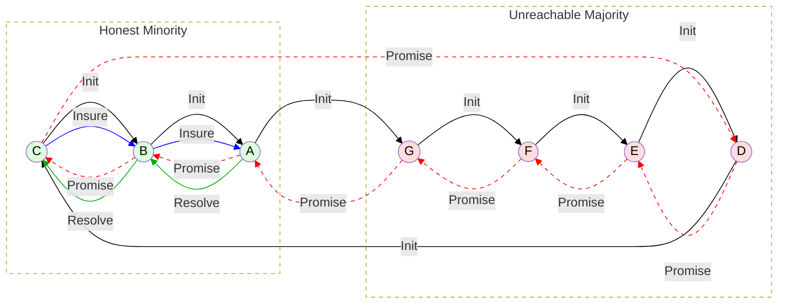

# Minority Recovery: Insurance Chit Protocol

## Overview

The Insurance Chit Protocol provides a viable solution to circuit starvation attacks in MyCHIPs. When a majority of nodes in a lift circuit go offline after the Promise phase, honest minority nodes are left with unresolved promised chits that impair their trading capacity.

This protocol uses a three-phase approach:
1. **Insurance chits** neutralize the effect of stuck promises, allowing trading to continue
2. **Majority resolution** determines the fate of the original lift (commit or void)
3. **Resolution chits** complete the intended lift when the majority commits

**Key Innovation**: The solution requires no group coordination - everything works through bilateral economic incentives and existing tally contract obligations.

## Phase 1: Initial Circuit Formation

Before the attack, we have a normal seven-node trading circuit with established tally relationships.



**The Network**: 
- **Honest nodes**: A, B, C (3 nodes, 43% minority)
- **Colluding nodes**: D, E, F, G (4 nodes, 57% majority)
- **Tally relationships**: Each arrow represents an existing trust relationship and credit tally between adjacent nodes

## Phase 2: Circuit Starvation Attack

A coordinated lift begins normally through the Discover and Promise phases, but then the majority nodes (D, E, F, G) go offline before the Commit phase, leaving the minority with unresolved promised chits.



**The Problem**:
- **Red dashed arrows**: Promised chits (conditional commitments) for a 250-unit lift
- **Stuck promises**: All nodes have promised to transfer 250 units in the direction shown
- **Resource starvation**: Promised chits reduce available trading capacity on each tally
- **Uncertain outcome**: Minority nodes don't know if majority will eventually commit or void

**Impact on Trading**:
- Each promised chit reduces the available credit/debit capacity on the tally
- Future lift decisions become difficult due to uncertain projected balances
- Business operations are impaired but not completely stopped

## Phase 3: Insurance Chits Neutralize the Problem

After a defined timeout period (specified in the original lift proposal), honest minority nodes become eligible to request insurance chits from their trading partners.



**Insurance Chit Protocol**:
- **Blue arrows**: Insurance chits in the opposite direction of the original promises
- **A requests from B**: Insurance chit B→A (250 units)
- **B requests from C**: Insurance chit C→B (250 units)
- **Net effect**: Each tally has zero net promised value (original promise + insurance = 0)

**How It Works**:
1. **User alerts**: App notifies A that the lift has been outstanding beyond the timeout
2. **Manual request**: A asks B for an insurance chit worth 250 units (B→A direction)
3. **Tally obligation**: B is obligated under the tally contract to provide the insurance chit
4. **Propagation**: B simultaneously requests insurance from C following the same process
5. **Promised state**: Insurance chits remain in promised state, linked to the original lift

**Key Benefits**:
- **Trading restoration**: Net zero promised balance allows normal trading to resume
- **No risk**: Both original and insurance chits resolve together (commit or void)
- **Bilateral coordination**: No complex group decisions needed

## Phase 4: Resolution Completes the Lift

When the majority nodes eventually return online and commit the original lift, the insurance chits also commit, creating an intentional imbalance that enables resolution chits to complete the intended lift.



**Resolution Process When Majority Commits**:

1. **Majority returns**: D, E, F, G come back online and vote to commit the original lift
2. **Simultaneous commit**: Both original promises and insurance chits commit together
3. **Intentional imbalance created**:
   - A: Net +250 (loses 250 to G via original, gains 250 from B via insurance)
   - B: Net 0 (loses 250 to A via insurance, gains 250 from C via insurance) 
   - C: Net -250 (loses 250 to B via insurance, owes 250 to D via original)

4. **Resolution chits restore balance**:
   - **Green arrows**: A→B and B→C resolution chits (250 units each)
   - **Economic incentive**: A has excess (+250) and can afford to pay B
   - **Fair outcome**: B helps C who is deficit (-250) due to the committed lift

**Final Result**: The lift completes exactly as originally intended, with possible penalties applied to the irresponsible majority nodes.

**Alternative: If Majority Voids**:
If the majority returns and voids the original lift, both original promises and insurance chits void together, returning everyone to their original state. No resolution chits are needed.

## Implementation Details

### Contract Terms and User Experience

**Insurance Chit Eligibility**:
- Timeout period specified in original lift proposal (e.g., 24 hours)
- Only minority nodes affected by the stuck lift can request
- Direction follows the circuit: A requests from B, B requests from C

**User Interface Flow**:
```
User Alert to A:
"This lift has been outstanding for a whole day and has not been resolved. 
A voting majority cannot be reached. In order to restore lift function to 
this tally, it is appropriate for you to now ask for an insurance chit 
from your trading partner, B."

User Alert to B when receiving request:
"A is requesting an insurance chit. Under your tally contract, you are 
obligated to provide this insurance. You should also request an insurance 
chit from C if you haven't already."
```

**Manual Intervention Required**:
- Insurance chit requests and responses
- Resolution chit requests and responses  
- Human oversight ensures appropriate use of the protocol

### State Management

**Chit Tracking**:
- Insurance chits reference the original lift ID
- All related chits (original + insurance + resolution) remain linked
- Promised state maintained until majority resolution
- Resolution together prevents race conditions

**Bilateral Obligations**:
- Tally contracts enforce insurance chit obligations
- No group coordination required
- Economic incentives drive natural propagation
- Preserves existing trust relationships

## Why This Works: Comparison to Failed Proposals

### **Proposal 1 (Direct A-C Tally): FAILED**
- Created new trust relationships (A-C direct)
- Race condition: minority actions independent of majority resolution
- Could result in double-execution or incorrect balances

### **Proposal 2 (Bilateral Adjustments): FAILED**  
- Broke atomicity by partially executing the lift
- Same race condition problem as Proposal 1
- Created imbalances without coordination mechanism

### **Proposal 3 (Insurance Chit Protocol): SUCCEEDS**
- **No race conditions**: Insurance chits tied to original lift fate
- **Preserves atomicity**: Nothing executes until majority decides
- **Bilateral coordination**: Uses existing trust relationships
- **Economic incentives**: Natural propagation through self-interest
- **Fair outcomes**: Handles both commit and void scenarios correctly

## Viability Assessment

### Technical Viability: **HIGH**
- Builds on existing chit and tally mechanisms
- Clear state management with linked but distinct chit types
- Manageable complexity increase
- Standard cryptographic resolution criteria

### Economic Viability: **HIGH**
- Strong economic incentives for participation
- Protects innocent intermediaries (like node B)
- Preserves all legitimate claims and relationships
- Fair distribution of costs and benefits

### Practical Viability: **HIGH**
- Uses existing tally contracts and trust relationships
- Clear user interface and notification system
- Manual intervention provides human oversight
- Scales naturally regardless of circuit size

### Social Viability: **HIGH**
- Respects MyCHIPs' social trust model
- No forced trust relationships between distant nodes
- Bilateral resolution preserves partner relationships
- Natural incentives align with honest behavior

## Recommendations

**Implementation Priority**: **HIGH** - This solution addresses a real attack vector while maintaining system principles.

**Development Phases**:
1. **Protocol Design**: Extend ChipNet consensus to handle linked chit resolution
2. **Contract Updates**: Add insurance chit obligations to tally contracts  
3. **User Interface**: Design clear alerts and manual intervention flows
4. **Testing**: Comprehensive testing of all resolution scenarios
5. **Documentation**: User education on the protocol and its benefits

**Alternative Terminology**: Consider "Interim/Completion" instead of "Insurance/Resolution" to emphasize the temporary nature and final completion phases.

## Questions & Answers

**Status**: All questions answered! ✅

### 1. Insurance Chit Mechanics ✅ ANSWERED

**Q: What exactly is an "insurance chit"?**
**A:** An insurance chit is a conditional promise (uncommitted chit) that works in the opposite direction of the original promised chit. It's distinct from but associated with the original lift chit.

**Q: How do these insurance chits "balance" the resources?**
**A:** The insurance chit nullifies the original chit promise because their net balance is zero:
- Original promise: A→B (-250)  
- Insurance chit: B→A (+250)
- **Net effect**: Zero balance, allowing normal trading to continue

**Q: Are insurance chits executed immediately or do they remain in promised state until resolution?**
**A:** Insurance chits remain in promised state until the majority returns and resolves the original lift. Both the original chit and insurance chit are validated or voided together by the same cryptographic criteria (majority vote).

#### Insurance Chit Protocol Rules:
1. **Eligibility**: Can be requested when a lift has been outstanding for a defined timeout period (e.g., one day as specified in the original lift proposal)
2. **Direction**: 
   - A is entitled to request insurance chit from B (B→A direction)
   - B is entitled to request insurance chit from C (C→B direction)
3. **Topology Awareness**: Each node knows its place in the circuit topology, so these rules can be enforced
4. **Request Process**: Always requested by the party who will receive the chit
5. **Resolution**:
   - **If majority rolls back**: No further action necessary - both chits void together
   - **If majority commits**: Now eligible for "resolution chits" (see question 2)
   - **If never resolved**: Mere ledger annoyance with no threat due to net zero value

### 2. The Resolution Process ✅ ANSWERED

**Q: What does "Provide Valid Signature" from the majority actually mean?**
**A:** This means the majority nodes return online and provide their cryptographic vote to either commit or void the original lift transaction.

**Q: What exactly is a "resolution chit"?**
**A:** A resolution chit is equal in value to the original lift chit (possibly more by the amount of a fine/penalty for irresponsible nodes) and **equal in direction** with the original lift chit. It has the effect of "redoing" the lift since the insurance chit had "undone" it.

**Q: Why does this create a payment flow A→B→C→D?**
**A:** When the majority commits the original lift, the resolution chits restore the intended lift effect:
- **Insurance chits effect**: Nullified the original promises (net zero)
- **Resolution chits effect**: Execute the intended lift direction
- **Net result**: The lift completes as originally intended

#### Resolution Process Flow:
1. **Majority Returns and Commits**: Original lift + insurance chits both commit together
2. **Resolution Chit Eligibility**: 
   - C becomes eligible to request resolution chit from B (C→B direction, same as original promise)
   - B becomes eligible to request resolution chit from A (B→A direction, same as original promise)
3. **Manual Intervention**: Both insurance chits and resolution chits may require human intervention to initiate and respond to
4. **Final Effect**: 
   - Original promises: A→B→C→D (committed)
   - Insurance chits: B→A, C→B (committed, nullifying effect)
   - Resolution chits: A→B, B→C (executed, restoring lift effect)
   - **Net result**: Lift completes with possible penalties for irresponsible majority nodes

**Q: What happens if the majority comes back and VOIDS instead of commits the original lift?**
**A:** No further action necessary - both the original promises and insurance chits void together, returning everyone to their original state.

### 3. Race Condition Handling ✅ ANSWERED

**Q: How does this approach avoid the same race condition problems as proposals 1 and 2?**
**A:** **No race condition exists** because insurance chits are **tied to the original lift's fate**:
- Insurance chits stay in promised state with the original chits
- They commit or void together with the original (same cryptographic criteria)
- **Either outcome results in no net balance transfer** during the insurance phase

**Q: If A, B, C execute insurance chits, and then the majority returns and commits the original lift, don't we still have the double-execution problem?**
**A:** **No double-execution problem** because the system is designed for this scenario:

#### When Majority Commits (The Normal Recovery Path):
1. **Original promises commit**: A→B→C→D (A loses 250, C owes D 250)
2. **Insurance chits commit**: B→A, C→B (net zero effect)
3. **Imbalance created**: A is ahead (+250 from insurance), C is behind (-250 to D)
4. **Resolution chits fix imbalance**: A→B, B→C (A passes gain to B, B helps C)
5. **Final result**: Lift completes as intended with fair distribution

This **imbalance is intentional** - it creates the economic incentive for resolution chits to flow in the correct direction.

### 4. Timeline and Triggers ✅ ANSWERED

**Q: When exactly do nodes A, B, C decide to execute the insurance chit protocol?**
**A:** The timeout period is incorporated into the original lift proposal (built by the node that initiates the lift). After this period expires without resolution, nodes become eligible for insurance chits.

**Q: What triggers the "Request Insurance Chit" step?**
**A:** **Manual intervention with user alerts.** The app alerts users when appropriate:

*Example alert to A:*
> "This lift has been outstanding for a whole day and has not been resolved. A voting majority cannot be reached. In order to restore lift function to this tally, it is appropriate for you to now ask for an insurance chit from your trading partner, B."

*When B receives the request:*
> B is advised whether he is obligated under the tally contract to issue the insurance, and advised that he needs to request the same from C (if he hasn't already).

**Q: How do honest nodes coordinate this decision among themselves?**
**A:** **No coordination between all honest nodes is necessary.** This is what makes the solution elegant:

#### Bilateral Coordination Principles:
1. **Only Adjacent Nodes Matter**: Binding relationships exist only between two adjacent nodes, not the group
2. **Tally Contract Enforcement**: The tally contract binds parties to their agreements for bilateral healing
3. **No Distant Node Dependencies**: Nodes can't insist on anything from distant nodes
4. **Economic Interest Propagation**: Insurance and resolution propagate through honest nodes based on:
   - Getting tallies back in trading order
   - Not granting insurance without requesting in turn (if entitled)
   - Preserving good relations with trusted partners

#### Timing and Incentives:
- **Insurance/Resolution Chits**: Can be initiated at leisure after eligibility deadline
- **Economic Pressure**: Best interest is to act soon after becoming eligible
- **No Time Pressure**: Nodes can take time for manual processing, but economic incentives encourage prompt action

### 5. State Management Complexity ✅ ANSWERED

**Q: How are the "promised state" insurance chits tracked alongside the original promised chits?**
**A:** Insurance chits are **distinct but associated** with original lift chits:
- Each insurance chit references the original lift ID
- Both remain in promised state until majority resolution
- System tracks them as separate but linked transactions
- **Complexity is manageable** because they're resolved together

**Q: What happens to the insurance chits if the original lift eventually gets resolved normally?**
**A:** They resolve together with the original lift:
- **If majority commits**: Both original and insurance chits commit, creating the intentional imbalance that triggers resolution chits
- **If majority voids**: Both original and insurance chits void, returning to original state
- **If never resolved**: Both remain as promised chits (ledger annoyance but no functional impact due to net zero)

### 6. The Core Mechanism ✅ ANSWERED

**Q: Is the fundamental idea that insurance chits create a "backup lift" that can be executed independently of the original lift's fate?**
**A:** **No** - insurance chits are **tied to the original lift's fate**. They don't create an independent backup but rather provide **insurance against resource starvation** while the original lift remains in limbo.

**Q: Or is it more like "insurance against losses" where the chits only execute if certain conditions are met?**
**A:** **Yes** - it's insurance against resource starvation that:
1. **Enables continued trading** by creating net zero balance during the timeout period
2. **Resolves fairly** regardless of majority decision (commit or void)
3. **Creates economic incentives** for proper resolution when majority commits
4. **Preserves all original claims** and relationships

#### Alternative Terminology Suggestions:
Instead of "insurance" and "resolution" chits, consider:
- **"Interim" and "Completion" chits** - emphasizes the temporary nature and final completion
- **"Neutral" and "Settlement" chits** - emphasizes zero effect and final settlement  
- **"Holding" and "Transfer" chits** - emphasizes resource holding during timeout and final transfer
- **"Bridge" and "Fulfillment" chits** - emphasizes bridging the gap and fulfilling the lift

The current terminology works well, but "Interim/Completion" might be clearer about the temporary nature of the first phase. 