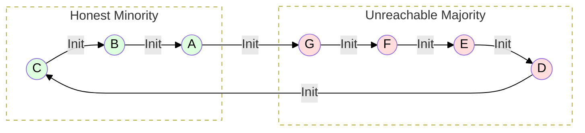
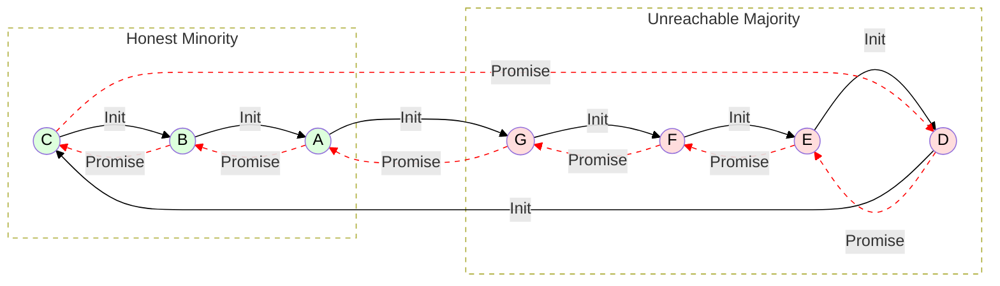
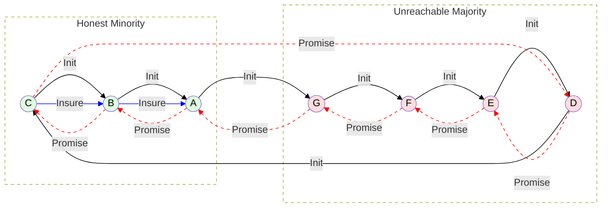
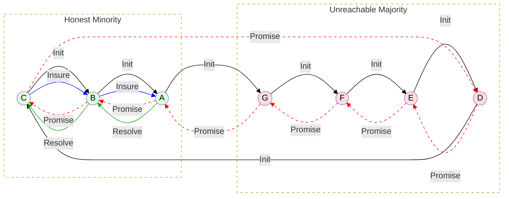
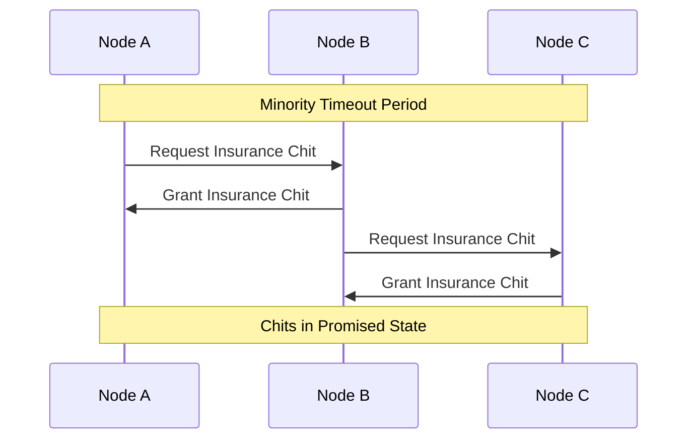
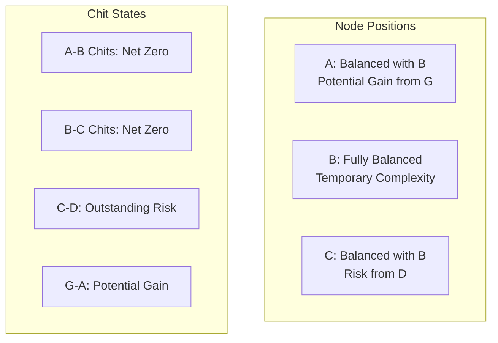
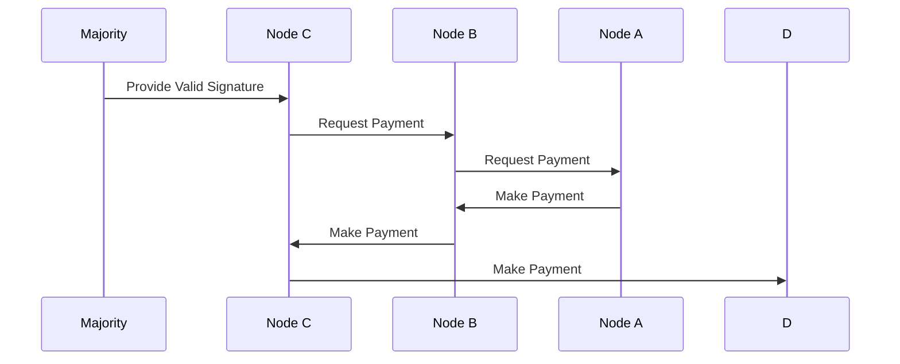
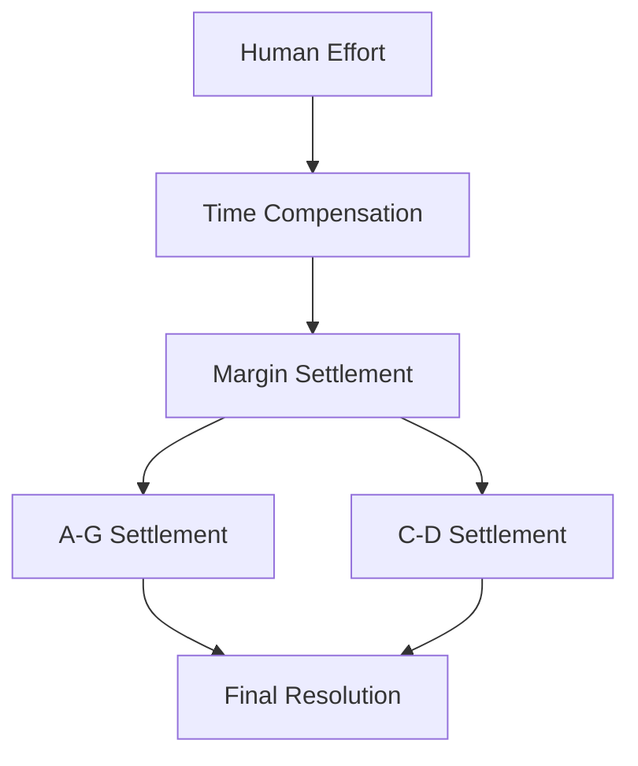

# Minority Recovery Contract Scenario

## Network States

### 1. Initial Tally Network

### 2. Lift Attempt State

### 3. Insurance Chit State

### 4. Final Resolution State

## Initial Conditions
1. **Lift State**:
   - Broken/incomplete lift
   - Majority (D,E,F,G) unreachable
   - Minority (A,B,C) connected
   - Unknown majority decision

2. **Resource State**:
   - Promises locked on all tallies
   - B doubly impacted (both directions)
   - A and C impacted on margin side
   - Uncertain final resolution

3. **Responsibility Distribution**:
   - B: Innocent intermediary
   - A,C: Partial responsibility (partner choice)
   - Majority: Unknown status/intent

## Insurance Chit Protocol

### Process Flow

## Position Analysis

### Immediate State

1. **Node B (Intermediary)**:
   - Resources balanced by insurance chits
   - Carries additional state complexity
   - Protected from immediate harm
   - Maintains operational capacity

2. **Node C (Right Margin)**:
   - Balanced with B through insurance
   - Exposed to D's potential claim
   - Higher risk position
   - May need additional protection

3. **Node A (Left Margin)**:
   - Balanced with B through insurance
   - Potential gain if G validates
   - Lower risk position
   - Strategic advantage

## Resolution Process

### Majority Validation Flow

### Compensation Structure

## Implementation Requirements

### Contract Terms
1. **Insurance Chit Rights**:
   - Automatic after timeout
   - Must be granted when requested
   - Stored in promised state
   - Linked to original lift

2. **Resolution Process**:
   - Clear validation criteria
   - Payment obligations
   - Timing requirements
   - Compensation terms

3. **State Management**:
   - Chit tracking
   - Promise relationships
   - Resolution status
   - Compensation tracking

2. **State Tracking**:
   - Original lift state
   - Insurance chit state
   - Resolution progress
   - Payment status

## Viability Analysis

### Strengths
1. **Fairness**:
   - Protects innocent intermediary
   - Preserves all claims
   - Enables eventual resolution
   - Compensates effort

2. **Practicality**:
   - Clear process
   - Human intervention points
   - Natural incentives
   - Complete resolution

3. **Risk Management**:
   - Balanced positions
   - Preserved claims
   - Clear responsibilities
   - Fair compensation

### Challenges
1. **Complexity**:
   - Additional state tracking
   - Multiple resolution steps
   - Human coordination
   - Complex accounting

2. **Timing**:
   - Minority timeout period
   - Resolution delays
   - Payment coordination
   - Compensation settlement

3. **Implementation**:
   - Protocol updates needed
   - State management
   - User interface
   - Documentation

## Conclusions

### Viability Assessment
1. **Technical Viability**: HIGH
   - Clear process flow
   - Manageable complexity
   - Standard mechanisms
   - Reasonable requirements

2. **Practical Viability**: HIGH
   - Natural incentives
   - Fair outcomes
   - Clear responsibilities
   - Complete resolution

3. **Economic Viability**: HIGH
   - Protected intermediary
   - Preserved claims
   - Fair compensation
   - Balanced risks

### Recommendations
1. **Implementation**:
   - Add to tally contracts
   - Update ChipNet protocol
   - Create user interfaces
   - Document process

2. **Deployment**:
   - Phase rollout
   - User education
   - Support tools
   - Monitoring systems

The minority recovery contract mechanism provides a viable, fair, and complete solution to the circuit starvation problem. It protects innocent intermediaries while preserving all legitimate claims and providing appropriate compensation for effort. The mechanism is practically implementable and aligns with existing MyCHIPs principles of social trust and contract-based resolution.

## Questions & Answers

**Status**: Questions 1-2-4 answered. Questions 3-5-6 need clarification.

### 1. Insurance Chit Mechanics ✅ ANSWERED

**Q: What exactly is an "insurance chit"?**
**A:** An insurance chit is a conditional promise (uncommitted chit) that works in the opposite direction of the original promised chit. It's distinct from but associated with the original lift chit.

**Q: How do these insurance chits "balance" the resources?**
**A:** The insurance chit nullifies the original chit promise because their net balance is zero:
- Original promise: A→B (-250)  
- Insurance chit: B→A (+250)
- **Net effect**: Zero balance, allowing normal trading to continue

**Q: Are insurance chits executed immediately or do they remain in promised state until resolution?**
**A:** Insurance chits remain in promised state until the majority returns and resolves the original lift. Both the original chit and insurance chit are validated or voided together by the same cryptographic criteria (majority vote).

#### Insurance Chit Protocol Rules:
1. **Eligibility**: Can be requested when a lift has been outstanding for a defined timeout period (e.g., one day as specified in the original lift proposal)
2. **Direction**: 
   - A is entitled to request insurance chit from B (B→A direction)
   - B is entitled to request insurance chit from C (C→B direction)
3. **Topology Awareness**: Each node knows its place in the circuit topology, so these rules can be enforced
4. **Request Process**: Always requested by the party who will receive the chit
5. **Resolution**:
   - **If majority rolls back**: No further action necessary - both chits void together
   - **If majority commits**: Now eligible for "resolution chits" (see question 2)
   - **If never resolved**: Mere ledger annoyance with no threat due to net zero value

### 2. The Resolution Process ✅ ANSWERED

**Q: What does "Provide Valid Signature" from the majority actually mean?**
**A:** This means the majority nodes return online and provide their cryptographic vote to either commit or void the original lift transaction.

**Q: What exactly is a "resolution chit"?**
**A:** A resolution chit is equal in value to the original lift chit (possibly more by the amount of a fine/penalty for irresponsible nodes) and **equal in direction** with the original lift chit. It has the effect of "redoing" the lift since the insurance chit had "undone" it.

**Q: Why does this create a payment flow A→B→C→D?**
**A:** When the majority commits the original lift, the resolution chits restore the intended lift effect:
- **Insurance chits effect**: Nullified the original promises (net zero)
- **Resolution chits effect**: Execute the intended lift direction
- **Net result**: The lift completes as originally intended

#### Resolution Process Flow:
1. **Majority Returns and Commits**: Original lift + insurance chits both commit together
2. **Resolution Chit Eligibility**: 
   - C becomes eligible to request resolution chit from B (C→B direction, same as original promise)
   - B becomes eligible to request resolution chit from A (B→A direction, same as original promise)
3. **Manual Intervention**: Both insurance chits and resolution chits may require human intervention to initiate and respond to
4. **Final Effect**: 
   - Original promises: A→B→C→D (committed)
   - Insurance chits: B→A, C→B (committed, nullifying effect)
   - Resolution chits: A→B, B→C (executed, restoring lift effect)
   - **Net result**: Lift completes with possible penalties for irresponsible majority nodes

**Q: What happens if the majority comes back and VOIDS instead of commits the original lift?**
**A:** No further action necessary - both the original promises and insurance chits void together, returning everyone to their original state.

### 3. Race Condition Handling
- **How does this approach avoid the same race condition problems as proposals 1 and 2?** The file doesn't address what happens if the majority returns and makes a different decision than expected.
- **If A, B, C execute insurance chits, and then the majority returns and commits the original lift, don't we still have the double-execution problem?**

### 4. Timeline and Triggers ✅ ANSWERED

**Q: When exactly do nodes A, B, C decide to execute the insurance chit protocol?**
**A:** The timeout period is incorporated into the original lift proposal (built by the node that initiates the lift). After this period expires without resolution, nodes become eligible for insurance chits.

**Q: What triggers the "Request Insurance Chit" step?**
**A:** **Manual intervention with user alerts.** The app alerts users when appropriate:

*Example alert to A:*
> "This lift has been outstanding for a whole day and has not been resolved. A voting majority cannot be reached. In order to restore lift function to this tally, it is appropriate for you to now ask for an insurance chit from your trading partner, B."

*When B receives the request:*
> B is advised whether he is obligated under the tally contract to issue the insurance, and advised that he needs to request the same from C (if he hasn't already).

**Q: How do honest nodes coordinate this decision among themselves?**
**A:** **No coordination between all honest nodes is necessary.** This is what makes the solution elegant:

#### Bilateral Coordination Principles:
1. **Only Adjacent Nodes Matter**: Binding relationships exist only between two adjacent nodes, not the group
2. **Tally Contract Enforcement**: The tally contract binds parties to their agreements for bilateral healing
3. **No Distant Node Dependencies**: Nodes can't insist on anything from distant nodes
4. **Economic Interest Propagation**: Insurance and resolution propagate through honest nodes based on:
   - Getting tallies back in trading order
   - Not granting insurance without requesting in turn (if entitled)
   - Preserving good relations with trusted partners

#### Timing and Incentives:
- **Insurance/Resolution Chits**: Can be initiated at leisure after eligibility deadline
- **Economic Pressure**: Best interest is to act soon after becoming eligible
- **No Time Pressure**: Nodes can take time for manual processing, but economic incentives encourage prompt action

### 5. State Management Complexity
- **How are the "promised state" insurance chits tracked alongside the original promised chits?** This seems like it could create very complex state management.
- **What happens to the insurance chits if the original lift eventually gets resolved normally?**

### 6. The Core Mechanism
- **Is the fundamental idea that insurance chits create a "backup lift" that can be executed independently of the original lift's fate?** 
- **Or is it more like "insurance against losses" where the chits only execute if certain conditions are met?** 