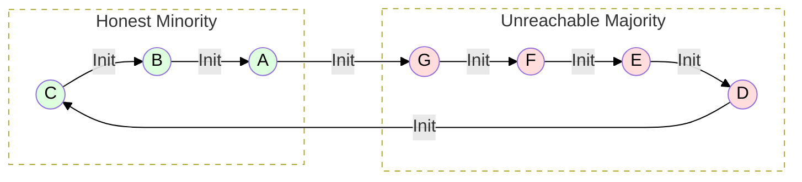
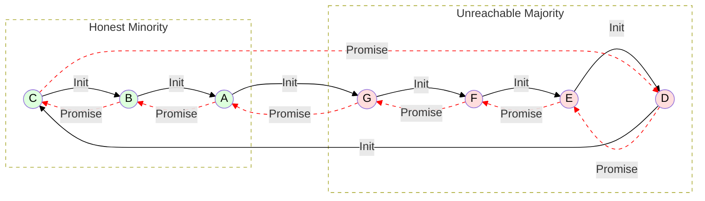
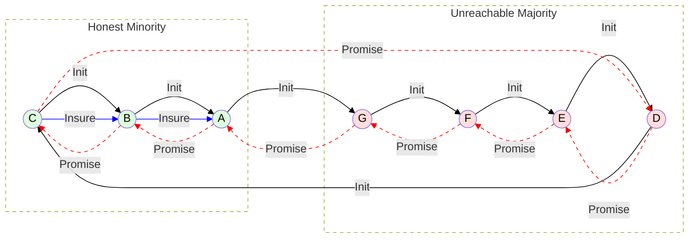
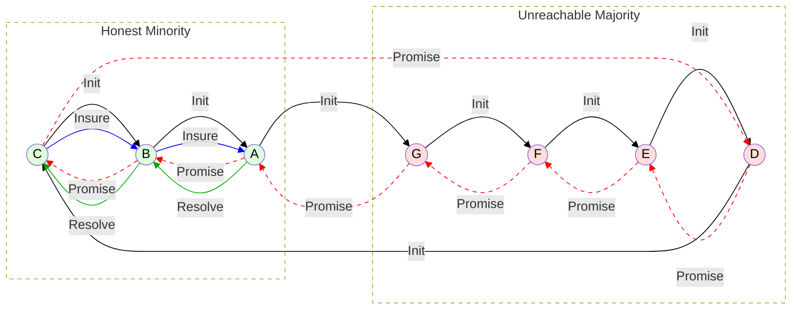
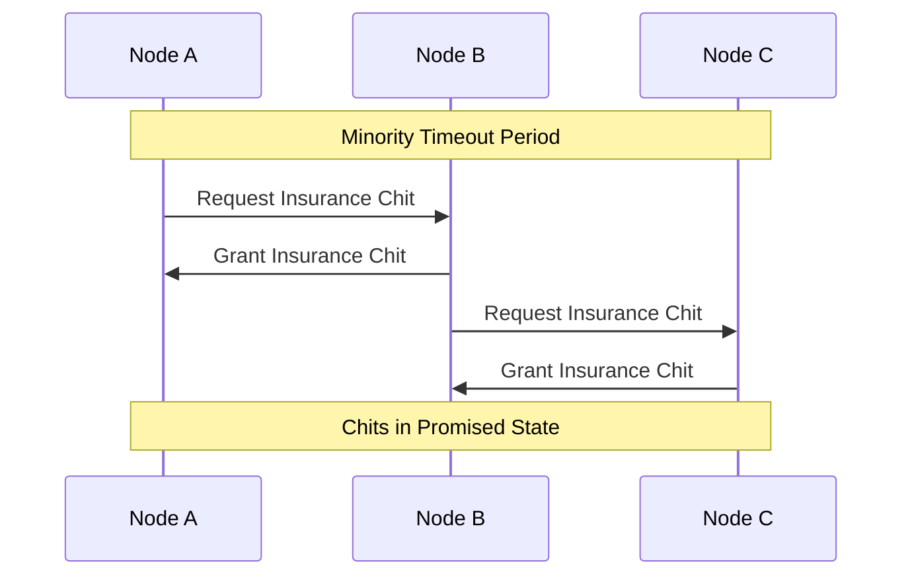
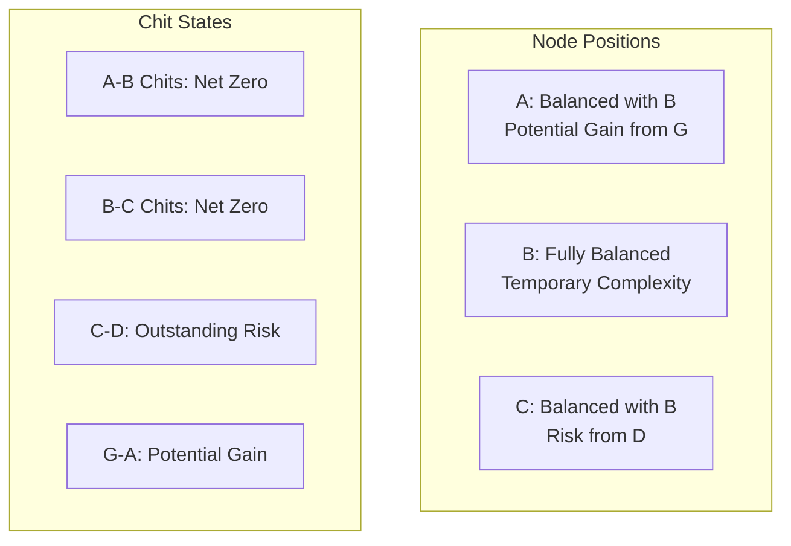
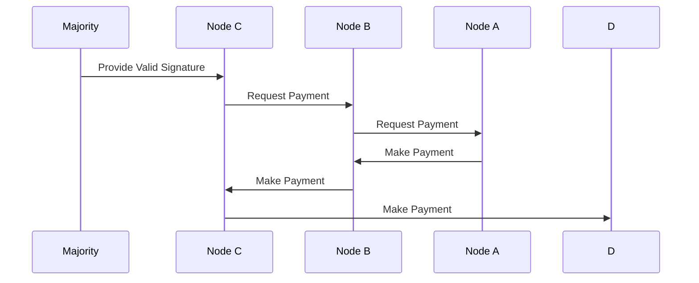
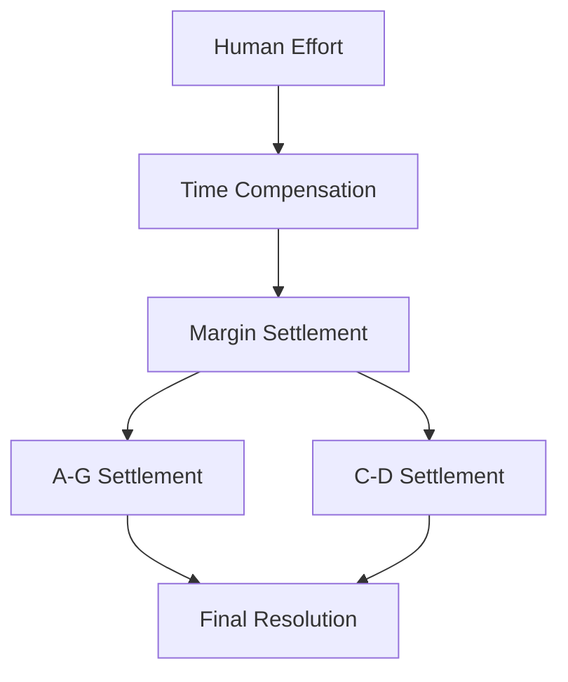

# Minority Recovery Contract Scenario

## Network States

### 1. Initial Tally Network

### 2. Lift Attempt State

### 3. Insurance Chit State

### 4. Final Resolution State

## Initial Conditions
1. **Lift State**:
   - Broken/incomplete lift
   - Majority (D,E,F,G) unreachable
   - Minority (A,B,C) connected
   - Unknown majority decision

2. **Resource State**:
   - Promises locked on all tallies
   - B doubly impacted (both directions)
   - A and C impacted on margin side
   - Uncertain final resolution

3. **Responsibility Distribution**:
   - B: Innocent intermediary
   - A,C: Partial responsibility (partner choice)
   - Majority: Unknown status/intent

## Insurance Chit Protocol

### Process Flow

## Position Analysis

### Immediate State

1. **Node B (Intermediary)**:
   - Resources balanced by insurance chits
   - Carries additional state complexity
   - Protected from immediate harm
   - Maintains operational capacity

2. **Node C (Right Margin)**:
   - Balanced with B through insurance
   - Exposed to D's potential claim
   - Higher risk position
   - May need additional protection

3. **Node A (Left Margin)**:
   - Balanced with B through insurance
   - Potential gain if G validates
   - Lower risk position
   - Strategic advantage

## Resolution Process

### Majority Validation Flow

### Compensation Structure

## Implementation Requirements

### Contract Terms
1. **Insurance Chit Rights**:
   - Automatic after timeout
   - Must be granted when requested
   - Stored in promised state
   - Linked to original lift

2. **Resolution Process**:
   - Clear validation criteria
   - Payment obligations
   - Timing requirements
   - Compensation terms

3. **State Management**:
   - Chit tracking
   - Promise relationships
   - Resolution status
   - Compensation tracking

2. **State Tracking**:
   - Original lift state
   - Insurance chit state
   - Resolution progress
   - Payment status

## Viability Analysis

### Strengths
1. **Fairness**:
   - Protects innocent intermediary
   - Preserves all claims
   - Enables eventual resolution
   - Compensates effort

2. **Practicality**:
   - Clear process
   - Human intervention points
   - Natural incentives
   - Complete resolution

3. **Risk Management**:
   - Balanced positions
   - Preserved claims
   - Clear responsibilities
   - Fair compensation

### Challenges
1. **Complexity**:
   - Additional state tracking
   - Multiple resolution steps
   - Human coordination
   - Complex accounting

2. **Timing**:
   - Minority timeout period
   - Resolution delays
   - Payment coordination
   - Compensation settlement

3. **Implementation**:
   - Protocol updates needed
   - State management
   - User interface
   - Documentation

## Conclusions

### Viability Assessment
1. **Technical Viability**: HIGH
   - Clear process flow
   - Manageable complexity
   - Standard mechanisms
   - Reasonable requirements

2. **Practical Viability**: HIGH
   - Natural incentives
   - Fair outcomes
   - Clear responsibilities
   - Complete resolution

3. **Economic Viability**: HIGH
   - Protected intermediary
   - Preserved claims
   - Fair compensation
   - Balanced risks

### Recommendations
1. **Implementation**:
   - Add to tally contracts
   - Update ChipNet protocol
   - Create user interfaces
   - Document process

2. **Deployment**:
   - Phase rollout
   - User education
   - Support tools
   - Monitoring systems

The minority recovery contract mechanism provides a viable, fair, and complete solution to the circuit starvation problem. It protects innocent intermediaries while preserving all legitimate claims and providing appropriate compensation for effort. The mechanism is practically implementable and aligns with existing MyCHIPs principles of social trust and contract-based resolution. 