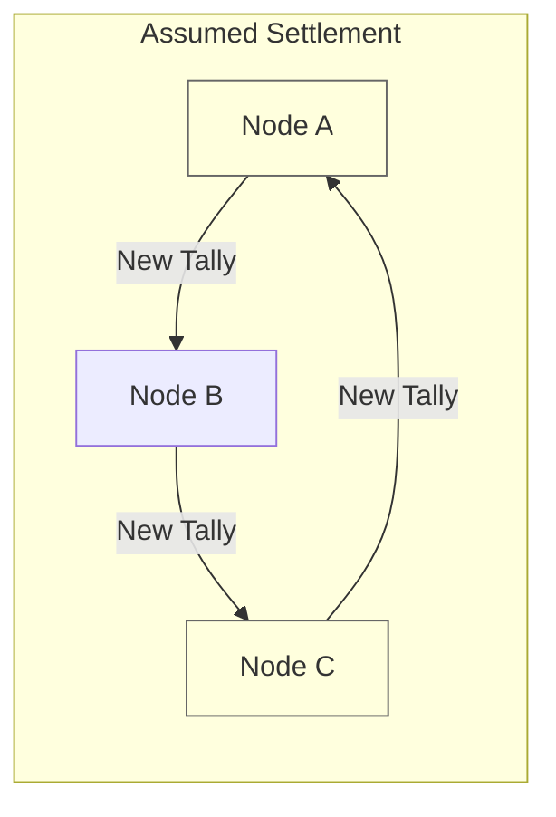
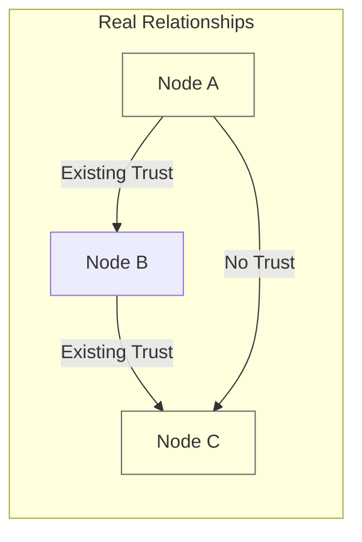
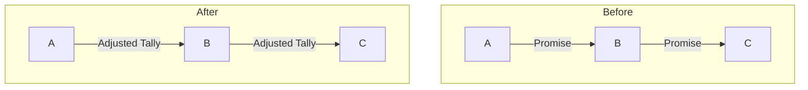
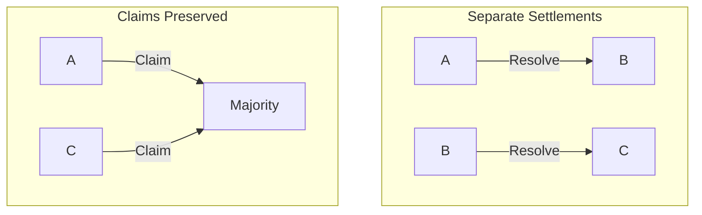
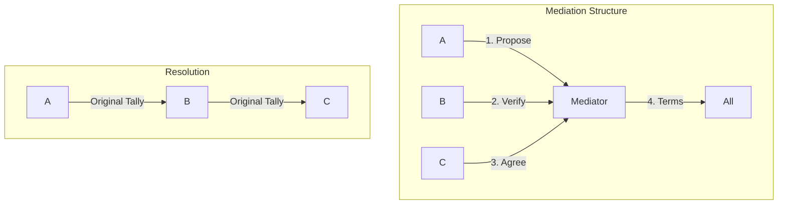
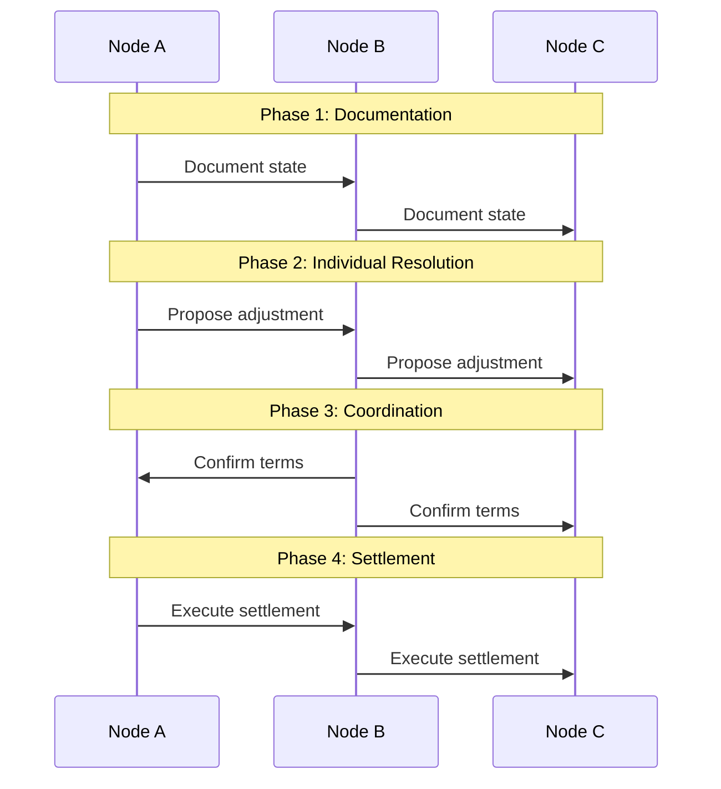

# Minority Recovery: Trust Requirements Analysis

## Trust Problem

### Original Assumption (Flawed)


**Issues**:
- Requires new trust relationships
- No basis for A-C trust
- Forces unnatural connections
- Increases risk exposure

### Actual Trust Network


## Alternative Solutions

### 1. Chain-Based Settlement


**Process**:
1. Keep existing trust lines
2. Adjust balances sequentially
3. B acts as intermediary
4. Preserve original claims

**Advantages**:
- Uses existing relationships
- No new trust required
- Clear responsibility chain
- Natural settlement path

**Disadvantages**:
- More risk for B
- Complex accounting
- Requires B's cooperation
- May need incentives

### 2. Independent Resolution


**Process**:
1. Each pair settles independently
2. Keep original claims separate
3. No cross-node obligations
4. Individual timeout handling

**Advantages**:
- No new trust needed
- Simple bilateral resolution
- Clear responsibilities
- Independent decisions

**Disadvantages**:
- Less efficient
- Might be unbalanced
- Harder to coordinate
- Potential inequities

### 3. Mediated Settlement


**Process**:
1. Use trusted third party
2. Keep existing tallies
3. Adjust terms bilaterally
4. Document resolution

**Advantages**:
- No new trust lines
- Professional oversight
- Clear process
- Legal framework

**Disadvantages**:
- External dependency
- Additional cost
- More complex
- Slower resolution

## Recommended Approach: Hybrid Resolution

### Process Flow


### Implementation

1. **Documentation Phase**:
   ```json
   {
     "stuck_lift": {
       "id": "lift_uuid",
       "original_promises": ["details"],
       "timeout_evidence": ["logs"]
     },
     "bilateral_settlements": [
       {
         "nodes": ["A", "B"],
         "adjustment": "amount",
         "terms": ["details"]
       },
       {
         "nodes": ["B", "C"],
         "adjustment": "amount",
         "terms": ["details"]
       }
     ],
     "preserved_claims": {
       "against_majority": ["claim_details"],
       "recovery_rights": ["terms"]
     }
   }
   ```

2. **Resolution Steps**:
   - Keep existing tally relationships
   - Adjust bilateral balances fairly
   - Document all decisions
   - Preserve external claims

3. **Risk Management**:
   - No new trust requirements
   - Limited exposure changes
   - Clear responsibility chain
   - Documented process

### Legal Framework

1. **Settlement Agreement**:
   - Uses existing contracts
   - Documents timeout/default
   - Preserves claims
   - Bilateral adjustments

2. **Claim Preservation**:
   - Individual rights maintained
   - Coordinated documentation
   - Future recovery path
   - Legal standing preserved

## Conclusions

### Key Principles
1. **Trust Preservation**:
   - No new trust relationships required
   - Use existing tally structure
   - Respect trust boundaries
   - Maintain natural relationships

2. **Fair Resolution**:
   - Bilateral settlements
   - Proportional adjustments
   - Coordinated timing
   - Preserved rights

3. **Practical Implementation**:
   - Simple process
   - Clear documentation
   - Manageable risk
   - Natural recovery

The revised approach acknowledges and respects existing trust relationships while providing a practical path to resource recovery. It's more limited than the original proposal but more realistic and implementable. 