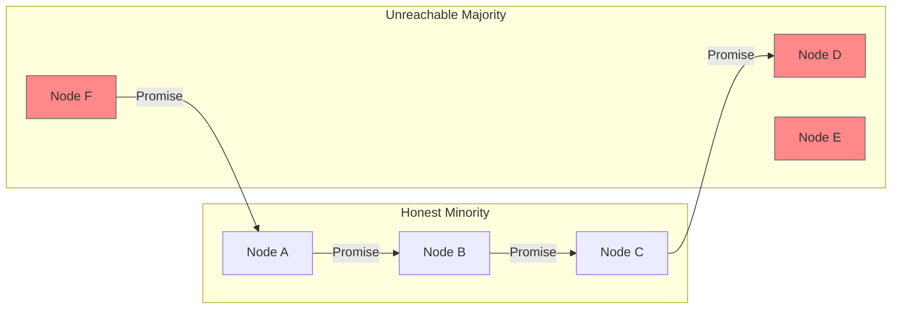
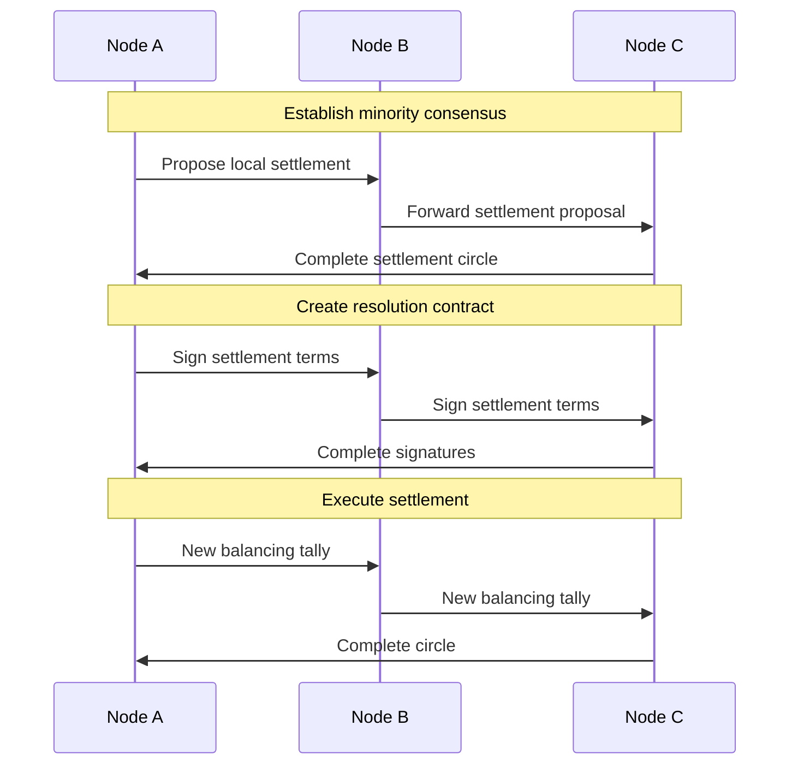
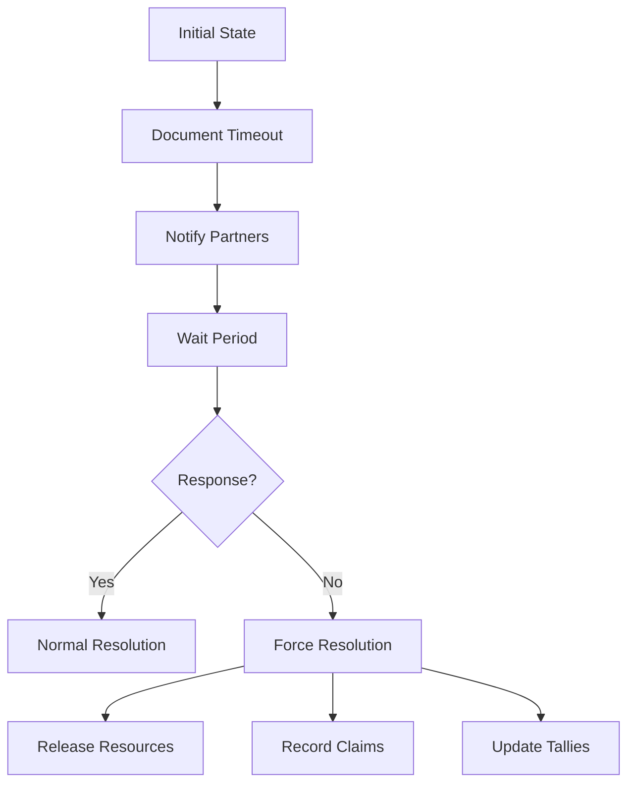
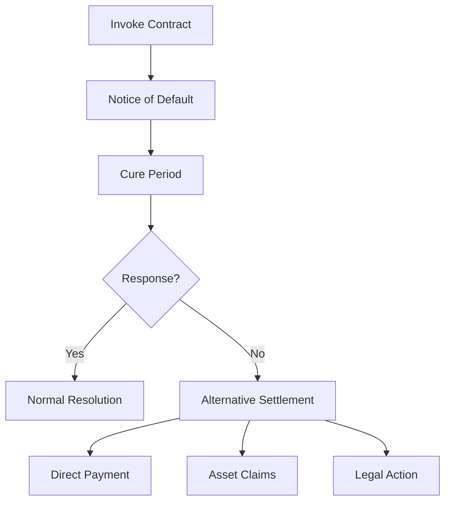
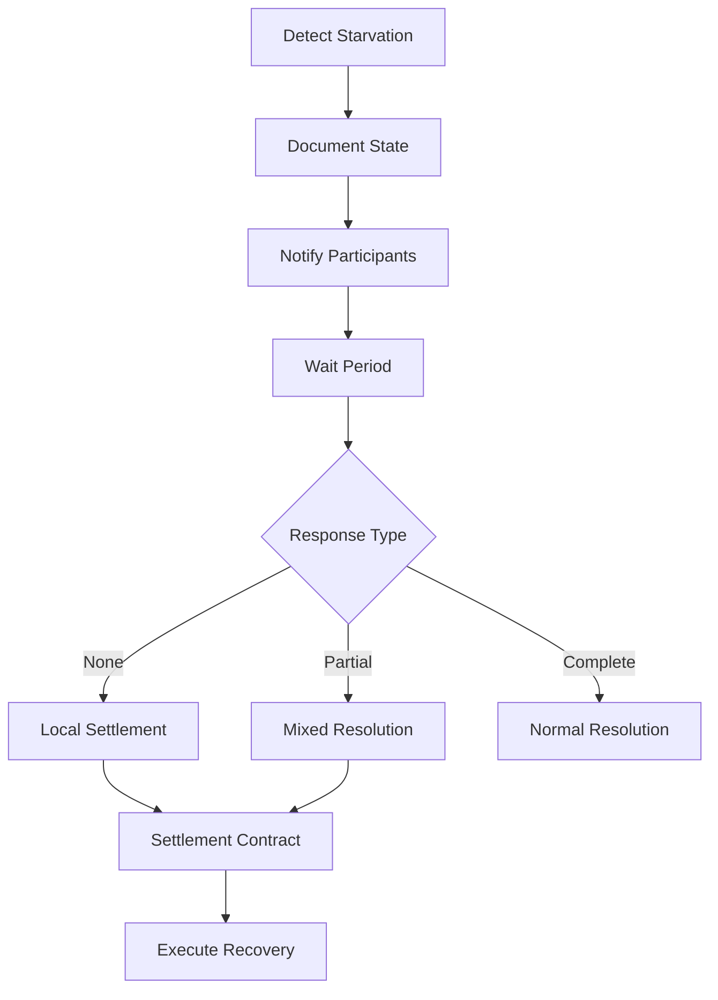

# Minority Node Recovery Analysis

## Problem Statement

### Initial State


### Core Issues
1. **Promise State**:
   - Resources locked by promises
   - No commit confirmation
   - No definitive failure proof
   - Uncertain final state

2. **Knowledge Limits**:
   - Can't verify majority state
   - Don't know if lift completed
   - Can't prove malicious intent
   - Uncertain timeout status

## Recovery Options Analysis

### Option 1: Cooperative Minority Settlement



1. **Process**:
   - Minority nodes agree to settle locally
   - Create new balancing tallies
   - Form closed settlement circle
   - Document original promises

2. **Advantages**:
   - Quick resolution
   - No external dependencies
   - Maintains relationships
   - Preserves liquidity

3. **Challenges**:
   - Requires unanimous agreement
   - New risk distribution
   - Complex accounting
   - Legal uncertainty

### Option 2: Time-Based Resolution



1. **Process**:
   - Set formal timeout period
   - Document non-response
   - Notify all participants
   - Force state resolution

2. **Advantages**:
   - Clear process
   - Definitive endpoint
   - Resource recovery
   - Audit trail

3. **Challenges**:
   - Timing uncertainty
   - Claim resolution
   - Legal standing
   - Future implications

### Option 3: Contract-Based Resolution



1. **Process**:
   - Invoke tally contract terms
   - Issue default notices
   - Allow cure period
   - Enforce remedies

2. **Advantages**:
   - Legal framework
   - Clear process
   - Multiple remedies
   - Enforceable rights

3. **Challenges**:
   - Time consuming
   - Resource intensive
   - Complex coordination
   - Uncertain outcomes

## Proposed Solution: Hybrid Recovery Protocol

### Protocol Design


1. **Initial Phase**:
   - Document current state
   - Notify all participants
   - Set response deadline
   - Record all communications

2. **Resolution Phase**:
   - **If No Response**:
     * Form minority settlement circle
     * Create balancing tallies
     * Document original claims
     * Execute local resolution

   - **If Partial Response**:
     * Include responsive nodes
     * Adjust settlement scope
     * Create hybrid resolution
     * Execute mixed settlement

3. **Documentation**:
   ```json
   {
     "original_lift": {
       "id": "lift_uuid",
       "timestamp": "iso_date",
       "participants": ["node_ids"],
       "promises": ["promise_details"]
     },
     "resolution_attempt": {
       "timeout_date": "iso_date",
       "notifications": ["notification_details"],
       "responses": ["response_details"]
     },
     "settlement": {
       "type": "minority_circle",
       "participants": ["node_ids"],
       "new_tallies": ["tally_details"],
       "original_claims": ["claim_details"]
     }
   }
   ```

### Legal Framework

1. **Settlement Contract**:
   - Acknowledges original lift
   - Documents timeout/default
   - Specifies resolution terms
   - Preserves original claims

2. **Rights Preservation**:
   - Maintains claim validity
   - Allows future recovery
   - Documents good faith
   - Enables legal action

3. **Risk Management**:
   - Distributes exposure
   - Limits individual impact
   - Preserves relationships
   - Enables future recovery

## Implementation Requirements

### Technical Needs
1. **State Tracking**:
   - Promise documentation
   - Timeout monitoring
   - Communication logging
   - Resolution tracking

2. **Protocol Support**:
   - Settlement circle formation
   - Balancing tally creation
   - Claim preservation
   - State resolution

### Operational Process
1. **Detection**:
   - Monitor promise state
   - Track timeouts
   - Log communications
   - Document attempts

2. **Resolution**:
   - Form settlement group
   - Create resolution contract
   - Execute settlement
   - Record resolution

### Recovery Automation
1. **Triggers**:
   - Timeout thresholds
   - Response deadlines
   - Settlement conditions
   - Resolution criteria

2. **Actions**:
   - Notification system
   - Contract generation
   - Settlement execution
   - State updates

## Conclusions

### Recommended Approach
1. **Immediate Actions**:
   - Document current state
   - Notify all participants
   - Set clear deadlines
   - Preserve evidence

2. **Resolution Process**:
   - Form minority settlement
   - Create resolution contract
   - Execute balanced settlement
   - Preserve future claims

3. **Future Protection**:
   - Update lift protocols
   - Enhance monitoring
   - Improve contracts
   - Automate recovery

The hybrid recovery protocol provides a practical path forward while preserving rights and relationships. It balances immediate resource recovery with long-term claim preservation. 